## 创建 Java 项目

### 项目创建

新建项目 "New" → "Project..."

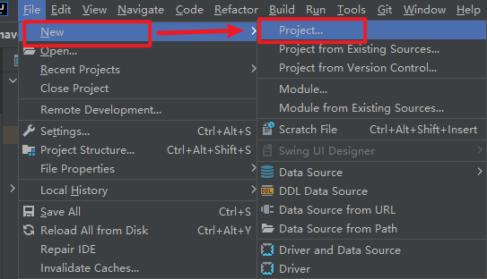

选择 "Maven Archetype"，输入项目名"Name"，项目目录"Location"，"JDK"，以及项目原型（Archetype），展开 Advanced setting，检查 "Groupid"，"Artifactid"，"Version" 是否正确。点击 create

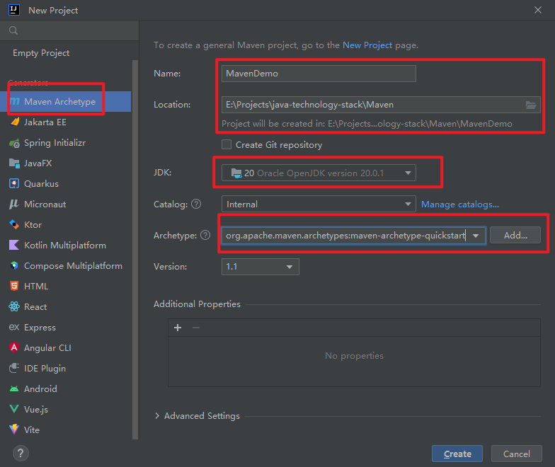

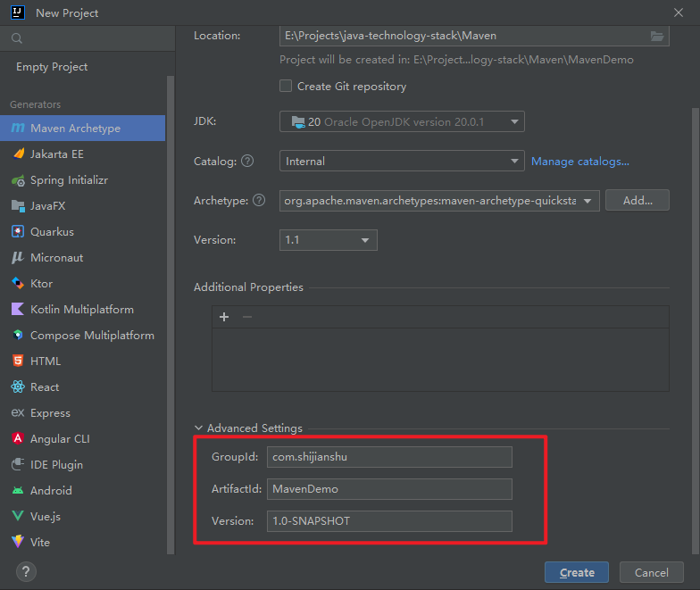

项目创建成果，检查 该项目maven的配置：

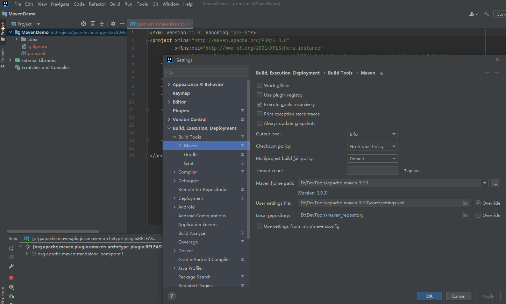

Maven 默认项目目录缺省，需要补齐：

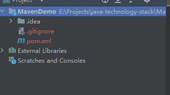

右击项目目录，"New" → "Directory":

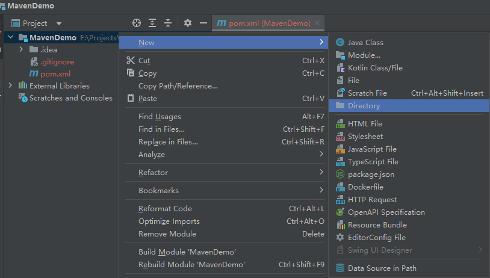

根据提示将四个目录创建出来:

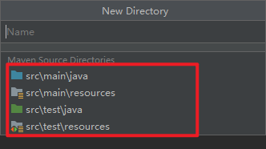


## 编译并打包 Java 项目

### 编译 Java 项目

选择 "Edit Configurations..."：

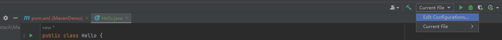

点击 ＋ ，选择 "Maven"：

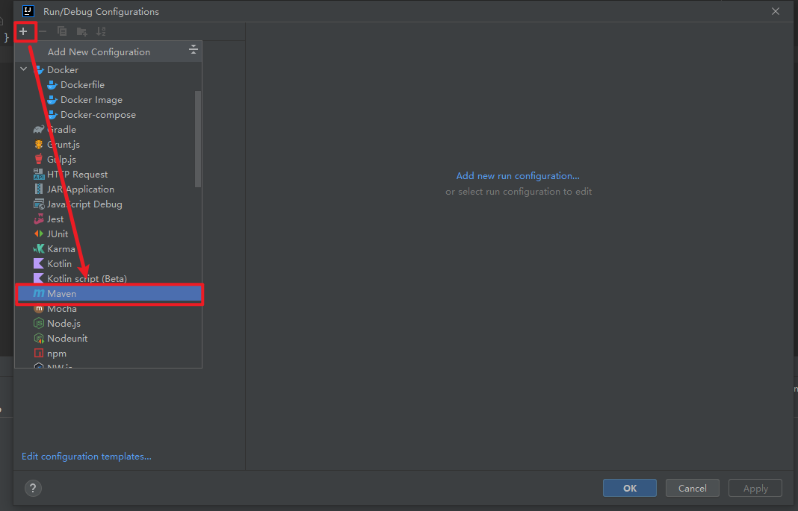

输入操作名称（"Name"）compile，对应具体需要执行的命令 compile，点击 apply：

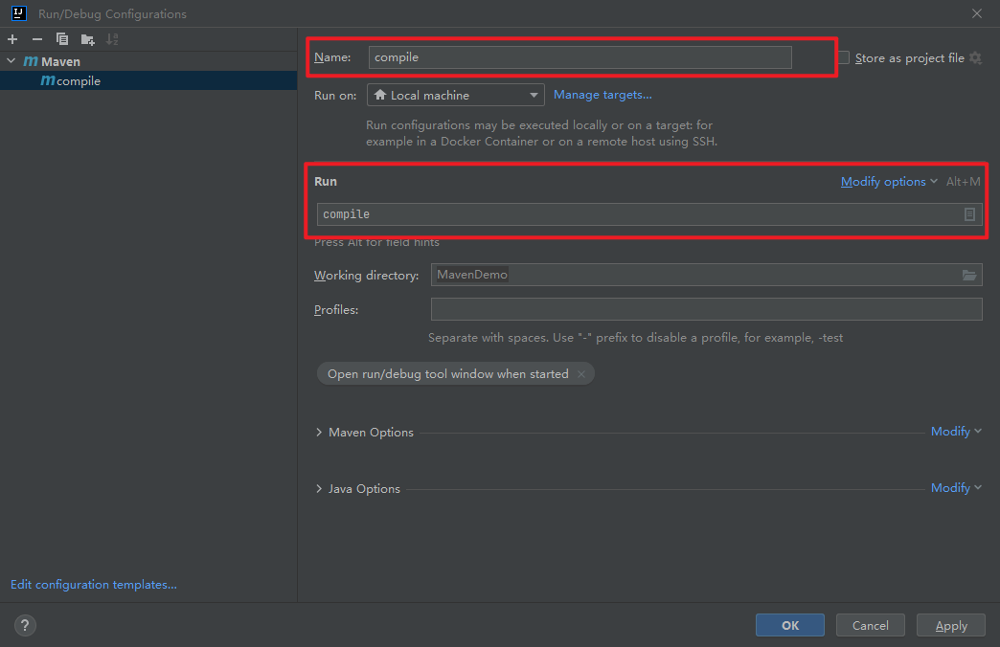

点击箭头便可执行 mvn compile 编译 Java 代码

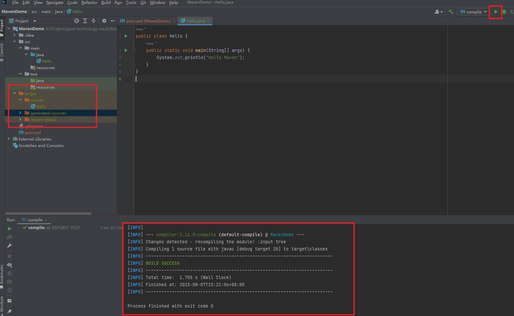

### 打包 Java 项目

相同方法配置 package 操作，点击箭头即可开始打包 Java 项目，jar 包如下：

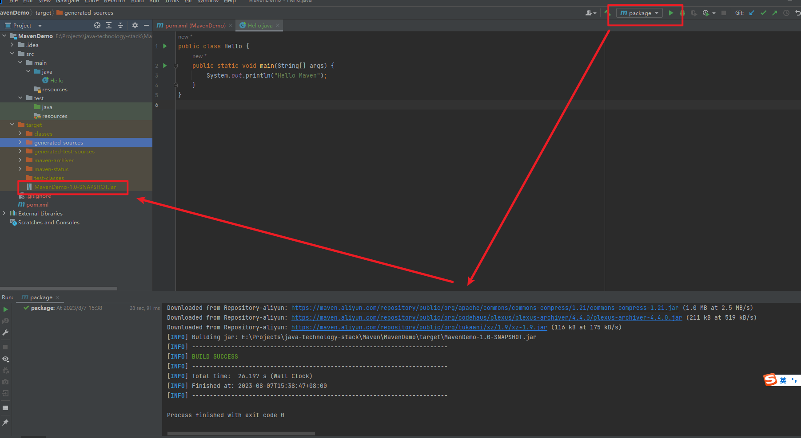

### Demo
https://gitee.com/damiaoxi/java-technology-stack/tree/master/Maven/maven_project_created_by_idea

## 创建 web 项目

### 项目创建

"New" → "Project..." → "Maven Archetype" → "Archetype" → "maven-archetype-webpack" → "Create"

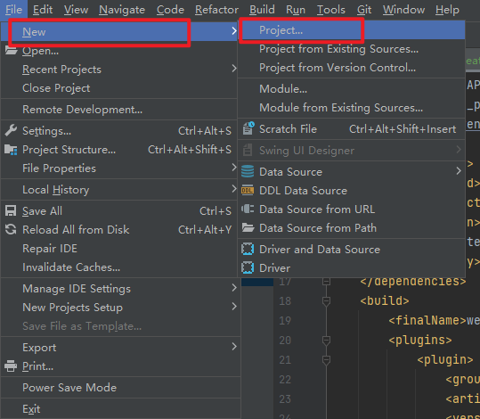

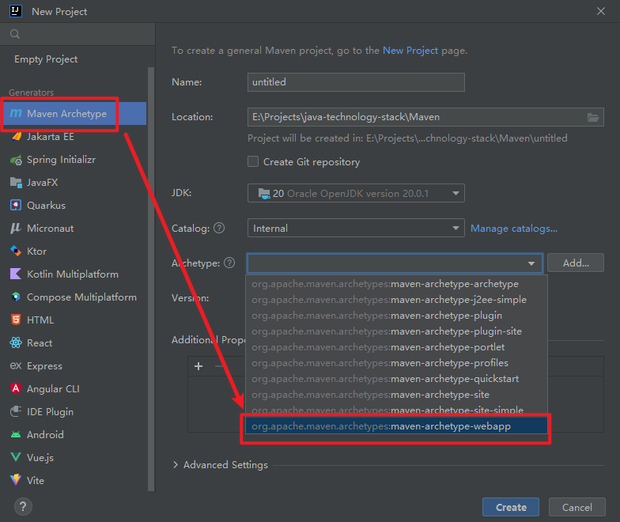

### 配置 jetty

````xml
<build>
    <finalName>web_maven_project_created_by_idea</finalName>
    <plugins>
        <!--jetty 插件-->
        <plugin>
            <groupId>org.eclipse.jetty</groupId>
            <artifactId>jetty-maven-plugin</artifactId>
            <version>10.0.10</version>
            <configuration>
                <scan>10</scan> <!--热部署，每10秒扫描一次-->
                <webApp>
                    <contextPath>/test</contextPath> <!--对外暴露的路径-->
                </webApp>
                <httpConnector>
                    <port>8899</port> <!--启动端口号，默认端口 8080-->
                </httpConnector>
            </configuration>
        </plugin>
    </plugins>
</build>
````

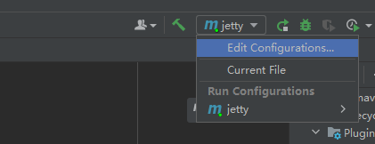

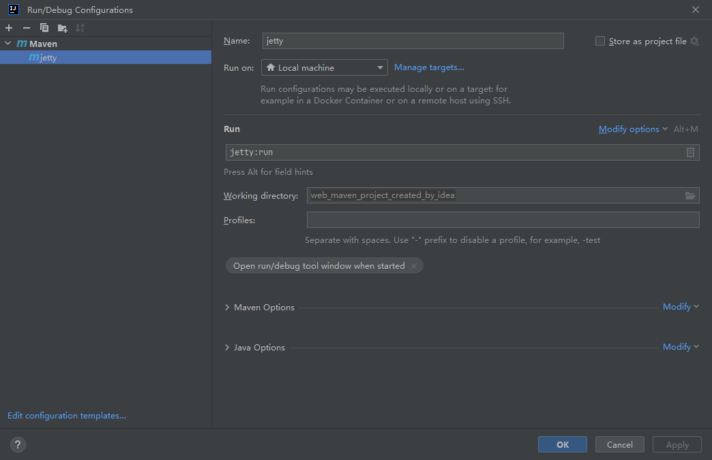

### 配置 tomcat

````xml
<!--Tomcat7 插件-->
<plugin>
    <groupId>org.apache.tomcat.maven</groupId>
    <artifactId>tomcat7-maven-plugin</artifactId>
    <version>2.2</version>
    <configuration>
        <port>8080</port> <!--启动端口号，默认端口 8080-->
        <path>/test</path> <!--对外暴露的路径-->
        <uriEncoding>UTF-8</uriEncoding>
        <server>tomcat7</server> <!--服务器名称-->
    </configuration>
</plugin>
````

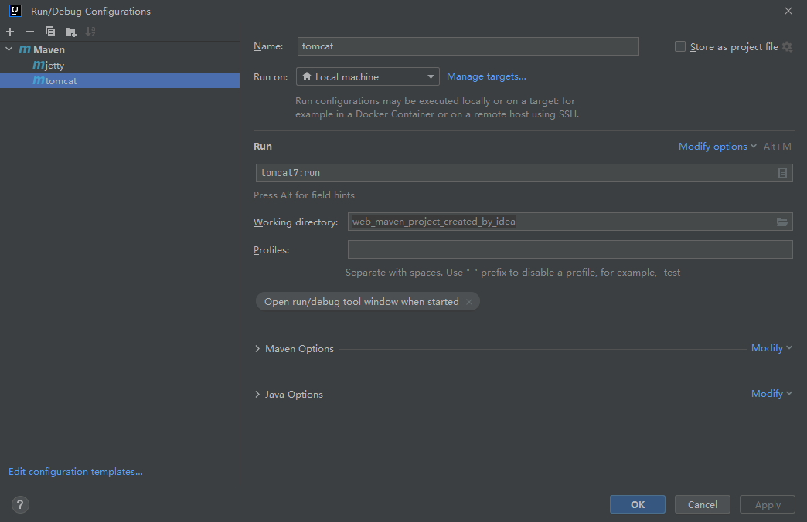

## Demo
https://gitee.com/damiaoxi/java-technology-stack/tree/master/Maven/web_maven_project_created_by_idea