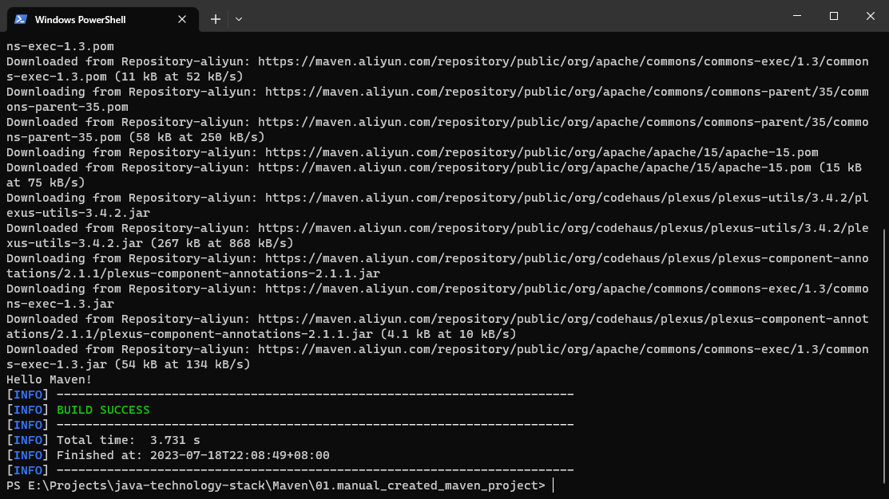

## **Maven 项目目录结构**

| 目录                          | 目的                             |
| ----------------------------- | -------------------------------- |
| ${basedir}                    | 存放 pom.xml 和所有的子目录       |
| ${basedir}/src/main/java      | 项目的 java 源代码               |
| ${basedir}/src/main/resources | 项目的资源，比如说 property 文件 |
| ${basedir}/srctestjava        | 项目的测试类，比如说 JUnit 代码  |
| ${basedir}/srcitestresources  | 测试使用的资源                   |

### 创建一个文件夹作为项目的根目录

在根目录中创建一个 pom.xml 文件， 内容如下

```xml
<?xml version="1.0" encoding="utf-8"?>
<project xmlns="http://maven.apache.org/POM/4.0.0"
		 xmlns:xsi="http://www.w3.org/2001/XMLSchema-instance"
		 xsi:schemaLocation="http://maven.apache。org/POM/4.0.0
			http://maven.apache.org/xsd/maven-4.0.0.xsd">

	<modelVersion>4.0.0</modelVersion>

	<groupId>com.shijianshu</groupId>
	<artifactId>maven01</artifactId>
	<version>0.0.1-SNAPSH0T</version>
	<packaging>jar</packaging>

	<name >maven01</name>
	<url>http://maven.apache.org</url>

	<properties>
		<project.build.sourceEncoding>UTF-8</project.build.sourceEncoding>
	</properties>

	<dependencies>
		<dependency>
			<groupId>junit</groupId>
			<artifactId>junit</artifactId>
			<version>3.8.1</version>
			<scope>test</scope>
		</dependency>
	</dependencies>

</project>
```

**Ps: 标签定义解释**

> 根目录下的第一个子元素 ModelVersion 指定当前 Pom 模型的版本，对于 Maven3 来说，它只能是 4.0.0。指定了当前 Maven 模型的版本号，对于 Maven2 和 Maven3 来说，它只能是 4.0.0
>
> groupId：定义了项目属于哪个组，这个组往往和项目所在的组织和公司存在关联。
> 比如: com.xxxx
>
> artifactId：定义了当前 Maven 项目在组中唯一的 ID。
> Version：x.x.x-里程碑
> 比如: 1.0.0-SNAPSHOT
> 第一个 x 大版本有重大变革
> 第二个 x 小版本修复 bug, 增加功能
> 第三个 X 更新
>
> 里程碑版本:
> SNAPSHOT (快照， 开发版)
> alpha (内部测试)
> beta (公开测试)
> Release | RC (发布版)
> GA (正常版本)
> 使用 name 标签声明一个对于用户更为友好的项目名称，虽然不是必须的，但还是推荐为每个 Pom 声明 name，以访便信
> 息交流。

### 编写主函数

```java
package com.shijianshu.demo;

public class Hello{
	public static void main(String[] args){
		System.out.println('Hello Maven!')
	}
}
```

### cmd 下编译并运行

cmd 下面，进入项目的根目录（pom.xml 所在目录）

1. 编译 java 文件

    ```shell
    mvn compile
    ```

2. 执行 main 方法

    ```shell
    mvn exec:java -D"exec.mainClass"="com.shijianshu.demo.Hello"
    ```

    > `com.shijianshu.demo.Hello` 为 `main` 方法所在的类，执行该类中的 `main` 方法

​ 

> 注意需要修改 maven 安装目录下的的 settings.xml
>
> ```xml
> 1. 修改默认仓库位置
> <localRepository>D:\DevTools\maven_repository</localRepository>
> 2. 更换阿里镜像，加快依赖下载
> <mirror>
>   <id>Repository-aliyun</id>
>   <mirrorOf>central</mirrorOf>
>   <name>Aliyun repository</name>
>   <url>https://maven.aliyun.com/repository/public</url>
> </mirror>
> ```
