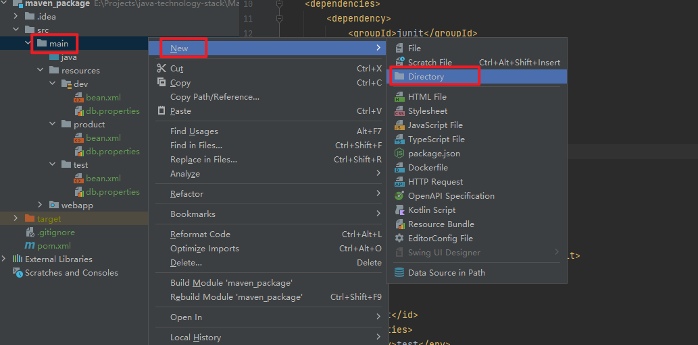
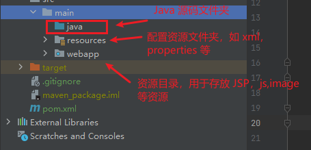
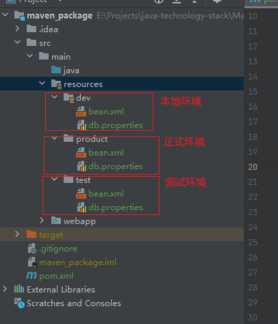
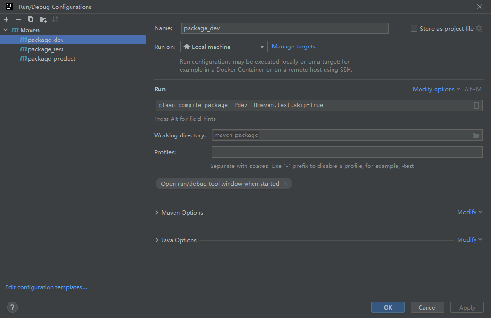
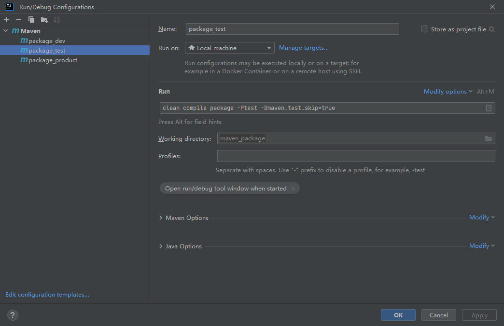
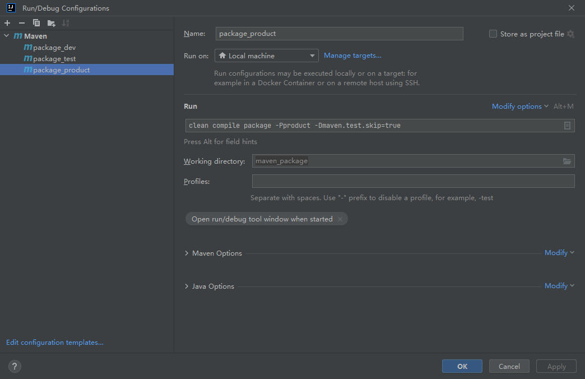

对于企业级项目,无论是进行本地测试，还是测试环境测试以及最终的项目上线，都会涉及项目的打包操作。对于每个环境下的项目打包，对应的项目所需要的配置资源都会有所区别，实现打包的方式有很多种，可以通过ant，或者通过idea自带的打包功能实现项目打包，但当项目很大并且需要的外界配置很多时，此时打包的配置就会异常复杂，对于maven项目，我们可以用过pom.xml配置的方式来实现打包时的环境选择，相比较其他形式打包工具，通过maven只需要通过简单的配置，就可以轻松完成不同环境下项目的整体打包。

比如下面这样一个项目，项目中配置了不同环境下项目所需要的配置文件,这时候需要完成不同环境下的打包操作，此时通过修改pom.xml 如下:

## 建立对应的目录结构
使用 idea 创建项目，目录结构可能会缺失，需要通过手动添加对应的目录。

1.添加Java源文件夹

选择项目的main文件夹，右键选择New，选择 Directory 输入文件夹 “java”：



2. 添加资源文件夹

   步骤如上，创建文件夹，命名为 resources，并标记为 Resources Root



3.  添加对应文件夹目录，及添加不同环境下对应的配置文件。（本地环境，测试环境，正式环境）



## 添加 profile 配置

````xml
<profiles>
    <profile>
        <id>dev</id>
        <properties>
            <env>dev</env>
        </properties>
        <!--未指定环境时，默认打包dev环境-->
        <activation>
            <activeByDefault>true</activeByDefault>
        </activation>
    </profile>
    <profile>
        <id>test</id>
        <properties>
            <env>test</env>
        </properties>
    </profile>
    <profile>
        <id>product</id>
        <properties>
            <env>product</env>
        </properties>
    </profile>
</profiles>
````

## 设置资源文件配置

````xml
<!-- 对于项目资源文件的配置放在 build 中-->
<resources>
    <resource>
        <directory>src/main/resources/${env}</directory>
    </resource>
    <resource>
        <directory>src/main/java</directory>
        <includes>
            <include>**/*.xml</include>
            <include>**/*.properties</include>
            <include>**/*.tld</include>
        </includes>
        <filtering>false</filtering>
    </resource>
</resources>
````

`${env}` 可以拿到 `mvn -P` 跟着的参数。

## 执行打包操作

打开 Run/Debug Configurations 窗口，输入对应的打包命令







## Demo
https://gitee.com/damiaoxi/java-technology-stack/tree/master/Maven/maven_package