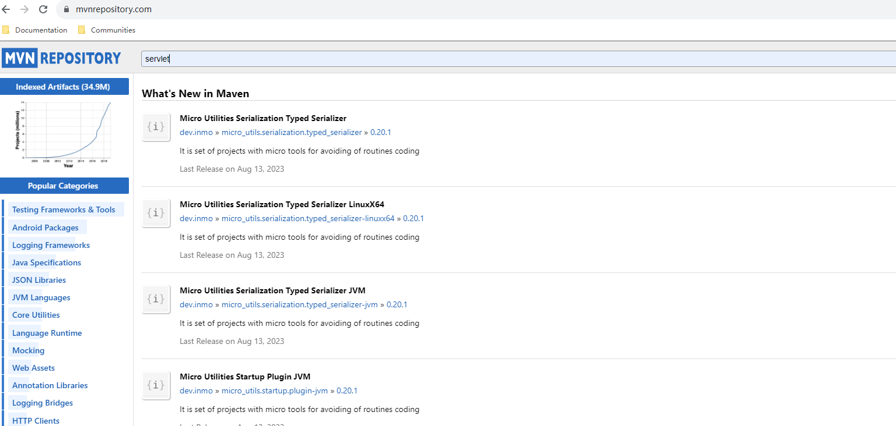
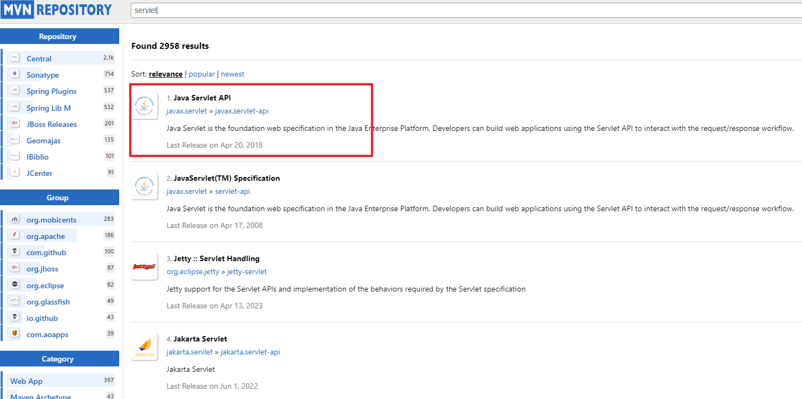
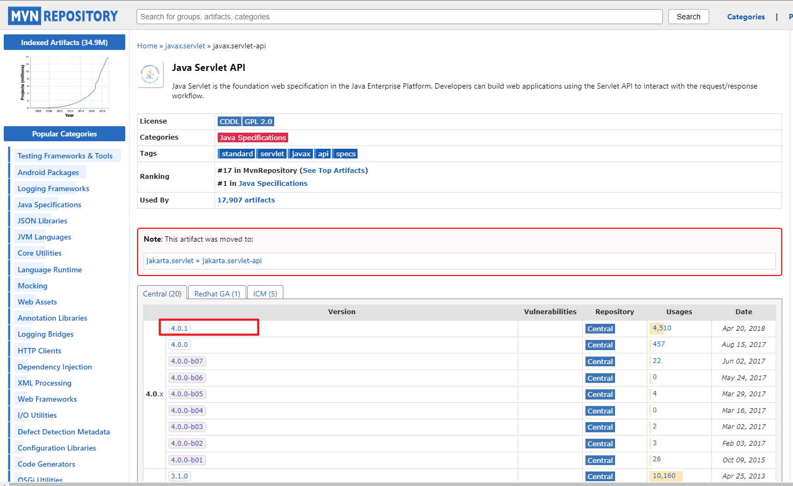
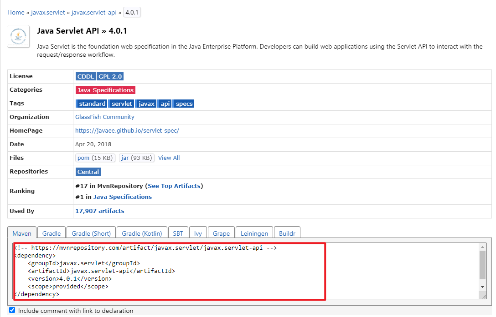

当第一次运行 Maven 命令的时候，你需要 Internet 链接，因为它需要从网上下载一些文件。那么它从哪里下载呢？它是从 Maven 默认的远程库下载的。这个远程仓库有 Maven 的核心插件和可供下载的 jar 文件。

对于 Maven 来说，仓库只分为两类：**本地仓库**和**远程仓库**。

当 Maven 根据坐标寻找构件的时候，它首先会查看本地仓库,如果本地仓库存在，则直接使用；如果本地没有，Maven 就会去远程仓库查找，发现需要的构件之后，下载到本地仓库再使用。如果本地仓库和远程仓库都没有，Maven 就会报错。

远程仓库分为三种：中央仓库，私服，其他公共库。
中央仓库是默认配置下，Maven 下载 jar 包的地方。

私服是另一种特殊的远程仓库,为了节省带宽和时间，应该在局域网内架设一一个私有的仓库服务器，用其代理所有外部的远程仓库。内部的项目还能部署到私服上供其他项目使用。

一般来说， 在 Maven 项目目录下，没有诸如 `lib/` 这样用来存放依赖文件的目录。当 Maven 在执行编译或测试时，如果需要使用依赖文件，它总是基于坐标使用本地仓库的依赖文件。
默认情况下，每个用户在自己的用户目录下都有一个路径名为 `.m2/repository/` 的仓库目录。 有时候， 因为某些原因（比如 c 盘空间不足），需要修改本地仓库目录地址。
对于仓库路径的修改,可以通过 maven 配置文件 conf 目录下 settings.xml 来指定仓库路径：

```xml
<settings>
    <localRepository>D:\DevTools\maven_repository</localRepository>
</settings>
```

## 中央仓库

由于原始的本地仓库是空的，maven 必须知道至少一个可用的远程仓库，才能执行 maven 命令的时候下载到
需要的构件。中央仓库就是这样一个默认的远程仓库。

maven-model-builder-3.3.9.jar maven 自动的 jar 中包含了一个超级 POM。定义了默认中央仓库的位置。中央仓库包含了 2000 多个开源项目,接收每天 1 亿次以上的访问。

## 私服

私服是一种特殊的远程仓库，它是架设在局域网内的仓库服务，私服代理广域网上的远程仓库，供局域网内的 maven 用户使用。当 maven 需要 下载构件时，它去私服当中找，如果私服没有，则从外部远程仓库下载，并缓存在私服上，再为 maven 提供。
此外，一些无法从外部仓库下载的构件也能从本地上传到私服提供局域网中其他人使用配置方式项目 pom.xml 配置

```xml
<repositories>
	<repository>
		<snapshots>
			<enab1ed>true</enabled>
		</snapshots>
		<id>public</id>
		<name>Pub1ic Repositories</name>
		<ur1>http://192.168.0.96:8081/content/groups/pub1ic/</ur1>
	</repository>
	<repository>
		<id>getui-nexus</id>
		<ur1>http://mvn.gt.igexin.com/nexus/content/repositories/releases/</ur1>
	</repository>
</repositories>
```

## 其他公共库

常用的阿里云仓库配置

```xml
<mirror>
    <id>Repository-aliyun</id>
    <mirrorOf>central</mirrorOf>
    <name>Aliyun repository</name>
    <url>https://maven.aliyun.com/repository/public</url>
</mirror>
```

## 如何在中央仓库中寻找一个 jar 包

以 servlet 为例：

访问 https://mvnrepository.com，在搜索框中搜索 servlet：



选择 Java Servlet API



可见 Servlet 的所有版本，选择其中一个版本：



可见其 pom.xml 的设置，复制粘贴到 `dependencies` 即可：


