## 创建 maven_parent 项目

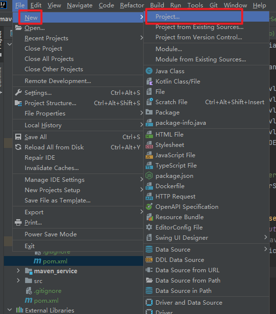

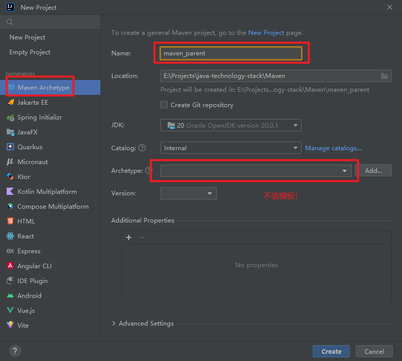

## 创建 maven_dao 项目

在 maven_parent 下新建 module:

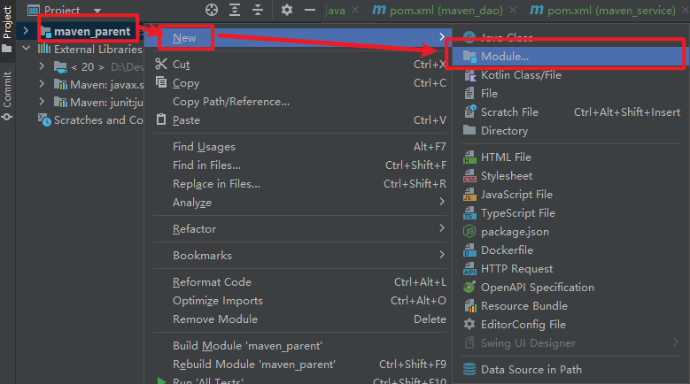

使用 quick start 模板创建模块：

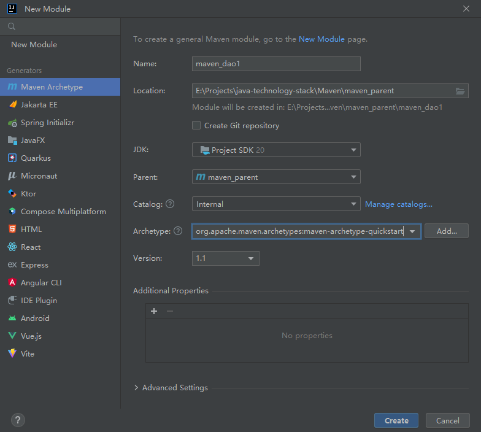

## 创建 maven_service 项目

同创建 maven_dao

## 创建 maven_controller 项目

使用 webapp 模板创建模块：

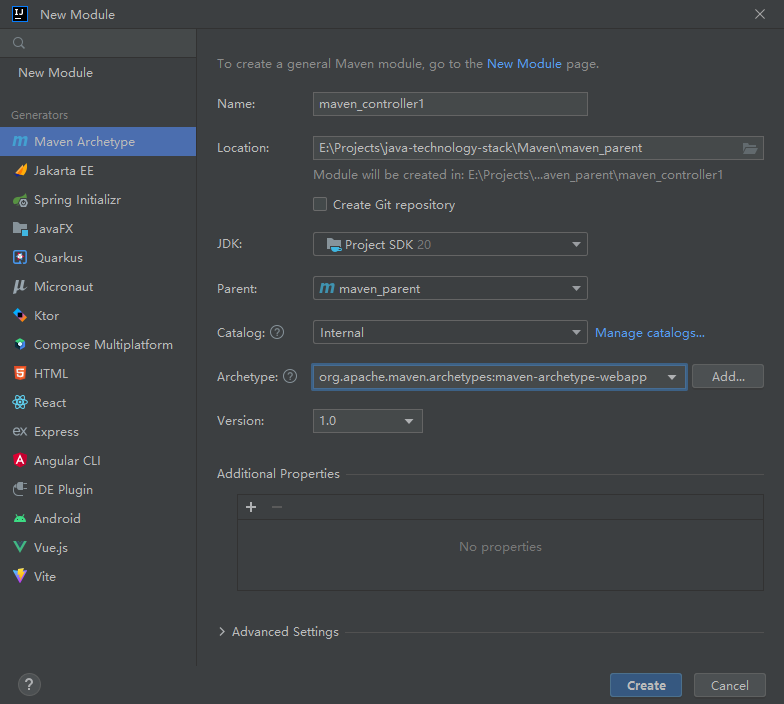

添加 java package 结构：

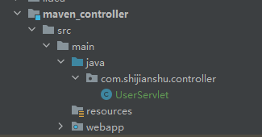

## 修改包之间的依赖

- 在 service 层添加 dao 层依赖

  ````xml
  <dependency>
      <groupId>com.shijianshu</groupId>
      <artifactId>maven_dao</artifactId>
      <version>1.0-SNAPSHOT</version>
  </dependency>
  ````

- 在 controller 层添加 service 依赖

  ````xml
  <dependency>
      <groupId>com.shijianshu</groupId>
      <artifactId>maven_service</artifactId>
      <version>1.0-SNAPSHOT</version>
  </dependency>
  ````

  在 controller 层添加 servlet 依赖

  ````xml
  <dependency>
      <groupId>javax.servlet</groupId>
      <artifactId>javax.servlet-api</artifactId>
      <version>4.0.1</version>
      <scope>provided</scope>
  </dependency>
  ````

  在 controller 层添加 tomcat7 插件

  ````xml
  <!--Tomcat7 插件-->
  <plugins>
      <plugin>
          <groupId>org.apache.tomcat.maven</groupId>
          <artifactId>tomcat7-maven-plugin</artifactId>
          <version>2.2</version>
          <configuration>
              <port>8080</port> <!--启动端口号，默认端口 8080-->
              <path>/test</path> <!--对外暴露的路径-->
              <uriEncoding>UTF-8</uriEncoding>
              <server>tomcat7</server> <!--服务器名称-->
          </configuration>
      </plugin>
  </plugins>
  ````

##  编写各层代码

- Dao:

  Maven/maven_parent/maven_dao/src/main/java/com/shijianshu/UserDao.java

  ````java
  package com.shijianshu;
  
  /**
   * This is dao layer!
   */
  public class UserDao {
      public static void testDao() {
          System.out.println("This is dao layer!");
      }
  }
  
  ````

- Service:

  Maven/maven_parent/maven_service/src/main/java/com/shijianshu/UserService.java

  ````java
  package com.shijianshu;
  
  /**
   * This is service layer!
   */
  public class UserService {
      public static void testService() {
          System.out.println("This is service layer!");
          UserDao.testDao();
      }
  }
  ````

- Controller:

  Maven/maven_parent/maven_controller/src/main/java/com/shijianshu/controller/UserServlet.java

  ````java
  package com.shijianshu.controller;
  
  import com.shijianshu.UserService;
  
  import javax.servlet.ServletException;
  import javax.servlet.ServletRequest;
  import javax.servlet.ServletResponse;
  import javax.servlet.annotation.WebServlet;
  import javax.servlet.http.HttpServlet;
  import java.io.IOException;
  
  @WebServlet("/user")
  public class UserServlet extends HttpServlet {
      @Override
      public void service(ServletRequest req, ServletResponse res) throws ServletException, IOException {
          System.out.println("UserServlet Test!");
          // 调用 maven_service 模块的方法
          UserService.testService();
      }
  }
  ````

## 启动项目

- 配置并 `mvn install` 各级包：

  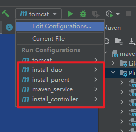

  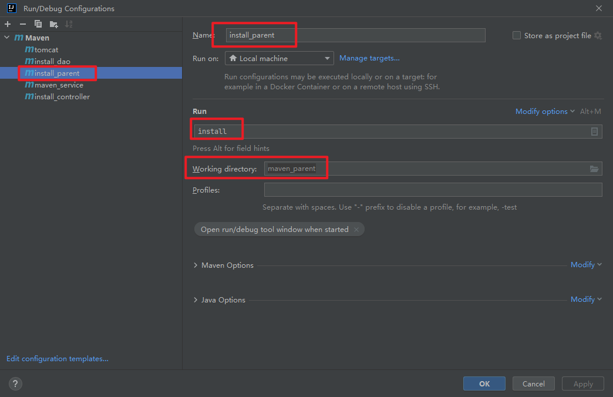

  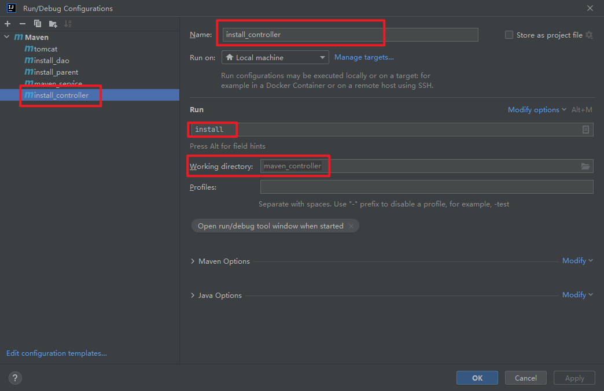

- 在 controller 层配置 tomcat7:

  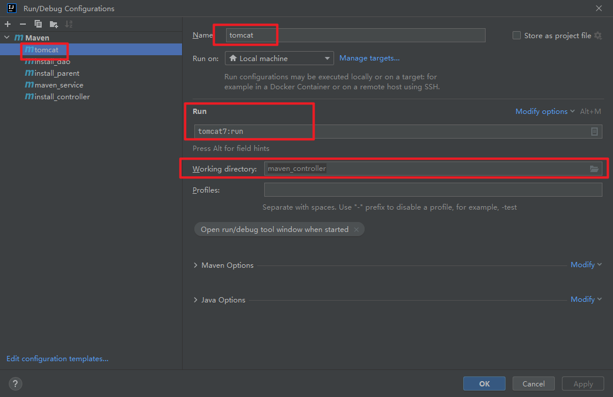

- 运行 tomcat7 插件：

  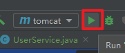

浏览器输入 http://localhost:8080/test/user 即可看到：

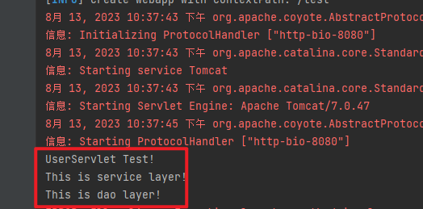

## Demo
https://gitee.com/damiaoxi/java-technology-stack/tree/master/Maven/maven_parent