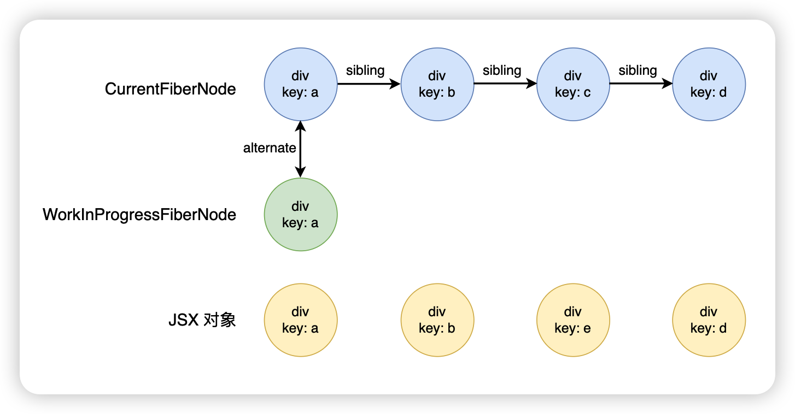
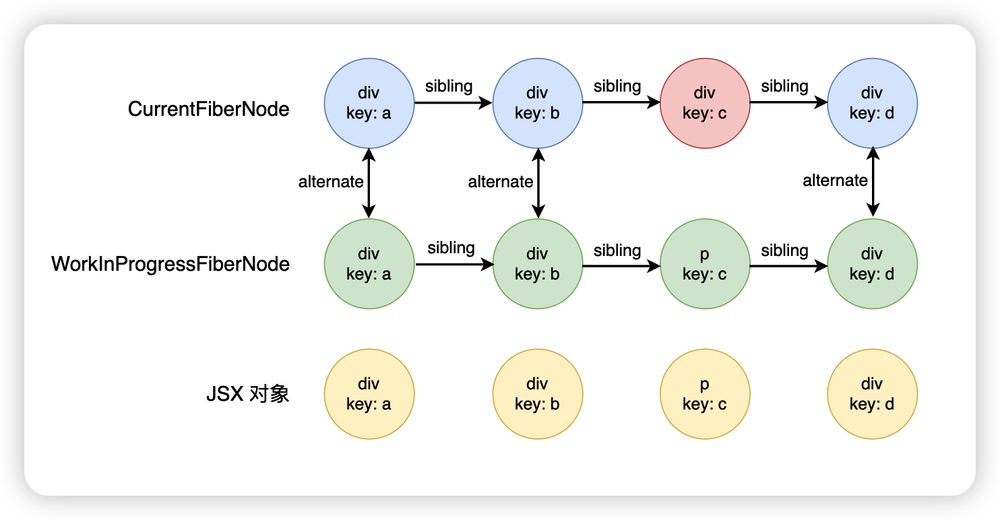
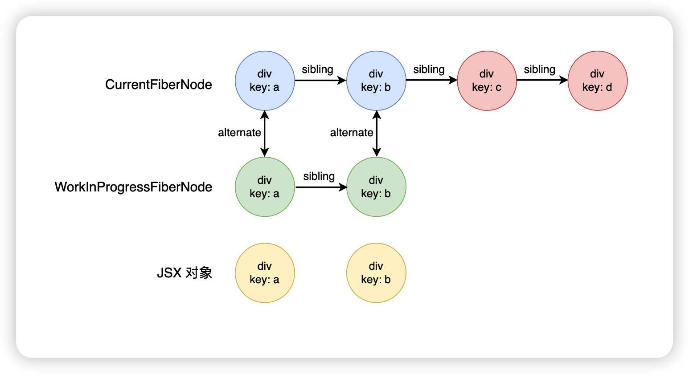
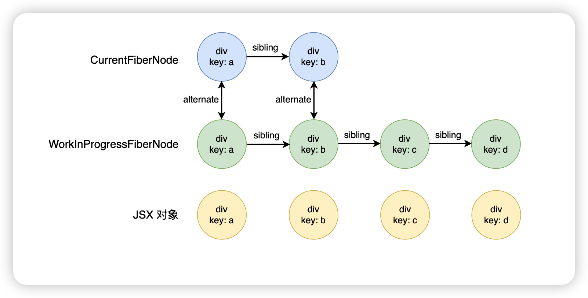
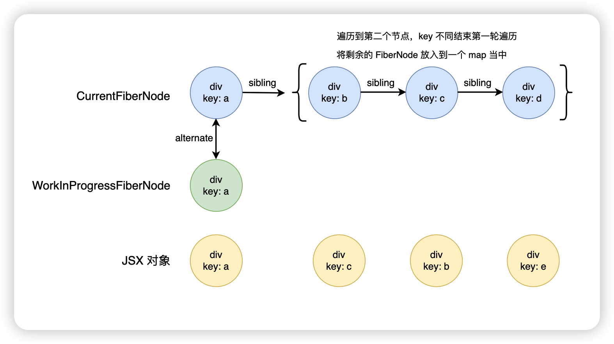
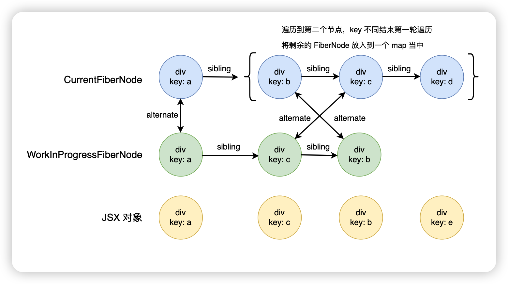
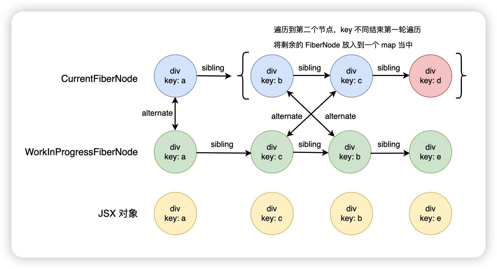

Render 阶段会生成 Fiber Tree，所谓的 diff 实际上就是发生在这个阶段，这里的 diff **指的是 current FiberNode 和 JSX 对象之间进行对比，然后生成新的的 wip FiberNode。**

> 除了 React 以外，其他使用到了虚拟 DOM 的前端框架也会有类似的流程，比如 Vue 里面将这个流程称之为 patch。

diff 算法本身是有性能上面的消耗，在 React 文档中有提到，即便采用最前沿的算法，如果要完整的对比两棵树，那么算法的复杂度都会达到 O(n^3)，n 代表的是元素的数量，如果 n 为 1000，要执行的计算量会达到十亿量级的级别。

因此，为了降低算法的复杂度，React 为 diff 算法设置了 3 个限制：

- 限制一：只对同级别元素进行 diff，如果一个 DOM 元素在前后两次更新中跨越了层级，那么 React 不会尝试复用它
- 限制二：两个不同类型的元素会产生不同的树。比如元素从 div 变成了 p，那么 React 会直接销毁 div 以及子孙元素，新建 p 以及 p 对应的子孙元素
- 限制三：开发者可以通过 key 来暗示哪些子元素能够保持稳定

更新前：

```jsx
<div>
  <p key="one">one</p>
  <h3 key="two">two</h3>
</div>
```

更新后

```jsx
<div>
  <h3 key="two">two</h3>
  <p key="one">one</p>
</div>
```

如果没有 key，那么 React 就会认为 div 的第一个子元素从 p 变成了 h3，第二个子元素从 h3 变成了 p，因此 React 就会采用限制二的规则。

但是如果使用了 key，那么此时的 DOM 元素是可以复用的，只不过前后交换了位置而已。


接下来我们回头再来看限制一，对同级元素进行 diff，究竟是如何进行 diff ？整个 diff 的流程可以分为两大类：

- 更新后只有一个元素，此时就会根据 newChild 创建对应的 wip FiberNode，对应的流程就是单节点 diff
- 更新后有多个元素，此时就会遍历 newChild 创建对应的 wip FiberNode 已经它的兄弟元素，此时对应的流程就是多节点 diff


## 单节点 diff

单节点指的是新节点为单一节点，但是旧节点的数量是不一定

单节点 diff 是否能够复用遵循以下的流程：

- 判断 key 是否相同
  - 如果更新前后没有设置 key，那么 key 就是 null，也是属于相同的情况
  - 如果 key 相同，那么就会进入到步骤二
  - 如果 key 不同，就不需要进入步骤，无需判断 type，结果直接为不能复用（如果有兄弟节点还会去遍历兄弟节点）
- 如果 key 相同，再判断 type 是否相同
  - 如果 type 相同，那么就复用
  - 如果 type 不同，无法复用（并且兄弟节点也一并标记为删除）

更新前

```jsx
<ul>
  <li>1</li>
  <li>2</li>
  <li>3</li>
</ul>
```

更新后

```jsx
<ul>
  <p>1</p>
</ul>
```

这里因为没有设置 key，所以会被设为 key 是相同的，接下来就会进入到 type 的判断，此时发现 type 不同，因此不能够复用。

既然这里唯一的可能性都已经不能够复用，会直接标记兄弟 FiberNode 为删除状态。

> 如果上面的例子中，key 不同只能代表当前的 FiberNode 无法复用，因此还需要去遍历兄弟的 FiberNode

下面我们再来看一些示例

更新前

```jsx
<div>one</div>
```

更新后

```jsx
<p>one</p>
```

没有设置 key，那么可以认为默认 key 就是 null，更新前后两个 key 是相同的，接下来就查看 type，发现 type 不同，因此不能复用。


更新前

```jsx
<div key="one">one</div>
```

更新后

```jsx
<div key="two">one</div>
```

更新前后 key 不同，不需要再判断 type，结果为不能复用


更新前

```jsx
<div key="one">one</div>
```

更新后

```jsx
<p key="two">one</p>
```

更新前后 key 不同，不需要再判断 type，结果为不能复用


更新前

```jsx
<div key="one">one</div>
```

更新后

```jsx
<div key="one">two</div>
```

首先判断 key 相同，接下来判断 type 发现也是相同，这个 FiberNode 就能够复用，children 是一个文本节点，之后将文本节点更新即可。


## 多节点 diff

所谓多节点 diff，指的是新节点有多个。

React 团队发现，在日常开发中，对节点的更新操作的情况往往要多余对节点“新增、删除、移动”，因此在进行多节点 diff 的时候，React 会进行两轮遍历：

- 第一轮遍历会尝试逐个的复用节点
- 第二轮遍历处理上一轮遍历中没有处理完的节点


### 第一轮遍历

第一轮遍历会从前往后依次进行遍历，存在三种情况：

- 如果新旧子节点的key 和 type 都相同，说明可以复用
- 如果新旧子节点的 key 相同，但是 type 不相同，这个时候就会根据 ReactElement 来生成一个全新的 fiber，旧的 fiber 被放入到 deletions 数组里面，回头统一删除。但是注意，此时遍历并不会终止
- 如果新旧子节点的 key 和 type 都不相同，结束遍历


**示例一**

更新前

```jsx
<div>
	<div key="a">a</div>
  <div key="b">b</div>
  <div key="c">c</div>
  <div key="d">d</div>
</div>
```

更新后

```jsx
<div>
	<div key="a">a</div>
  <div key="b">b</div>
  <div key="e">e</div>
  <div key="d">d</div>
</div>
```

首先遍历到 div.key.a，发现该 FiberNode 能够复用



继续往后面走，发现 div.key.b 也能够复用


接下来继续往后面走，div.key.e，这个时候发现 key 不一样，因此第一轮遍历就结束了


**示例二**

更新前

```jsx
<div>
	<div key="a">a</div>
  <div key="b">b</div>
  <div key="c">c</div>
  <div key="d">d</div>
</div>
```

更新后

```jsx
<div>
	<div key="a">a</div>
  <div key="b">b</div>
  <p key="c">c</p>
  <div key="d">d</div>
</div>
```

首先和上面的一样，div.key.a 和 div.key.b 这两个 FiberNode 可以进行复用，接下来到了第三个节点，此时会发现 key 是相同的，但是 type 不相同，此时就会将对应的旧的 FiberNode 放入到一个叫 deletions 的数组里面，回头统一进行删除，根据新的 React 元素创建一个新的 FiberNode，但是此时的遍历是不会结束的


接下来继续往后面进行遍历，遍历什么时候结束呢？

- 到末尾了，也就是说整个遍历完了
- 或者是和示例一相同，可以 key 不同




### 第二轮遍历

如果第一轮遍历被提前终止了，那么意味着有新的 React 元素或者旧的 FiberNode 没有遍历完，此时就会采用第二轮遍历

第二轮遍历会处理这么三种情况：

- 只剩下旧子节点：将旧的子节点添加到 deletions 数组里面直接删除掉（删除的情况）

- 只剩下新的 JSX 元素：根据 ReactElement 元素来创建 FiberNode 节点（新增的情况）

- 新旧子节点都有剩余：会将剩余的 FiberNode 节点放入一个 map 里面，遍历剩余的新的 JSX 元素，然后从 map 中去寻找能够复用的 FiberNode 节点，如果能够找到，就拿来复用。（移动的情况）

  如果不能找到，就新增呗。然后如果剩余的 JSX 元素都遍历完了，map 结构中还有剩余的 Fiber 节点，就将这些 Fiber 节点添加到 deletions 数组里面，之后统一做删除操作


**只剩下旧子节点**

更新前

```jsx
<div>
  <div key="a">a</div>
  <div key="b">b</div>
  <div key="c">c</div>
  <div key="d">d</div>
</div>
```

更新后

```jsx
<div>
  <div key="a">a</div>
  <div key="b">b</div>
</div>
```

遍历前面两个节点，发现能够复用，此时就会复用前面的节点，对于 React 元素来讲，遍历完前面两个就已经遍历结束了，因此剩下的FiberNode就会被放入到 deletions 数组里面，之后统一进行删除




**只剩下新的 JSX 元素**

更新前

```jsx
<div>
  <div key="a">a</div>
  <div key="b">b</div>
</div>
```

更新后

```jsx
<div>
  <div key="a">a</div>
  <div key="b">b</div>
  <div key="c">c</div>
  <div key="d">d</div>
</div>
```

根据新的 React 元素新增对应的 FiberNode 即可。




**新旧子节点都有剩余**

更新前

```jsx
<div>
  <div key="a">a</div>
  <div key="b">b</div>
  <div key="c">c</div>
  <div key="d">d</div>
</div>
```

更新后

```jsx
<div>
  <div key="a">a</div>
  <div key="c">b</div>
  <div key="b">b</div>
  <div key="e">e</div>
</div>
```

首先会将剩余的旧的 FiberNode 放入到一个 map 里面



接下来会继续去遍历剩下的 JSX 对象数组，遍历的同时，从 map 里面去找有没有能够复用



如果在 map 里面没有找到，那就会新增这个 FiberNode，如果整个 JSX 对象数组遍历完成后，map 里面还有剩余的 FiberNode，说明这些 FiberNode 是无法进行复用，直接放入到 deletions 数组里面，后期统一进行删除。




### 双端对比算法

所谓双端，指的是在新旧子节点的数组中，各用两个指针指向头尾的节点，在遍历的过程中，头尾两个指针同时向中间靠拢。

因此在新子节点数组中，会有两个指针，newStartIndex 和 newEndIndex 分别指向新子节点数组的头和尾。在旧子节点数组中，也会有两个指针，oldStartIndex 和 oldEndIndex 分别指向旧子节点数组的头和尾。


每遍历到一个节点，就尝试进行双端比较：「新前 vs 旧前」、「新后 vs 旧后」、「新后 vs 旧前」、「新前 vs 旧后」，如果匹配成功，更新双端的指针。比如，新旧子节点通过「新前 vs 旧后」匹配成功，那么 newStartIndex += 1，oldEndIndex -= 1。

如果新旧子节点通过「新后 vs 旧前」匹配成功，还需要将「旧前」对应的 DOM 节点插入到「旧后」对应的 DOM 节点之前。如果新旧子节点通过「新前 vs 旧后」匹配成功，还需要将「旧后」对应的 DOM 节点插入到「旧前」对应的 DOM 节点之前。


实际上在 React 的源码中，解释了为什么不使用双端 diff

```js
function reconcileChildrenArray(
returnFiber: Fiber,
 currentFirstChild: Fiber | null,
 newChildren: Array<*>,
 expirationTime: ExpirationTime,
): Fiber | null {
    // This algorithm can't optimize by searching from boths ends since we
    // don't have backpointers on fibers. I'm trying to see how far we can get
    // with that model. If it ends up not being worth the tradeoffs, we can
    // add it later.

    // Even with a two ended optimization, we'd want to optimize for the case
    // where there are few changes and brute force the comparison instead of
    // going for the Map. It'd like to explore hitting that path first in
    // forward-only mode and only go for the Map once we notice that we need
    // lots of look ahead. This doesn't handle reversal as well as two ended
    // search but that's unusual. Besides, for the two ended optimization to
    // work on Iterables, we'd need to copy the whole set.

    // In this first iteration, we'll just live with hitting the bad case
    // (adding everything to a Map) in for every insert/move.

    // If you change this code, also update reconcileChildrenIterator() which
    // uses the same algorithm.
｝
```

将上面的注视翻译成中文如下：

> 由于双端 diff 需要向前查找节点，但每个 FiberNode 节点上都没有反向指针，即前一个 FiberNode 通过 sibling 属性指向后一个 FiberNode，只能从前往后遍历，而不能反过来，因此该算法无法通过双端搜索来进行优化。
>
> React 想看下现在用这种方式能走多远，如果这种方式不理想，以后再考虑实现双端 diff。React 认为对于列表反转和需要进行双端搜索的场景是少见的，所以在这一版的实现中，先不对 bad case 做额外的优化。


## 常见问答

> 题目：React 中的 diff 算法有没有了解过？具体的流程是怎么样的？React 为什么不采用 Vue 的双端对比算法？
>
> 参考答案：
>
> diff 计算发生在更新阶段，当第一次渲染完成后，就会产生 Fiber 树，再次渲染的时候（更新），就会拿新的 JSX 对象（vdom）和旧的 FiberNode 节点进行一个对比，再决定如何来产生新的 FiberNode，它的目标是尽可能的复用已有的 Fiber 节点。这个就是 diff 算法。
>
> 在 React 中整个 diff 分为单节点 diff 和多节点 diff。
>
> 所谓单节点是指新的节点为单一节点，但是旧节点的数量是不一定的。
>
> 单节点 diff 是否能够复用遵循如下的顺序：
>
> 1. 判断 key 是否相同
>    - 如果更新前后均未设置 key，则 key 均为 null，也属于相同的情况
>    - 如果 key 相同，进入步骤二
>    - 如果 key 不同，则无需判断 type，结果为不能复用（有兄弟节点还会去遍历兄弟节点）
> 2. 如果 key 相同，再判断 type 是否相同
>    - 如果 type 相同，那么就复用
>    - 如果 type 不同，则无法复用（并且兄弟节点也一并标记为删除）
>
> 多节点 diff 会分为两轮遍历：
>
> 第一轮遍历会从前往后进行遍历，存在以下三种情况：
>
> - 如果新旧子节点的key 和 type 都相同，说明可以复用
> - 如果新旧子节点的 key 相同，但是 type 不相同，这个时候就会根据 ReactElement 来生成一个全新的 fiber，旧的 fiber 被放入到 deletions 数组里面，回头统一删除。但是注意，此时遍历并不会终止
> - 如果新旧子节点的 key 和 type 都不相同，结束遍历
>
> 如果第一轮遍历被提前终止了，那么意味着还有新的 JSX 元素或者旧的 FiberNode 没有被遍历，因此会采用第二轮遍历去处理。
>
> 第二轮遍历会遇到三种情况：
>
> - 只剩下旧子节点：将旧的子节点添加到 deletions 数组里面直接删除掉（删除的情况）
>
> - 只剩下新的 JSX 元素：根据 ReactElement 元素来创建 FiberNode 节点（新增的情况）
>
> - 新旧子节点都有剩余：会将剩余的 FiberNode 节点放入一个 map 里面，遍历剩余的新的 JSX 元素，然后从 map 中去寻找能够复用的 FiberNode 节点，如果能够找到，就拿来复用。（移动的情况）
>
>   如果不能找到，就新增呗。然后如果剩余的 JSX 元素都遍历完了，map 结构中还有剩余的 Fiber 节点，就将这些 Fiber 节点添加到 deletions 数组里面，之后统一做删除操作
>
> 整个 diff 算法最最核心的就是两个字“复用”。
>
> React 不使用双端 diff 的原因：
>
> 由于双端 diff 需要向前查找节点，但每个 FiberNode 节点上都没有反向指针，即前一个 FiberNode 通过 sibling 属性指向后一个 FiberNode，只能从前往后遍历，而不能反过来，因此该算法无法通过双端搜索来进行优化。
>
> React 想看下现在用这种方式能走多远，如果这种方式不理想，以后再考虑实现双端 diff。React 认为对于列表反转和需要进行双端搜索的场景是少见的，所以在这一版的实现中，先不对 bad case 做额外的优化。