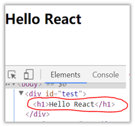
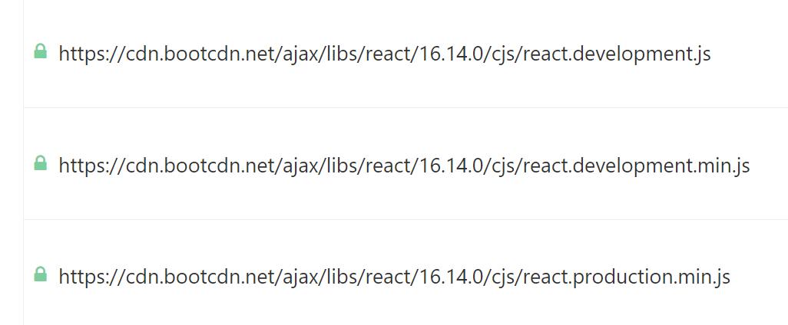
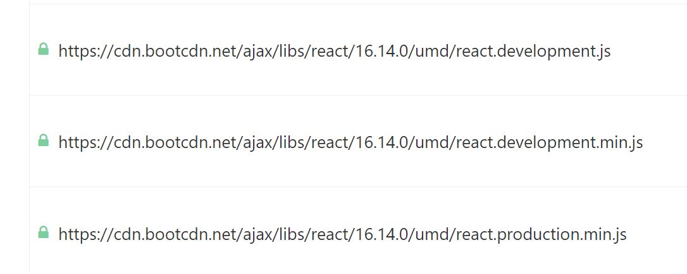
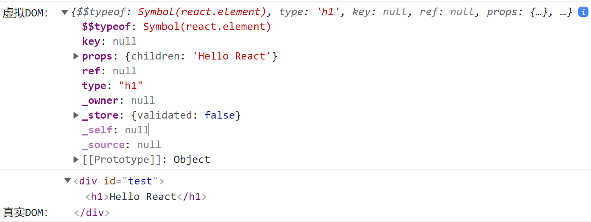
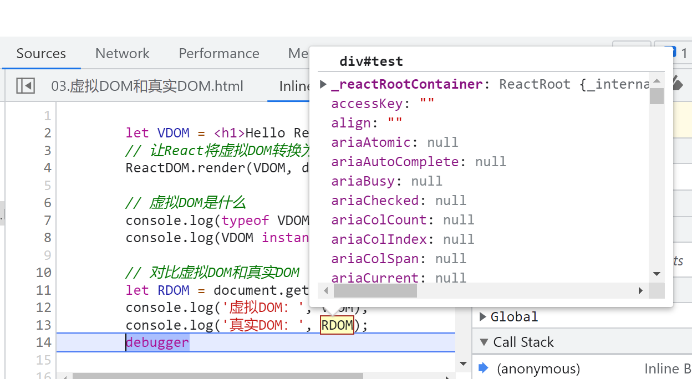
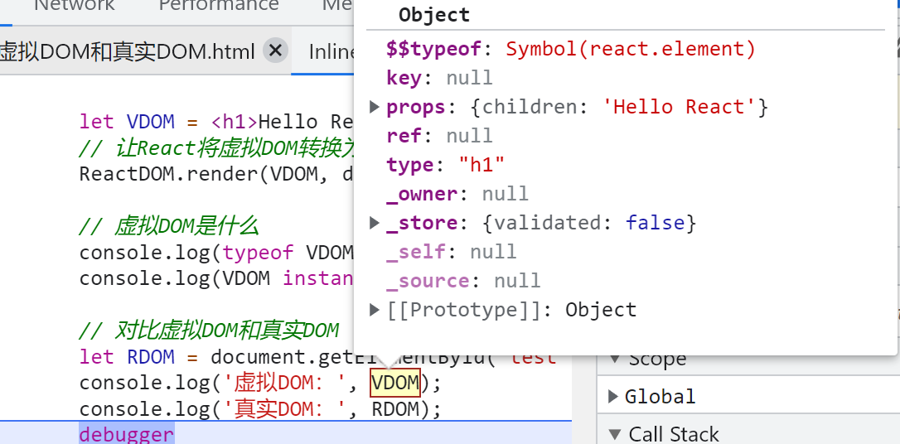
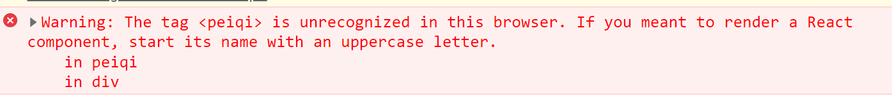
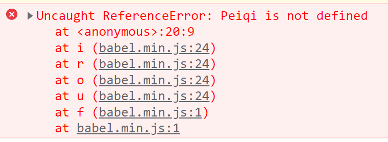

## 目标效果

使用 React 在页面中渲染 "Hello React"：



## 需要的 js 库

- react.js：React 核心库。
- react-dom.js：提供操作 DOM 的 react 拓展库。
- babel.min.js：解析 JSX 语法转为 JavaScript 代码的库。

**补充：哪里可以找到这些 js 库？**

1. [BootCDN](https://www.bootcdn.cn/) 前端开源CDN加速服务网站可下载。

   - 在 "../cjs/.." 中的代码是使用 commonJS 写的版本：

   

   - 在  "../umd/.." 中的代码是使用 ES6 写的版本：

   

   一般浏览器可以运行 CommonJS 的代码，但是一般推荐使用 ES6 的语法，所以一般使用 ’‘../umd/..’‘ 中的代码。

2. [React官网](https://react.docschina.org/docs/add-react-to-a-website.html#step-2-add-the-script-tags) 可以找到 CDN资源，将其直接引入到页面即可使用 React：

   ````html
     <!-- ... 其它 HTML ... -->
   
     <!-- 加载 React。-->
     <!-- 注意: 部署时，将 "development.js" 替换为 "production.min.js"。-->
     <script src="https://unpkg.com/react@16/umd/react.development.js" crossorigin></script>
     <script src="https://unpkg.com/react-dom@16/umd/react-dom.development.js" crossorigin></script>
   
     <!-- 加载我们的 React 组件。-->
     <script src="like_button.js"></script>
   
   </body>
   ````

**补充：使用babel转义ES6代码之后，浏览器就可以运行转义后的代码了吗？**

不一定的，Babel 确实是可以将 ES6 语法转换为 ES5 语法，但是 Babel 无法转换 ES6 的模块化语法。Babel 做的实际是将 ES6 语法转换为 CommonJS 语法。但是 CommonJS 语法中的 require 模块化语法浏览器不认识，所以需要 browserify 这类插件的打包转化 require 模块化语法之后才能给浏览器使用。

**所以**，本章不使用模块化语法作为 React 使用的展示。

**补充： Babel 既然不能单独将 React 代码解析为浏览器可运行的代码，为什么 React 还需要和 Babel 一块使用？**

React 使用 JSX 作为编程语言，浏览器并不认识 JSX 语法，Babel 可以将 JSX 代码转义为 JavaScript 代码

## js 库引入的顺序

1. 先引入 React 核心库

   ````html
   <!-- 引入 React 核心库，全局产生 React 对象 -->
   <script src="./js/react.development.js"></script>
   ````

2. 建议再引入 react-dom 用于支撑 react 操作 DOM

   ````html
   <!-- 引入 react-dom 用于支撑 react 操作 DOM，全局产生 ReactDOM 对象 -->
   <script src="./js/react-dom.development.js"></script>
   ````

3. 引入 babel，将 jsx 转换为 js

   ````html
   <!-- 引入 babel，将 jsx 转换为 js -->
   <script src="./js/babel.min.js"></script>
   ````

## 代码实现

````html
<!DOCTYPE html>
<html lang="en">
<head>
    <meta charset="UTF-8">
    <meta http-equiv="X-UA-Compatible" content="IE=edge">
    <meta name="viewport" content="width=device-width, initial-scale=1.0">
    <title>Hello_react</title>
    <!-- 引入 React 核心库 -->
    <script src="./js/react.development.js"></script>
    <!-- 引入 react-dom 用于支撑 react 操作 DOM -->
    <script src="./js/react-dom.development.js"></script>
    <!-- 引入 babel，将 jsx 转换为 js -->
    <script src="./js/babel.min.js"></script>
</head>
<body>
    <div id="test"></div>
    <script type="text/babel">/*此处必须写 "text/babel" ,要求浏览器使用babel解析其中的代码*/
        // 创建虚拟 DOM
        let VDOM = <h1>Hello React</h1>
        // 让React将虚拟DOM转换为真实DOM，渲染到页面
        ReactDOM.render(VDOM, document.getElementById('test'))
    </script>
</body>
</html>
````

效果：


**补充：此时控制台会有警告**


原因：

- 未安装 react 开发者工具
- 在网页中直接使用 Babel 编译代码，编译过程会执行在浏览器内，会影响网页性能，不推荐这么做。

## 虚拟 DOM 创建的两种方式

### 使用 jsx 语法创建虚拟DOM

- 例子

  ````html
  <!DOCTYPE html>
  <html lang="en">
  
  <head>
      <meta charset="UTF-8">
      <meta http-equiv="X-UA-Compatible" content="IE=edge">
      <meta name="viewport" content="width=device-width, initial-scale=1.0">
      <title>使用jsx语法创建虚拟DOM</title>
      <!-- 引入 React 核心库 -->
      <script src="./js/react.development.js"></script>
      <!-- 引入 react-dom 用于支撑 react 操作 DOM -->
      <script src="./js/react-dom.development.js"></script>
      <!-- 引入 babel，将 jsx 转换为 js -->
      <script src="./js/babel.min.js"></script>
  </head>
  
  <body>
      <div id="test"></div>
      <script type="text/babel">
          // 创建虚拟 DOM
          let VDOM = (
              <h1>
                  <span>Hello React</span>
              </h1>
          )
          // 让React将虚拟DOM转换为真实DOM，渲染到页面
          ReactDOM.render(VDOM, document.getElementById('test'))
          /*
              关于jsx：
              1. jsx的出现就是为了更加方便地创建虚拟DOM
              2. jsx最终经过babel的编译，转译为了最原始的js写法
          */
      </script>
  </body>
  
  </html>
  ````

  

### 使用 js 语法创建虚拟DOM

- 语法：

  ````javascript
  let VDOM = React.createElement('DOM标签类型',{标签属性名(如 id): 标签属性值}, 标签内容)
  ````

- 例子：

  ````html
  <!DOCTYPE html>
  <html lang="en">
  <head>
      <meta charset="UTF-8">
      <meta http-equiv="X-UA-Compatible" content="IE=edge">
      <meta name="viewport" content="width=device-width, initial-scale=1.0">
      <title>使用js语法创建虚拟DOM</title>
      <!-- 引入React核心库 -->
      <script src="./js/react.development.js"></script>
      <!-- 引入React-DOM -->
      <script src="./js/react-dom.development.js"></script>
  </head>
  <body>
      <!-- 容器 -->
      <div id="app"></div>
      <script type="text/javascript">
          // 创建一个虚拟DOM
          let VDOM = React.createElement('h1', {id: 'DOM'}, React.createElement('span',null,'Hello React'))
          // 将虚拟DOM渲染到容器中
          ReactDOM.render(VDOM, document.getElementById('app'))
      </script>
  </body>
  </html>
  ````

  

## 虚拟DOM和真实DOM

### 虚拟DOM是什么

- 虚拟 DOM 是一个***普通对象***

  ````javascript
  let VDOM = <h1>Hello React</h1>
  console.log(typeof VDOM); //object
  console.log(VDOM instanceof Object) //true
  ````

### 对比虚拟DOM和真实DOM

````javascript
let VDOM = <h1>Hello React</h1>
let RDOM = document.getElementById('test')
console.log('虚拟DOM：', VDOM);
console.log('真实DOM：', RDOM);
````



- 真实DOM比较“重”，因为真实DOM是给浏览器使用的，上面挂载了非常多的属性、事件等：

  

- 虚拟DOM比较“轻”，因为虚拟DOM给React使用，上面挂载的属性比较少：

  

- 虚拟DOM最终一定会转为真实DOM放入页面

## React JSX

JSX 全称为 JavaScript XML，一种类似于 XML 的 JavaScript 拓展语法，本质是 `React.createElemet(component,props,...children`方法的语法糖。

### JSX语法规则

- 创建虚拟DOM时，不需要定义为字符串。

  ````jsx
  const VDOM = <h1>Hello React</h1>
  ````

- 虚拟DOM标签中要混入**js**表达式，要用**`{}`包裹**。

  ````jsx
  const data = 'Hello React'
  const VDOM = <h1>{data}</h1>
  ````

- 虚拟DOM标签中**类名**要用 **className** 指定。

  ````jsx
  const VDOM = <h1 className='title'>{data}</h1>
  ````

- 虚拟DOM标签中要用**内联样式**，**用 `style={{color: 'white'}}`**，注意属性名带 `‘-’` 的需要转换为驼峰命名。

  ````jsx
  const VDOM = <h1 style={{color: 'white', fontSize: '45px'}} className='title'>{data}</h1>
  ````

  其中外层`{}`表示需要包裹一个js代码，内层括号声明了一个对象，样式以对象内键值对的形式定义。

- 只能有一个根标签。

  ```jsx
  const VDOM = (
      <div>
          <h1 style={{color: 'white',fontSize: '45px'}} className='title'>{data}</h1>
          <h2>Hello JSX</h2>
      </div>   
  )
  ```

- 标签必须闭合

  ````jsx
  const VDOM = (
      <div>
          <h1 style={{color: 'white',fontSize: '45px'}} className='title'>{data}</h1>
          <h2>Hello JSX</h2>
          <input type="text" />
      </div>   
  )
  ````

- 关于标签的首字符

  - 若首字母小写，则 React 去找与之同名的 HTML 标签

    - 若找到，之间转为 HTML 标签。

    - 若没有找到，报错：

      

  - 若首字母大写，则 React 去找与之同名的组件

    - 所找到，那么就用组件

    - 若未找到，报错

      

### JSX练习

````html
<!DOCTYPE html>
<html lang="en">
  <head>
    <meta charset="UTF-8" />
    <meta http-equiv="X-UA-Compatible" content="IE=edge" />
    <meta name="viewport" content="width=device-width, initial-scale=1.0" />
    <title>JSX练习</title>
    <script src="../js/react.development.js"></script>
    <script src="../js/react-dom.development.js"></script>
    <script src="../js/babel.min.js"></script>
  </head>
  <body>
    <div id="app"></div>
    <script type="text/babel">
      const data = ['Angular','vue','react'];
      const VDOM = (
          <div>
              <ul>
                {
                    data.map((item, index)=>{
                        return <li key={index}>{item}</li>
                    })
                }
            </ul>
          </div>
      )
      ReactDOM.render(VDOM, document.getElementById('app'))
    </script>
  </body>
</html>

````

注意：

- `{}`内部必须是一个**表达式**
- `<li></li>`中的 `key` 最好不要用数组 `index`，详情见 diff 算法。