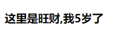
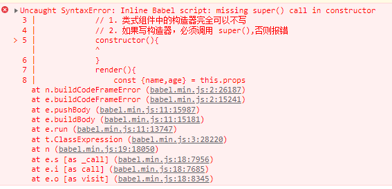
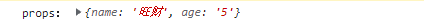
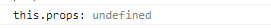
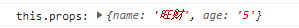

- 类式组件构造器完全可以不写：

  ````jsx
  class Dog extends React.Component {
      // 1. 类式组件中的构造器完全可以不写
      render(){
          const {name,age} = this.props
          return (
              <h3>这里是{name},我{age}岁了</h3>
          )
      }
  }
  ReactDOM.render(<Dog name="旺财" age="5"/>,document.querySelector('#app'))
  ````

  

- 类式组件构造器写了，必须在构造器函数内调用 `super()`：

  ````jsx
  class Dog extends React.Component {
      // 2. 如果写构造器，必须调用 super(),否则报错
      constructor(){
      }
      render(){
          const {name,age} = this.props
          return (
              <h3>这里是{name},我{age}岁了</h3>
          )
      }
  }
  ReactDOM.render(<Dog name="旺财" age="5"/>,document.querySelector('#app'))
  ````

  报错：

  

- React 会在组件挂载之前执行组件实例对象的构造器，并为构造器传入组件实例标签上的属性 `props`：

  ````jsx
  class Dog extends React.Component 
    // 3. React会在组件挂载之前执行组件实例对象的构造器，并为构造器传入组件实例标签上的属性 props
    constructor(props) {
      super();
      console.log("props：", props);
    }
    render() {
      const { name, age } = this.pro
      return (
        <h3>
          这里是{name},我{age}岁了
        </h3>
      );
    }
  }
  ReactDOM.render(
    <Dog name="旺财" age="5" />,
    document.querySelector("#app")
  );
  ````

  控制台输出：

  

- 如果未向 `super()` 传入 `props`，则在构造器中通过 `this` 调用 `props` 会报 `undefined`

  ````jsx
  class Dog extends React.Component {
    // 如果未向 super() 传入 props，则在构造器中通过 this 调用 props 会报 undefined
    constructor(props) {
      super();
      console.log("props：", props);
      console.log("this.props:", this.props);
    }
    render() {
      const { name, age } = this.props;
      return (
        <h3>
          这里是{name},我{age}岁了
        </h3>
      );
    }
  }
  ReactDOM.render(
    <Dog name="旺财" age="5" />,
    document.querySelector("#app")
  );
  ````

  控制台：

  

  向 `super()` 传入 `props` ：

  ````jsx
  constructor(props) {
    super(props);
    console.log("props：", props);
    console.log("this.props:", this.props);
  }
  ````

  控制台：

  
