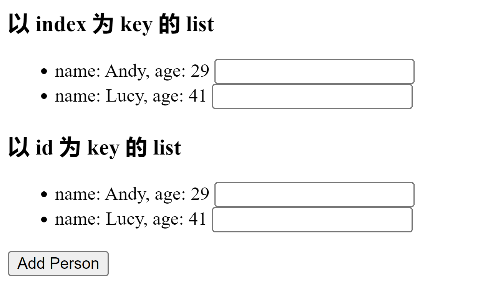
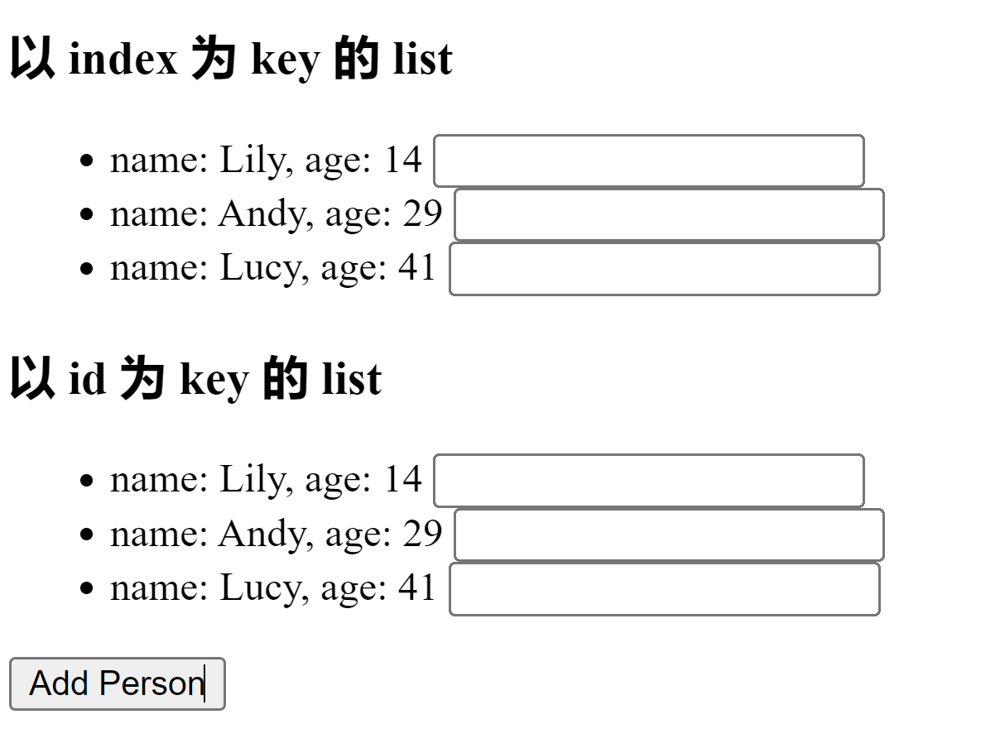
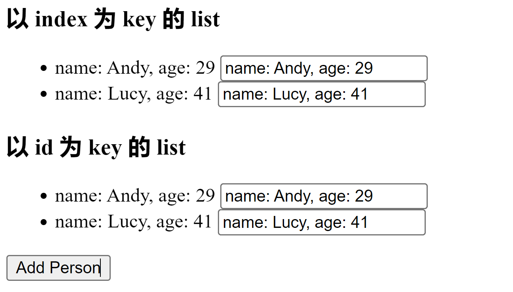

- 虚拟 DOM 中 key 的作用

  当状态 `state` 中的数据发生变化时，React 会根据 **新数据** 生成 **新的虚拟DOM**，随后 React 进行 **新虚拟DOM** 与 **旧虚拟DOM** 的diff比较，比较规则如下：

  - 旧虚拟 DOM 找到了与新虚拟 DOM 相同的 key:
    - 若虚拟 DOM 中内容没变，直接使用之前的真实 DOM
    - 若虚拟 DOM 中内容变了，则生成新的真实 DOM，随后替换掉页面中之前的真实 DOM
  - 旧虚拟 DOM 中未找到与新虚拟 DOM 相同的 key
    - 根据数据创建新的真实 DOM，随后渲染到页面

- 案例分析：

  ````jsx
  class Personlist extends React.Component {
      state = {
          persons: [
              {
                  id: '0001',
                  name: 'Andy',
                  age: 29
              },
              {
                  id: '0010',
                  name: 'Lucy',
                  age: 41
              }
          ]
      }
      render(){
          const { persons } = this.state
          return (
              <div>
                  <h3>以 index 为 key 的 list</h3>
                  <ul>
                      {persons.map((item, index) => {
                          return <li key={index}>name: {item.name}, age: {item.age} <input type="text"/></li>
                      })}
                  </ul>
                  <h3>以 id 为 key 的 list</h3>
                  <ul>
                      {persons.map((item, index) => {
                          return <li key={item.id}>name: {item.name}, age: {item.age} <input type="text"/></li>
                      })}
                  </ul>
                  <button onClick={this.addPerson}>Add Person</button>
              </div>
              
          )
      }
      
      addPerson = () => {
          const newPerson = {
              id: '0100',
              name: 'Lily',
              age: 14
          } 
          this.setState({
              persons:[
                  newPerson, ...this.state.persons
              ]
          })
      }
  }
  ````

  一个渲染列表的组件：

  

  有一个增加人员的功能，点击 Add Person 按钮后，新增一个人：

  

将输入框内填充内容：



点击 Add Person 按钮：

以 index 为 key 的输入框数据出现了混乱，为什么呢？

1. 使用 index 作为 key 时：

   初次挂载的组件：

   - 初始的数据：

     ````javascript
     {id: '0001',name: 'Andy',age: 29}
     {id: '0010',name: 'Lucy',age: 41}
     ````

   - 初始的虚拟 DOM：

     ````jsx
     <li key=0 >name: Andy, age: 29 <input type="text"/>
     <li key=1>name: Lucy, age: 41 <input type="text"/>
     ````

   更新之后：

   - 新的数据：

     ````jsx
     {id: '0100',name: 'Lily',age: 14}
     {id: '0001',name: 'Andy',age: 29}
     {id: '0010',name: 'Lucy',age: 41}
     ````

   - 更新后的虚拟 DOM：

     ````jsx
     <li key=0 >name: Lily, age: 14 <input type="text"/>
     <li key=1 >name: Andy, age: 29 <input type="text"/>
     <li key=2>name: Lucy, age: 41 <input type="text"/>
     ````

   diffing 算法先拿新的虚拟DOM中的第一个中的key去找旧虚拟DOM中key值相同的那个，发现有，但是内部内容不同，便更新了原本的对应真实DOM，比较input的时候，发现input标签新旧相同，就不做任何动作，保留了原先真实DOM，所以导致了输入框内容还保留在原先位置的输入框里。以此类推，后面的虚拟和真实DOM还会重复先前的操作，导致了错误的结果。

2. 以 id 作为 key 时：

   初次挂载的组件：

   - 初始的数据：

     ````javascript
     {id: '0001',name: 'Andy',age: 29}
     {id: '0010',name: 'Lucy',age: 41}
     ````

   - 初始的虚拟 DOM：

     ````jsx
     <li key=‘0001’ >name: Andy, age: 29 <input type="text"/>
     <li key=‘0010’>name: Lucy, age: 41 <input type="text"/>
     ````

   更新之后：

   - 新的数据：

     ````jsx
     {id: '0100',name: 'Lily',age: 14}
     {id: '0001',name: 'Andy',age: 29}
     {id: '0010',name: 'Lucy',age: 41}
     ````

   - 更新后的虚拟 DOM：

     ````jsx
     <li key=‘0100’ >name: Lily, age: 14 <input type="text"/>
     <li key=‘0001’ >name: Andy, age: 29 <input type="text"/>
     <li key=‘0010’>name: Lucy, age: 41 <input type="text"/>
     ````

   diffing 算法先拿新的虚拟DOM中的第一个中的key去找旧虚拟DOM中key值相同的那个，发现旧虚拟DOM中没有，就行创建一个真实DOM，插入到第一个位置。然后 diffing 拿第二个虚拟DOM的key '0001' 到旧虚拟DOM中查找，发现有相同key值的虚拟DOM，并且内部内容一致，保留原先真实DOM不动，第三个同理。不会出错。

- 用index值作为key可能会引发的问题：

  1. 若对数据进行：逆序添加，逆序删除等破坏原有顺序的操作

     会产生没有必要的真实DOM更新 → 界面效果没问题，但是效率低

  2. 如果结构中包含输入类 DOM

     会产生错误DOM更新 → 界面有问题

  3. 注意，如果不存在对数据的逆序添加、逆序删除等破坏顺序的操作，仅用于渲染列表展示，使用 index 作为 key 没有问题，效率低而已