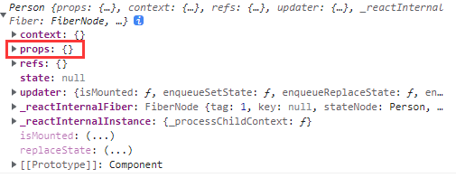

`props` 属性会挂载在每个组件实例对象上。

## props 的基本使用

组件标签上的属性会转化为组件对象 `props` 上的属性。

````jsx
ReactDOM.render(<Person name='lucy' age='46' gender='women'/>,document.querySelector('#app'))
````


因此，组件标签上可以通过添加属性的方式，从外部传递信息。组件对象内部可以通过 `this.props` 获取这些传递进来的信息。

````jsx
class Person extends React.Component{
    render(){
        const {name, age, gender} = this.props
        return (
            <ul>
                <li>name: {name}</li>
                <li>age: {age}</li>
                <li>gender: {gender}</li>
            </ul>
        )
    }
}
ReactDOM.render(<Person name='lucy' age='46' gender='women'/>,document.querySelector('#app'))
````


**注意！**

- `props` 对象中的属性是***只读***的，不可修改。

  ````javascript
  this.props.age = 99  //会报错，props对象中的属性是只读的
  ````

  想要修改值，正确做法：

  ````javascript
  let {name, age, gender} = this.props
  age = 99
  ````

## 打包传递 props

在组件标签中使用”解构赋值语法“传递对象，可以将对象中的属性映射为组件标签的属性，进而可以从 `props` 中获得该对象中的属性。

````jsx
const data = {
    name: 'Andy',
    age: 56,
    gender: 'man'
}
ReactDOM.render(<Person {...data}/>,document.querySelector('#app'))
// 相当于：
ReactDOM.render(<Person name='Andy' age='56' gender='man'/>,document.querySelector('#app'))
````

**注意：**

在**原生 js 环境**中，展开语法不能独立展开对象：

````javascript
console.log(...data) // 报错，对象上没有迭代器
````

但是可以使用 `{}` 进行包裹从而实现对象克隆：

````javascript
console.log({...data})
console.log({...data1, ...data2})
console.log({a: 'a', b: 'b', ...data2})
````

**但是** React 组件标签中使用的包裹在 `{}` 的“解构赋值”**不是原生 js** 的解构赋值，而是 **React** 为打包 `props` 传递设计的**专有语法**。

在非React 组件标签的，在 JSX 和 babel 环境中，允许直接对对象进行结构（`...data`），但是依旧不能对对象进行正常结构，而是直接忽略这段代码。

## 对 props 进行限制

### 类型限制

有时候需要对标签属性传入的数据类型进行限制，以限制不期望的类型数据被传入导致意料外的代码执行结果。

- 引入 prop-type.js

  ````html
  <script src="../js/prop-types.js"></script>
  ````

​		引入 prop-type.js 文件之后，全局会有一个 `PropTypes` 对象，对象内定义了各种类型。

- 给类式组件定义入参**类型**

  ````jsx
  ClassComponent.propTypes = {
      attrName1: PropTypes.string,
      attrName2: PropTypes.number,
      ...
  }
  ````

  类式组件上带有一个 `propTypes` 属性，组件创建时会读取该属性的内容，来制定对该类式组件属性类型的限制规则。

**例子：**定义一个 `Person` 类，并对该类式组件的属性进行限制：

````jsx
// 定义一个 `Person` 类
class Person extends React.Component{
    render(){
        let {name, age, gender} = this.props
        return (
            <ul>
                <li>name: {name}</li>
                <li>age: {age+1}</li>
                <li>gender: {gender}</li>
            </ul>
        )
    }
}

// 对该组件的属性进行限制
Person.propTypes = {
    name: PropTypes.string,
    age: PropTypes.number,
    sex: PropTypes.string
}

// 逐个传入属性，渲染一个组件
ReactDOM.render(<Person name='lucy' age='46' ReactDOM.render(<Person name='lucy' age='46' gender='women'/>,document.querySelector('#app'))

// 数据
const data = {
    name: 'Andy',
    age: 56,
    gender: 'man'
}

// 打包传入属性，渲染一个组件
ReactDOM.render(<Person {...data}/>,document.querySelector('#app1'))
````

组件会被正常渲染：


但是由于组件传入了非法参数 `age='46'`, 控制台会报错：


### 必填限制

给类式组件定义入参**必要性**限制

````jsx
ClassComponent.propTypes = {
    attrName1: PropTypes.string.isRequired,
    ...
}
````

**例子：**

给 `Person` 类加上类型必要性限制：

````jsx
Person.propTypes = {
    name: PropTypes.string.isRequired,// 限制属性 1.字符串类型 2.必填
    age: PropTypes.number,
    sex: PropTypes.string
}

ReactDOM.render(<Person name='lucy' gender='women'/>,document.querySelector('#app2'))
````

由于没有填入必填属性 `name`，渲染正常，控制台报错：


### 设置默认值

类式组件上带有一个 `defaultProps` 属性，组件创建时会读取该属性的内容，对该类式组件属性设置**默认值**。

````jsx
Person.defaultProps = {
    age: 18
}

// 组件实例未传入 age 属性
ReactDOM.render(<Person name='Lucy' gender='women'/>,document.querySelector('#app2'))
````


未传入的 `age` 属性被设置了默认值 18。

### 将限制配置对象放到组件类内部

直接使用 `className.attr` 的方式可以给类本身挂载属性对象，但是组件本身希望包含该组件的所有内容，这种在类外各类定义属性的方式显然是违背组件设计初衷的。因此需要将这些配置对象定义在类的内部。

**补充：**

类内部使用 `static` 修饰的属性，会被挂载到类本身上，而不是类实例上

````jsx
className {
    static attrName
}
````

凡是被 `static` 修饰的属性和方法都是**静态方法**和**属性**,只能被**类名调用**,不能被实例化对象调用.同时也不能被子类继承,换句话说它属于当前这个类的。

利用 `static` 的特性。可以将限制配置对象定义为静态属性，放到类的内部。

````jsx
class Person extends React.Component{
    state = {}
    
    static propTypes = {
    	name: PropTypes.string.isRequired,
    	age: PropTypes.number,
    	sex: PropTypes.string
    }
    static defaultProps = {
        age: 18
    }
    render(){
        let {name, age, gender} = this.props
        return (
            <ul>
                <li>name: {name}</li>
                <li>age: {age}</li>
                <li>gender: {gender}</li>
            </ul>
        )
    }
}
````

## 函数式组件使用 props

函数式组件也可以使用 `props`，定义在组件上的属性会作为参数传入到函数中，通过入参即可获取使用 `props`：

````jsx
function Person(props) {
  const { name, age, gender } = props;
  return (
    <ul>
      <li>name: {name}</li>
      <li>age: {age}</li>
      <li>gender: {gender}</li>
    </ul>
  );
}
Person.propTypes = {
  name: PropTypes.string.isRequired,
  age: PropTypes.number,
  gender: PropTypes.string,
};
Person.defaultProps = {
    name: 'dafaultName'
}
const data = {
  age: "66",
  gender: "unkonwn",
};
ReactDOM.render(<Person {...data} />, document.querySelector("#app"));
````

同样，可以在组件函数本身上定义限制属性。
