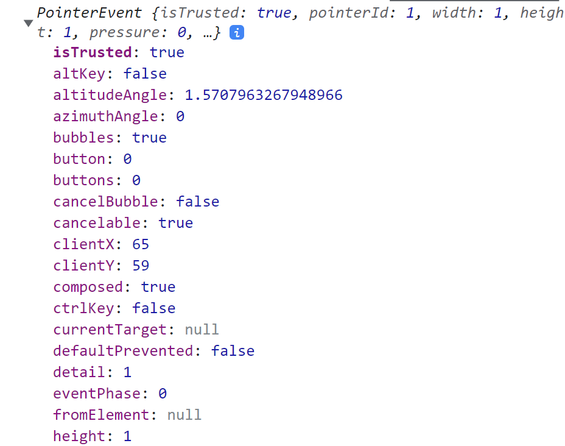
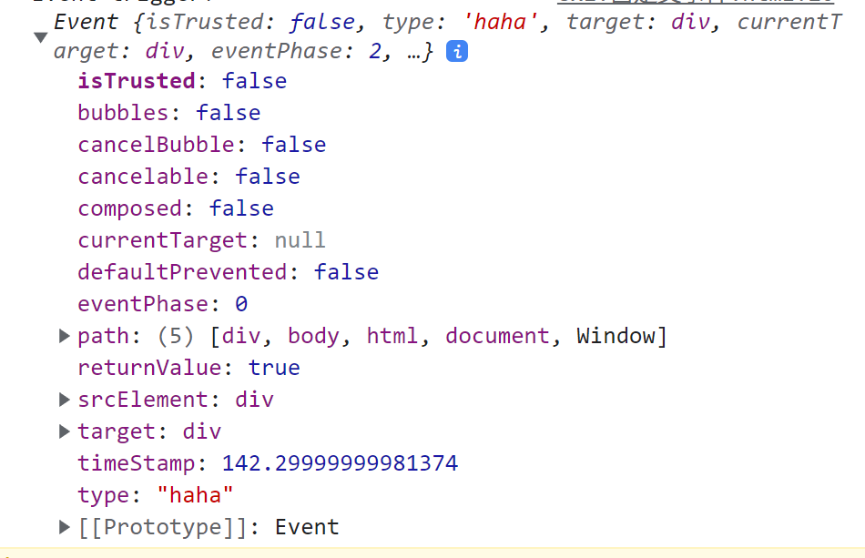
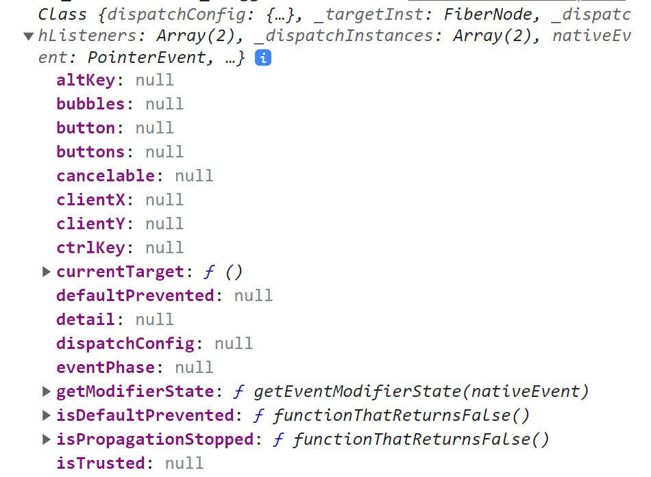

## 通过 onXxxx 属性指定处理函数

 React 通过 onXxxx 属性指定处理函数，为了**兼容性好**。

### React中使用的是自定义事件

React 使用的都是**自定义事件**，不是原生事件。---为了更好的兼容性

**补充：**自定义事件

原生事件，如 `onclick`，事件对象：



JavaScript 允许自定义事件

- `new Event(eventName)`：创建一个事件
- `DOMElement.dispathEvent(eventName)`：DOM元素触发事件

````html
<div style="height: 200px;width: 100px;background-color: aqua;"></div>
<script type="text/javascript">
    let div = document.querySelector('div')
    // 1. 定义一个 haha 事件
    const haha = new Event('haha')
    // 2. 给元素绑定 haha 事件，并设置回调函数
    div.addEventListener('haha', ()=>{
        alert('Event trigger!')
    })
    // 3. 元素触发 haha 事件，从而调用回调函数
    div.dispatchEvent(haha)
</script>
````

自定义事件对象：



### 将事件委托给最高层元素

React 中的事件是通过事件委托的方式处理的（委托给组件最外层的元素），通过 `event.target` 可以访问到事件触发的 DOM 元素。--- 为了**效率高**

补充：事件委托

子元素触发的事件可以通过冒泡传给父元素，用此特性可以将事件绑定在父元素的身上从而实现事件委托，事件的回调函数默认传入事件对象，通过事件对象可以拿到触发事件的究竟是哪个子元素（`event.target`）

````html
<ul id="pageHeader">
    <li id="tab1">首页</li>
    <li id="tab2">页签1</li>
    <li id="tab3">页签2</li>
    <li id="tab4">页签3</li>
    <li id="tab5">页签4</li>
</ul>
<script type="text/javascript">
    let header = document.querySelector('#pageHeader')
    header.addEventListener('click', (event) => {
        console.log(event.target)
    })
</script>
````

## React 事件对象

React 事件对象是由 React 封装过的自定义类对象：



该对象上绑定了同原生事件对象同样的属性，但是只有要用到的属性被赋予了值。

因此当需要调用事件对象的属性和方法时，直接像原生事件对象一样调用即可：

````jsx
class EventDemo extends React.Component{
    render(){
        return (
            <div className="container" onClick={this.rootClockCallback}>
                <button onClick={this.printMessage1}>Button_No.1</button>
                <button onClick={this.printMessage2}>Button_No.2</button>
            </div>
        )
    }
    rootClockCallback = () => {
        console.log('Root_ClickCallback_Triggered', event)
    }
    
    printMessage1 = (event) => {
        event.stopPropagation(); // 阻止冒泡，rootClockCallback 不会被调用
        console.log('Message_PrinterNo.1_triggered');
    }
    printMessage2 = () => {
        console.log('Message_PrinterNo.2_triggered');
    }
}
````