-16450971824071.png)

## 引出 React 组件生命周期

要实现一个案例：

**需求一：**

页面元素逐渐淡出，并在完全淡出之后恢复原样，周而复始。

````jsx
class Demo extends React.Component{
    state = {
        opacity: 1
    }
    // 生命周期钩子函数 在组件挂载完成后触发
    componentDidMount(){
        console.log('componentDidMount() invoked!');
        let { opacity } = this.state
        setInterval(() => {
            opacity = opacity < 0 ? 1 : opacity - 0.1
            this.setState({
                opacity
            })
        }, 200)
    }
    
    render(){
        console.log('render() invoked!')
        const {opacity} = this.state
        return (
            <h1 style={{opacity}}>孩子学习老不好，多半是废了。</h1>
        )
    }
}
ReactDOM.render(<Demo/>, document.querySelector('#app'))
````

如果将定时器放在 `render()`中，每次 `state` 变化都会引起 `render()` 调用， `render()` 调用会新开设一个新的定时器，由此往复，定时器会越来越多，定时器回调执行频率会越来越高。

`componentDidMount()` 是 React 组件的生命周期钩子函数，它在组件挂载完成后触发，且仅在此时触发一次，因此将定时器放在这个钩子中，可以满足需求。

**需求二：**

点击按钮，让页面上的组件卸载。

可以使用 `ReactDOM.unmountComponentAtNode(Node)` 卸载某一 DOM 节点内的组件，因此可以通过点击事件卸载组件：

````jsx
class Demo extends React.Component{
    state = {
        opacity: 1
    }
    // 生命周期钩子函数 在组件挂在完成后触发
    componentDidMount(){
        console.log('componentDidMount() invoked!');
        let { opacity } = this.state
        setInterval(() => {
            opacity = opacity < 0 ? 1 : opacity - 0.1
            this.setState({
                opacity
            })
        }, 200)
    }
    
    render(){
        console.log('render() invoked!')
        const {opacity} = this.state
        return (
            <div>
                <h1 style={{opacity}}>孩子学习老不好，多半是废了。</h1>
                <button onClick={this.unmount}>躺平吧</button>
            </div> 
        )
    }
    unmount = () => {
        // ReactDOM.unmountComponentAtNode(DOM Node) 卸载节点内的组件
        ReactDOM.unmountComponentAtNode(document.querySelector('#app'))
    }
}
````

 组件被卸载了，但是控制台报了一个错：

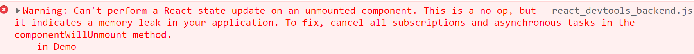

错因：组件被卸载了，但是定时器没有被清除，定时器还在定时更新原组件内的状态 `state`。

因此需要在卸载组件之前，先将定时器清除。

生命周期钩子 `comnponentWillUnmount()`，会在组件卸载之前固定调用，因此可以使用 `comnponentWillUnmount()` 实现该功能：

````jsx
class Demo extends React.Component{
    state = {
        opacity: 1
    }
    // 生命周期钩子函数 在组件挂在完成后触发
    componentDidMount(){
        console.log('componentDidMount() invoked!');
        let { opacity } = this.state
        this.timer = setInterval(() => {
            opacity = opacity < 0 ? 1 : opacity - 0.1
            this.setState({
                opacity
            })
        }, 200)
    }
    //生命周期钩子函数，在组件卸载之前固定触发
    componentWillUnmount(){
        console.log('componentWillUnmount() invoked!');
        clearInterval(this.timer)
    }
    
    render(){
        console.log('render() invoked!')
        const {opacity} = this.state
        return (
            <div>
                <h1 style={{opacity}}>孩子学习老不好，多半是废了。</h1>
                <button onClick={this.unmount}>躺平吧</button>
            </div> 
        )
    }
    unmount = () => {
        // ReactDOM.unmountComponentAtNode(DOM Node) 卸载节点内的组件
        ReactDOM.unmountComponentAtNode(document.querySelector('#app'))
    }
}
````

## 组件自身生命周期（旧）

````jsx
// 父组件
class FatherComponent extends React.Component{
    constructor(){
        console.log('father ---- constructor');
        super()
        this.state = {
            present: 'Big bro'
        }
    }
    componentWillMount(){
        console.log('father ---- componentWillMount');
    }
    componentDidMount(){
        console.log('father ---- componentDidMount');
    }
    shouldComponentUpdate(){
        console.log('father ---- shouldComponentUpdate');
        return true
    }
    componentWillUpdate(){
        console.log('father ---- componentWillUpdate');
    }
    componentDidUpdate(){
        console.log('father ---- componentDidUpdate');
    }
    componentWillUnmount(){
        console.log('father ---- componentWillUnmount');
    }
    render(){
        console.log('father ---- render');
        const {present} = this.state
        return (
            <div className='father'>
                <h1>这里是父组件，我有一个祖传大宝贝：{present}</h1>
                <button onClick={this.changePresent}>大宝贝换换吧</button>
                <SonComponent presentFromFather={present}/>
                <button onClick={this.removeComponent}>卸载组件</button>
            </div>
        )
    }
    changePresent = () => {
        const {present} = this.state
        this.setState({
            present: present === 'Big bro' ? 'Litter girl' : 'Big bro'
        })
    }
    removeComponent = () => {
        ReactDOM.unmountComponentAtNode(document.querySelector('#app'))
    }
}
// 子组件
class SonComponent extends React.Component{
    constructor(){
        console.log('son ---- constructor');
        super()
    }
    componentWillMount(){
        console.log('son ---- componentWillMount');
    }
    componentDidMount(){
        console.log('son ---- componentDidMount');
    }
    shouldComponentUpdate(){
        console.log('son ---- shouldComponentUpdate');
        return true
    }
    componentWillUpdate(){
        console.log('son ---- componentWillUpdate');
    }
    componentDidUpdate(){
        console.log('son ---- componentDidUpdate');
    }
    componentWillReceiveProps(){
        console.log('son ---- componentWillReceiveProps');
    }
    componentWillUnmount(){
        console.log('son ---- componentWillUnmount');
    }
    render(){
        console.log('son ---- render');
        return (
            <div className='son'>
                <h2>这里是子组件，我从我父组件那儿继承到了一个祖传大宝贝：{this.props.presentFromFather}</h2>
            </div>
        )
    }
}
ReactDOM.render(<FatherComponent/>,document.querySelector('#app'))
````


### 组件挂载流程

由 `ReactDOM.render()` 触发 ----- 除此渲染。

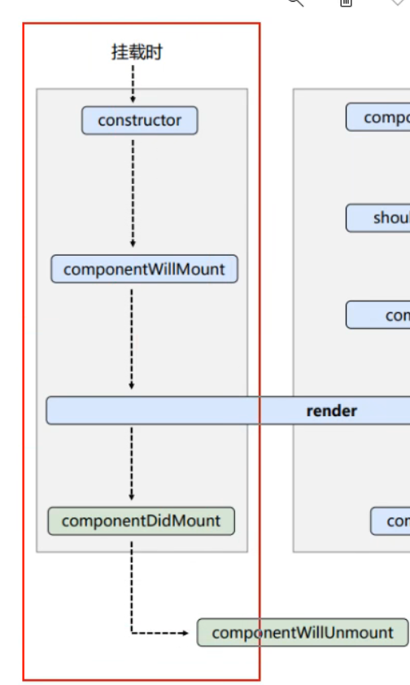

- `constructor()`{}：构造器函数

  组件创建时调用。

- `componentWillMount(){}`：生命周期钩子函数

  组件**即将挂载前**触发。

- `render(){}`：生命周期钩子函数

  组件靠此函数渲染。

- `componentDidMount(){}`：生命周期钩子函数

  组件**挂载后**触发。

- `componentWillUnmount(){}`: 生命周期钩子函数

  组件**即将卸载前**触发。

流程调用顺序：

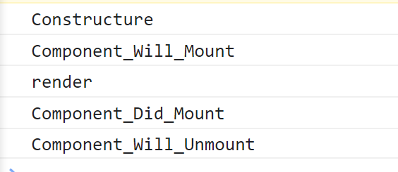

### 组件更新流程

由组件内部 `this.setState()` 或组件重新 render 触发。

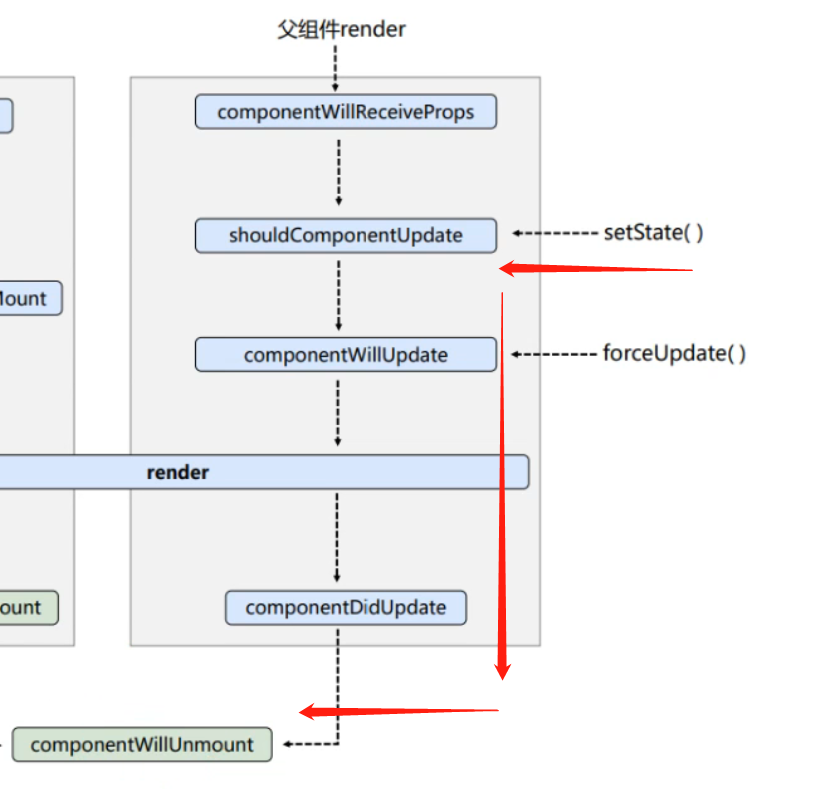

- `shouldComponentUpdate(){ return true }`：生命周期钩子函数

  组件可否更新。是组件**更新**流程的**阀门**，组件更新流程发起时调用，返回一个布尔值，默认返回 `true`，如果返回 `false` 则流程阻塞。如果不写返回值，流程阻塞，控制台报错：

  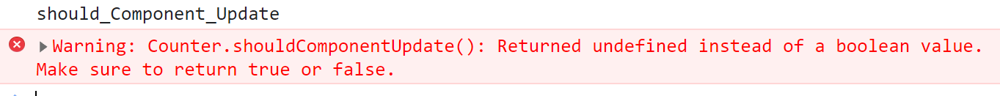

  **该钩子可以进行组件的优化**

- `componentWillUpdate(){}`：生命周期钩子函数

  组件**即将更新前**调用。

- `componentDidUpdate(){}`：生命周期钩子函数

  组件**更新后**调用。

  流程钩子调用顺序：

  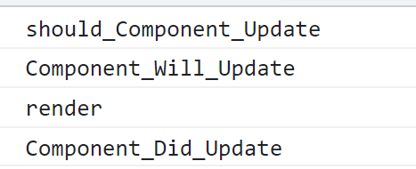

### 强制更新流程

由 `this.forceUpdate()` 触发。

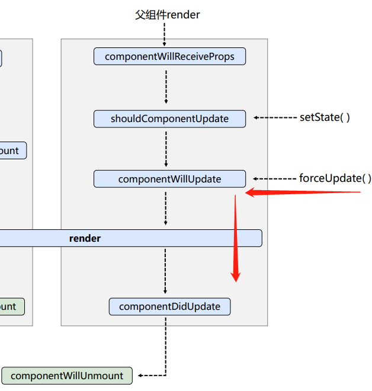

使用 `forceUpdate()` 方法可以出发强制更新流程，该流程不需要征求 `shouldComponentUpdate()` 的同意，直接开启更新流程

流程调用顺序：

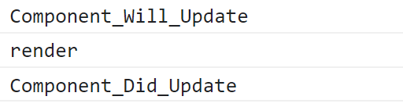

## 父子组件生命周期（旧）

### 父子组件挂载流程

父组件先初始化（`constructor`） →  父组件将要挂载（`componentWillMount`）→ 父组件渲染（`render`）→ 子组件初始化（`constructor`） →  子组件将要挂载（`componentWillMount`）→ 子组件渲染（`render`）→ 子组件挂载完成（`componentDidMount`）→ 父组件挂载完成（`componentDidMount`）

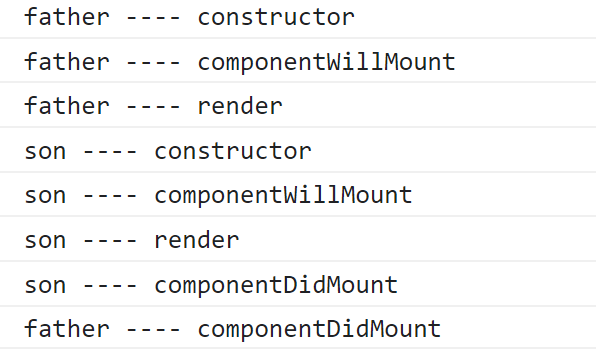

### 父子组件更新流程

- `componentWillReceiveProps(){}`：生命周期钩子函数

  组件接收**新的**属性前调用。

  **注意：**该钩子函数不会在组件第一次获得属性时调用。

父组件更新阀门（`shouldComponentUpdate`）→ 父组件将要更新（`componentWillUpdate`） → 父组件渲染（`render`） →  **子组件将要接收新的属性**（`componentWillReceiveProps`） → 子组件更新阀门（`shouldComponentUpdate`） → 子组件将要更新（`componentWillUpdate`） → 子组件渲染（`render`） → 子组件完成更新（`componentDidUpdate`）→ 父组件完成更新（`componentDidUpdate`）

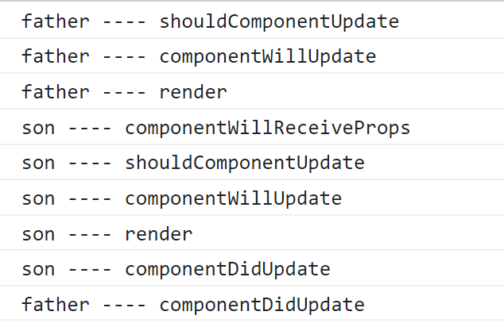

### 父子组件卸载流程

父组件将要卸载（`componentWillUnmount`）→ 子组件将要卸载（`componentWillUnmount`）

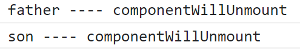

## 组件生命周期（新）

.png)

### 对比新旧生命周期

React 团队一直致力于异步渲染。在探寻异步渲染的过程中，团队发现以下生命周期钩子函数会带来不准确的代码实现：

- `componentWillMount(){}`
- `componentWillUpdate(){}`
- `componentWillReceiveProps(){}`

这些钩子函数在新版本 React 中都被改名，被加以 `UNSAFE_` 前缀，如果不加，在 16.8 -  18.0 的版本中控制台会报出警报：

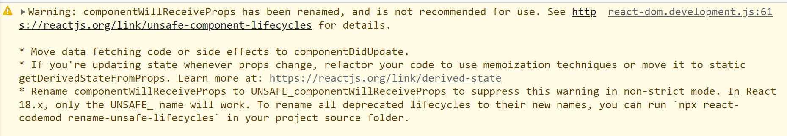

在 18.0 及以后的版本中，未冠以 `UNSAFE_` 前缀的函数会失效。

以上三个生命周期钩子，都**不推荐使用**。

### getDerivedStateFromProps()

` static getDerivedStateFromProps(props, state){ return newState}` 生命周期钩子函数

- `props`: 组件自身接收的属性
- `state`: 组件自身状态 `state`
- `newState:` 返回一个对象，该对象作用同 `this.state` 去改变组件状态 `state`

`getDerivedStateFromProps` 的存在只有一个目的：让组件在`props` 变化时更新 `state`。

该钩子函数在以下情况下调用：

- 组件挂载时，`render` 调用前
- 更新组件时，有新的 `props` 传入后
- `this.setState` 调用后
- `this.forceUpdate` 调用后 

### getSnapshotBeforeUpdate()

`getSnapshotBeforeUpdate(){ return value }` 生命周期钩子函数

`render`完成后，在最近一次渲染输出（提交到 DOM 节点）之前调用。此生命周期的任何返回值，将作为参数传递给 `componentDidUpdate()`

- 此钩子必须搭配 `componentDidUpdate` 使用，否则会报错：

  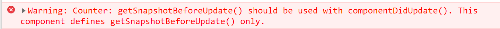

- 此钩子函数必须有返回值，否则会报错：

  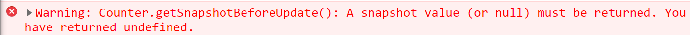

### componentDidUpdate()

`componentDidUpdate(prevProps, preState, snapshotValue){}` 生命周期钩子函数

组件更新后调用

- `prevProps`：组件更新前的 `props`
- `preState`：组件更新前的 `state`
- `snapshotValue`：快照值，即 `getSnapshotBeforeUpdate` 的返回值

### 新生命周期总结

1. 去掉了（不推荐使用）三个 will 的钩子函数

   - `componentWillMount(){}`
   - `componentWillUpdate(){}`
   - `componenetWillReceieveProps(){}`

   只保留了一个 will 钩子函数

   - `componentWillUnmount(){}`

2. 增加了两个新的钩子函数

   - `getDerivedStateFromProps(){}`
   - `getSnapshotBeforeUpdate(){}`