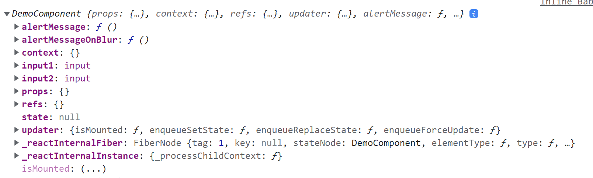
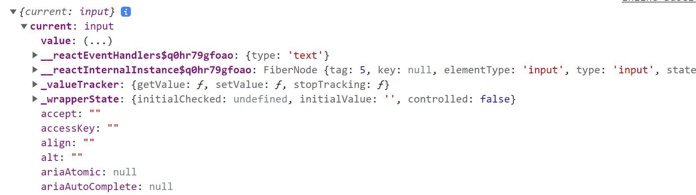

Refs 提供了一种方式，允许我们访问 DOM 节点或在 render 方法中创建的 React 元素。

**ref** 会占用很多的内存，能不用就不用。

## 字符串形式的 ref（不推荐）

通过在组件标签上定义 `ref` 属性，属性接受一个字符串，该组件标签对应的真实 DOM 节点就会存放在组件对象的 `refs` 属性中，并以该字符串为 `key`。

````jsx
class DemoComponent extends React.Component {
    alertMessage = () => {
        console.log(this)
        const {input1} = this.refs
        alert(input1.value)
    }
    render(){
        return (
            <div>
                <input type="text" ref="input1"/>
                <button onClick={this.alertMessage}>Click this to alert message before</butt
                <input type="text" placeholder='Alert message when out of focus'/>
            </div>
        )
    }
}
````

第一个输入框的真实DOM元素会以 `input1` 的名字，放入 `DemoComponent` 实例对象中 `refs` 属性中。因此可以通过 `this.refs` 获取到该 DOM 元素。

**注意：字符串形式的 ref 已经过时**，尽量**不要用**。

## 回调函数形式的 ref（不推荐）

通过在组件标签上定义 `ref` 属性，属性接收一个回调函数，react 会在渲染该组件时将组件标签对应的真实 DOM 节点作为参数，传入到该回调函数中，并立即调用该函数。

````jsx
<input type="text" ref={(c) => {this.input1 = c}}/>
````

上面代码中 `c` 即为真实 `DOM` ，将该 DOM 对象挂载在组件实例上，即可以在其他函数中通过 `this` 获取到该 `DOM`。

````jsx
class DemoComponent extends React.Component {
    alertMessage = () => {
        const {input1} = this
        alert(input1.value)
    }
    alertMessageOnBlur = () => {
        const {input2} = this
        alert(input2.value)
    }
    render(){
        return (
            <div>
                <input type="text" ref={(c) => {this.input1 = c}}/>
                <button onClick={this.alertMessage}>Click this to alert message before</button>
                <input type="text" placeholder='Alert message when out of focus' ref={c => this.input2 = c} onBlur = {this.alertMessageOnBlur}/>
            </div>
        )
    }
````

使用该方法操作DOM，DOM对象会直接挂载在组件实例上：



`refs` 属性中是一个空对象。

**注意：**回调函数形式的 ref 也**不推荐**使用！

## createRef 形式的 Ref

`React` 对象上挂载了一个 `createRef` 方法，该方法调用返回一个容器。将该容器赋予给组件标签上定义的 `ref` 属性后，在渲染对应组件标签时 react 会将该组件对应真实 DOM 对象放入到容器中：

````jsx
container1 = React.createRef()
render(){
    console.log(this)
    return (
        <div>
            <input type="text" ref={this.container1}/>
        </div>
    )
}
````

容器中只有一个属性：`current`



DOM对象会被赋予给该属性。

所以，通过将容器挂载在组件实例上，使用容器去接收真实 DOM 对象。就可以使用 `this.container.current` 来获取到该真实 DOM对象。

但是如果组件需要存储多个 DOM，则需要定义出多个容器：

````jsx
class DemoComponent extends React.Component {
    container1 = React.createRef()
    container2  = React.createRef()
    alertMessage = () => {
        console.log(this.container1)
        alert(this.container1.current.value)
    }
    alertMessageOnBlur = () => {
        alert(this.container2.current.value)
    }
    render(){
        console.log(this)
        return (
            <div>
                <input type="text" ref={this.container1}/>
                <button onClick={this.alertMessage}>Click this to alert message before</button>
                <input type="text" placeholder='Alert message when out of focus' onBlur = {this.alertMessageOnBlur} ref={this.container2}/>
            </div>
        )
    }
}
````