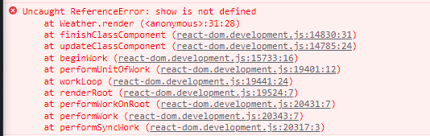
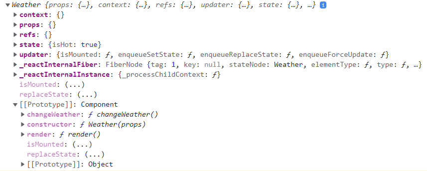
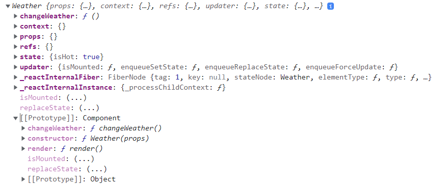
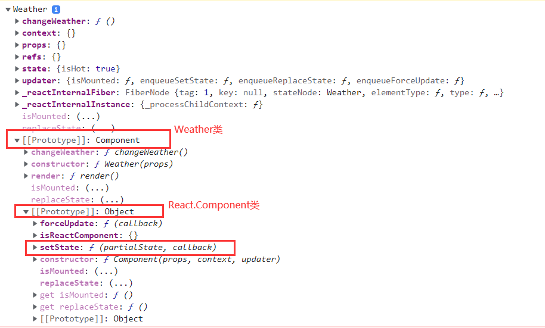

## 初始化 state

组件对象最初的`state`继承于`React.Component`，想要覆盖该空对象需要自己在定义的类组件中定义同名的属性，且初始化 `state` 需要在组件对象创建时完成，因此需要将自己需要的 `state` 写在构造器中：

````jsx
class Weather extends React.Component{
    constructor(props){
        super(props);
        this.state = {isHot: true} // 初始化状态
    }
    render(){
        const {isHot} = this.state
        return <h1>今天天气很{isHot? '炎热' : '凉爽'}</h1>
    }
}
````

## React 中绑定事件

### 原生DOM绑定事件回顾

````html
<body>
    <!--方法一：在标签上定义事件-->
    <button id="btn" onclick="show()">Click here!</button>
</body>
<script type="text/javascript">
    const btn = document.getElememntById('btn')
    // 方法二：添加事件监听器
    btn.addEventListener('click',()=>{
        show()
    })
    // 方法三：定义DOM对象的事件触发回调函数
    btn.onclick = (){
        show()
    }
    function show(){
        alert(1)
    }
</script>
````

关于方法一：事件传入的是方法调用的字符串，当DOM元素触发点击事件时，会触发字符串对应JavaScript代码的执行，所以字符串一定是方法的调用。

### 在虚拟DOM上绑定事件

````jsx
class MyComponent extends React.Component{
    ...
    render(){
        // 将 show 函数对象作为点击事件的回调函数，传入到虚拟DOM中
        return <h1 onClick={show}>今天天气很{isHot? '炎热' : '凉爽'}</h1>
    }
}

function show(){
	alert('1')
}
````

- React 虚拟DOM上绑定事件直接在虚拟DOM上定义事件即可

  - 定义事件的方式同原生 DOM 不同，需要写成驼峰形式，如 `onBlur`,`onClick`。

  - 事件触发函数不是字符串，而是函数本身，所以需要写在 `{}` 中。

  - 由于 `{}` 中写入的必须是一个 JavaScript 表达式，因此需要将函数直接作为对象放入，而不能将函数调用（如 `{show()}`）放入，如果将函数的调用形式放入，`onClick`事件触发回调函数实际上会被赋予函数执行的返回值。

    **下面的代码是怎么执行的？**

    ````jsx
    class MyComponent extends  React.Component{
        ...
        render(){
    		<h1 onClick={show()}>今天天气很{isHot? '炎热' : '凉爽'}</h1>
    	}
    }
    
    function show(){
    	alert('1')
    }
    ````

    1. 执行 `show()`，浏览器弹窗
    2. 由于 `show()` 没有返回值，`onClick` 事件回调函数会接收到一个 `undefined`。
    3. 点击页面上的 `h1` 标签，触发 `onClick` 事件，调用事件回调函数 `undefined`，什么都没有发生。

但是作为一个组件，将事件回调函数定义在组件类之外肯定是不合适的，因此考虑将 `show()` 定义在组件类的内部 。

#### 2.3.2.3. 类中函数作为事件回调函数时，内部this的指向问题

- 首先，类中定义函数不需要声明 `function`，因此将方法定义如下：

  ````tsx
  class Weather extends React.Component {
      constructor(props) {
          super(props);
          this.state = { isHot: true } // 初始化状态
      }
      render() {
          console.log(this);
          const { isHot } = this.state
          return <h1 onClick={show}>今天天气很{isHot ? '炎热' : '凉爽'}</h1>
      }
  
      show() {
          console.log(this)
          this.state.isHot = !this.state.isHot
      }
  }
  ````

  如此定义控制台会报错：

  

  因为 `render()` 在调用的时候，定义了 `onClick` 事件的回调函数，但是将 `show`直接传给 `onClick ` 事件而不指定`show`是属于哪个对象的时候， JS 执行引擎会直接到全局变量中搜寻一个叫 `show` 的对象。很明显，除非在最外层作用域刻意定义一个 `show`对象，JS 执行引擎是一定找不到这个 `show` 对象的，因此会报错： `show is not defined`。

- 为了将类中的方法作为事件的回调，需要在定义回调函数时使用 `this`（此处的 `this` 指向组件对象） 指定传入的 `show`为组件对象中的 `show` 方法（在组件对象的原型对象上） 

  ````jsx
  class Weather extends React.Component {
      constructor(props) {
          super(props);
          this.state = { isHot: true }
      }
      render() {
          console.log(this); // 组件对象
          const { isHot } = this.state
          return <h1 onClick={this.show}>今天天气很{isHot ? '炎热' : '凉爽'}</h1>
      
      show() {
          console.log(this) // undefined
          this.state.isHot = !this.state.isHot //报错 Uncaught TypeError: Cannot read properties of undefined (reading 'state')
      }
  }
  ````

  如此定义，在定义组件的时候不会报错了。但是在点击事件触发后，控制台输出的 `this` 为 `undefined` 并且对 `this` 上得属性调用报错了。为什么？

  因为 `onClick={this.show}` 这段代码将组件对象内的 `show` 函数对象作为点击事件的回调函数传入，当点击事件触发时，直接去调用了 `show`方法即 `show()` ，而不是通过组件对象去调用`show`（`this.show()`），而 `show` 函数又定义在类内部，默认开启了严格模式，因此函数内部的 `this` 会指向 `undefined`，`this` 丢了。

### 解决类中函数作为回调函数时，内部 this 丢失的问题

首先看一下现在 `Weather` 组件实例上有些什么：



`changeWeather()` 方法在组件实例的原型对象上，组件对象本身对象上并没有一个叫 `changeWeather()`。

按照 React 官方的做法，去解决函数内部 `this` 丢失的问题：

````jsx
class Weather extends React.Component {
    constructor(props) {
        super(props);
        this.state = { isHot: true }
        this.changeWeather = this.changeWeather.bind(this)
    }

    render() {
        const { isHot } = this.state
        return <h1 onClick={this.changeWeather}>今天天气很{isHot ? '炎热' : '凉爽'}</h1>
    }

    changeWeather() {
        console.log(this)
    }
}
````

其中 `this.changeWeather = this.changeWeather.bind(this)` 做了以下几件事：

- 表达式的左侧 `this.changeWeather` 中 `this` 为组件实例对象，组件实例对象自身是没有 `changeWeather` 的，因此js会到原型对象上去找同名方法，原型对象上正好有 `Weather` 类定义好的 `changeWeather()`，因此等式右侧读取到的是组件实例对象的原型对象上的 `changeWeather()`（指向定义在 `Weather` 类上的 `changeWeather()`）。
- 等式右侧  `this.changeWeather.bind(this)` 中 `bind()` 中的 `this` 同样指向组件实例对象，该方法会将组件实例对象原型对象上的 `changeWeather` 方法内的 this 指向指向组件实例对象，再返回这个修改过 this 指向的函数。
- 等式的左侧声明了一个组件自身实例对象上的 `changeWeather` 对象。
- 将等式右侧返回的修改完 this 指向的 `changeWeather` 方法，赋予给组件实例对象自身上的 `changeWeather` 对象上。

这样一番操作之后，组件实例对象上挂载的内容如下：



因此，将在组件实例对象中执行 `render()` 方法时将 `this.changeWeather` 方法赋予给事件回调时，实际赋予的是组件实例对象自身上的 `changeWeather` 对象，而不是以往的组件实例对象原型对象上的 `changeWeather`，而组件实例对象上的 `changeWeather()` 中的 `this` 是经过修改指向组件实例对象自身的，因此能避免 `this` 丢失。

## setState()

点击组件，回调函数在方法内直接对 `state` 对象进行修改，并不会响应到组件中。

````jsx
class Weather extends React.Component {
    constructor(props) {
        super(props);
        this.state = { isHot: true } 
        this.changeWeather = this.changeWeather.bind(this)
    }
    
    render() {
        console.log(this);
        const { isHot } = this.state
        return <h1 onClick={this.changeWeather}>今天天气很{isHot ? '炎热' : '凉爽'}</h1>
    }
    
    changeWeather() {
        console.log(this)
        this.state.isHot = false // 直接对 state 进行操作是不能响应到组件的，需要使用 setState() 对 state 内的值进行修改
    }
}
````

直接对 state 进行操作是不能响应到组件的，需要使用 `setState()` 对 state 内的值进行修改。

`setState()` 方法是定义在 `React.Component` 类上的方法：



上例修改 state 中的值需要写成以下形式：

````jsx

class Weather extends React.Component {
    constructor(props) {
        super(props);
        this.state = { isHot: true }
        this.changeWeather = this.changeWeather.bind(this)
    }

    render() {
        const { isHot } = this.state
        return <h1 onClick={this.changeWeather}>今天天气很{isHot ? '炎热' : '凉爽'}</h1>
    }

    changeWeather() {
    	const isHot = this.state.isHot
    	this.setState({
        	isHot: !isHot // 取反赋值
    	})
	}
}
````

## state的简写方式

### 类中 state 定义的缩写

类中可以写以下三种代码：

- 构造器函数：

  ````javascript
  constructor(props){
      supers(props)
  }
  ````

  `new` 指令执行时，会调用构造函数

- 普通函数定义：

  ````javascript
  funcName(){}
  ````

  类中定义函数不需要声明 `function` 关键字，定义的函数会挂载在类实例对象的 `ProtoType`对象上

- ***赋值语句***：

  ````javascript
  name = value
  ````

  类中普通的赋值语句会在类的每个实例对象上创建与被赋值对象同名的属性（`name`），属性值为赋值语句赋予的值（`value`）。

根据类中可以**直接**写***赋值语句***，该赋值的属性及值就会出现在每个实例对象上这个特性，可以将 state 的定义抽离出构造函数：

````javascript
class ClassName extends React.Component {
    state = {
        attr: val
    }
    render() {
        const { attr } = this.state
        return <h1>{attr}</h1>
    }
    
}
````

### 类中事件回调函数的缩写

类中的函数可以定义成两种方式：

- 普通函数定义：

  ````javascript
  funcName(){
      console.log(this)
  }
  ````

  - 函数定义在实例对象的  `ProtoType `对象（类对象）上。
  - 函数内的 `this` 指向：
    - 当函数通过**实例对象调用**时，`this` 指向该**实例对象**
    - 当函数**直接调用**时，`this` 指向 **`undefined`**，因为函数定义在了类中，类中方法默认开启了严格模式，会拒绝 `this` 指向全局对象。

  如果用普通函数定义方式定义事件回调函数，在不对函数进行 `this` 指定的情况下，`this` 会丢失。

- 箭头函数定义：

  ````javascript
  funcName = () => {
      console.log(this)
  }
  ````

  - 本质上是赋值语句
  - 函数定义在实例对象本身上
  - 箭头函数内的 `this` 指向如不指定，指向函数定义的外部的 `this`，函数定义在组件实例对象上，因此 `this` 指向实例对象本身。

  根据在类中使用箭头函数定义函数，函数内部 `this` 指向实例对象的特性，组件内的***事件回调函数***一定要***定义成箭头函数***的形式。

因此，类中的事件回调函数可以缩写成**箭头函数**，以避免 `this` 丢失：

````javascript
class Weather extends React.Component {
    state = {
        isHot: true
    }
    render() {
        const { isHot } = this.state
        return <h1 onClick={this.changeWeather}>今天天气很{isHot ? '炎热' : '凉爽'}</h1>
    }
	// 事件回调函数定义为箭头函数
    changeWeather = () => {
        const isHot = this.state.isHot
        this.setState({
            isHot: !isHot
        })
    }
}
````