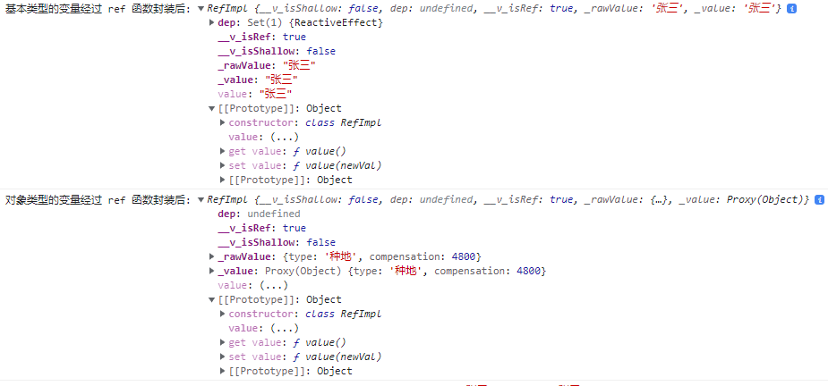

## setup

1. 理解：Vue3 中一个新的配置项，值为一个函数。
2. setup 是所有 Composition API（组合API）“表演的舞台”。
3. 组建中所用到的：数据、方法等等，均瑶配置在 setup 中。
4. setup 函数的两种返回值：
   1. 若返回一个对象，则对象中的属性、方法，在模板中可以直接使用。（重点关注）
   2. 若返回一个渲染函数，则可以自定义渲染内容。
5. 注意点：
   1. 尽量不要与 Vue2.x 配置混用
      - Vue2.x 配置（data、methods、computed...）中可以访问到 setup 中的属性、方法
      - 但在 setup 中不能访问到 Vue2.x 配置（data、methods、computed...）
      - 如果有重名，setup优先
   2. setup 不能是一个 async 函数，因为返回值不再是 return 的对象，而是 promise，模板看不到 return 对象中的属性。（有一种情况可以返回一个 Promise 实例，但是需要 Suspense 和异步组件的配合）

````vue
<template>
  <h2>--- Vue3 setup 定义的功能 ---</h2>
  <h4>你好，我的名字：{{ nameDefinedInSetup }}</h4>
  <h4>这里是在测试 Vue3 语法定义的 setup 能否拿到 data() 中定义的属性：{{ nameFromData }}</h4>
  <button @click="alertInSetup">按一下试试</button>
  <button @click="checkIfGotDataOrMethodsFromVue2Configuration">按一按，按F12看看能不能拿到 vue2 配置中定义的数据与方法</button>

  <br />
  <h2>--- Vue2 data 和 methods 定义的功能 ---</h2>
  <h4>你好，我的名字：{{ nameInData }}</h4>
  <h4>这里是在测试 Vue2 语法定义的data 能否拿到 setup 中定义的属性：{{ namefromSetup }}</h4>
  <button @click="alertInMethods">你再按一下试试</button>
  <button @click="checkIfGotDataOrMethodsFromVue3Configuration">按一按，按F12看看能不能拿到 vue3 配置中定义的数据与方法</button>
</template>

<script>
//import { h } from 'vue'

export default {
  name: 'App',

  // Vue3 中依旧可以通过 data() 创建数据
  data() {
    return {
      nameInData: 'name from data',
      namefromSetup: this.nameDefinedInSetup
    }
  },

  // Vue3 中依旧可以通过 methods 创建函数
  methods: {
    alertInMethods() {
      alert(`这是一个从 methods 中定义的函数弹出的警示`)
    },
    // Vue2 定义的 data 与 method 内，可以拿到 Vue3 setup 中定义的数据和方法
    checkIfGotDataOrMethodsFromVue3Configuration() {
      console.log('拿到的从Vue3 语法中定义的 data 为：', this.nameDefinedInSetup); //name from setup
      console.log('拿到的从Vue3 语法中定义的 methods 为：', this.alertInSetup); // alertInSetup() {alert('这是一个从 setup 中弹出的警示！');}
    }
  },
  // Vue3 中可以将组件中所用到的：数据（data）、方法（method）等等，均要配置在 setup 中
  setup() {
    const nameDefinedInSetup = 'name from setup'

    function alertInSetup() {
      alert('这是一个从 setup 中弹出的警示！')
    }

    // Vue3 定义的方法中，无法拿到 Vue2 语法定义的 data 和 methods
    function checkIfGotDataOrMethodsFromVue2Configuration() {
      console.log('拿到的从Vue2 语法中定义的 data 为：', this.nameInData); // undefined
      console.log('拿到的从Vue2 语法中定义的 methods 为：', this.alertInMethods);// undefined
    }

    //setup 函数的返回值可以是一个对象，对象中的属性、方法，在模板中均可以直接使用
    return {
      nameDefinedInSetup,
      alertInSetup,
      checkIfGotDataOrMethodsFromVue2Configuration
    }

    // setup 函数的返回值可以是一个函数，函数的返回值是自定义渲染内容（会覆盖 template 中定义的所有内容）
    // return function () {
    //   return h('h1', "这里是 setup 返回的函数渲染的内容")
    // }
  }
}
</script>

<style></style>
````

## ref 函数

- 作用定义一个响应式数据
- 语法：`const xxx = ref(initValue)`
  - 创建一个包含响应式数据的引用对象（reference对象）
  - JS 中操作数据 `xxx.value`
  - 模板中读取数据：不需要 `.value`，直接使用：`<div>{{xxx}}</div>`
- 备注：
  - 接收数据可以是：基本类型、对象类型
  - 对于基本类型的数据：响应式依靠的是 `getter` 和 `setter`
  - 对象类型的数据：内部使用了 Vue3.0 中的一个新的函数 --- `reactive` 函数



````vue
<template>
  <h4>unsername: {{ username }}</h4>
  <h4>age: {{ age }}</h4>
  <h4>job: {{ job.type }}</h4>
  <h4>compensation: {{ job.compensation }}</h4>
  <button @click="onBtnClick">Press to change</button>
</template>

<script>
import { ref } from "vue";

export default {
  name: "App",

  setup() {
    // 数据需要 ref() 对数据进行封装，封装成引用实例 refImpl 对象，其值在 _value 属性上，并设置好了 setter 和 getter 劫持改数据的读写操作（getter 和 setter 挂载在了 prototype 上）
    const username = ref("张三");
    const age = ref(19)

    console.log('基本类型的变量经过 ref 函数封装后:', username)

    const job = ref({
      type: '种地',
      compensation: 4800
    })

    console.log('对象类型的变量经过 ref 函数封装后:', job)

    function onBtnClick() {
      // 对引用实例中 value 的修改，才能响应式反应到页面上
      username.value = "李四"
      age.value = 48
      job.value = {
        type: '卖菜',
        compensation: '6140'
      }
    }

    return {
      username,
      age,
      job,
      onBtnClick
    };
  },
};
</script>

<style></style>
````

## reactive 函数

- 作用：定义一个**对象类型**的响应式数据（基本类型不可以使用，要用 `ref` 函数）
- 语法：`const proxyObj = reactive(obj)` 接收一个对象（或数组），返回一个**代理对象**（Proxy 的实例对象）
- reactive 定义的响应式数据是支持“深层次”响应的。
- 内部给予 ES6 的 Proxy 实现，通过代理对象操作源对象内部数据。

````vue
<template>
  <h4>unsername: {{ username }}</h4>
  <h4>age: {{ age }}</h4>
  <h4>job: {{ job.type }}</h4>
  <h4>compensation: {{ job.compensation }}</h4>
  <h4>hobby: {{hobby}}</h4>
  <button @click="onBtnClick">Press to change</button>
</template>

<script>
import { ref, reactive } from "vue";

export default {
  name: "App",

  setup() {
    const username = ref("张三");
    const age = ref(22)
    // reactive() 无法处理基本数据类型
    // const age = reactive(19)

    // 使用 reactive() 处理对象，可以得到一个被处理对象的代理对象（Proxy）
    let job = reactive({
      type: '种地',
      compensation: 4800
    })

    // reactive() 可以处理数组
    let hobby = reactive(['抽烟', '喝酒', '烫头'])

    function onBtnClick() {
      username.value = "李四"
      age.value = 48
      // 该 Proxy 对象支持响应式，直接修改该对象就可以驱动数据修改和页面更新
      job = {
        type: '卖菜',
        compensation: '6140'
      }

      // 直接对数组元素进行操作也是支持响应式的
      hobby[2] = '吹水'
    }

    return {
      username,
      age,
      job,
      hobby,
      onBtnClick
    };
  },
};
</script>

<style></style>
````

## shallowReactive 与 shallowRef

- shallowReactive：只处理对象最外层属性的响应式（浅响应式）。
- shallowRef：只处理基本数据类型的响应式，不进行对象的响应式处理。
- 什么时候使用？
  - 如果有一个对象数据，结构比较深，但只监视其外层属性变化可以使用 shallowReactive。
  - 如果有一个对象数据，后续功能不会修改该对象的属性，而是生成新的对象来替换，使用 shallowRef。

````vue
<template>
    <div>{{ person.name }} - {{ person.age }} - {{ person.work.score }} <button @click="person.age += 1">点我 +1</button><button
            @click="person.work.score += 1">点我 +1</button></div>
</template>

<script>
import { shallowReactive, reactive, shallowRef } from 'vue';

export default {
    name: "Demo",
    setup() {
        // shallowReactive 只处理对象最外层属性的响应式
        // const person = shallowReactive({
        //     name: '张三',
        //     age: 18,
        //     work: {
        //         score: 20
        //     }
        // })

        // shallowReactive 只将对象包装成 refImpl，并不将引用类型数据转换成 proxy 对象进行响应式处理
        const person = shallowRef({
            name: '张三',
            age: 18,
            work: {
                score: 20
            }
        })

        console.log(person)

        return {
            person
        }
    },
};
</script>

<style></style>
````

## readonly 与 shallowReadonly

- readonly：让一个响应式数据变为只读的（深只读）
- shallowReadonly：让一个响应式数据变为制度的（浅只读）
- 应用场景：不希望数据被修改时

````vue
<template>
    <div>{{ person.name }} - {{ person.age }} - {{ person.work.score }} <button @click="person.age += 1">点我
            +1</button><button @click="person.work.score += 1">点我 +1</button></div>
</template>

<script>
import { reactive, readonly, shallowReadonly } from 'vue';

export default {
    name: "Demo",
    setup() {

        let person = reactive({
            name: '张三',
            age: 18,
            work: {
                score: 20
            }
        })

        // readonly 可以将响应式的数据变为只读数据，不能修改
        //person = readonly(person)

        // shallowReaddonly 将响应式数据的最外层属性变成只读属性，不可修改
        person = shallowReadonly(person)

        return {
            person
        }
    },
};
</script>

<style></style>
````

## toRaw 与 markRaw

- toRaw:
  - 作用：将一个由 `reactive` 生成的响应式对象转为普通对象。
  - 使用场景：用于读取响应式对象对应的普通对象，对这个普通对象的所有操作，不回引起页面更新。
- markRaw：
  - 作用：标记一个对象，使其永远不会再成为响应式对象。
  - 应用场景：
    - 有些值不应被设置为响应式的，例如复杂的第三方类库等。
    - 当渲染具有不可变数据的大列表，跳过响应式转换可以提高性能。

````vue
<template>
    <div>{{ person.name }} - {{ person.age }} <button @click="person.age += 1">年龄 +1</button><button
            @click="toRowFunc">person to raw</button>
    </div>
    <div>
        <div v-show="person.car">车辆信息： {{ person.car }}</div>
        <button @click="addPrice">涨价</button>
        <button @click="addCar">添加车辆</button>
    </div>
</template>

<script>
import { markRaw, reactive, toRaw } from 'vue';

export default {
    name: "Demo",
    setup() {
        let person = reactive({
            name: '张三',
            age: 18
        })

        const toRowFunc = () => {
            // toRaw 将对象转换为原始无响应式的对象
            const p = toRaw(person)
            console.log('p:', p)
        }

        const addCar = () => {
            // markRaw 将响应式数据中的指定属性标记成非响应式的原始对象
            person.car = markRaw({
                carname: 'benz',
                price: '30'
            })
        }

        const addPrice = () => {
            person.car.price += 1
            console.log(person.car)
        }

        return {
            person,
            toRowFunc,
            addCar,
            addPrice
        }
    },
};
</script>
````

## customRef

- 作用：创建一个自定义的 ref，并对其依赖项进行跟踪和更新触发进行显示控制。

- 实现防抖效果：

  ````vue
  <template>
      <input type="text" v-model="text">
      <h4>{{ text }}</h4>
  </template>
  
  <script>
  import { customRef } from 'vue';
  
  export default {
      name: "Demo",
      setup() {
          // 自定义一个 ref
          function customedRef(value) {
              let timer = null
              return customRef((track, trigger) => ({
                  get() { // 客制化 ref 数据被读取时，调用该 get 方法
                      console.log(`customedRef 数据被读取了，我把${value}给他了`)
                      track() // 通知 Vue 追踪数据的变化
                      return value
                  },
                  set(newValue) { // 客制化ref数据被修改时，调用该 set 方法
                      console.log(`customedRef 数据被修改了，新值为：${newValue}`)
                      clearTimeout(timer)
                      timer = setTimeout(() => {
                          value = newValue
                          trigger() // 通知 Vue 去重新解析模板
                      }, 500)
                  }
              }))
          }
  
          const text = customedRef('test data')
  
          return {
              text
          }
      },
  };
  </script>
  ````

  

## provide 与 inject

通常情况下，当我们需要从父组件向子组件传递数据时，会使用 [props](https://cn.vuejs.org/guide/components/props.html)。想象一下这样的结构：有一些多层级嵌套的组件，形成了一颗巨大的组件树，而某个深层的子组件需要一个较远的祖先组件中的部分数据。在这种情况下，如果仅使用 props 则必须将其沿着组件链逐级传递下去，这会非常麻烦：


注意，虽然这里的 `<Footer>` 组件可能根本不关心这些 props，但为了使 `<DeepChild>` 能访问到它们，仍然需要定义并向下传递。如果组件链路非常长，可能会影响到更多这条路上的组件。这一问题被称为“prop 逐级透传”，显然是我们希望尽量避免的情况。

`provide` 和 `inject` 可以帮助我们解决这一问题。 [[1\]](https://cn.vuejs.org/guide/components/provide-inject.html#footnote-1) 一个父组件相对于其所有的后代组件，会作为**依赖提供者**。任何后代的组件树，无论层级有多深，都可以**注入**由父组件提供给整条链路的依赖。


用法：

- 祖组件中：

  ````vue
  setup() {
      const car = reactive({
        name: 'Benz',
        price: 3000
      })
  
      provide('car', car)
  
      ...
    }
  ````

- 孙组件中：

  ````vue
  setup() {
      const car = inject('car')
      ...
  }
  ````

## 响应式数据的判断

- isRef: 检查一个值是否为一个 ref 对象
- isReactive: 检查一个对象是否有是由 `reactive` 创建的响应式代理
- isReaconly: 检查一个对象是否是由 `reaconly` 创建的只读代理
- isProxy: 检查一个对象是否是由 `reactive` 或者 `readonly` 方法创建的代理
