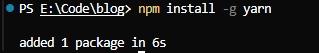

NPM（**N**ode **P**ackage **M**anager）是 Node.js 的包管理工具，用于管理 Node.js 项目中的依赖包。它会随着 Node.js 的安装一同被安装。

## 包的安装

### 本地安装

使用命令 `npm install <package-name>` 或 `npm i <package-name>` 即可完成本地安装。

NPM 可以同时安装多个包，如 `npm i <package-name-1> <package-name-2> <package-name-3>`。

本地安装的包会出现在当前目录下的 `node_modules` 目录中。

-   随着开发的进展，`node_modules` 目录会变得异常庞大，目录下的内容不适合直接传输到生产环境，因此通常使用 `.gitignore` 文件忽略该目录中的内容。
-   本地安装适用于绝大部分的包，它会在当前目录及其子目录中发挥作用。
-   通常在项目的根目录中使用本地安装。
-   安装一个包的时候，NPM 会自动管理依赖，它会下载该包的依赖包到 `node_modules` 目录中。
-   如果本地安装的包带有命令行工具（CLI），NPM 会将它的 CLI 脚本文件放置到 `node_modules/.bin` 下，使用命令 `npx <command-name>` 即可调用。

    

    例如 `npx acorn` 就会执行 `node_modules/.bin/acorn` 或者 `node_modules/acorn/bin/acorn.cmd`。

    > 具体执行的文件取决于操作系统，Linux 下是 `node_modules/.bin/acorn`，Windows 下是 `node_modules/acorn/bin/acorn.cmd`。

### 全局安装

全局安装的包放置在一个特殊的全局目录，该目录可以通过命令 `npm config get prefix` 查看。

使用命令 `npm install --global <package-name>` 或 `npm i -g <package-name>` 全局安装包。


重要：**全局安装的包并非在所有工程中都可用，它主要用于提供全局的命令行工具（CLI）。**

大部分情况下不需要全局安装包，除非满足以下条件：

-   包的版本非常稳定，很少有大的更新。
-   提供的 CLI 工具在各个工程中使用的非常频繁。
-   CLI 工具仅为开发环境提供支持，而非部署环境。

全局安装的的包会将其可执行文件放在 `npm config get prefix` 的目录下。




并且 `npm config get prefix` 对应路径已经添加到了系统的 `PATH` 环境变量中，因此可以直接在全局任意位置的命令行中执行对应命令。


### 精确安装

1.  **精确安装最新版本**

    一般直接安装依赖，默认的版本是一个向上兼容的版本，如:

    ```json
    {
        "devDependencies": {
            "vue": "^3.5.13"
        }
    }
    ```

    如果希望安装最新的精确版本可以使用以下指令：

    ```shell
    npm install --save-exact <package-name>
    npm install -E <package-name>
    ```

    安装的精确版本如：

    ```json
    {
        "devDependencies": {
            "vue": "3.5.13"
        }
    }
    ```

2.  **安装指定版本**

    ```shell
    npm install <package-name>@<version>
    ```

## 包的操作

### 查询

1.  **查询包安装路径**

    ```shell
    npm root [-g]
    ```

2.  **查看包信息**

    ```shell
    npm view <package-name> [sub-info]
    # view 的别名有：v、info、show
    ```

3.  **查询安装包**

    ```shell
    npm list [-g] [--depth=<depth>]
    # list 的别名有: ls、la、ll
    ```

### 更新

1.  **检查有哪些包需要更新**

    ```shell
    npm outdated
    ```

2.  **更新包**

    ```shell
    npm update [-g] [<package-name>]
    # update 的别名有：up、upgrade
    ```

### 卸载包

```shell
npm uninstall [-g] <package-name>
# uninstall 的别名有: remove、rm、r、un、unlink
```

### NPM 配置项

安装好 NPM 之后，最终会产生两个配置文件，一个是用户配置，一个是系统配置，当两个文件的配置项有冲突的时候，用户配置会覆盖系统配置。

通常，我们更关心最终生效的配置，而不是具体的配置文件。

通过下面的命令可以查询目前生效的各种配置：

```shell
npm config ls [-l] [--json]
```

另外，可以通过下面的命令操作配置：

1.  **获取某个配置项**

    ```shell
    npm config get <key>
    ```

2.  **设置某个配置项**

    ```shell
    npm config set <key>=<value>
    ```

3.  **移除某个配置项**

    ```shell
    npm config delete <key>
    ```

### NPM 包的缓存

npm 缓存目录默认是 C 盘用户目录下的 `\AppData\Local\npm-cache` 文件夹

1. 缓存目录查询

    ```bash
    npm config get cache
    ```
2. 缓存目录设置
    ```bash
    npm config set cache <path>
    ```
3. 清理缓存
    ```bash
    npm cache clean [--force]
    ```

## 包的配置文件

NPM 将每个使用 NPM 的工程本身都看作是一个包，包的信息需要通过一个名称固定的配置文件来描述，这个配置文件就是 **`package.json`**。

### `package.json` 的创建

`package.json` 配置文件可以手动创建，也可以通过命令 `npm init` 创建。

配置文件包含以下内容：

-   `name`：包的名称，该名称必须是英文单词字符，支持连接符。
-   `version`：版本，版本规范：`主版本号.次版本号.补丁版本号`。
    -   `主版本号`：仅当程序发生了重大变化时才会增长，如新增了重要功能、新增了大量的 API、技术架构发生了重大变化。
    -   `次版本号`：仅当程序发生了一些小变化时才会增长，如新增了一些小功能、新增了一些辅助型的 API。
    -   `补丁版本号`：仅当解决了一些 bug 或进行了一些局部优化时更新，如修复了某个函数的 bug、提升了某个函数的运行效率。
-   `description`：包的描述。
-   `homepage`：官网地址。
-   `author`：包的作者，必须是有效的 NPM 账户名，书写规范是 `account <mail>`，例如：`zhangsan <zhangsan@gmail.com>`，不正确的账号和邮箱可能导致发布包时失败。
-   `repository`：包的仓储地址，通常指 Git 或 SVN 的地址，它是一个对象。
-   `type`：仓储类型，`git` 或 `svn`。
-   `url`：地址。
-   `main`：包的入口文件，使用包的人默认从该入口文件导入包的内容。
-   `keywords`: 搜索关键字，发布包后，可以通过该数组中的关键字搜索到包。

使用 `npm init --yes` 或 `npm init -y` 可以在生成配置文件时自动填充默认配置。

> `package.json` 中可以自定义属性，并在 Node.js 中读取使用。
> 在 Node.js 环境中，直接导入 JSON 格式的文件会自动将其转换为 JavaScript 对象。
>
> ```js
> // 会获取到 package.json 对象
> const config = require('./package.json')
> ```

### 包的依赖配置

`package.json` 文件最重要的作用，是记录当前工程的依赖。

-   `dependencies`：生产环境的依赖包。
-   `devDependencies`：仅开发环境的依赖包。

配置好依赖后，使用下面的命令安装依赖：

```bash
# 本地安装所有依赖 dependencies + devDependencies
npm install
npm i

# 仅安装生产环境的依赖 dependencies
npm install --production
```

为了更加方便地添加依赖，NPM 支持在使用 `install` 命令时，加入一些额外的参数，用于将安装的依赖包保存到 `package.json` 文件中。

涉及的命令如下：

```bash
# 安装依赖到生产环境
npm i <package-name>
# 安装依赖，并将安装的依赖保存到 dependencies 中
npm i --save <package-name>
npm i -S <package-name>

# 安装依赖到开发环境
npm i --save-dev <package-name>
npm i -D <package-name>
```

### 包的语义化版本

在某些场景下，可能希望在安装依赖包时，次版本号和补丁版本号可以提升，但是主版本号不能变化。

有时又希望只有补丁版本号可以提升，其他都不能提升。

甚至希望依赖包保持固定的版本。

这样一来，就需要在配置文件中描述清楚具体的依赖规则，而不是直接写上版本号那么简单。

这种规则的描述，即**语义版本（Semantic Versioning）**。

语义版本的书写规则非常丰富，下面列出了一些常见的书写方式：

| 符号 |         描述         |      示例       |                              示例描述                              |
| :--: | :------------------: | :-------------: | :----------------------------------------------------------------: |
| `>`  |     大于某个版本     |    `>1.2.1`     |                          大于 1.2.1 版本                           |
| `>=` |   大于等于某个版本   |    `>=1.2.1`    |                        大于等于 1.2.1 版本                         |
| `<`  |     小于某个版本     |    `<1.2.1`     |                          小于 1.2.1 版本                           |
| `<=` |   小于等于某个版本   |    `<=1.2.1`    |                        小于等于 1.2.1 版本                         |
| `-`  |   介于两个版本之间   | `1.2.1 - 1.4.5` |                      介于 1.2.1 和 1.4.5 之间                      |
| `x`  |    不固定的版本号    |     `1.3.x`     |              只要保证主版本号是 1，次版本号是 3 即可               |
| `~`  |    补丁版本号可增    |    `~1.3.4`     |        保证主版本号是 1，次版本号是 3，补丁版本号大于等于 4        |
| `^`  | 此版本和补丁版本可增 |    `^1.3.4`     | 保证主版本号是 1，次版本号可以大于等于 3，补丁版本号可以大于等于 4 |
| `*`  |       最新版本       |       `*`       |                          始终安装最新版本                          |

### 脚本配置

在开发过程中，可能会反复使用许多 CLI 命令，例如：

-   启动工程命令（`node` 或一些第三方包提供的 CLI 命令）
-   部署工程命令（一些第三方包提供的 CLI 命令）
-   测试工程命令（一些第三方包提供的 CLI 命令）

NPM 支持定义脚本，只需要在 `package.json` 中配置 `scripts` 字段，即可配置各种脚本名称。

运行方式： `npm run <script-name>`

脚本中可以省略 `npx`，因为 `npm run` 的时候会临时将 `node_modules/.bin` 目录加入环境变量，脚本结束之后再恢复原环境变量。

NPM 还对一些常用的脚本名称进行了简化，以下三个脚本名称可以省略 `run`：

-   `start`
    -   `start` 脚本有默认值：`node server.js`
-   `stop`
-   `test`

### `package-lock.json`

版本依赖控制是一个权衡的过程。

如果允许版本更新，可以修复依赖包的 bug（补丁版本号），或引入新功能（次版本号），但同样可能带来不确定的风险（新的 bug）。

如果不允许版本更新，可以获得最好的稳定性，但失去了依赖包自我优化的能力。

有时情况更加复杂，如果依赖包升级后，其依赖也发生了变化，会有更多不确定的情况出现。

基于此，NPM 在安装包的时候，会自动生成一个 `package-lock.json` 文件，该文件记录了安装包时的确切依赖关系。

当移植工程时，如果移植了 `package-lock.json` 文件，恢复安装时，会按照 `package-lock.json` 文件中的确切依赖进行安装，最大限度地避免了差异。

## NPM 对差异版本处理

NPM 会将不同层级的依赖打平放到 `node_modules` 目录下，但是如果两个包依赖同一个包的不同版本，如下图：


`node_modules` 目录中就不会使用扁平的目录结构，而会形成嵌套的目录，如下图：

```
├── node_modules
│   ├── a
│   │   ├── node_modules
│   │   │   ├── c
│   │   │   |   |—— c 包的文件
│   │   │── a 包的文件
│   ├── b
│   │   ├── node_modules
│   │   │   ├── c
│   │   │   |   |—— c 包的文件
│   │   │── b 包的文件
```

## 包的导入索引逻辑

当使用 Node.js 导入模块时，如果模块路径不是以 `./` 或 `../` 开头，Node.js 会在核心模块（如 `fs`）中寻找对应模块，即使当前目录存在同名文件（如 `fs.js`），也会优先加载核心模块。

如果核心模块没有对应模块，则 Node.js 会在 `node_modules` 目录下寻找对应模块，例如：

```js
var _ = require('lodash')
```

它首先会从当前目录的以下位置寻找文件：

```shell
node_modules/lodash.js
node_modules/lodash/<entry-file>
```

若当前目录没有这样的文件，则会回溯到上级目录按照同样的方式查找。

如果到顶级目录都无法找到文件，则抛出错误。

上面提到的入口文件按照以下规则确定：

1.  查看导入包的 `package.json` 文件，读取 `main` 字段作为入口文件。
2.  若不包含 `main` 字段，则使用 `index.js` 作为入口文件。

> 入口文件的规则同样适用于工程自身的模块。
> 在 Node.js 中，还可以手动指定路径来导入相应的文件，
> 例如：
>
> ```js
> const get = require('lodash/get')
> ```
>
> 此时，Node.js 会先去找 `node_modules/lodash/get.js`。
> 如果没有，则将 `get` 作为一个包，去找包层级下 `package.json` 文件中 `main` 字段指定的文件。
> 如果没有找到 `package.json` 的对应 `main` 字段，或者 `main` 字段指向的文件不存在，则将 `get` 作为一个包，去找包层级下 `index.js` 文件。
> 如果上述都失败了，就往父级目录按照同样的逻辑找，直到根目录。

## 配置运行环境

项目运行时通常需要区分当前的运行环境，一般常用环境分为：

-   开发环境 (`development`)
-   生产环境 (`production`)
-   测试环境 (`test`)

因此，需要通过配置来告知运行时代码其所处的环境。

Node.js 中有一个全局环境变量 `global`，该变量类似于浏览器环境中的 `window`，其属性在 Node.js 环境中可以直接使用。

`global` 里有一个属性 `process`，该属性是一个包含当前 Node.js 程序运行计算机的信息，其中就包含 `env`，就是系统中的所有环境变量。


通常项目中会使用系统环境变量 `NODE_ENV` 的值，来判断 Node.js 程序正运行的环境。

设置环境变量有两种方式：

-   **永久设置**
    直接在系统环境变量中添加新变量 `NODE_ENV`：
    
    
    
    
-   **临时设置**
    使用指令临时设置环境变量 `NODE_ENV`：
    ```shell
        set NODE_ENV=development
    ```
    可以将指令放到 `package.json` 里的 `scripts` 中，并紧接着运行后续指令，后续指令在运行完之前，指定环境变量都是指定值，运行完之后指定环境变量会被销毁。
    ```json
    {
        ...,
        "scripts": {
            "start": "set NODE_ENV=development&&node index.js",
            "build": "set NODE_ENV=production&&node index.js",
            "test": "set NODE_ENV=test&&node index.js"
        },
        ...
    }
    ```
    不同的操作系统设置环境变量的指令不同，Windows 操作系统中使用指令 `set`，Linux/macOS 操作系统中使用指令 `export`。
    在项目中指定指令时可以使用第三方包 `cross-env`，它会根据指令运行环境设置环境变量：
    ```shell
        npm i -D cross-env
    ```
    ```json
    {
        ...,
        "scripts": {
            "start": "cross-env NODE_ENV=development node index.js",
            "build": "cross-env NODE_ENV=production node index.js",
            "test": "cross-env NODE_ENV=test node index.js"
        },
        ...
    }
    ```

## 发布包

### 准备工作

1. 移除所有镜像源
2. 注册一个 NPM 账号，并完成邮箱认证
3. 本地使用 npm cli 进行登录
    1. 使用命令 `npm login` 登录
    2. 使用命令 `npm whoami` 可以查看当前登录的账号
    3. 使用命令 `npm logout` 可以注销当前登录
4. 创建工程根目录
5. 使用 npm init 初始化项目

### 发布

1. 确定包版本
2. 使用命令 `npm publish` 完成发布
