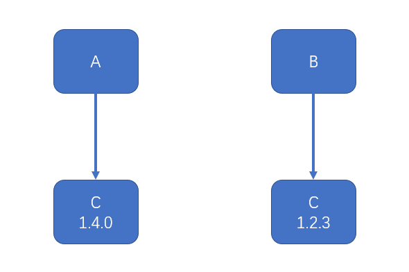

NPM（**N**ode **P**ackage **M**anager） 是 Node.js 的包管理工具，用于管理 Node.js 项目中的依赖包。 其会随着 node 的安装一起安装。

## 包的安装

### 本地安装

使用命令 `npm install 包名` 或 `npm i 包名` 即可完成本地安装。

NPM 可以同时安装多个包，如 `npm i 包名1 包名2 包名3`。

本地安装的包出现在当前目录下的 `node_modules` 目录中

-   随着开发的进展，`node_modules`目录会变得异常庞大，目录下的内容不适合直接传输到生产环境，因此通常使用`.gitignore`文件忽略该目录中的内容
-   本地安装适用于绝大部分的包，它会在当前目录及其子目录中发挥作用
-   通常在项目的根目录中使用本地安装。
-   安装一个包的时候，npm 会自动管理依赖，它会下载该包的依赖包到`node_modules`目录中。
-   如果本地安装的包带有 CLI，npm 会将它的 CLI 脚本文件放置到`node_modules/.bin`下，使用命令`npx 命令名`即可调用。

    

    如 `npx acorn` 就会执行`node_modules/.bin/acorn`或者 `node_modules/acorn/bin/acorn.cmd`

    > 具体执行的文件取决于你的操作系统，linux 下是`node_modules/.bin/acorn`，windows 下是`node_modules/acorn/bin/acorn.cmd`

### 全局安装

全局安装的包放置在一个特殊的全局目录，该目录可以通过命令 `npm config get prefix` 查看

使用命令`npm install --global 包名` 或 `npm i -g 包名` 全局安装包


重要：**全局安装的包并非所有工程可用，它仅提供全局的 CLI 工具**

大部分情况下，都不需要全局安装包，除非：

-   包的版本非常稳定，很少有大的更新
-   提供的 CLI 工具在各个工程中使用的非常频繁
-   CLI 工具仅为开发环境提供支持，而非部署环境

全局安装的的包会将其可执行文件放在 `npm config get prefix` 的目录下


并且 `npm config get prefix` 对应路径已经添加到了环境变量的 `PATH` 中，因此可以直接在全局任意位置命令行中执行对应命令。


## package.json

npm 将每个使用 npm 的工程本身都看作是一个包，包的信息需要通过一个名称固定的配置文件来描述，配置文件为 **package.json**

### package.json 的创建

package.json 配置文件可以手动创建，也可以通过命令 `npm init` 创建

配置文件包含以下内容：

-   `name`：包的名称，该名称必须是英文单词字符，支持连接符
-   `version`：版本，版本规范：`主版本号.次版本号.补丁版本号`
    -   `主版本号`：仅当程序发生了重大变化时才会增长，如新增了重要功能、新增了大量的 API、技术架构发生了重大变化
    -   `次版本号`：仅当程序发生了一些小变化时才会增长，如新增了一些小功能、新增了一些辅助型的 API
    -   `补丁版本号`：仅当解决了一些 bug 或 进行了一些局部优化时更新，如修复了某个函数的 bug、提升了某个函数的运行效率
-   `description`：包的描述
-   `homepage`：官网地址
-   `author`：包的作者，必须是有效的 npm 账户名，书写规范是 `account <mail>`，例如：`zhangsan <zhangsan@gmail.com>`，不正确的账号和邮箱可能导致发布包时失败
-   `repository`：包的仓储地址，通常指 git 或 svn 的地址，它是一个对象
-   `type`：仓储类型，git 或 svn
-   `url`：地址
-   `main`：包的入口文件，使用包的人默认从该入口文件导入包的内容
-   `keywords`: 搜索关键字，发布包后，可以通过该数组中的关键字搜索到包

使用 `npm init --yes` 或 `npm init -y` 可以在生成配置文件时自动填充默认配置

### package.json 保存的依赖关系

package.json 文件最重要的作用，是记录当前工程的依赖

-   `dependencies`：生产环境的依赖包
-   `devDependencies`：仅开发环境的依赖包

配置好依赖后，使用下面的命令安装依赖：

```bash
## 本地安装所有依赖 dependencies + devDependencies
npm install
npm i

## 仅安装生产环境的依赖 dependencies
npm install --production
```

为了更加方便的添加依赖，npm 支持在使用 `install` 命令时，加入一些额外的参数，用于将安装的依赖包保存到 package.json 文件中

涉及的命令如下

```bash
## 安装依赖到生产环境
npm i 包名
### 安装依赖，并将安装的依赖保存到 dependencies 中
npm i --save 包名
npm i -S 包名

## 安装依赖到开发环境
npm i --save-dev 包名
npm i -D 包名
```

### 依赖的语义化版本

有的时候，我们希望：安装我的依赖包的时候，次版本号和补丁版本号是可以有提升的，但是主版本号不能变化

有的时候，我们又希望：安装我的依赖包的时候，只有补丁版本号可以提升，其他都不能提升

甚至我们希望依赖包保持固定的版

这样一来，就需要在配置文件中描述清楚具体的依赖规则，而不是直接写上版本号那么简单。

这种规则的描述，即**语义版本**

语义版本的书写规则非常丰富，下面列出了一些常见的书写方式

| 符号 |         描述         |     示例      |                              示例描述                              |
| :--: | :------------------: | :-----------: | :----------------------------------------------------------------: |
|  >   |     大于某个版本     |    >1.2.1     |                          大于 1.2.1 版本                           |
|  >=  |   大于等于某个版本   |    >=1.2.1    |                        大于等于 1.2.1 版本                         |
|  <   |     小于某个版本     |    <1.2.1     |                          小于 1.2.1 版本                           |
|  <=  |   小于等于某个版本   |    <=1.2.1    |                        小于等于 1.2.1 版本                         |
|  -   |   介于两个版本之间   | 1.2.1 - 1.4.5 |                      介于 1.2.1 和 1.4.5 之间                      |
|  x   |    不固定的版本号    |     1.3.x     |              只要保证主版本号是 1，次版本号是 3 即可               |
|  ~   |    补丁版本号可增    |    ~1.3.4     |        保证主版本号是 1，次版本号是 3，补丁版本号大于等于 4        |
|  ^   | 此版本和补丁版本可增 |    ^1.3.4     | 保证主版本号是 1，次版本号可以大于等于 3，补丁版本号可以大于等于 4 |
|  \*  |       最新版本       |      \*       |                          始终安装最新版本                          |

## package-lock.json

版本依赖控制始终是一个两难的问题

如果允许版本增加，可以让依赖包的 bug 得以修复（补丁版本号），可以带来一些意外的惊喜（次版本号），但同样可能带来不确定的风险（新的 bug）

如果不允许版本增加，可以获得最好的稳定性，但失去了依赖包自我优化的能力

而有的时候情况更加复杂，如果依赖包升级后，依赖也发生了变化，会有更多不确定的情况出现

基于此，npm 在安装包的时候，会自动生成一个 package-lock.json 文件，该文件记录了安装包时的确切依赖关系

当移植工程时，如果移植了 package-lock.json 文件，恢复安装时，会按照 package-lock.json 文件中的确切依赖进行安装，最大限度的避免了差异

## npm 对差异版本处理

npm 会将不同层级的依赖打平放到 node_modules 目录下，但是如果两个包依赖同一个包的不同版本，如下图：



node_modules 目录中就不会使用扁平的目录结构，而会形成嵌套的目录，如下图：

```
├── node_modules
│   ├── a
│   │   ├── node_modules
│   │   │   ├── c
│   │   │   |   |—— c包的文件
│   │   │── a包的文件
│   ├── b
│   │   ├── node_modules
│   │   │   ├── c
│   │   │   |   |—— c包的文件
│   │   │── b包的文件
```

## 包的导入索引逻辑

当使用 nodejs 导入模块时，如果模块路径不是以 `./` 或 `../` 开头，则 node 会认为导入的模块来自于 node_modules 目录，例如：

```js
var _ = require('lodash')
```

它首先会从当前目录的以下位置寻找文件

```shell
node_modules/lodash.js
node_modules/lodash/入口文件
```

若当前目录没有这样的文件，则会回溯到上级目录按照同样的方式查找

如果到顶级目录都无法找到文件，则抛出错误

上面提到的入口文件按照以下规则确定

1. 查看导入包的 package.json 文件，读取 `main` 字段作为入口文件
2. 若不包含 `main` 字段，则使用 index.js 作为入口文件

> 入口文件的规则同样适用于自己工程中的模块
> 在 node 中，还可以手动指定路径来导入相应的文件
> 如 ：
>
> ```js
> const get = require('lodash/get')
> ```
>
> 此时，node 会先去找 `nodemodules/lodash/get.js`
> 如果没有，则将 `get` 作为一个包，去找包层级下 package.json 文件中 `main` 字段指定的文件
> 如果没有找到 package.json 的对应 `main` 字段，或者 `main` 字段指向的文件不存在，则将 `get` 作为一个包，去找包层级下 index.js 文件
> 如果上述都失败了，就往父级目录按照同样的逻辑找，直到根目录

## npm 脚本 （npm scripts）

在开发的过程中，我们可能会反复使用很多的 CLI 命令，例如：

-   启动工程命令（node 或 一些第三方包提供的 CLI 命令）
-   部署工程命令（一些第三方包提供的 CLI 命令）
-   测试工程命令（一些第三方包提供的 CLI 命令）

npm 支持定义脚本，只需要在 package.json 中配置 `scripts` 字段，即可配置各种脚本名称

运行方式： `npm run 脚本名称`

npm 还对一些常用的脚本名称进行了简化，下面三个脚本名称可以不用带 `run`：

-   `start`
-   `stop`
-   `test`

一些细节：

-   脚本中可以省略 `npx`，因为 `npm run` 的时候会临时将 `node_modules/.bin` 目录加入环境变量，脚本结束之后再恢复原环境变量。
-   `start` 脚本有默认值：`node server.js`
