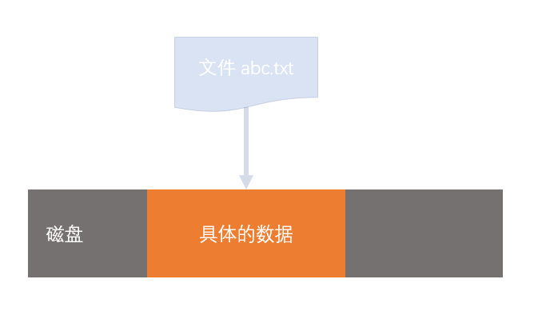
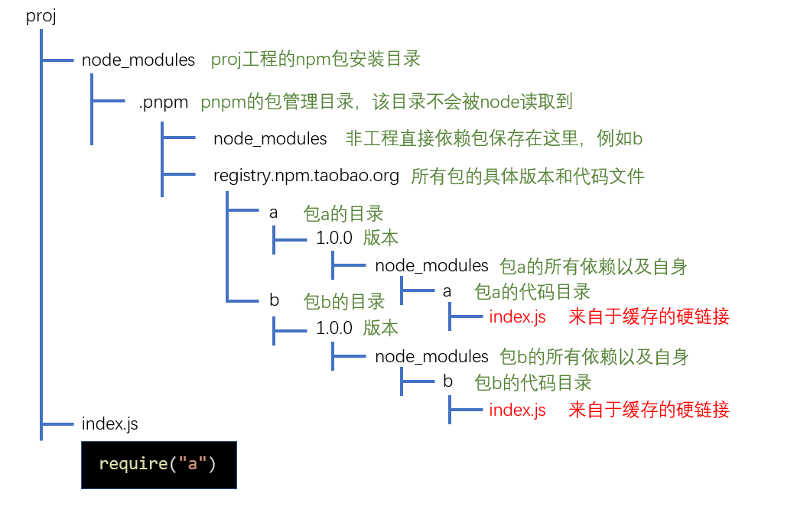

pnpm 是一个基于 npm 的包管理工具，其与 npm 和 yarn 相比具有以下优势：

1. 安装效率高于 npm 和 yarn
2. `node_modules` 采用树状结构，更加简洁，同时避免了开发时使用间接依赖的问题
3. 使用缓存和链接，极大的降低磁盘空间的占用

## 安装/使用

pnpm 需要使用 npm 进行全局安装：

```bash
npm install -g pnpm
```

使用 pnpm 只需要将 `npm` 命令替换为 `pnpm` 命令即可，如果需要执行本地 CLI，使用 `pnpx` 指令即可。（使用 `pnpx` 执行一个需要安装的命令时，会使用 `pnpm` 进行安装）。

## pnpm 的原理

### 文件与链接

#### 文件的本质

操作系统中，文件实际上是一个指针，其指向一个外部存储地址（硬盘、U 盘、网络...）：


删除文件时，删除的实际上是指针：



#### 文件的拷贝

复制一个文件，是将该文件指针指向的内容进行复制，然后产生一个新文件指向新的内容：


#### 硬链接（hard link）

硬链接的概念来自于 Unix 操作系统，它是指将一个文件 A 指针复制到另一个文件 B 指针中，文件 B 就是文件 A 的硬链接


创建硬链接不会产生额外的磁盘占用，两个文件指向同一个磁盘内容。

硬链接的数量没有限制，可以为同一个文件产生多个硬链接

Windows 从 Vista 版本开始支持创建硬链接的操作，在 cmd 中使用以下指令创建硬链接：

```bash
mklink /h link_file_path original_file_path
```

> 文件夹（目录）不存在问价内容，所以文件夹（目录）无法创建硬链接
> Windows 操作系统中，不要跨盘符创建硬链接

#### 符号链接/软连接（symbol link）

符号链接又称为软连接，如果为某个文件或文件夹 A 创建符号连接 B，则 B 指向 A：


Windows 从 Vista 版本开始支持创建符号链接的操作，在 cmd 中使用以下指令创建硬链接：

```bash
mklink /d link_file_path original_file_path
# /d表示创建的是目录的符号链接，不写则是文件的符号链接
```

> 早期的 Windows 系统不支持符号链接，但是提供了一个工具 junction 来达到类似的功能。

#### 硬链接与符号链接的区别

1. 硬链接仅可以额链接文件，符号链接还可以链接目录
2. 硬链接在建立之后仅和文件实际存储块有关，与之前的文件无关。符号链接始终与之前的文件关联，与文件实际存储块无关。

#### 快捷方式

快捷方式类似于符号链接，是 Windows 系统早期就支持的链接方式,也是 Windows 系统独有的链接方式。

快捷方式不仅仅是一个指向其他文件或目录的指针，还包含了其他信息：如权限、兼容性启动方式等其他属性。

#### Node 环境对硬链接和符号链接的处理

**硬链接**：硬链接是一个实实在在的文件，node 不对其做任何特殊处理，也无法区别对待（node 无法判断该文件是一个硬链接还是源文件，因为两者没有区别）

**符号链接**：由于符号链接指向的是另一个文件或目录，当 node 执行符号链接下的 JS 文件是在原始路径下执行的。

### pnpm 的构建方式

pnpm 使用**符号链接**和**硬链接**来构建 `node_modules` 目录。

已一个例子说明构建方式：

假设两个包 `a` 和 `b`，`a` 依赖 `b`：


假设工程为 proj，其直接依赖 `a`，项目安装依赖的时候 pnpm 会做以下处理：

1. 查询依赖关系，得到最终要安装的包：`a` 和 `b`。
2. 查看 `a` 和 `b` 是否已经有缓存，如果没有，下载到缓存中，如果有，则进入下一步。
3. 创建 `node_modules` 目录，并对目录进行结构初始化：

 

4.从缓存的对应包中使用硬链接放置文件到相应包代码目录中：



5.使用符号链接，将每个包的直接依赖放置到自己的目录中：


这样做是为了保证 `a` 的代码在执行过程中，可以读取到它们的直接依赖。

6. pnpm 为了解决一些书写不规范的包（读取间接依赖）的问题，又将所有的工程非直接依赖，使用符号链接加入到了 `.pnpm/node_modules` 中。
   在本例中没有必要使用这个 `node_modules`，但是如果 `b` 依赖 `c`，`a` 又要直接用 `c`，面对这种不规范的依赖引用， pnpm 通过这种方式支持了。

    > 直接使用绝对路径引用以来的写法，pnpm 没办法支持。

7. 在工程的 `node_modules` 目录中使用符号链接，放置直接依赖:
