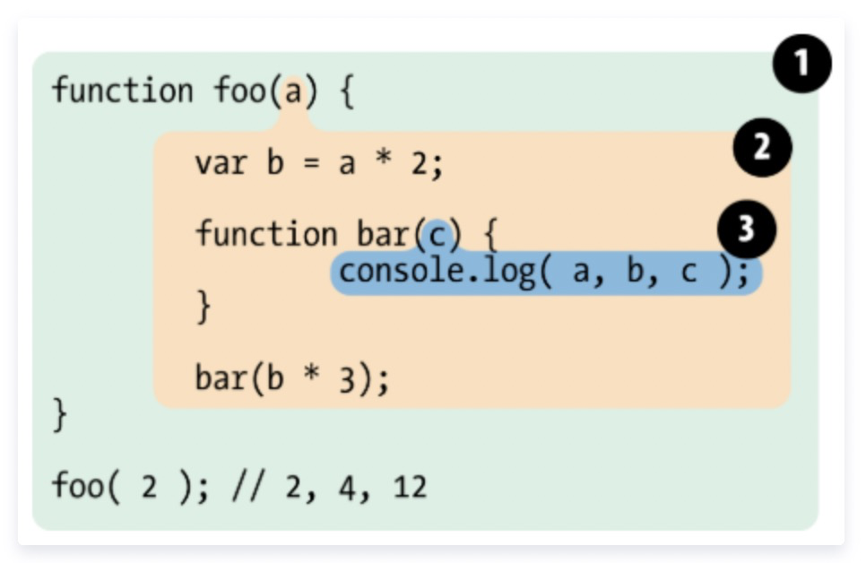

## 1. 什么是作用域

作用域是在运行时代码中的某些特定部分中变量，函数和对象的可访问性。

换句话说，作用域决定了代码区块中变量和其他资源的可见性。

下面通过一个例子来理解作用域的概念：

```js
function outFun2() {
    var inVariable = "内层变量2";
}
outFun2();
console.log(inVariable); // Uncaught ReferenceError: inVariable is not defined
```

从上面的例子可以理解作用域的概念，变量 `inVariable` 在全局作用域没有声明，所以在全局作用域下取值会报错。

可以这样理解：**作用域就是一个独立的地盘，让变量不会外泄、暴露出去**。也就是说**作用域最大的用处就是隔离变量，不同作用域下同名变量不会有冲突。**

**ES6 之前 JavaScript 没有块级作用域，只有全局作用域和函数作用域**。

ES6 的到来，为开发者提供了"块级作用域"，可通过新增命令 `let` 和 `const` 来体现。

## 2. 全局作用域和函数作用域

**（1）全局作用域**

在代码中任何地方都能访问到的对象拥有全局作用域，一般来说以下几种情形拥有全局作用域：

- 最外层函数和在最外层函数外面定义的变量拥有全局作用域

```js
var outVariable = "我是最外层变量"; //最外层变量
function outFun() { //最外层函数
    var inVariable = "内层变量";
    function innerFun() { //内层函数
        console.log(inVariable);
    }
    innerFun();
}
console.log(outVariable); // 我是最外层变量
outFun(); // 内层变量
console.log(inVariable); // inVariable is not defined
innerFun(); // innerFun is not defined
```

- 所有未定义直接赋值的变量自动声明为拥有全局作用域

```js
function outFun2() {
    variable = "未定义直接赋值的变量";
    var inVariable2 = "内层变量2";
}
outFun2();//需要先执行这个函数，否则变量无法被声明
console.log(variable); //未定义直接赋值的变量
console.log(inVariable2); //inVariable2 is not defined
```

- 所有 `window` 对象的属性拥有全局作用域

一般情况下，`window` 对象的内置属性都拥有全局作用域，例如 `window.name`、`window.location`、`window.top` 等等。

全局作用域有个弊端：如果编写了很多行 JavaScript 代码，变量定义都没有用函数包括，那么它们就全部都在全局作用域中。这样就会污染全局命名空间，容易引起命名冲突。

```js
// 张三写的代码中
var data = {a: 100}

// 李四写的代码中
var data = {x: true}
```

这就是为何 jQuery、Zepto 等库的源码，所有的代码都会放在 `(function(){....})()` 中。

因为放在里面的所有变量，都不会被外泄和暴露，不会污染到外面，不会对其他的库或者 JavaScript 脚本造成影响。这是函数作用域的一个体现。

**（2）函数作用域**

函数作用域，是指声明在函数内部的变量，和全局作用域相反，局部作用域一般只在固定的代码片段内可访问到，最常见的例如函数内部。

```js
function doSomething(){
    var stuName="zhangsan";
    function innerSay(){
        console.log(stuName);
    }
    innerSay();
}
console.log(stuName); // 脚本错误
innerSay(); // 脚本错误
```

**作用域是分层的，内层作用域可以访问外层作用域的变量，反之则不行**。

下面通过一个例子来理解，用泡泡来比喻作用域：



最后输出的结果为 2、4、12

- 泡泡 1 是全局作用域，有标识符 `foo`；
- 泡泡 2 是作用域 `foo`，有标识符 `a`、`bar`、`b`；
- 泡泡 3 是作用域 `bar`，仅有标识符 `c`。

值得注意的是：**块语句（大括号"｛ ｝"中间的语句），如 `if` 和 `switch` 条件语句或 `for` 和 `while` 循环语句，不像函数，它们不会创建一个新的作用域**。在块语句中定义的变量将保留在它们已经存在的作用域中。

```js
if (true) {
    // 'if' 条件语句块不会创建一个新的作用域
    var name = 'Hammad'; // name 依然在全局作用域中
}
console.log(name); // logs 'Hammad'
```

JavaScript 的初学者经常需要花点时间才能习惯变量提升，而如果不理解这种特有行为，就可能导致 bug。

正因为如此，ES6 引入了块级作用域，让变量的生命周期更加可控。

## 3. 块级作用域

块级作用域可通过新增命令 `let` 和 `const` 声明，所声明的变量在指定块的作用域外无法被访问。

块级作用域在如下情况被创建：

1. 在一个函数内部
2. 在一个代码块（由一对花括号包裹）内部

`let` 声明的语法与 `var` 的语法一致。基本上可以用 `let` 来代替 `var` 进行变量声明，但会将变量的作用域限制在当前代码块中。块级作用域有以下几个特点：

- 声明变量不会提升到代码块顶部

`let`、`const` 声明并不会被提升到当前代码块的顶部，因此需要手动将 `let`、`const` 声明放置到顶部，以便让变量在整个代码块内部可用。

```js
function getValue(condition) {
    if (condition) {
        let value = "blue";
        return value;
    } else {
        // value 在此处不可用
        return null;
    }
    // value 在此处不可用
}
```

- 禁止重复声明

如果一个标识符已经在代码块内部被定义，那么在此代码块内使用同一个标识符进行 `let` 声明就会导致抛出错误。例如：

```js
var count = 30;
let count = 40; // Uncaught SyntaxError: Identifier 'count' has already been declared
```

在本例中，`count` 变量被声明了两次：一次使用 `var`，另一次使用 `let`。

因为 `let` 不能在同一作用域内重复声明一个已有标识符，此处的 `let` 声明就会抛出错误。但如果在嵌套的作用域内使用 `let` 声明一个同名的新变量，则不会抛出错误。

```js
var count = 30;
// 不会抛出错误
if (condition) {
    let count = 40;
    // 其他代码
}
```

- 循环中的绑定块作用域的妙用

开发者可能最希望实现 `for` 循环的块级作用域了，因为可以把声明的计数器变量限制在循环内。

例如，以下代码在 JavaScript 中经常见到：

```js
<button>测试1</button>
<button>测试2</button>
<button>测试3</button>
var btns = document.getElementsByTagName('button')
for (var i = 0; i < btns.length; i++) {
  btns[i].onclick = function () {
    console.log('第' + (i + 1) + '个')
  }
}
```

要实现这样的一个需求：点击某个按钮，提示"点击的是第 n 个按钮"。

此处先不考虑事件代理，结果发现，点击任意一个按钮，后台都是弹出"第四个"。

这是因为 `i` 是全局变量，执行到点击事件时，此时 `i` 的值为 3。

那该如何修改，最简单的是用 `let` 声明 `i`

```js
for (let i = 0; i < btns.length; i++) {
  btns[i].onclick = function () {
    console.log('第' + (i + 1) + '个')
  }
}
```

## 4. 作用域链

### 4.1 什么是自由变量

首先认识一下什么叫做**自由变量**。

如下代码中，*console.log(a)* 要得到 *a* 变量，但是在当前的作用域中没有定义 *a*（可对比一下 *b*）。当前作用域没有定义的变量，这称为自由变量。

自由变量的值如何得到？

需要向父级作用域寻找（注意：这种说法并不严谨，下文会重点解释）。

```js
var a = 100
function fn() {
    var b = 200
    console.log(a) // 这里的 a 在这里就是一个自由变量
    console.log(b)
}
fn()
```

### 4.2 什么是作用域链

如果父级也没有呢？

再一层一层向上寻找，直到找到全局作用域还是没找到，就宣布放弃。这种一层一层的关系，就是作用域链。

```js
var a = 100
function f1() {
    var b = 200
    function f2() {
        var c = 300
        console.log(a) // 100 自由变量，顺作用域链向父作用域找
        console.log(b) // 200 自由变量，顺作用域链向父作用域找
        console.log(c) // 300 本作用域的变量
    }
    f2()
}
f1()
```

### 4.3 关于自由变量的取值

关于自由变量的值，上文提到要到父作用域中取，其实有时候这种解释会产生歧义。

```js
var x = 10
function fn() {
    console.log(x)
}
function show(f) {
    var x = 20;
    (function () {
        f() // 10，而不是 20
    })()
}
show(fn)
```

在 *fn* 函数中，取自由变量 `x` 的值时，要到哪个作用域中取？

要到创建 *fn* 函数的那个作用域中取，**无论 `fn` 函数将在哪里调用**。

所以，不要再使用以上说法了。相比而言，用这句话描述会更加贴切：**要到创建这个函数的那个作用域中取值，这里强调的是"创建"，而不是"调用"**，切记切记，其实这就是所谓的"静态作用域"。

再看一个例子：

```js
const food = "rice";
const eat = function () {
    console.log(`eat ${food}`);
};
(function () {
    const food = "noodle";
    eat(); // eat rice
})();
```

在本示例中，最终打印的结果为 *eat rice*。因为对于 `eat()` 函数来说，创建该函数时它的父级上下文为全局上下文，所以 `food` 的值为 *rice*。

如果将代码稍作修改，改成如下：

```js
const food = "rice";
(function () {
    const food = "noodle";
    const eat = function () {
        console.log(`eat ${food}`);
    };
    eat(); // eat noodle
})();
```

这个时候，打印出来的值就为 *eat noodle*。因为对于 `eat()` 函数来讲，创建它的时候父级上下文为 *IIFE*，所以 *food* 的值为 *noodle*。

### 4.4 作用域与执行上下文

许多开发人员经常混淆作用域和执行上下文的概念，误认为它们是相同的概念，但事实并非如此。

JavaScript 属于解释型语言，JavaScript 的执行分为：解释和执行两个阶段，这两个阶段所做的事并不一样。

**解释阶段**

- 词法分析
- 语法分析
- 作用域规则确定

**执行阶段**

- 创建执行上下文
- 执行函数代码
- 垃圾回收

JavaScript 解释阶段便会确定作用域规则，因此作用域在函数定义时就已经确定了，而不是在函数调用时确定，但是执行上下文是函数执行之前创建的。

执行上下文最明显的就是 *this* 的指向是执行时确定的。而作用域访问的变量是编写代码的结构确定的。

作用域和执行上下文之间最大的区别是：

**执行上下文在运行时确定，随时可能改变，作用域在定义时就确定，并且不会改变**。

## 5. 真题解答

- 谈谈你对作用域和作用域链的理解？

> 参考答案：
>
> **什么是作用域？**
>
> ES5 中只存在两种作用域：全局作用域和函数作用域。
>
> 在 JavaScript 中，作用域定义为一套规则，这套规则用来管理引擎如何在当前作用域以及嵌套子作用域中根据标识符名称进行变量（变量名或者函数名）查找。ES6 新增了块级作用域。
>
> **什么是作用域链？**
>
> 当访问一个变量时，编译器在执行这段代码时，会首先从当前的作用域中查找是否有这个标识符，如果没有找到，就会去父作用域查找，如果父作用域还没找到继续向上查找，直到全局作用域为止。
>
> 而作用域链，就是由当前作用域与上层作用域的一系列变量对象组成，它保证了当前执行的作用域对符合访问权限的变量和函数的有序访问。
>
> 作用域链有一个非常重要的特性，**那就是作用域中的值是在函数创建的时候，就已经被存储了，是静态的**。
>
> 所谓静态，就是说作用域中的值一旦被确定了，永远不会变。**函数可以永远不被调用，但是作用域中的值在函数创建的时候就已经被写入了，**并且存储在函数作用域链对象里面。
