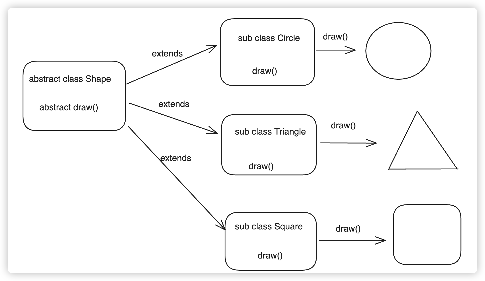
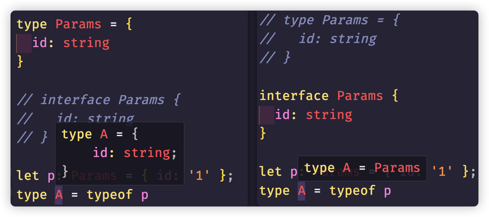
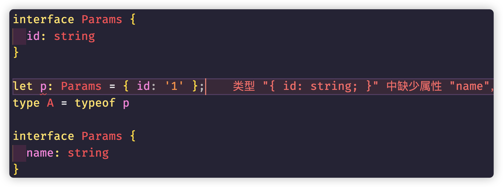

## 关于面向对象

首先，面向对象程序设计（Object Oriented Programming，OOP）是一种计算机编程架构。

> **OOP 特点** = **封装** + **继承** + **多态**，OOP 达到了软件工程的三个主要目标：**重用性**、**灵活性**和**扩展性**
>
> 面向对象使得软件的开发方法与过程尽可能接近人类认识世界、解决现实问题的方法和过程

> 人类总是习惯于将已知或未知的事物进行分类，例如区分好人与坏人、人与动物等。
>
> 这种归类方式是为了给具体对象贴上标签，便于我们记忆，甚至是扩展记忆的连贯性。
>
> 虽然这种方式有时具有很强的主观性，但不可否认，这是人类最容易记忆的方式。

因此，当程序变得越来越复杂时，就需要一种可读性和可理解性更强、更适合人类的程序设计方式，这就是面向对象。在互联网行业，许多流行的后端语言都是面向对象的，比如 Java、C# 等，这是因为涉及的业务复杂，为了在纷繁复杂的程序业务世界中找到最清晰的脉络，需要像人类认知世界一样，将各个内容分类并打上标签。

因此，面向对象中所说的类，就是对具有相似属性和相似行为的内容进行代码归类。这样做的目的无非是为了便于开发者记忆、阅读和扩展。

> 从类型系统的角度来看：一个类实际上就是创建了一种新的数据结构类型。因此，一个类就是一个类型。

在 ES6 之前，传统的 JavaScript 程序使用构造函数来创建类，基于原型链实现继承。但是这样会让函数产生二义性，简单来说，一个构造函数既可以表示是一个函数，也可以表示是一个构造函数（类）。虽然之前一直约定俗成地认为函数名首字母大写就是构造函数，但却没有语法层面的区分。因此，ES6 之后加入了 `class` 和箭头函数，专门用来区分类和一般函数。

## 访问修饰符

类的主要结构包括：**属性、构造函数、方法、存取器、访问修饰符、装饰器**。在 TypeScript 中，我们只需要在相应的部分加上类型标注即可。

**属性的类型标识类似于变量，而构造函数、方法、存取器的类型标注实际上就是函数**：

```typescript
// TS中类的主要结构：属性、构造函数、方法、存取器、访问修饰符、装饰器
// 属性类似于变量，加上相关类型标注，当然也能通过值的类型进行类型推导
// 构造函数、方法、存取器类似于函数，加上参数的类型与返回类型

// 访问修饰符：可以修饰属性和方法
// public（默认）: 可以在类、类的子类中，以及类和子类的实例对象访问
// protected: 仅能在类和子类中访问
// private: 仅能在类的内部被访问到
// # ES2022新特性，私有属性和方法
/*
class Animal{
  public name: string;
  protected color: string;
  private _age: number;
  #type: string;
  constructor(name: string, color:string, _age: number, type:string) { 
    this.name = name;
    this.color = color;
    this._age = _age;
    this.#type = type;
  }

  show() { 
    console.log(this.name, this.color, this._age)
  }
}
*/
class Animal {
    #type: string
    constructor(public name: string, protected color: string, private _age: number, type: string) {
        this.#type = type
    }

    show() {
        console.log(this.name, this.color, this._age)
    }
}

class Cat extends Animal {
    info() {
        // 父类中public修饰的属性和方法在子类中都能访问
        console.log(this.name)
        this.show()
        // 父类中protected修饰的属性和方法在子类中都能访问
        console.log(this.name)
        this.show()

        // 父类中private修饰的属性和方法在子类中 不能访问
        // console.log(this._age);
    }
}

const a = new Animal('小白', '白色', 3, 'Dog')
console.log(a.name)
a.show()
// console.log(a.color);
// console.log(a._age);

const c = new Cat('小猫', '花色', 2, 'Cat')
console.log(c.name)
c.info()
```

> **注意 1：**`"strict": true` 会默认开启 `"strictPropertyInitialization": true`，也就是属性必须初始化。如果希望关闭这个特性，可以单独设置 `"strictPropertyInitialization": false`。

-   `public`：在**类、类的实例、子类**中都能被访问。
-   `protected`：仅能在**类与子类中**被访问。
-   `private`：仅能在**类的内部**被访问。
-   `#`：仅能在**类的内部**被访问。ES2022 新特性

需要注意的有两个地方：

1. `private` 实际上是 TypeScript 的访问修饰符，因此在转换为 JavaScript 代码之后，实际上是会消失的。

2. 私有字段 `#` 实际上是 ES2022 中被正式采纳的标准。

3. 如果不添加任何访问修饰符，**默认为 `public`**。我们一般不会为构造函数添加修饰符，保持默认即可。

上面构造函数的写法还是略显麻烦，我们实际上可以简写：

```typescript
class Animal {
  #type: 'cat' | 'dog';
  constructor(public name: string, public color: string, private _age: number, type: 'cat' | 'dog') {
    this.#type = type;
  }
  ......
}
```

> 用 `#` 标记的私有字段，目前还不能以类似于 `public` 和 `private` 修饰符的构造函数参数简写形式声明。

## 存取器（访问器）属性

访问器属性的写法几乎和 JavaScript 一样，只需要注意一些小细节即可：

```typescript
class Animal {
    public name: string
    protected color: string
    private _age: number
    #type: string
    constructor(name: string, color: string, _age: number, type: string) {
        this.name = name
        this.color = color
        this._age = _age
        this.#type = type
    }

    get age() {
        return this._age
    }

    set age(value: number) {
        if (value < 0 || value > 150) throw new Error('年龄不符合规范...')
        this._age = value
    }

    get type(): string {
        return this.#type
    }

    set type(value: 'Cat' | 'Dog') {
        this.#type = value
    }

    show() {
        console.log(this.name, this.color, this._age)
    }
}

/* class Animal{
  
  #type: string;
  constructor(
    public name: string,
    protected color: string,
    private _age: number,
    type: string) { 
    this.#type = type;
  }

  show() { 
    console.log(this.name, this.color, this._age)
  }
} */

class Cat extends Animal {
    info() {
        // 父类中public修饰的属性和方法在子类中都能访问
        console.log(this.name)
        this.show()
        // 父类中protected修饰的属性和方法在子类中都能访问
        console.log(this.name)
        this.show()

        // 父类中private修饰的属性和方法在子类中 不能访问
        // console.log(this._age);
    }
}

const a = new Animal('小白', '白色', 3, 'Dog')
console.log(a.name)
a.show()
a.age = -1
a.type = 'Cat'

// console.log(a.color);
// console.log(a._age);

const c = new Cat('小猫', '花色', 2, 'Cat')
console.log(c.name)
c.info()
```

如果访问器属性有 `set`，那么默认 `get` 返回具体的类型。

因此，可选属性这种写法与访问器属性的 `get`、`set` 一起使用会产生逻辑冲突。

```typescript
class Animal {
    private _age?: number
    // ......其他省略
    get age() {
        return this._age
    }
    set age(value: number) {
        if (value < 0) throw new Error('年龄不能为负数')
        this._age = value
    }
}
```

上面的代码会直接报错：

```shell
不能将类型"number | undefined"分配给类型"number"。
不能将类型"undefined"分配给类型"number"。ts(2322)
```

**修改方式一：** 去掉 `private _age: number;` 的可选属性，因为这本来就与访问器属性冲突。

**修改方式二：** 删除 `set` 属性访问器，如果 `set` 不是必要的，去掉 `set` 也能避免这种逻辑冲突。

**修改方式三：** 在 `get` 方法中加入对 `undefined` 的判断：

```typescript
get age() {
  if(this._age === undefined) throw new Error('年龄未知')
  return this._age;
}
```

**修改方式四：非空断言**

```typescript
get age() {
  return this._age!;
}
```

**修改方式五：**

一般我们都会默认开启 `tsconfig.json` 的配置属性 `"strict": true`，`"strictNullChecks": true` 也会随之开启。既然上面报错**不能将类型"undefined"分配给类型"number"**，实际上是因为把 `undefined` 作为了单独类型进行严格检查，当然不能赋值给 `number` 类型。如果不把 `undefined` 和 `null` 作为单独的类型进行严格检查，也就不会报这种错误了。设置 `"strictNullChecks": false` 即可。不过一般不建议随便修改工程配置项。

## 静态成员

在 TypeScript 中，您可以使用 `static` 关键字来表示一个成员为静态成员：

```typescript
class Animal {

  // 静态属性
  static kingdom = "Animal";

  // 静态方法
  static showKingdom(): string {
    console.log(Animal.kingdom);
    console.log(this.kingdom);
    return `The kingdom is ${Animal.kingdom}.`;
  }
  ......
}
const s = Animal.showKingdom();
console.log(s)
```

在静态方法中虽然也可以使用 `this`，但静态方法中的 `this` 指向的不是类的实例，而是类本身。这意味着在静态方法内部，`this` 指向的是类的构造函数，而不是类的实例。

实际上，如果我们将 `target` 降低到 ES5 以下（**注意**：降低 `target`，如果没有 `lib` 的话，默认支持的语法也会降级，`#` 这种写法肯定就不支持了），观察编译后的 JavaScript 文件，会发现**静态成员直接被挂载在函数体上**，而**实例成员挂载在原型上**：

```typescript
// 静态方法
Animal.showKingdom = function () {
    console.log(Animal.kingdom)
    console.log(this.kingdom)
    return 'The kingdom is '.concat(Animal.kingdom)
}
// 实例方法
Animal.prototype.show = function () {
    console.log(this.name, this.color, this._age)
}
```

## 继承

有面向对象，就必然有继承。和 JavaScript 一样，使用 `extends` 关键字来实现继承。当然，类的继承仍然具有单根性的特点：

```typescript
class Father {
    constructor(public name: string) {}
    info(): void {
        console.log('Father Info')
    }
}

class Child extends Father {
    constructor(public name: string, public age: number) {
        super(name)
    }
    override info(): string {
        console.log('Child Info')
        super.info()
        return ''
    }
}
```

父类和子类的概念应该已经比较熟悉了，上面主要用到了几个关键字：`extends`、`super` 和 `override`。

**`super`：** 在构造方法中调用时使用 `super()`，而且这种写法只能在构造方法中使用。如果子类有构造方法，那么必须调用 `super()`，无论构造方法是否有参数，这样才能将父子关系连接起来。需要注意的是，如果不写的话会报错。

在一般方法中调用时使用 `super.xxx()` 的形式，表示调用的是父类的方法，特别是在子类重写父类方法时（子类方法和父类方法同名的情况，实际上就是覆盖父类的同名方法），这样可以清晰地区分调用的是父类的方法还是子类的方法。**`super` 只能调用父类的方法，不能访问父类的属性**。

**`override`：** TypeScript 4.x 新增的关键字，这是一个提醒关键字。使用 `override` 修饰的方法表明该方法是一个重写的、覆盖父类的方法。如果子类中的方法没有在父类中出现过，那么不能使用 `override`。

## `this` 返回类型

`this` 可以用作值，也可以用作类型。

比如我们现在要做一个 ES6 的 `Set` 数据结构的简化版：

```typescript
class SimpleSet {
    // 设置为元素设置为Map类型可以方便的使用内置的方法，我们不用重复造轮子
    // Map类型也便于扩展
    // 仅仅只关心键，值不关心，设置为boolean类型
    private elements: Map<number, boolean>

    constructor() {
        this.elements = new Map<number, boolean>()
    }

    add(element: number): SimpleSet {
        this.elements.set(element, true)
        return this // 链式调用
    }

    has(element: number): boolean {
        return this.elements.has(element)
    }

    delete(element: number): boolean {
        return this.elements.delete(element)
    }

    values(): number[] {
        return Array.from(this.elements.keys())
    }
}

// 示例使用
const mySet = new SimpleSet()

mySet.add(1).add(2).add(3) // 链式调用

console.log(mySet.values()) // 输出: [1, 2, 3]

mySet.delete(2)
console.log(mySet.values()) // 输出: [1, 3]
```

其他都没有什么问题，但是如果我们还有一个子类，子类可能需要处理其他的内容：

```typescript
class MutableSet extends SimpleSet {
    show() {
        console.log('MutableSet show')
    }
}
```

初看起来没有问题，但是如果我们再次调用 `add` 方法，就能看到具体的一些区别了：

```typescript
const mySet = new MutableSet()

mySet.add(1).add(2).add(3).show() // add方法返回的是SimpleSet,根本调用不到show方法
```

因此，为了保证子类的 `this` 返回正确，只能重写覆盖父类的 `add` 方法，目的仅仅是为了改写返回的对象类型：

```typescript
class MutableSet extends SimpleSet {
    add(element: number): MutableSet {
        super.add(element)
        return this
    }
    show() {
        console.log('MutableSet show')
    }
}
```

实际上，我们可以用一个简单的方法来解决这个问题：在父类中，将 `add` 方法的返回类型直接定义为 `this`：

```typescript
// 父类
class SimpleSet {
  add(element: number): this {
    this.elements.set(element, true);
    return this; // 链式调用
  }
	......
}

// 子类
class MutableSet extends SimpleSet {
  show() {
    console.log('MutableSet show')
  }
}

// 示例使用
const mySet = new MutableSet();
mySet.add(1).add(2).add(3).show();
```

## 类的泛型支持

同样，类也支持泛型。上面的 `SimpleSet` 我们基本上限定了只能使用数字类型，我们应该使用泛型，这样传递的是什么类型，`SimpleSet` 中保存的就应该是什么类型：

```typescript
class SimpleSet<T> {
    private elements: Map<T, boolean>

    constructor(initialElements: T[] = []) {
        this.elements = new Map<T, boolean>()
        initialElements.forEach(element => this.add(element))
    }

    add(element: T): this {
        this.elements.set(element, true)
        return this
    }

    has(element: T): boolean {
        return this.elements.has(element)
    }

    delete(element: T): boolean {
        return this.elements.delete(element)
    }

    values(): T[] {
        return Array.from(this.elements.keys())
    }

    static of<E>(...elements: E[]): SimpleSet<E> {
        const set = new SimpleSet<E>()
        elements.forEach(element => set.add(element))
        return set
    }
}

const mySet = new SimpleSet<number>()
mySet.add(1).add(2).add(3).add(4)
console.log(mySet)

const mySet2 = new SimpleSet(['a', 'b', 'c'])
console.log(mySet2)

const mySet3 = SimpleSet.of(100, 200, 300)
console.log(mySet3.values()) // 输出: [100, 200, 300]
```

可以看到，在声明类时绑定的泛型 `T`，在每个实例方法和实例属性中都可以使用。

在构造函数中加上了参数，这样在 `new` 对象时，可以传入对应的类型，TypeScript 可以进行类型推导，否则默认类型推导是 `unknown`。

新增了一个静态方法 `of`，注意在**静态方法中不能访问类的泛型**。毕竟是直接通过类型调用的，所以必须要重新声明泛型参数。

## 有关 `this` 的类型体操

### [`ThisType<Type>`](https://www.typescriptlang.org/docs/handbook/utility-types.html)

`ThisType<Type>` 可以让 `Type` 充当上下文类型的标记 [`this`](https://www.typescriptlang.org/docs/handbook/functions.html#this)：

```typescript
type ObjectDescriptor<D, M> = {
    data?: D
    methods?: M & ThisType<D & M> // Type of 'this' in methods is D & M
}

function makeObject<D, M>(desc: ObjectDescriptor<D, M>): D & M {
    let data: object = desc.data || {}
    let methods: object = desc.methods || {}
    return {...data, ...methods} as D & M
}

let obj = makeObject({
    data: {x: 0, y: 0},
    methods: {
        moveBy(dx: number, dy: number) {
            this.x += dx // Strongly typed this
            this.y += dy // Strongly typed this
        }
    }
})

obj.x = 10
obj.y = 20
obj.moveBy(5, 5)
```

这个例子相对复杂，以下是一个更简单的示例：

```typescript
type Foo = {
    foo: () => number
} & ThisType<{
    a: number
    b: number
}>

const f: Foo = {
    foo() {
        return this.a + this.b
    }
}
```

```typescript
type Bar = {
    a: number
    b: number
}
type Foo = {
    // bar: () => Bar;
    foo: () => number
} & ThisType<Bar>

const foo: Foo = {
    // bar: () => ({
    //   a: 10,
    //   b: 20,
    // }),
    foo() {
        return this.a + this.b
    }
}
```

### [SimpleVue](https://typehero.dev/challenge/simple-vue)

实现类似 Vue 的类型支持的简化版本。

实际上就是实现 Vue 中的 `data`、`computed` 和 `methods` 的类型标注。

对于没有编写过 Vue 的读者，需要遵循下面的规则：

-   `data` 是一个简单的函数，它返回一个提供上下文 `this` 的对象，但是无法在 `data` 中获取其他的计算属性或方法。而且在 `data` 中也不能访问 `this` 对象。

-   `computed` 是一个对象，将 `this` 作为上下文的函数的对象，进行一些计算并返回结果。在 `computed` 中可以访问 `data` 中的属性与 `computed` 自身的函数。而且在调用时只能使用属性的调用方式，不能用函数的调用方式。

-   `methods` 是一个对象，其上下文也为 `this`。函数中可以访问 `data`、`computed` 以及其他 `methods` 中的暴露的字段。`computed` 与 `methods` 的不同之处在于 `methods` 在上下文中按原样暴露为函数。

这个题目看起来很难，实际上非常简单：

只需要掌握四个关键知识点即可：

1. 函数中声明 `this`
2. `ThisType` 工具的使用
3. 映射类型重映射
4. `infer` 推断

```typescript
declare function SimpleVue<D, C, M>(options: {
    data: (this: void) => D
    computed: C & ThisType<D>
    methods: M & ThisType<D & getComputed<C> & M>
}): any

type getComputed<T> = {
    readonly [P in keyof T]: T[P] extends (...args: any[]) => infer R ? R : never
}
```

### 实现可链接选项

这是 TypeScript 类型体操中的一个挑战 [Chainable options](https://typehero.dev/challenge/chainable-options)：

```typescript
declare const config: Chainable

const result = config.option('foo', 123).option('name', 'type-challenges').option('bar', {value: 'Hello World'}).get()

// 期望 result 的类型是：
interface Result {
    foo: number
    name: string
    bar: {
        value: string
    }
}
```

简单来说，就是每次 `option` 链式调用的函数会将属性添加到对象中，而且属性名不能重复，如果重复了就取后面那一次的属性和值的类型。

一开始我们这样思考：`option` 每次返回的类型肯定是之前的 `T` 类型与 `option` 调用之后的对象字面量类型的交叉：

```typescript
type Chainable<T = {}> = {
    option<K extends string, V>(key: K, value: V): Chainable<T & {[P in K]: V}>
    get(): T
}
```

然后如果出现同名的 `key`，将其排除：

```typescript
type Chainable<T = {}> = {
    option<K extends string, V>(key: Exclude<K, keyof T>, value: V): Chainable<T & {[P in K]: V}>
    get(): T
}
```

最后，每次返回的 `T` 应该忽略当前的 `K`，如果没有同名的就没有任何影响，如果出现同名的才会触发：

```typescript
type Chainable<T = {}> = {
    option<K extends string, V>(key: Exclude<K, keyof T>, value: V): Chainable<Omit<T, K> & {[P in K]: V}>
    get(): T
}
```

## 抽象类

面向对象中还有一个概念：**抽象类**。抽象类是对类结构与方法的抽象。

**面向对象的三大特征：封装、继承、多态**

关于后端语言对于多态的理解：

多态是同一个行为具有多个不同表现形式或形态的能力。

### 多态存在的三个必要条件

-   继承
-   重写
-   父类引用指向子类对象：`Parent p = new Child();`



后端 Java 伪代码实现：

```typescript
abstract class Shape{
	abstract void draw();
}
class Circle extends Shape{
	void draw(){
		System.out.println("Circle")
	}
}

class Triangle extends Shape{
	void draw(){
		System.out.println("Triangle")
	}
}

class Square extends Shape{
	void draw(){
		System.out.println("Square")
	}
}

// 后端的多态
// 继承
// 重写
// 父类引用指向子类对象
Shape s = new Square();
s.draw();
```

### TypeScript 中抽象类的语法

```typescript
abstract class Foo {
    abstract name: string
    abstract get nameGetter(): string
    abstract method(name: string): string
    static info(): void {
        console.log('Foo Info')
    }
}
```

注意，抽象类中的成员也需要使用 `abstract` 关键字才能被视为抽象类成员。反过来，如果一个类中有 `abstract` 修饰成员，那么必须在抽象类中。

如果抽象类中全部是抽象成员、抽象方法或者静态方法，子类可以使用 `implements` 实现，当然也可以使用 `extends`：

```typescript
class Baz implements Foo {
    name = 'baz'
    get nameGetter(): string {
        return this.name
    }
    method(name: string): string {
        return name
    }
}
```

最关键的是，**抽象类并不能被实例化**。抽象类出现的目的就是为了程序架构而生的，抽象类中全部都是抽象的方法，所以也没有实例化的必要。

```typescript
const f = new Foo() // error 无法创建抽象类实例
```

如果抽象类中有实例方法，那么子类必须使用 `extends` 继承：

```typescript
abstract class Foo {
    abstract name: string
    abstract get nameGetter(): string
    abstract method(name: string): string
    static info(): void {
        console.log('Foo Info')
    }
    foo() {
        console.log('foo')
    }
}

class Baz extends Foo {
    name = 'baz'
    get nameGetter(): string {
        return this.name
    }
    method(name: string): string {
        return name
    }
}
const baz = new Baz()
const b = baz.method('hello')
console.log(b)
baz.foo()
```

实际上道理很简单：当抽象类编译之后，在 JavaScript（ES6）中还是一个普通的 `class` 类。如果全是抽象的，实际上相当于什么都没有，这个实现关系只存在于 TypeScript 中，所以使用 `implements` 还是 `extends` 都没有关系，对编译之后的 JavaScript 文件都没有影响。

但是如果抽象类中有具体的方法，编译之后的 JavaScript 文件的 `class` 类中是有内容的，所以必须使用 `extends`。

如果一个类中并没有全部实现抽象类的抽象方法，那么这个类也必须是抽象的：

```typescript
abstract class Foo {
    abstract name: string
    abstract get nameGetter(): string
    abstract method(name: string): string
    static info(): void {
        console.log('Foo Info')
    }
}

abstract class Baz extends Foo {
    // name = 'baz';
    // get nameGetter(): string {
    //   return this.name;
    // }
    method(name: string): string {
        return name
    }
}

class bar extends Baz {
    name = 'bar'
    get nameGetter(): string {
        return this.name
    }
    method(name: string): string {
        return name
    }
}
```

## 接口

面向对象中，另外一个非常重要的概念是接口。按照面向对象的说法，接口是比抽象类还要抽象的概念。在接口中只能有抽象的方法和属性，相当于只能声明结构，不能有具体的实现。

比如上面的代码，我们改为 `interface` 实现：

```typescript
interface Foo {
    name: string
    get nameGetter(): string
    method(name: string): string
}

interface Bar {
    show(addr: string): string
}

class Baz implements Foo, Bar {
    name = 'baz'
    get nameGetter(): string {
        return this.name
    }
    method(name: string): string {
        return name
    }
    show(addr: string): string {
        return addr
    }
}
```

在面向对象的语法特性中，接口主要有几个特点：

1. 类和接口的实现使用 `implements` 关键字
2. 可以多实现
3. 在接口中不能使用访问修饰符
4. 接口和接口之间使用 `extends` 继承，而且可以多继承

实际上通过编译之后，您会发现，抽象类至少还有一个空的类在那里，而 `interface` 的声明在编译之后的 JavaScript 文件中就直接删掉了。

在我们不考虑面向对象这些特性时，纯前端程序员在使用接口时，会直接与类型别名 `type` 进行类比。虽然继承、实现等也是表示类型关系，但是对于初学者来说，当我们需要一种类型时，用 `interface` 或者类型别名 `type` 来表示一种类型结构，可以减少很多心智负担。

```typescript
interface User {
    readonly id: number
    name: string
    show: (addr: string) => void
}
// 对比类型别名的声明
type Person = {
    readonly id: number
    name: string
    show: (addr: string) => void
}

const u: User = {
    id: 1,
    name: 'ruby',
    show(addr: string): void {
        console.log(addr)
    }
}
u.id = 2 // error
```

### 声明合并

`interface` 还有一种很重要的特性就是声明合并，即 TypeScript 自动将多个同名的 `interface` 接口声明组合在一起。当然，这个特性不仅仅是接口有，枚举和 `namespace` 命名空间也有：

```typescript
interface User {
    readonly id: number
    name: string
    show: (addr: string) => void
}
interface User {
    age: number
}

const u: User = {
    id: 1,
    name: 'ruby',
    show(addr: string): void {
        console.log(addr)
    },
    age: 13
}
```

> 注意：虽然可以合并，但是不能有冲突。如果**出现键同名但是值不同类型的情况会报错**。

```typescript
interface User {
    readonly id: number
    name: string
    show: (addr: string) => void
    age: string
}
interface User {
    age: number // error
}
```

接口和接口、接口和类型别名之间也可以有继承关系，使用 `extends` 关键字。接口要继承类型别名时，类型别名对应的类型应该是一个结构类型：

```typescript
interface User {
    id: number
    name: string
}

interface Person extends User {
    age: number
}

type Action = {
    type: string
    get(): string
    set(v: string): void
}

interface Person extends Action {
    sex: '男' | '女'
}

const p: Person = {
    id: 1,
    age: 13,
    name: 'ruby',
    sex: '男',
    type: 'person',
    get(): string {
        return 'hello'
    },
    set(v: string): void {
        console.log(v)
    }
}
```

实际上反过来，我们用 `type` 来实现也可以：

```typescript
type PA = Person & Action & {sex: '男' | '女'}

const p: PA = {
    id: 1,
    age: 13,
    name: 'ruby',
    sex: '男',
    type: 'person',
    get(): string {
        return 'hello'
    },
    set(v: string): void {
        console.log(v)
    }
}
```

## 接口与类型别名的区别

这是笔试面试中经常出现的 TypeScript 问题。可以从以下几个方面回答：

-   在对象结构扩展情况下，`interface` 使用 `extends` 关键字，而 `type` 使用交叉类型（`&`）。
-   同名的 `interface` 会声明合并，当然需要兼容原接口的结构。
-   `interface` 与 `type` 都可以描述对象类型、函数类型、Class 类型，但 `interface` 无法像 `type` 那样表达基本数据类型、元组、联合类型等等。

关于这个问题，最好从基本的面向对象的区分来入手回答，才能更加形象具体。

首先，接口本来就是面向对象中出现的概念，其目的就是对事物或者行为进行抽象的总结提取。因此，接口本来就是用来描述某一个结构的。所以对于对象结构的扩展，**接口使用的是 `extends` 这个专属于面向对象的关键字**。而类型别名仅仅代表一个字面量的别名而已，和面向对象没有任何实际意义上的关联。**类型别名只是人为地使用了交叉运算符 `&` 来模拟了继承的关系，实现对象结构扩展**。

其次，接口是面向对象的处理，因此在接口中，我们只能使用结构类型。而类型别名可以是任何类型，可以是基础类型、函数、对象结构等。**接口无法像类型别名那样直接表达基础类型和元组类型**。

正是由于面向对象，对于**接口的声明应该是抽象的描述，而不应该有复杂的类型逻辑运算，因此接口不能表达联合类型（交叉类型可以通过继承实现），也不应该在接口中去处理类型逻辑**。类型别名则没有这些限制，因此如果要做**类型运算首选是类型别名**。

**面向对象是对结构的设计，因此对于架构的考虑，接口可能需要对外公布，所以接口有声明合并的特性**。如果我们设计第三方库，有些类型需要考虑到使用者是否需要扩展，那么我们可以声明成接口。如果不需要的话，可以直接使用类型别名。

### 接口与索引签名（映射）所引发的问题

但是接口的声明合并会引发一个可大可小的问题，稍微不注意，会给我们开发留下陷阱。要说明这个问题，我们一层层地来剖析，首先看下面的问题：

```typescript
type Params = {
    id: string
}

// interface Params {
//   id: string
// }

let p: Params = {id: '1'}
type A = typeof p
```

当使用**类型别名 `Params`**时，`type A = typeof p` 能够很清楚地看到，类型就是字面量 `{id:'1'}`。但是当换成**接口 `Params`**时，`type A = typeof p` 只能看到类型是 `Params` 类型。这个现象值得思考。



这是因为，设置类型别名之后，VSCode 知道当前的类型是固定的，不会再进行改变。而 `interface` 由于有声明合并的存在，并不能确定最后的接口内到底有什么内容，所以仅仅只是显示了接口名而已。

如果我们下面添加一个同名接口，就会出现问题。



接下来看索引签名的一个问题：

```typescript
type MyRecord = {
    [key: string]: string
    age: number // 报错 类型number的属性age不能赋值string索引类型string
}
```

因为索引签名已经规定了，键是 `string` 类型，值是 `string` 类型，下面我们要自定义自己的键值和上面规定的就不匹配了。

所以，像这样的写法就是错误的：

```typescript
type MyRecord = {
    [key: string]: string
}

const record: MyRecord = {
    name: 'jack',
    type: 'admin',
    sex: '男',
    age: 20 // error
}
```

`record` 前面属性键值都是匹配的，但是 `age` 不匹配，所以报错。

上面两个问题都搞清楚之后，下面的问题就好解决了：

```typescript
interface MyInterface {
    name: string
}
type MyType = {
    name: string
}

const example1: MyType = {name: 'example2'}
const example2: MyInterface = {name: 'example1'}

interface MyRecord {
    [key: string]: string
}

let record: MyRecord = {}
record = example1
record = example2 // error
```

上面 `MyInterface` 和 `MyType` 明明一模一样，`example1` 与 `example2` 的值也差不多。但是当 `example2` 赋值给 `record` 时，却报错了。

原因实际上是 TypeScript 不能根据自己的类型推导，确定类型签名与接口的值是匹配的，因为接口存在声明合并的情况，而且索引签名也存在如果出现和索引键值不匹配的情况会报错。

当然这是一个很简单的情况，有时候在不经意间出现了这个问题，确实有点找不到原因所在，比如有下面的函数：

```typescript
function useParams<ParamsOrKey extends string | Record<string, string | undefined>>() {}
useParams<MyType>()
```

`Record<string, string | undefined>` 这个写法应该比较熟悉，这是 TypeScript 的工具函数，和下面这样写的意思是一样的：

```typescript
{
  [key:string]：string|undefined
}
```

这个函数的泛型参数写得有点复杂，但就是简单复刻了 `react-router` 路由的 `useParams` 钩子函数，用于接受一个字符串，或者索引类型的键值对。

当泛型是上面的 `MyType` 类型别名时没有任何问题，但是如果是接口，直接报错：

```typescript
function useParams<ParamsOrKey extends string | Record<string, string | undefined>>() {}
// 错误： 类型"MyInterface"不满足约束"string | Record<string, string | undefined>"。
useParams<MyInterface>()
```

如果不了解上面的一些问题，这个错误可能会困扰很长时间。

## 类的类型理解升级

在 TypeScript 中的类有两个点必须要理解：

**1. 在 TypeScript 中，类是结构化类型**

**2. 在 TypeScript 中，类既声明值也声明类型，而且类的类型有两种：实例化对象类型与类构造函数类型**

### 类是结构化类型

与 TypeScript 中的其他类型一样，TypeScript 根据结构比较类，与类的名称无关。

**类与其他类型是否兼容，要看结构**

如果一个常规对象定义了同样的属性和方法，那么也与类兼容：

```typescript
class User {
    constructor(public id: number, public name: string) {}
    show(addr: string) {
        console.log(addr)
    }
}
class Person {
    constructor(public id: number, public name: string) {}
    show(addr: string) {
        console.log(this.id + '---' + this.name + '---' + addr)
    }
}

function desc(user: User) {
    user.show('成都')
}

const u = new User(1, 'ruby')
const p = new Person(2, 'jack')

const a = {
    id: 1,
    name: 'ruby',
    show(addr: string): void {
        console.log('hello ' + addr)
    }
}

desc(u)
desc(p)
desc(a)
```

> 不过稍微要注意的是，如果类中有 `private` 或者 `protected` 修饰的字段，情况就不一样了，TypeScript 会触发检查。

### 类即是值也是类型

```typescript
class MyMap {
    state: Record<string, string> = {}

    get(key: string): string | undefined {
        return this.state[key]
    }
    set(key: string, value: string): void {
        this.state[key] = value
    }
    values(): string[] {
        return Object.values(this.state)
    }
    keys(): string[] {
        return Object.keys(this.state)
    }
    static of(...entries: [string, string][]): MyMap {
        const map = new MyMap()
        entries.forEach(entry => map.set(entry[0], entry[1]))
        return map
    }
}

const m1 = new MyMap()
m1.set('id', '1')
m1.set('name', 'jack')
console.log(m1.get('name'))
console.log(m1.values())

const m2 = MyMap.of(['name', 'rose'], ['sex', '女'])
console.log(m2.keys())
```

注意这句代码：

```typescript
const m1: MyMap = new MyMap()
```

按照上面的写法，`m1:MyMap` 中的 `MyMap` 显然是类型，`new MyMap()` 既然已经在操作了，那应该是个值。

但是，如果仅仅是这样的话，中间缺失了一环。

上面的代码中，**`m1` 指 `MyMap` 类的一个实例。这个是实例化类型**。我们可以通过 `m1.xxx` 调用对应的属性和方法。

而 `new MyMap()` 这里既然表示是个值，那么他就应该有值所对应的类型。而且，对于静态方法和静态属性，我们不是还可以通过 `MyMap.xxx` 去调用吗？

所以，还有一个类型，表示的是 `MyMap()` 这个**构造函数的类型**。

为了更好地理解，可以换一种描述方式：

如果我现在有两个方法，其中一个方法需要的是对象，一个方法是类本身，那这个应该怎么限定？

```typescript
class User {
    constructor(public id: number, public name: string) {}
    show() {
        console.log(this.id, this.name)
    }
}

function method1(target: User) {
    console.log(target.id)
    console.log(target.name)
    target.show()
}

function method2(target: new (...args: [number, string]) => User) {
    const t = new target(1, 'jack')
}

method1(new User(1, 'jack'))
method2(User)
```

**构造函数类型的表示：**

```typescript
new (...args:any[]) => any;
```

但是，我们怎么**表示 `MyMap` 类自身的构造函数类型**呢？**可以使用 `typeof` 关键字**：

```typescript
type MyMapConstructorType = typeof MyMap
```

甚至可以通过 TypeScript 给我们预留的工具，通过构造器类型再得到实例化类型：

```typescript
type MyMapInstanceType = InstanceType<MyMapConstructorType>
```

当然，我们看不见这个类型中具体有哪些，我们可以模仿着 ES 关于类的处理，来模拟一下，比如 `String`、`Map` 这些类，可以参考 `lib.es5.d.ts` 中的源代码。

**实例化类型的 `MyMap` 类型**

```typescript
interface MyMap {
    state: Record<string, string>
    get(key: string): string | undefined
    set(key: string, value: string): void
    values(): string[]
    keys(): string[]
}
```

**构造方法类型 `typeof MyMap`**

```typescript
interface MyMapConstructor {
    new (): MyMap
    of(...entries: [string, string][]): MyMap
    readonly prototype: MyMap
}
```

所以，对于构造函数类型，我们反过来推导一样成立：

```typescript
var m: MyMapConstructor
type M1 = typeof m
type M2 = InstanceType<M1>
```

如果 `MyMap` 比较复杂，可以简化为以下示例：

```typescript
class Person {
    constructor(public name: string) {}
}
type PersonInstance = InstanceType<typeof Person>
const person: PersonInstance = new Person('jack')

interface User {
    new (name: string): User
}
type UserInstance = InstanceType<User> // User
```

实际上这就对应着我们在 Vue 的代码中为[模板标注类型](https://cn.vuejs.org/guide/typescript/composition-api.html#typing-component-template-refs)时可以看到的写法：

```typescript
<script>
import {ref} from "vue"
import MyComp from "./components/MyComp.vue";

type MyCompConstructor = typeof MyComp;
type MyCompInstance = InstanceType<MyCompConstructor>;
const myComp = ref<MyCompInstance | null>(null)
// 简写
// const myComp = ref<InstanceType<typeof MyComp> | null>(null)

const openModal = () => {
  myComp.value?.open();
}
</script>

<template>
  <MyComp ref="myComp"/>
</template>
```

`MyComp` 实际得到的是 Vue 的配置对象，实际上就相当于 `MyComp.vue` 文件中我们所写在 `script` 中的内容，包括 `data`、`methods`、生命周期函数等等。

通过 `typeof MyComp` 实际上得到了 Vue 组件的构造函数类型，然后再通过 `InstanceType<MyCompConstructor>` 得到真正的 Vue 实例对象类型。有了这样的类型之后，我们才能在声明的变量中访问到 `MyComp` 暴露出来的方法。

## 混入

### JavaScript 中的混入

在 JavaScript 中实现对象的混入很简单，我们经常在使用。一般我们都通过浅拷贝，简单地将一个对象的属性和方法复制到另一个对象中来完成。最常见的做法是使用 `Object.assign()` 或展开运算符（`...`）来实现。

#### 对象的混入

```typescript
const canEat = {
    eat: function () {
        console.log('eating')
    }
}

const canWalk = {
    walk: function () {
        console.log('walking')
    }
}

// const person = Object.assign({}, canEat, canWalk);
const person = {...canEat, ...canWalk}

person.eat() // eating
person.walk() // walking
```

当然这是基于对象的。如果是基于类的也可以，基本也是两种做法。最简单的，实际上就是把上面的 `person` 转换为 `class`，然后把对象上的属性加入到 `class` 的原型上去。

#### 通过原型混入

```typescript
const canEat = {
    eat: function () {
        console.log('eating')
    }
}

const canWalk = {
    walk: function () {
        console.log('walking')
    }
}

// const person = Object.assign({}, canEat, canWalk);
// const person = { ...canEat, ...canWalk };

// person.eat(); // eating
// person.walk(); // walking

class Person {
    constructor(name) {
        this.name = name
    }
}

// 将方法混入 Person 类的原型
Object.assign(Person.prototype, canEat, canWalk)

const person = new Person('Alice')
person.eat() // eating
person.walk() // walking
```

#### 通过闭包高阶函数混入

这种做法实际上在以前 React 使用类组件时，高阶组件经常见到：

```typescript
function withEating(Class) {
    return class extends Class {
        eat() {
            console.log('eating')
        }
    }
}

function withWalking(Class) {
    return class extends Class {
        walk() {
            console.log('walking')
        }
    }
}

class Person {
    constructor(name) {
        this.name = name
    }
}

const EatingAndWalkingPerson = withWalking(withEating(Person))

const person = new EatingAndWalkingPerson('Bob')
person.eat() // eating
person.walk() // walking
```

### TypeScript 实现混入

理解了 JavaScript 混入后，TypeScript 的混入实现方式类似。下面通过 TypeScript 来实现高阶函数的混入。

这里有一个疑问需要解决一下：高阶函数的参数需要的是一个构造函数类型，如何声明一个构造函数类型呢？

要声明一个构造函数类型很简单，如下：

```typescript
type ClassConstructor = new (...args: any[]) => any
```

其中，最关键的就是 `new` 这个关键字，表示该签名是一个构造函数，意味着使用这个类型的函数可以通过 `new` 关键字被实例化。

当然我们可以加入泛型：

```typescript
type Constructor<T = {}> = new (...args: any[]) => T
```

那接下来的事情就简单了：

```typescript
// 类构造器的类型
type Constructor<T = any> = new (...args: any[]) => T

// 第一个混入，增加了一个时间戳属性
function Timestamped<TBase extends Constructor>(Base: TBase) {
    return class extends Base {
        timestamp = Date.now()
    }
}

// 第二个混入，增加了一个打印方法
function Printable<TBase extends Constructor>(Base: TBase) {
    return class extends Base {
        print() {
            console.log(this)
        }
    }
}

// 基础类
class MyClass {
    constructor(public name: string) {}
}

// 创建一个混入了Timestamped和Printable的新类
const TimestampedPrintableMyClass = Timestamped(Printable(MyClass))

// 使用
const example = new TimestampedPrintableMyClass('test')
console.log(example.name) // 输出 'test'
console.log(example.timestamp) // 输出创建实例时的时间戳
example.print()
```

## 构造函数相关类型工具

[`ConstructorParameters<Type>`](https://www.typescriptlang.org/docs/handbook/utility-types.html#constructorparameterstype) 从构造函数类型中获取构造函数参数的元组类型：

```typescript
class User {
    constructor(public id: number, public name: string) {}
}

type ConstructorParamsType1 = ConstructorParameters<typeof User> // [id: number, name: string]
```

对于 `ConstructorParameters` 的实现实际上和之前的 [`ReturnType`](https://www.typescriptlang.org/docs/handbook/utility-types.html#returntypetype) 十分类似，只不过现在我们需要构造函数类型去进行处理：

```typescript
type MyConstructorParams<T extends abstract new (...args: any[]) => any> = T extends abstract new (
    ...args: infer R
) => any
    ? R
    : never

type ConstructorParamsType2 = MyConstructorParams<typeof User>
```

我们可以扩展一个场景实现一下效果：

```typescript
class Book {
    title: string
    content?: string
    constructor(title: string) {
        this.title = title
    }
}
class CreateInstance<T extends new (...args: any[]) => any> {
    private ClassConstructor: T
    constructor(classConstructor: T) {
        this.ClassConstructor = classConstructor
    }

    getInstance(...args: ConstructorParameters<T>): InstanceType<T> {
        return new this.ClassConstructor(...args)
    }
}

const instanceCreator = new CreateInstance(Book)
const book = instanceCreator.getInstance('Typescript类型全解')
```

另外和构造函数类型直接相关的就是 [`InstanceType<Type>`](https://www.typescriptlang.org/docs/handbook/utility-types.html#instancetypetype) 类型工具了，这个我们之前就用过了，可以通过构造函数类型得到实例对象类型。

```typescript
class User {
    constructor(public id: number, public name: string) {}
}

type U = InstanceType<typeof User>
```

要去实现这个类型工具也非常简单：

```typescript
type MyInstanceType<T extends abstract new (...args: any[]) => any> = T extends abstract new (...args: any[]) => infer R
    ? R
    : never

type InstanceUser = MyInstanceType<typeof User>
```

再强调一句：**`typeof User`，这里的 `User` 代表的是值**

有一个问题值得思考：在 TypeScript 中，可以直接写构造函数吗？

这种思考说明对类型系统的认知还不够明确。

函数是具有二义性的，因此 ES6 中才有了箭头函数和类的区分。在 TypeScript 中，如果要使用类，应该使用 `class` 而不是构造函数的写法。要使用函数，那么这个函数就是一个普通函数。

这个思考非常有趣，我们可以接着这个错误思考，再来认知一下类的类型：

```typescript
function Person(id: number, name: string, age: number) {
    this.id = id
    this.name = name
    this.age = age
}
```

首先这样写，在 TypeScript 中就会直接报错。至少需要先把 `this` 的严格检查去掉，将 `noImplicitThis` 设置为 `false`。

但是这个我们在 JavaScript 中认知的构造函数，还不能直接 `new`：

```typescript
const person = new Person(1, 'John Doe', 30) // error
```

会提示错误：**其目标缺少构造签名的 "new" 表达式隐式具有 "any" 类型**

因为不知道 `new` 的到底是什么，我们可以使用简单的断言：

```typescript
const person = new (Person as any)(1, 'John Doe', 30)
```

来屏蔽这个错误，也能去掉严格检查的 `noImplicitAny` 设置为 `false`。

但是就算如此，我们得到的 `person` 也仅仅是一个 `any` 类型的值，所以是没有任何 TypeScript 提示的。

而且最关键的，如果我们使用 `InstanceType`，试图通过这个工具帮我们找到实例对象类型也是徒劳的：

```typescript
type PersonInstance = InstanceType<typeof Person> // error
```

会提示错误：**类型 "(id: number, name: string, age: number) => void" 提供的内容与签名 "new (...args: any): any" 不匹配**

**因为 `typeof Person` 获取的仅仅就只是一个函数类型，而不会是一个构造函数类型**

我们只能人为地构造类型去填补这些缺陷：

```typescript
function Person(id: number, name: string, age: number) {
    this.id = id
    this.name = name
    this.age = age
}

interface Person {
    id: number
    name: string
    age: number
}
type PersonConstructor = new (id: number, name: string, age: number) => Person
//当然也能写成接口形式：
// interface PersonConstructor {
//   new(id: number, name: string, age: number): Person;
//   readonly prototype:Person
// }

type PersonInstance = InstanceType<PersonConstructor>

const person: PersonInstance = new (Person as any)(1, 'John Doe', 30)
```

除了 [`ConstructorParameters<Type>`](https://www.typescriptlang.org/docs/handbook/utility-types.html#constructorparameterstype) 和 [`InstanceType<Type>`](https://www.typescriptlang.org/docs/handbook/utility-types.html#instancetypetype) 这两个类型工具之外，下面介绍另一个常用的类型工具 [`Awaited<Type>`](https://www.typescriptlang.org/docs/handbook/utility-types.html#awaitedtype)。

[`Awaited<Type>`](https://www.typescriptlang.org/docs/handbook/utility-types.html#awaitedtype) 可以用来获取 `Promise` 中的类型（如 `await`、`then` 方法返回的被 `Promise` 包裹的数据的类型）。

其中 `Promise` 是我们常用的异步类，本身就有 `Promise` 类型和 `PromiseConstructor` 类型：

```typescript
type T = Awaited<Promise<Person>> // Person
```

`Awaited` 在我们处理异步场景时非常有用。

比如有时候我们从第三方库仅仅能获取接口，并且这个接口可能还返回的是一个 `Promise` 类型，那么我们就可以通过 `Awaited` 帮我们获取具体函数返回的 `Promise` 类型的泛型，也就是真正的数据类型：

```typescript
interface User {
    id: number
    firstName: string
    lastName: string
    age: number
}
async function fetchUser(): Promise<User> {
    const data = await fetch('https://mock.mengxuegu.com/mock/65b1f3d1c4cd67421b34cd0c/mock_ts/user').then(res => {
        return res.json()
    })
    return data
}
```

比如上面的 `fetchUser()` 是一个第三方库的函数，如果我们希望获取真正返回的数据 `User` 的类型，就可以使用 `Awaited`：

```typescript
type UserFetch = Awaited<ReturnType<typeof fetchUser>>

const user: UserFetch = {
    id: 1,
    firstName: 'yuan',
    lastName: 'jin',
    age: 18
}
```

```typescript
type Awaited<T> = T extends null | undefined
    ? T // 当T是null | undefined时就直接取值
    : T extends object & {then(onfulfilled: infer F, ...args: infer _): any} // `await` 仅使用可调用的 `then` 来解包对象类型。 非对象类型不会被解包
    ? F extends (value: infer V, ...args: infer _) => any // 如果“then”的参数是可调用的，则提取第一个参数
        ? Awaited<V> // 递归调用Awaited，将解开的类型V传入
        : never // `then` 的参数不可调用获取never
    : T // 不是对象类型或者没有then的时候直接获取T类型
```

也就是说，`Awaited` 可以深层嵌套，如果没有 `Promise` 的话，就直接返回类型：

```typescript
type A = Awaited<Promise<string>> // string

type B = Awaited<Promise<Promise<number>>> // number

type C = Awaited<boolean | Promise<number>> // number | boolean

type D = Awaited<number> // number

type E = Awaited<null> // null
```

如果希望传入的不是 `Promise` 类型就直接报错，可以将 `Awaited` 再封装一下，使用 `PromiseLike`：

```typescript
type MyAwaited<T extends PromiseLike<any>> = Awaited<T>

//......

type F = MyAwaited<number> // error 类型"number"不满足约束"PromiseLike<any>"。

type G = MyAwaited<null> // error 类型"null"不满足约束"PromiseLike<any>"。
```
