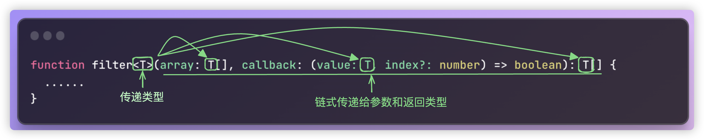
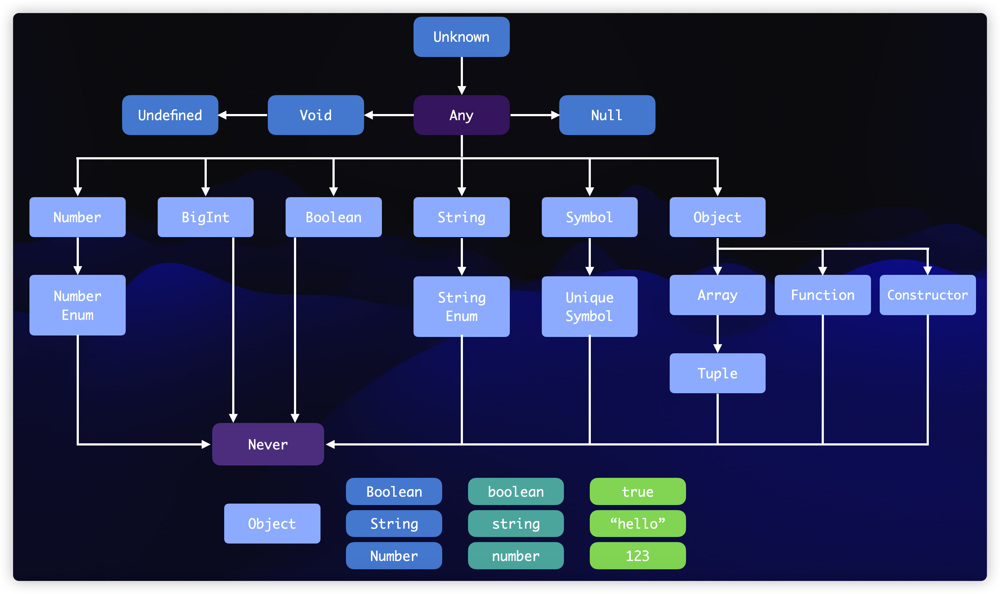

## 函数声明与调用

函数在前面章节已经广泛使用，其声明方式与 JavaScript 基本一致，区别在于 TypeScript 中需要显式地注解函数的参数

```typescript
function add(a: number, b: number): number {
    return a + b
}
```

函数的返回类型 TypeScript 可以自动推导，也可以显式地注解。

函数的声明方式与 JavaScript 一致，支持具名函数、函数表达式和箭头函数等多种形式

```typescript
function sayHello1(name: string) {
    return 'hello ' + name
}

const sayHello2 = function (name: string) {
    return 'hello ' + name
}

const sayHello3 = (name: string): string => {
    return 'hello ' + name
}

const sayHello4 = (name: string) => 'hello ' + name

const sayHello5 = (name: string) => {
    if (name === 'admin') {
        return 'hello admin'
    }
    return
}
```

在函数调用时，无需提供任何额外的类型信息，直接传入实参即可，TypeScript 将检查实参是否与函数的形参类型兼容

```typescript
const sum = add(1, 2)
```

返回结果的类型是确定的。

当缺少必要参数或参数类型不匹配时，TypeScript 将提示相应的错误

```typescript
const sum = add(1) //error 应有2个参数，但获得1个
const str = sayHello1(123) // error 类型"123"的参数不能赋给类型"string"的参数
```

### 可选参数与默认参数

同样可以使用可选符号`?`把参数标记为可选。

> 声明函数的参数时，必要的参数放在前面，然后才是可选参数

```typescript
function sendMessage(userId: number, message?: string) {
    console.log(userId, message || '')
}
sendMessage(1)
```

与在 JavaScript 中一样，可以为可选参数提供默认值，这样做在语义上与把参数标记为可选是一样的。

> 带默认值的参数调用时可以不用传入参数的值，并且带默认值的参数不要求一定要放在参数列表的末尾，可选参数是必须放在末尾。不过默认参数放在前面也没有任何意义，约定俗成都还是放在末尾。

```typescript
function sendMessage(userId: number, message = 'hello') {
    console.log(userId, message || '')
}
```

### 剩余参数

函数有时需要接受不定数量的参数，在传统的 JavaScript 中，可以使用 `arguments` 对象来处理此类情况

```typescript
function sum() {
    return Array.from(arguments).reduce((result, item) => result + item, 0)
}
sum(1, 2, 3, 4, 5) //error
```

使用 `arguments` 存在诸多限制，在现代 JavaScript 开发中已不被推荐，在 TypeScript 中更是如此。

1. `arguments` 是一个类数组对象，使用时需要转换为真正的数组才能使用数组方法
2. 调用时会提示函数不需要参数，但实际却传入了参数
3. 在 `reduce` 等函数的回调中，所有参数类型都被推导为 `any`

为确保类型安全，应当使用**剩余参数(rest parameter)**

```typescript
function sum(...numbers: number[]) {
    return numbers.reduce((result, item) => result + item, 0)
}
sum(1, 2, 3, 4, 5)
```

使用剩余参数可以解决上述所有问题：

1. 剩余参数是一个真正的数组，可以使用 TypeScript 定义具体的类型
2. 函数调用时会提供准确的类型提示
3. `reduce` 等回调函数中的参数都具有明确的类型

需要注意的是：

> 一个函数最多只能有一个剩余参数，而且必须位于参数列表的最后

### `this` 的类型注解

在 JavaScript 中，可能会写出下面的代码（可以在浏览器上测试）

```typescript
function showDate() {
    return `${this.getFullYear()}-${this.getMonth() + 1}-${this.getDate()}`
}
```

该函数中的 `this` 指向 `Date` 对象，因此调用时需要使用 `call` 方法绑定具体的 `Date` 实例

```typescript
function showDate() {
    return `${this.getFullYear()}-${this.getMonth() + 1}-${this.getDate()}`
}
showDate.call(new Date())
```

> 如果打开了`"strict":true`，默认也会开启`"noImplicitThis": true`，没有显示的指定 `this` 的类型也会提示错误，在一般的函数中，如果要使用 `this`，就必须显示的标注 `this` 的类型
>
> **注意**：`noImplicitThis` 不强制要求类和对象的函数必须要注解 `this`

这种写法存在安全隐患，因为无法确定 `showDate` 方法的正确调用方式。在 TypeScript 中，可以使用 `this` 的类型注解来确保传入正确的 `this` 对象

```typescript
function showDate(this: Date) {
    return `${this.getFullYear()}-${this.getMonth() + 1}-${this.getDate()}`
}
// showDate(); //error
showDate.call(new Date())
// showDate.call(null); // 如果"strictBindCallApply":false不会报错
```

> 如果函数使用 `this`，可以在函数的第一个参数中声明 `this` 类型(放在其他参数之前)，这样在调用函数的时候，TypeScript 将确保 `this` 是预期的类型
>
> `this`不是常规的参数，而是保留字，是函数签名的一部分

> `"strictBindCallApply": true` 开启这个配置选项能比较安全的调用 `.call` 、`.apply` 和 `.bind` ，会检查传入的参数是否和 `this` 匹配，当然 `strictBindCallApply` 配置也是属于 `strict` 家族的一员

## 调用签名

在讨论函数时，需要明确声明的函数具体属于什么类型。虽然可以使用 `Function` 类型，但这并不精确。

与对象类型类似，`object` 能描述所有对象，`function` 也可以描述所有函数，但都无法体现具体的类型信息

```typescript
function add(a: number, b: number) {
    return a + b
}
```

像上面这样的函数，可以用 TypeScript 进行描述

```typescript
;(a: number, b: number) => number
```

这是 TypeScript 表示函数类型的句法，也称为**调用签名**。

> 函数的调用签名只包含类型层面的代码，即只有类型，没有值。因此，函数的调用签名可以表示参数的类型、`this` 的类型、返回值的类型、剩余参数的类型和可选参数的类型，但是无法表示默认值（因为默认值是值，不是类型）。调用签名没有函数体，无法推导出返回类型，所以必须显式的注解
>
> 函数签名其实对写函数也有指导意义。

```typescript
type Greet = (name: string) => string
function greet(name: string) {
    return name
}

type Log = (userId: number, message?: string) => void
function log(userId: number, message = 'hello') {}

type SumFn = (...numbers: number[]) => number
function sumFn(...numbers: number[]): number {
    return numbers.reduce((total, n) => total + n, 0)
}
```

可以将调用签名和函数表达式结合起来

```typescript
type Log = (userId: number, message?: string) => void
const log: Log = (userId, message) => {
    console.log(userId, message)
}
```

将函数表达式注解为 `Log` 类型后，会发现，不必再此注解参数的类型，因为在定义 `Log` 类型的时候已经注解了 `message` 和 `userId` 的类型。TypeScript 能从 `Log` 中推导出来，同理，返回值类型其实也是一样（当然返回值类型本身就能帮助进行推导）

上面使用的都是类型别名，当然也能使用`interface`

```typescript
interface Log {
    (userId: number, message?: string): void
}

// type Log = (userId: number, message?: string) => void;
const log: Log = (userId, message) => {
    console.log(userId, message)
}
```

其实，如果已经有具体的函数了，完全可以通过 `typeof` 获取函数的类型声明

```typescript
function greet(name: string) {
    return name
}

function log(message: string, userId = 'xxx1') {}

function sumFn(...numbers: number[]): number {
    return numbers.reduce((total, n) => total + n, 0)
}

type Greet = typeof greet
type Log = typeof log
type SumFn = typeof sumFn
```

如果是有回调函数，一样添加回调函数相关声明就行了

```typescript
function handleData(data: string, callback: (err: Error | null, result: string) => void): void {
    // 模拟一些操作
    if (data === 'error') {
        callback(new Error('An error occurred'), '')
    } else {
        callback(null, `Processed data: ${data}`)
    }
}
```

当然可以将 `callback` 的声明再提取成一个类型别名

```typescript
// 注意：没有用模块化，类型别名的命名容易和全局变量冲突, 比如ErrorCallback
type ErrorCB = (err: Error | null, result: string) => void;

function handleData(data: string, callback:ErrorCB):void {
  ......
}
```

当然也能够将整个函数提取为类型别名或者接口，交给函数表达式处理：

```typescript
type ErrorCB = (err: Error | null, result: string) => void

type HandleData = (data: string, callback: ErrorCB) => void

const handleData: HandleData = (data, callback) => {
    // 模拟一些操作
    if (data === 'error') {
        callback(new Error('An error occurred'), '')
    } else {
        callback(null, `Processed data: ${data}`)
    }
}
```

当然了，也能使用 `typeof` 直接获取已有函数的类型声明：

```typescript
type HandleData = typeof handleData
```

在对象字面量类型中声明函数类型，和普通的函数类型声明没有什么差别：

```typescript
type User = {
    name: string
    id: number
    show: (name: string) => void
    info(id: number): string
}
```

## 上下文类型推导

直接将函数类型进行声明，TypeScript 能从上下文中推导出参数的类型。这是 TypeScript 类型推导的一个强大特性，一般称为**上下文类型推导**。

**上下文类型推导，在某些时候非常的有用，比如回调函数中**

```typescript
function times(fn: (index: number) => void, n: number) {
    for (let i = 0; i < n; i++) {
        fn(i)
    }
}

times((n: number) => console.log(n), 4)
```

上面的函数 `times` 的回调函数 `fn`，强调需要一个 `number` 类型的参数，并且没有返回类型。

当调用 `times` 函数时，当然需要传入这个一个回调函数 `(n:number) => console.log(n)`

按照正常情况，既然是一个函数，那么函数中传递的参数，就应该声明类型。

但是，这里其实可以省略，直接简写为:

```typescript
times(n => console.log(n), 4)
```

因为 TypeScript 能从上下文推导出 `n` 是一个数字，因为在 `times` 的签名中，声明回调函数 `f` 的参数 `index` 是一个数字。那么 TypeScript 就能推导出，下面传入的回调函数中的参数 `n`，就是那个参数，该参数的类型必然应该是 `number` 类型

但是，也有需要注意的地方：

> 如果回调函数的声明不是在行内直接声明，那么 TypeScript 无法推导出它的类型

```typescript
const fn = n => console.log(n) // error 参数n隐式具有"any"类型
times(fn, 4)
```

这个错误当然也很好理解，外部直接声明的 `fn` 相当于是一个全新的函数了，在声明的时候和 `times` 函数是没有任何关联的，当然不可能进行上下文类型推导

## 重载

在某些逻辑较复杂的情况下，函数可能有多组入参类型和返回值类型.

比如有这样简单的需求：函数有两个参数，要求两个参数如果都是 `number` 类型，那么就做乘法操作，返回计算结果，如果两个参数都是字符串，就做字符串拼接，并返回字符串拼接结果。其他情况直接抛出异常：参数类型必须相同

> 首先，**很多初学者的直观想法是，直接声明两个不同的函数不就完了**。
>
> 首先这种做法不是要讲的这个概念。另外，其实做的事情是一样的，比如 `console.log()` 函数，可以传递 `number`，`string`，`boolean` 甚至对象，都能实现打印，但是使用用到的都是一个`console.log()` 函数，如果不同的参数，对应不同的函数名，那这样对于使用者来说，是极大的心智负担。

基于这种需求，可能会编写如下代码：

```typescript
function combine(a: number | string, b: number | string) {
    if (typeof a === 'number' && typeof b === 'number') {
        return a * b
    } else if (typeof a === 'string' && typeof b === 'string') {
        return a + b
    }
    throw new Error('must be of the same type')
}

const result = combine(2, 3)
```

**此代码表面上看似合理，但实际存在诸多问题。**

**首先，这样的代码未能发挥类型约束的作用**。类型系统的目的是在编译期间检测错误，避免运行时错误。该代码存在以下问题：

1. 参数可以输 `number` 也可以输入 `string`，并没有在编译时就给出提示不能输入不同类型的参数
2. 返回值类型并不固定，两个参数是 `number`，那么返回的类型，就应该一定是 `number`，但是现在返回的是 `string | number`

**其次，这涉及到静态类型语言的基本原则**：在多数静态语言中，一旦指定了特定的参数和返回类型，就只能使用相应的参数调用函数，且返回值类型保持一致。习惯了 JavaScript 的动态性，可能认为上述写法合理，毕竟有类型限定和函数推导。

然而，在多数静态语言中，上述写法并不成立。参数类型必须明确（数值或字符串），不存在类型推导，函数返回值类型也必须明确指定，如**以下伪代码**所示：

```typescript
function combine(a: number, b: number): number {
    return a * b
}
function combine(a: string, b: string): string {
    return a + b
}
```

在函数声明时确定类型，避免了运行时判断的复杂性。

因此，TypeScript 相比其他静态编程语言，保持了一定的动态性，函数的输出类型依赖于输入类型的推导。这既可以理解为 TypeScript 的类型系统更为先进，也可以视为兼容 JavaScript 动态特性的必要妥协。

针对上述问题，可以使用**函数重载签名（Overload Signature）**来解决

```typescript
function combine(a: number, b: number): number
function combine(a: string, b: string): string
function combine(a: number | string, b: number | string) {
    if (typeof a === 'number' && typeof b === 'number') {
        return a * b
    } else if (typeof a === 'string' && typeof b === 'string') {
        return a + b
    }
    throw new Error('must be of the same type')
}

const result = combine(2, 3)
```

这里的三个 `function combine` 其实具有不同的意义：

-   `function combine(a: number, b: number): number;`，**重载签名一**，传入 `a` 和 `b` 的值为 `number` 时，函数返回值类型为 `number` 。
-   `function combine(a: string, b: string): string;`，**重载签名二**，传入 `a` 和 `b` 的值为 `string` 时，函数返回值类型为 `string` 。
-   `function combine(a: number | string, b: number | string)`，**函数的实现签名**，会包含重载签名的所有可能情况

> 注意：重载签名和实现签名必须放在一起，中间不能插入其他的内容

继续看下面的例子，根据函数传递的参数，如果传入 `string` 类型，就转换为 10 进制的 `number` 类型，如果传入的是 `number` 类型或者其他类型，就调用 `toString()` 转换为 `string` 类型

```typescript
function changeType(x: string | number): number | string {
    return typeof x === 'string' ? parseInt(x, 10) : x.toString()
}
changeType('1')
```

这样写代码依然和之前的问题一样，不能在编译时提供帮助，因此加上**重载签名**

```typescript
function changeType(x: string): number
function changeType(x: number): string
function changeType(x: string | number): number | string {
    return typeof x === 'string' ? parseInt(x, 10) : x.toString()
}
changeType('2')
```

不过在声明重载的时候，还是有一些细节需要注意，比如，模拟 DOM API 中 `createElement` 函数的处理，这个函数大家都用过，参数传递具体的标签名字符串，就帮助创建对应的 HTML 元素

```typescript
function createElement(tag: 'a'): HTMLAnchorElement
function createElement(tag: 'canvas'): HTMLCanvasElement
function createElement(tag: 'table'): HTMLTableElement
function createElement(tag: string): HTMLElement {
    return document.createElement(tag)
}

const a = createElement('a') // ok
const b = createElement('b') // error
```

由于重载签名只有 `a | canvas | table` 的情况，因此，如果调用函数的时候，传入不是这三个类型的字符串就会报错，其实可以**再加入一个兜底的重载签名**，如果用户传入自定义标签名，或者一些前沿性的标签名，直接返回一般性的 `HTMLElement`

```diff
function createElement(tag: "a"): HTMLAnchorElement;
function createElement(tag: "canvas"): HTMLCanvasElement;
function createElement(tag: "table"): HTMLTableElement;
+function createElement(tag: string): HTMLElement;
function createElement(tag: string): HTMLElement {
  return document.createElement(tag);
}

const a = createElement("a");
```

需要注意的是：**拥有多个重载声明的函数在被调用时，是按照重载的声明顺序往下查找的**，简单来说，特殊的子类型，比如类型字面量等应该放在上面，**兜底的类型，应该放在最后**，如果将兜底的类型放在最上面，无论如何，函数签名找到的都是第一个

> 实际上，TypeScript 中的重载是**伪重载**，它只有**一个具体实现**，其**重载体现在方法调用的签名上而非具体实现上**。而在如 Java 等语言中，**重载体现在多个名称一致但入参不同的函数实现上**，这才是**更广义上的函数重载**。

## 理解泛型

在掌握了前述内容后，现在面临一个看似简单的需求：用 TypeScript 封装一个函数，传入任意类型的参数，并返回相同类型的值。

对于 JavaScript 而言，这个需求实现起来非常简单

```javascript
function identity(value) {
    return value
}
const identity = value => value
```

但在 TypeScript 中，这个需求变得复杂：参数需要类型约束，返回类型应与参数类型一致。

如果尝试指定具体类型，如`number`或`string`：

```typescript
function identity(value: number) {
    return value
}
```

这样做会将类型限制得过于严格，只能接受特定类型的参数。

为了支持任意类型，可能会考虑使用`any`：

```typescript
function identity(value: any) {
    return value
}

const s = identity('hello')
```

但使用`any`与直接编写 JavaScript 代码无异，这完全丧失了类型检查的价值。即使代码不再报错，**最终得到的变量类型仍然是未知的**，无法享受到 IDE 的类型提示和类型安全保障。这违背了使用 TypeScript 的初衷。

此时可能会想到前面介绍的**函数重载**：

```typescript
function identity(value: number): number
function identity(value: string): string
function identity(value: boolean): boolean
function identity(value: number | string | boolean): number | string | boolean {
    return value
}

const s = identity('aaa')
```

这种写法看起来可行，但仅涵盖了 3 个基本类型。如果需要支持不同类型的数组，就需要继续添加更多重载声明

```typescript
function identity(value: number): number
function identity(value: string): string
function identity(value: boolean): boolean
function identity(value: number[]): number[]
function identity(value: string[]): string[]
function identity(
    value: number | string | boolean | number[] | string[]
): number | string | boolean | number[] | string[] {
    return value
}

const s1 = identity([1, 2, 3, 4])
const s2 = identity(['a', 'b', 'c', 'd'])
```

而当涉及到对象类型时，情况变得更加复杂：

```diff
function identity(value: number):number;
function identity(value: string):string;
function identity(value: boolean): boolean;
function identity(value: number[]): number[];
function identity(value: string[]): string[];
+function identity(value: object): object;
+function identity(value: number | string | boolean | number[] | string[] | object): number | string | boolean | number[] | string[] | object{
+  return value;
+}

const s1 = identity([1,2,3,4]);
const s2 = identity(["a","b","c","d"]);
+const s3 = identity({ id: 1, name: "aaa" });
+console.log(s3.name) // error 类型"object"上不存在属性"name"
```

对象类型 `object` 会报错，为什么？这在之前就解释过，`object` 仅仅表示对象而已，并不知道对象里面具体有什么，那就只能使用对象字面量...那这就完全没戏了。谁知道对象字面量里面有多少的内容呢?

那么这里好像就没有更好的办法可以解决了？

如果能利用 TypeScript 的自动推导的功能，**不确定当前用什么类型，当用到什么类型的参数的时候，根据传给的类型进行推导，只要在代码用到了推导的类型，那么就都是这个类型**，这就是要讲的泛型

```typescript
function identity<T>(value: T): T {
    return value
}
```

在函数名后，使用尖括号 `<>` 来声明泛型 `T` ，表示传递的泛型的类型，可以将其先理解为一种占位符号。后面凡是出现一样的这个符号 `T` ，那就表示是一样的类型。

本质上 `T` 其实和写的 `number`，`string` 等等是一个意思。当调用时：

```typescript
function identity<T>(value: T): T {
    return value
}

type User = {
    id: number
    name: string
}

const s1 = identity<number>(1)
const s2 = identity<string>('a')
const s3 = identity<User>({id: 1, name: 'aaa'})
console.log(s3.name) // ok
```

当调用的时候，TypeScript 其实可以根据传入的参数自动推导泛型的类型，所以，调用的时候，前面的 `<>` 是可以省略的。

```typescript
const s1 = identity(1)
const s2 = identity('a')
const s3 = identity({id: 1, name: 'aaa'})
console.log(s3.name) // ok
```

那为什么是`T`？

> `T`就是一个类型名称，如果愿意，可以使用任意的其他字母名称，例如，`A`，`B`，`C` 等等。
>
> 按照惯例，经常使用单个大写字母，从 `T` 开始，依次使用 `U`，`V`，`W` 等。
>
> 就算是多个单词 `Abb`，`Acc` 也没有问题，因为**泛型字母就表示一个占位符，类型检查器将根据上下文填充具体的类型**。
>
> 不过一般 `T`，`E`，`K`，`V`，`U` 等字母用的比较多而已

以下是另一个示例：

```typescript
function getTuple<T>(a: T, b: T) {
    return [a, b]
}
const as = getTuple<string>('hello', 'world')
```

考虑以下代码示例：

```typescript
function myNumberFilter(arr: number[], callback: (item: number, index?: number) => boolean): number[] {
    const result = []
    for (let i = 0; i < arr.length; i++) {
        const item = arr[i]
        if (callback(item)) {
            result.push(item)
        }
    }
    return result
}
const filterArr1 = myNumberFilter([1, 2, 3, 4, 5], item => item % 2 === 0)
console.log(filterArr1)

function filter<T>(arr: T[], callback: (item: T, index?: number) => boolean): T[] {
    const result = []
    for (let i = 0; i < arr.length; i++) {
        const item = arr[i]
        if (callback(item)) {
            result.push(item)
        }
    }
    return result
}

const filterArr2 = filter(['xxx.js', 'aaa.java', 'bbb.md'], item => item.endsWith('.js'))
console.log(filterArr2)
```

编译后可以观察到，`myNumberFilter` 和 `filter` 这两个函数的内部逻辑完全相同。

这进一步验证了类型系统与逻辑分离的原则：编译时的类型变化不会影响运行时的逻辑。

然而，泛型使函数在编译时具有更强的通用性，相比接受具体类型的函数更为强大。

**泛型可以理解为一种约束。**

当将函数参数注解为 `fn(n:number)` 时，参数 `n` 的值被约束为 `number` 类型。

同样，泛型 `T` 将 `T` 所在位置的类型约束为 `T` 所绑定的类型



上述示例采用函数声明的写法，函数表达式的写法同样适用：

```typescript
const filter = <T>(array: T[], callback: (value: T, index?: number) => boolean): T[] => {
	......
}
```

由于泛型具有极高的实用性，因此在数组、对象、类型别名以及后续介绍的类和接口中都可以使用泛型。

应当尽可能使用泛型，这样编写的代码具有更好的通用性、可重用性和简洁性

## 类型别名与接口使用泛型

数组、类型别名、类和接口中都支持泛型的使用。

数组中使用泛型：

```typescript
function unique<T>(array: Array<T>): T[] {
    return Array.from(new Set(array))
}

const arr1: number[] = [1, 2, 2, 3, 4, 4]
const arr2: Array<string> = ['a', 'b', 'b', 'c', 'd', 'a']

const arr3 = unique(arr1)
const arr4 = unique(arr2)
console.log(arr3)
console.log(arr4)
```

类型别名中同样支持泛型，通常称为泛型别名。

例如，在处理后端数据返回时，响应通常包含 `code`、`message` 和 `data` 字段。虽然 `code` 和 `message` 的类型相对固定，但 `data` 的具体内容是不确定的。为了将返回内容封装为类型别名，需要使用泛型

```typescript
type ResultData<T> = {
    message: string
    code: number
    data: T
}

type User = {
    id: number
    name: string
    tel: string
    address?: string
}

type UserData = ResultData<User>
```

泛型别名之间可以相互引用，函数中也可以使用泛型别名

```typescript
type MyEvent<T> = {
    target: T
    type: string
}

type TimedEvent<T> = {
    event: MyEvent<T>
    from: Date
    to: Date
}

const myEvent: MyEvent<HTMLButtonElement | null> = {
    target: document.querySelector('#btn'),
    type: 'click'
}

const timedEvent: TimedEvent<HTMLElement | null> = {
    event: {
        target: document.querySelector('#div'),
        type: 'click'
    },
    from: new Date(),
    to: new Date()
}

function triggerEvent<T>(event: MyEvent<T>): void {
    // ...
}
triggerEvent({
    target: document.querySelector('#layer'),
    type: 'click'
})
```

接口中使用泛型与类型别名的方式基本相同。上述代码可以直接将类型别名改为接口形式：

```typescript
interface MyEvent<T> {
    target: T
    type: string
}

interface TimedEvent<T> {
    event: MyEvent<T>
    from: Date
    to: Date
}
```

泛型别名还可以为 TypeScript 开发带来便利。例如，在 `strict` 模式下，不能将已固定类型的变量赋值为 `null`。如果习惯了在 JavaScript 中将某些值初始化为 `null`，这种限制可能会带来不便

```typescript
type Nullable<T> = T | null | undefined

const str: Nullable<string> = null

type User = {
    id: number
    name: string
    tel: string
    address?: string
}

let user: Nullable<User> = null
user = {
    id: 1,
    name: 'aaa',
    tel: '123456'
}
```

函数的调用签名中也可以使用泛型，这实际上是创建特定函数的类型别名。例如，前面的 `filter` 函数可以用调用签名进行约束

```typescript
function filter<T>(arr: T[], callback: (item: T, index?: number) => boolean): T[] {
    const result = []
    for (let i = 0; i < arr.length; i++) {
        const item = arr[i]
        if (callback(item)) {
            result.push(item)
        }
    }
    return result
}
const filterArr2 = filter(['xxx.js', 'aaa.java', 'bbb.md'], item => item.endsWith('.js'))
console.log(filterArr2)
```

上述示例使用函数声明的方式实现。

```typescript
type Filter<T> = (arr: T[], callback: (item: T, index?: number) => boolean) => T[]
```

现在将其改写为调用签名，用于约束函数的类型。在具体实现函数时，需要传递具体的类型参数

```typescript
type Filter<T> = (arr: T[], callback: (item: T, index?: number) => boolean) => T[]

const myFilter: Filter<number> = (arr, callback) => {
    const result = []
    for (let i = 0; i < arr.length; i++) {
        const item = arr[i]
        if (callback(item)) {
            result.push(item)
        }
    }
    return result
}
```

不要混淆类型操作

```typescript
// add
// function add<T>(a: T, b: T) {
//   return a + b; // 加号需要有特定类型才能操作
// }

type Add<T> = (a: T, b: T) => T

const add: Add<string> = (a, b) => a + b
```

## 多泛型

考虑一个简单问题：创建一个通用的交换函数，它接受一个包含两个元素的数组，并返回元素交换位置后的数组

```typescript
function swap<T, U>(pair: [T, U]): [U, T] {
    return [pair[1], pair[0]]
}
const result1 = swap([2, 'a'])
const result2 = swap(['hello', {text: 'world'}])
console.log(result1, result2)
```

考虑另一个需求：封装一个类似于数组 `map` 方法的函数。该函数接受一个数组和一个回调函数，根据回调函数的处理逻辑生成一个新数组，新数组的类型可能与原数组相同，也可能不同

```typescript
// 原生map演示
const arr = [1, 2, 3, 4, 5]
const newArr1 = arr.map(e => e * 2)
const newArr2 = arr.map(e => `<div>index${e}</div>`)

console.log(newArr2)
```

首先实现一个基础的 `map` 函数：

```typescript
const arr = [1, 2, 3, 4, 5]
function map(arr, callback) {
    const result = []
    for (let i = 0; i < arr.length; i++) {
        const item = arr[i]
        result.push(callback(item, i))
    }
    return result
}
const t1 = map(arr, e => e * 2)
const t2 = map(arr, e => `<div>index${e}</div>`)
console.log(t1)
console.log(t2)
```

可以使用多个泛型参数：

**使用 `T` 表示输入数组中元素的类型，使用 `U` 表示输出数组中元素的类型。**

**该 `map` 函数接受一个 `T` 类型的数组和一个将 `T` 映射为 `U` 的函数，最终返回一个 `U` 类型的数组**

```typescript
const arr = [1, 2, 3, 4, 5]
function map<T, U>(arr: T[], callback: (e: T, i?: number) => U): U[] {
    const result = []
    for (let i = 0; i < arr.length; i++) {
        const item = arr[i]
        result.push(callback(item, i))
    }
    return result
}
const t1 = map<number, number>(arr, e => e * 2)
const t2 = map<number, string>(arr, e => `<div>index${e}</div>`)
```

与单个泛型的情况相同，调用时可以让 TypeScript 自动进行类型推导

```typescript
const t1 = map(arr, e => e * 2)
const t2 = map(arr, e => `<div>index${e}</div>`)
```

**需要注意**：要么让 TypeScript 自动推导，要么显式指定所有泛型参数，不能只指定部分参数。即使两个泛型都是 `number` 类型，也不能认为只指定一个参数就足够了。以下写法是错误的：

```typescript
const t1 = map<number>(arr, e => e * 2) // error 应该有2个类型参数，但只获得了1个
```

## 泛型的默认类型

泛型的默认类型是编程语言中的一种特性，允许在定义泛型时为其指定默认类型。当使用泛型时未明确指定类型参数时，将自动使用默认类型。

```typescript
function createArray<T = number>(length: number, value: T): T[] {
    return new Array(length).fill(value)
}

// 使用默认的泛型类型number
let numbers = createArray(3, 1) // 类型推断为number[]
```

直接为函数指定默认类型的意义有限，因为函数本身具有自动类型推导的能力。

```typescript
type A<T = string> = {
    value: T
}

// 使用默认泛型类型
let str: A = {value: 'Hello'} // T默认为string

// 明确指定泛型类型为number
let num: A<number> = {value: 123} // 明确指定T为number
```

以前面的示例为例：

```typescript
type MyEvent<T> = {
    target: T
    type: string
}
const myEvent: MyEvent<HTMLButtonElement | null> = {
    target: document.querySelector('#btn'),
    type: 'click'
}
```

前面声明的泛型别名在使用时需要指定泛型的类型。如果大部分 `target` 都是同一类型，可以像函数的默认参数一样，为泛型设置默认类型

```typescript
type MyEvent<T = HTMLElement | null> = {
    target: T
    type: string
}
const myEvent: MyEvent = {
    target: document.querySelector('#myButton'),
    type: 'click'
}
```

## 受限的泛型

泛型确实为类型定义带来了便利，但有时约束力不够，过于宽泛。例如，某些场景下需要一个泛型`T`，但该泛型只能是对象类型，不能是基本类型。甚至可能需要该泛型具备特定的属性，如`length`或`value`。因此，需要**为泛型设置上限约束**

在 ES6 中，`extends` 关键字用于实现类的继承，表示某个类是另一个类的子类。**TypeScript 借用了这一概念，使用 `extends` 表达类型之间的兼容性关系，从而实现对泛型范围的约束**

```typescript
function getObj<T extends object>(obj: T) {
    return obj
}

getObj({id: 1, name: 'aaa'})

type ObjLength = {
    length: number
}

function getObjLength<T extends ObjLength>(obj: T) {
    return obj
}

getObjLength({id: 1, name: 'aaa', length: 2})
getObjLength('aaa')
getObjLength([1, 2, 3, 4, 5])
getObjLength({id: 1, name: 'aaa'}) // error
```

对于多个泛型的情况，同样可以应用约束：

```typescript
type ObjLength = {
    length: number
}
// 比较长度
// a > b  大于0
// a < b  小于0
// a = b  等于0
function compareLength<T extends ObjLength, U extends ObjLength>(a: T, b: U) {
    return a.length - b.length
}

const result = compareLength([1, 2, 3, 4, 5], 'abc')
console.log(result)
```

同样，可以将 `extends` 应用于对象字面量类型，`extends` 本身就表示继承关系：

```typescript
type TreeNode = {
    value: string
}
type LeafNode = TreeNode & {
    isLeaf: true
}
type InnerNode = TreeNode & {
    children: TreeNode[]
}
const a: TreeNode = {value: 'a'}
const b: LeafNode = {value: 'b', isLeaf: true}
const c: LeafNode = {value: 'c', isLeaf: true}
const d: InnerNode = {value: 'e', children: [b, c]}

function mapNode<T extends TreeNode>(node: T, f: (value: string) => string): T {
    return {
        ...node,
        value: f(node.value)
    }
}

const a1 = mapNode(a, v => v.toUpperCase())
const b1 = mapNode(b, v => v.toUpperCase())
const c1 = mapNode(c, v => v.toUpperCase())
const d1 = mapNode(d, v => v.toUpperCase())

console.log(a1)
console.log(b1)
console.log(c1)
console.log(d1)
```

如果上述`mapNode`函数不加以限制，`T` 的类型无法确定`node:T`中 `node` 是否具有 `value` 属性。加以限制后，就可以安全地在函数中使用对象 `node` 的 `value` 属性。**这实际上是对类型的细化，也可以称为类型守卫**

有时候需要写一个类型，比如`Message`，`Message` 可以接受一个泛型，其主要作用是从泛型上读取泛型的 `message` 属性的类型。可能会这么写：

```typescript
type Message<T> = T['message'] // error 类型""message""无法用于索引类型"T"
```

因为泛型`T`无法确定`message`属性的存在，**此时可以使用泛型约束**

```typescript
type Message<T extends {message: unknown}> = T['message']

const person = {
    id: 1,
    message: 'hello'
}

type PersonMessage = Message<typeof person> // string
```

## 元组的类型推导

TypeScript 在推导元组类型时会放宽要求，推导结果尽可能宽泛，不考虑元组的长度和各位置的具体类型，通常直接推导为数组类型

```typescript
const a = [1, true] // (number | boolean)[]
```

然而有时需要更严格的推导结果，将上述示例中的变量 `a` 视为固定长度的元组而非数组。

可以使用类型断言`as const`，将元组标记为只读元组类型

```typescript
const a = [1, true] as const // readonly [1, true]
```

除了使用`as const`断言外，还可以利用 TypeScript 推导剩余参数类型的特性。

如果仅按以下方式编写：

```typescript
function tuple<T>(...ts: T[]) {
    return ts
}

const t = tuple(1, 2, 3, 4) //number[]
```

得到的仍然是 `number` 类型的数组，但如果按以下方式编写：

```typescript
function tuple<T extends unknown[]>(...ts: T) {
    return ts
}
```

该函数就可以完全替代声明元组的写法`const tuple = [1, true];`

**泛型约束(`T extends unknown[]`)**: 这里`T`被约束为一个扩展自`unknown[]`的类型。这意味着`T`可以是`unknown[]`的任何子类型，包括元组类型。

**剩余参数(`...ts: T`)**: 当使用`...`操作符作为函数参数时，它在运行时表现为一个数组，但在类型层面，TypeScript 能够保留传递给函数的参数类型的精确性，这包括元素的类型和数量。因此，尽管`ts`在函数体内部被当作一个数组处理，TypeScript 编译器仍然能够将其识别为`T`类型，这里的`T`是调用函数时根据传入参数推导出的具体元组类型

这意味着使用`tuple`函数时，TypeScript 编译器会根据传入的具体参数推导`T`的具体类型，该类型是一个元组类型，而非宽泛的数组类型

```typescript
const myTuple1 = tuple(1, 'hello', true) // 推导为元组类型 [number, string, boolean]
const myTuple2 = tuple(...['资料管理员', '权限管理员', '经理']) // [string, string, string]
```

## 类型理解再升级-型变

先看以下示例：

```typescript
type User = {
    id?: number
    name: string
}
type Animal = {
    id?: number
    name: string
}
type AdminUser = {
    id?: number
    name: string
    role: string
}

function deleteUser(user: User) {
    console.log(user)
}

const a1: Animal = {
    id: 1,
    name: 'animal1'
}

const u1: AdminUser = {
    id: 2,
    name: 'user2',
    role: 'admin'
}

deleteUser(a1) // OK? Error?
deleteUser(u1) // OK? Error?
```

> 答案：
>
> deleteUser(a1); 正确
>
> deleteUser(u1); 正确

### 结构化类型系统

TypeScript 的类型系统特性：**结构化类型系统**。TypeScript 比较两个类型并非通过类型的名称，而是比较这两个类型上实际拥有的属性与方法。`User` 与 `Animal` 类型上是一致的，所以它们虽然是两个名字不同的类型，但仍然被视为结构一致，这就是结构化类型系统的特性。可能听过结构类型的别称**鸭子类型（Duck Typing）**，这个名字来源于**鸭子测试（Duck Test）**。其核心理念是，**如果看到一只鸟走起来像鸭子，游泳像鸭子，叫得也像鸭子，那么这只鸟就是鸭子**。

因此：`deleteUser(a1);`正确

`deleteUser(u1);`为什么也是正确的？

在很多类型系统中，都有子类型与超(父)类型的概念。当然了在 Java，C# 这种后端名义型类型系统中子类型和父类型很容易区分，他们必须要`extends`，`implements`关键字。

但是在 TypeScript 中，是通过结构进行区分的，不一定强制需要`extends`，`implements`关键字标注父子关系。比如上面的`User`和`AdminUser`。

明明`u1`多了一个属性`role`，这是因为，**结构化类型系统**认为 `AdminUser` 类型完全实现了 `User` 类型。至于额外的属性 `role`，可以认为是 `AdminUser` 类型继承 `User` 类型后添加的新属性，即此时 `AdminUser` 类型可以被认为是 `User` 类型的子类型。

### 协变

在很多类型系统中，都有**型变**的概念，也就是类型变化的意思，在型变的系统中，

子类型可以赋值给父类型，叫做**协变**

父类型可以赋值给子类型，叫做**逆变**

之前的基础类型，一直在强调类型兼容性的问题，不同的类型当然没有兼容性可言，要谈兼容性，至少需要父子关系。至于所谓父子关系的兼容性，一般都具有下面的含义：

> 给定两个类型 `A` 和 `B`，假设 `B` 是 `A` 的子类型，那么在需要 `A` 的地方都可以放心使用 `B`



从上图中可以看出：

-   `Array` 是 `Object` 的子类型，需要 `Object` 的地方都可以使用 `Array`
-   `Tuple` 是 `Array` 的子类型，需要 `Array` 的地方都可以使用 `Tuple`
-   所有类型都是 `any` 的子类型，需要 `any` 的地方，任何类型都能用
-   `never` 是所有类型的子类型。
-   字面量类型是对应基础类型的子类型，需要基础类型的地方都能使用字面量类型

对于**结构化类型，主要的型变方式就是协变**。因此，

-   `AdminUser` 是 `User` 的子类型，那么需要 `User` 的地方，就都可以使用 `AdminUser`

`deleteUser(u1);` 是正确的，不会报错。

不过这仅仅是协变的基础形态，因为对于结构比较复杂对象来说，每一个具体的属性，都有可能还是比较复杂的形态。

```typescript
type ExistUser = {
    id: number
    name: string
}
type LegacyUser = {
    id?: number | string
    name: string
}

const u2: ExistUser = {
    id: 1,
    name: 'user1'
}

const u3: LegacyUser = {
    id: 3,
    name: 'user3'
}

deleteUser(u2) // OK? Error?
deleteUser(u3) // OK? Error?
```

新加了两种类型，注意和之前`User`类型的区别主要在`id`这个属性上

```typescript
User       ---> id ---> number | undefined

ExistUser  ---> id ---> number

LegacyUser ---> id ---> number | string | undefined
```

也就是说，每个类型的 `id` 属性的类型是不一样的，这里是联合类型，联合类型也有子类型和父类型的兼容关系。联合类型的父子关系的区分和基础类型是一样的。简单来说，**越具体的，越形象化的，就是子类型**

> `hello` 字面量类型 比 `string` 类型 更具体，那么`hello`字面量类型就是 `string` 类型的子类型
>
> `[number, number]`元组类型比数组类型更具体，那么元组类型就是数组类型的子类型
>
> `a | b` 联合类型 比 `a | b | c` 联合类型更具体，那么 `a | b` 就是 `a | b | c` 的子类型
>
> 当然，如果不能理解上面为啥 `a | b` 就是 `a | b | c` 的子类型，可以这么想，去市场买水果，买 `梨子 | 苹果` 肯定比买 `梨子 | 苹果 | 西瓜` 更具体

因此，就`id`这一个属性来说：

```typescript
ExistUser < User < LegacyUser
```

由于另外一个属性是一样的，所以：

```typescript
ExistUser < User < LegacyUser
```

那么就可以得出结论

```typescript
deleteUser(u2); 正确

deleteUser(u3);

错误  `id`类型不兼容，不能将`number | string | undefined`赋值给`number | undefined`
不能把父类型赋值给子类型
```

**TypeScript 对于结构（对象和类）的属性类型进行了协变**，也就是说，**如果想保证 `A` 对象可赋值给 `B` 对象，那么 `A` 对象的每个属性都必须是 `B` 对象对应属性的子类型**。

**如果 `A` 是 `B` 的子类型，那么可以说由 `A` 组成的复合类型（例如数组和泛型）也是 `B` 组成相应复合类型的子类型**

```typescript
type Pet = {
    name: string
}

type Dog = Pet & {
    breed: string
}

const dogs: Dog[] = [
    {
        name: 'Max',
        breed: 'Labrador'
    },
    {
        name: 'Rusty',
        breed: 'Dalmatian'
    }
]

const pets: Pet[] = dogs

type Arrs<T> = {
    arr: T[]
}

const arrs1: Arrs<Dog> = {
    arr: dogs
}
const arrs2: Arrs<Pet> = arrs1
```

### 多余属性检查

正是由于有协变这个特性，有时候又会给写代码增加一些困惑。

```typescript
let u4: User = {
    id: 1,
    name: 'user3',
    role: 'admin' // role 不在User类型中
}

let u5 = u1
```

如果是函数中也是一样：

```typescript
deleteUser(u1) // 正确
deleteUser({id: 2, name: 'user2', role: 'admin'}) // 错误
```

由于协变的存在，可以将`AdminUser`类型的 `u1` 对象视为`User`类型的子类型，因此可以进行赋值。

但在直接赋值时，如果包含多余属性会提示错误。这是合理的，因为已经标注为`User`类型，却包含其他属性，TypeScript 理应提示错误。这种与标注类型不匹配的检查称为**多余属性检查**。

**当将字面量直接赋值给变量、方法参数或构造函数参数时，就会触发多余属性检查**

即使直接赋值字面量对象，如果能确定其类型，也可以使用类型断言来处理：

```typescript
deleteUser({id: 2, name: 'user2', role: 'admin'} as User)
```

## class 也是结构化类型

回顾前面介绍的协变内容：

```typescript
type Animal = {
    eat(): void
}
type Pet = Animal & {
    run(): void
}
type Dog = Pet & {
    bark(): void
}
```

`Animal`、`Pet` 和 `Dog` 明显具有逐层的继承关系

```typescript
let a: Animal = {
    eat() {
        console.log('eat')
    }
}

let p: Pet = {
    eat() {
        console.log('eat')
    },
    run() {
        console.log('run')
    }
}

let d: Dog = {
    eat() {
        console.log('eat')
    },
    run() {
        console.log('run')
    },
    bark() {
        console.log('bark')
    }
}

function feed(pet: Pet) {
    pet.run()
    return pet
}

feed(a) // Error
feed(p)
feed(d)
```

使用 `class` 类的情况也相同，类的基本使用与 JavaScript 一致，父子层级关系也保持一致。关于类型的相关问题将在后续章节详细说明

```typescript
class Animal {
    eat() {
        console.log('eat')
    }
}

class Pet extends Animal {
    run() {
        console.log('run')
    }
}

class Dog extends Pet {
    bark() {
        console.log('bark')
    }
}

let a = new Animal()
let p = new Pet()
let d = new Dog()

function feed(pet: Pet) {
    pet.run()
    return pet
}

feed(a) // Error
feed(p)
feed(d)
```

无论如何，协变的相关内容与前面保持一致，因为**`class` 类也是结构化类型**，子类型的值可以传递到需要父类型的地方。

## 逆变

但对于函数的情况如何呢？

```typescript
function clone(f: (p: Pet) => Pet): void {
    // ...
}
```

现在定义不同的函数：

```typescript
function petToPet(p: Pet): Pet {
    return new Pet()
}

function petToDog(p: Pet): Dog {
    return new Dog()
}

function petToAnimal(p: Pet): Animal {
    return new Animal()
}
```

将这些函数传递给`clone`函数：

```typescript
clone(petToPet)
clone(petToDog)
clone(petToAnimal) // error "类型"(p: Pet) => Animal"的参数不能赋给类型"(p: Pet) => Pet"的参数
```

`petToDog`可以正常传递，但 `petToAnimal` 却报错了。原因可以通过伪代码来分析：

```typescript
function clone(f: (p: Pet) => Pet): void {
    // 伪代码
    let parent = new Pet()
    let child = f(parent)
    child.run() // 不安全
}
```

如果传给`clone`函数的`f`返回的是`Animal`，就无法调用`.run`方法。因此在编译时，TypeScript 会确保传入的函数至少返回一个`Pet`。

由此可以得出：**当函数的其他特征保持一致时，如果一个函数的返回类型是另一个函数返回类型的子类型，那么函数的返回类型是协变的**

那么函数的参数类型呢？

```typescript
function petToPet(p: Pet): Pet {
    return new Pet()
}
function animalToPet(a: Animal): Pet {
    return new Pet()
}
function dogToPet(d: Dog): Pet {
    return new Pet()
}
```

将这些函数传递给`clone`：

```typescript
clone(petToPet)
clone(animalToPet)
clone(dogToPet) // Error "类型"(d: Dog) => Pet"的参数不能赋给类型"(p: Pet) => Pet"的参数
```

`animalToPet` 可以正常传递，但 `dogToPet` 却报错了，同样可以通过伪代码分析：

```typescript
function dogToPet(d: Dog): Pet {
    d.bark() // 调用子类型的特有函数
    return new Pet()
}
```

现在将 `dogToPet` 传递给 `clone`，如果 `clone` 函数中传入的是 `Pet` 实例，这就是不安全的。因为 `.bark()` 方法只在 `Dog` 中定义，并非所有的 `Pet` 都具有此方法。

因此可以得出：**当函数的参数个数一致时，函数的参数是逆变的，即函数参数的父类型可以赋值给子类型**

总结而言，**在不考虑 `this` 的情况下，满足以下条件时，可以认为函数 `A` 是函数 `B` 的子类型**

1、函数 `A` 的参数数量小于或等于函数 `B` 的参数数量

2、函数 `A` 的返回类型是函数 `B` 返回类型的子类型（协变）

3、函数 `A` 的各个参数的类型是函数 `B` 相应参数的父类型（逆变）

> 由于历史遗留问题，TypeScript 中的函数默认对参数和 `this` 类型采用协变处理，这并不安全。因此 `strict` 家族包含了 `strictFunctionTypes` 选项，当开启 `strict:true` 时，默认也会开启 `strictFunctionTypes:true`
