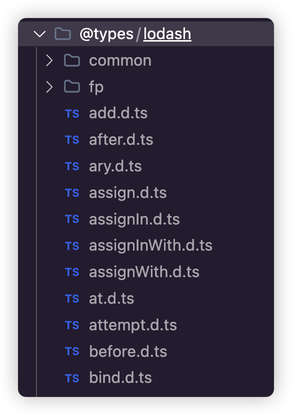

## 模块化 - ESM 的问题

### 模块的编译结果

**src/index.ts**

```typescript
import {show} from './myModule'
show()
```

**src/myModule.ts**

```typescript
export function show() {
    console.log('show')
}
```

当没有配置 tsconfig 的时候，直接使用命令 `tsc src/index.ts` 也能帮助我们编译模块化的代码，最后的结果大致为：

```typescript
// index.js
'use strict'
Object.defineProperty(exports, '__esModule', {value: true})
var myModule_1 = require('./myModule')
;(0, myModule_1.show)()

// myModule.js
;('use strict')
Object.defineProperty(exports, '__esModule', {value: true})
exports.show = void 0
function show() {
    console.log('show:')
}
exports.show = show
```

代码处理成了 `commonjs` 模块化，因为默认 `target` 是 `es3`，当 `target` 是 `es3/es5` 时，默认使用的模块化就是 `commonjs`，也就是配置属性 `module:commonjs`。

使用 `tsc --init` 生成 `tsconfig.json` 配置文件之后，默认生成的 `target` 是 `es2016`，`module` 是 `commonjs`。

虽然这些基础知识比较容易理解，但在 TypeScript 中，模块化实际上是一个复杂的概念。如果基础知识不够扎实，就会带来很多困扰。因为模块化还涉及到一个基础但非常复杂的知识点——模块解析策略，再加上 TypeScript 的一些特性，会导致有时候出现问题不知道如何排查。

以下是可能出现的问题：

### module

在 TypeScript 5.x 的版本中，`module` 能取如下的值：

```shell
none
commonjs
amd
umd
system
es6/es2015
es2020
es2022
esnext
node16
nodenext
```

### 默认值

当 `target` 取值为 `ES3` 或者 `ES5` 的时候，`module` 的值默认为 `commonjs`

当 `target` 取值为其他的时候，`module` 的值默认为 `ES6/ES2015 module`

在有打包器环境中，也就是有 Webpack、Vite 等常用的项目中，可能了解 `commonjs` 和 ESM 的区别，但不会特别留意这两个的一些细节。

### ES6 模块化所引发的问题

通过 `tsc --init` 生成默认的 `tsconfig.json` 文件

```typescript
{
  "compilerOptions": {
    "target": "es2016",
    "module": "commonjs",
    "outDir": "./dist",  // 编译后.js文件的位置
    "esModuleInterop": true,
    "forceConsistentCasingInFileNames": true,
    "strict": true,
    "skipLibCheck": true
  }
}
```

直接运行 `tsc`，在 `dist` 目录下生成了编译之后的 `index.js` 文件和 `myModule.js` 文件。运行命令 `node dist/index.js`，是可以执行的。

如果注释 `"module": "commonjs"` 之后，生成的 `.js` 文件不再是 `commonjs` 模块化的了，而是支持 ESM 的。因为这时候 `module` 取值是默认的 `ES6`，但是，这个时候不能直接通过 Node.js 运行。

```shell
(node:15598) Warning: To load an ES module, set "type": "module" in the package.json or use the .mjs extension.
(Use `node --trace-warnings ...` to show where the warning was created)
/Users/yingside/Desktop/ts/test4/dist/index.js:1
import { show } from "./myModule";
^^^^^^
......
```

虽然在 Node.js 中（>=12.20 版本）可以使用原生 ES Module，但必须遵循下面的规则。

-   文件以 `.mjs` 结尾；
-   `package.json` 中声明 `type: "module"`。

可以根据上面的两个规则，自行更改，这里最好是直接更改 `package.json`，修改 `.mjs` 结尾的话，还需要将 `.ts` 文件修改为 `.mts`，编译的时候才会自动编译为 `.mjs`，这还会引发其他的一些问题，暂时不考虑。

但是就算是 `package.json` 中加上了 `type: "module"` 之后，运行还是报错：

```shell
node:internal/errors:496
    ErrorCaptureStackTrace(err);
    ^

Error [ERR_MODULE_NOT_FOUND]:......
```

另一种方法是不在 Node.js 中运行，而是编写 HTML 页面，在浏览器中运行

```html
<!DOCTYPE html>
<html lang="en">
    <head>
        <meta charset="UTF-8" />
        <meta name="viewport" content="width=device-width, initial-scale=1.0" />
        <title>Document</title>
    </head>
    <body></body>
    <!-- 
  type="module" 会默认产生跨域请求，而file协议并不支持。
  可以使用 vscode 插件 Live Server 来启动一个本地服务器
-->
    <script type="module" src="index.js"></script>
</html>
```

但是还是报错：

```shell
Failed to load resource: the server responded with a status of 404 (Not Found)
```

`404` 错误说明找不到 `myModule` 模块。

## 模块化-模块解析策略

### CommonJS 模块查找策略

CommonJS，最初用于 Node.js，对于 `require` 语句引入的模块，采取以下查找策略：

1. **文件模块**: 如果路径是一个相对路径（如 `./module`）或绝对路径（如 `/path/to/module`），Node.js 会先尝试按照给出的路径查找文件。如果有相应的文件名直接匹配，则加载该文件；否则，会尝试添加 `.js`、`.json`、`.node` 等后缀名。
2. **目录模块**: 如果路径是一个目录，Node.js 会查找该目录下的 `package.json` 文件，并根据其 `main` 字段指定的文件名进行加载。如果没有 `package.json` 或 `main` 字段，Node.js 会尝试加载目录下的 `index.js` 或 `index.node` 文件。
3. **内置模块**: 如果模块名对应一个 Node.js 的内置模块（如 `fs`，`http`），那么就直接返回该模块，不进行文件查找。
4. **node_modules 查找**: 如果上述步骤都未能解析模块，Node.js 会在当前文件夹的父目录中查找 `node_modules` 文件夹，并尝试在其中查找模块。这一过程会一直向上递归至文件系统的根目录。

### ESM 模块查找策略

ESM（ECMAScript Modules），是 ECMAScript 的官方模块系统，用 `import` 和 `export` 语句来导入导出模块。其查找策略与 CommonJS 相似，但有以下区别：

1. **文件扩展名**: 在 ESM 中，导入模块时必须指定文件的完整路径和扩展名（如 `.js`、`.mjs`）。ESM 不直接支持将一个目录作为导入路径的方式。如果希望通过 ESM 导入一个目录下的模块，需要指定目录中具体文件的路径，包括扩展名（如 `import { something } from './someDir/index.js';`）
2. **URL 支持**: ESM 支持直接通过 URL 导入模块。
3. **node_modules 查找**: 在 Node.js 环境中，ESM 支持从 `node_modules` 目录查找模块，查找逻辑与 CommonJS 相似，但更严格地遵守文件扩展名和路径的准确性。但是**注意在浏览器环境中，并不支持，必须要给上全路径**

`node_modules` 第三方库模块的路径导入方式，也被称为 `bare import`

## 模块化-模块解析最佳实践

### bundler

`bundler` 是 TypeScript 5.x 新增的一个模块解析策略，这实际上是社区倒逼的标准，是对现实的妥协。

比如 `vite`，声称是完全基于 `ESM` 的打包工具，但是为了用户方便，声明相对路径模块的时候却不要求写扩展名。这实际上是和 `ESM` 的标准冲突的，但是这种做法是合理的。用户之前已经习惯了在引入模块的时候不写后缀名，许多程序员都已经把文件夹下写一个 `index.js` 当成标准了。

但是问题就出在现有的几个模块解析策略，都不能完美适配 `vite` + `typescript` + `esm` 的开发场景：

如果 `moduleResolution:node`，对于 ESM 支持不好

如果 `moduleResolution:node16 / nodenext`，强制要求使用相对路径模块时必须写扩展名

`moduleResolution:node16 / nodenext` 实际上算是 TypeScript 中完美的解决方案，但是在打包器环境中实在是非常尴尬。

所以才有了 `moduleResolution:bundler`，目的就是告诉你，**模块解析就交给打包器了，TypeScript 不再负责，而且不负责模块解析的话，由 TypeScript 去编译生成 JavaScript 文件就并不安全了**。

**而且选择 bundler 的话，module 就只能是 ESM 相关的配置**

### 搭配 module 和 moduleResolution

关键是如何配置这两个选项？

如果打算编写 CommonJS 风格的 Node.js 程序，不支持解析 `exports` 字段：

```typescript
"module": "CommonJS"
"moduleResolution": "Node"
```

如果打算 Node.js 程序支持比较新的内容，无论模块化 `commonjs` 还是 `es module` 选择：

```typescript
"module": "NodeNext"
"moduleResolution": "NodeNext"
```

当然，ESM 需要设置 `package.json` 的 `"type": "module"`，要么通过后缀区分 `.cjs`, `.mjs`

如果在 Vite 环境中：

```typescript
"module": "ESNext"
"moduleResolution": "Bundler"
```

如果在 Webpack 相关的打包环境中：

```typescript
"module": "ESNext"
"moduleResolution": "node"
```

## 模块化-路径别名

### baseUrl 与 paths

这两个配置一般在打包器中常见，都是在设置路径别名的时候进行处理。比如：

```json
baseUrl:"./",
"paths": {
  "@/*": ["src/*"]
}
```

`baseUrl`:**设置解析非相对路径模块的基础地址**，默认是当前目录。

`paths`:**路径映射**

也就是说，在纯 Node.js 环境的代码中，如果像下面这样的配置 `module` 和 `moduleResolution`

```typescript
"module": "NodeNext"
"moduleResolution": "NodeNext"
```

那么导入是肯定要加上后缀的，不然要报错，但是可以使用 `baseUrl`+`paths` 来解决这个问题

```shell
"module": "NodeNext",
"moduleResolution": "NodeNext",
"baseUrl": "./",
"paths":{
  "@/*":["src/*.js"]
}
```

在引入的时候，只需要像这样写：

```typescript
import {show} from '@/myModule'
```

同样也不会报错。

甚至可以写成下面这样：

```shell
"module": "NodeNext",
"moduleResolution": "NodeNext",
"baseUrl": "./",
"paths":{
  "*":["src/*.js"]
}
```

意味着，TypeScript 将会从当前目录进行查找，并且后续目录会自动映射为 `src/*.js`，这样如果在界面上写成这样

```typescript
import {view} from 'myModule'
import axios from 'axios'
```

> 注意这样写只是保证 TypeScript 代码不报错而已，当编译成 JavaScript 文件之后，`"@/myModule"` 还是会原封不动的被转译。 **TypeScript 并不会处理模块说明符（也就是 from "xxxx"）里面的内容** **如果想处理别名问题，需要结合 paths 和打包工具一起进行处理**

## 类型声明

### 什么是类型声明文件

在前面的代码中，我们说从 `TypeScript` 编译到 `JavaScript` 的过程中，类型消失了，比如下面的代码：

```typescript
const str = 'hello'
type User = {
    id: number
    name: string
    show?: (id: number, name: string) => void
}

const u: User = {
    id: 1,
    name: '张三',
    show(id, name) {
        console.log(id, name)
    }
}

const users: Array<User> = [
    {id: 1, name: 'jack'},
    {id: 2, name: 'rose'}
]

function addUser(u: User) {
    // todos...
    return true
}

addUser(u)
```

**编译成 JavaScript 之后：**

```javascript
'use strict'
const str = 'hello'
const u = {
    id: 1,
    name: '张三',
    show(id, name) {
        console.log(id, name)
    }
}
const users = [
    {id: 1, name: 'jack'},
    {id: 2, name: 'rose'}
]
function addUser(u) {
    // todos...
    return true
}
addUser(u)
```

但是是真的消失了吗？实际上并不是，如果留意之前在 [Playground](https://www.typescriptlang.org/zh/play?#code/MYewdgzgLgBNBOMC8MBEALApgG2yVA3AFBQCeADpjAKoSaIoDeRMrMAlgCYBcMYArgFsARvRZswAQ0GZeCdmADm41hHQgA7gH5uACi7cBI+gBopM7vKUBKZAD4YANxBciAXyKhIsft1r1kGGY2Dh4ARhMVPmlZVEACfUBIOVRIkLVNfU4zGOtgkLYvCBBsTAA6PEUMrJlrKI8PAp86eAhuAEF4eElSAB5-eAcUAG0oxgMI81iAK0lgAGtUNxS2UZ4AJirY+BA6BaIAXSIAM34wYCh2cBhJTk4+3V8+nKiAemeYKBBObZKfqPhMKD8eBgd7wfiYYgea63Jr3awEIA) 上编写代码，专门有一项就叫做 `DTS`

会发现，编写的代码都自动转换成了 TypeScript 类型声明。

当然，这在 VS Code 编辑器中也能生成的。只需要在 `tsconfig.json` 文件中加上相关配置即可

```diff
{
  "compilerOptions": {
    "target": "es2016",
    "esModuleInterop": true,
    "forceConsistentCasingInFileNames": true,
    "strict": true,
    "skipLibCheck": true,
    "outDir": "./dist",
+    "declaration": true,
+    "declarationDir": "./types",
  },
  "include": ["src/**/*"],
  "exclude": ["./node_modules", "./dist", "./types"]
}
```

运行 `tsc`，最后生成：**[文件名].d.ts**

```typescript
declare const str = 'hello'
type User = {
    id: number
    name: string
    show?: (id: number, name: string) => void
}
declare const u: User
declare const users: Array<User>
declare function addUser(u: User): boolean
```

也就是说，类型并不是真的全部消失了，而是被放到了专门的类型声明文件里。

`.d.ts` 结尾的文件，就是类型声明文件。`d` 的含义就是 `declaration`

实际上 `TypeScript` 本身就包含**两种文件类型**

1. `.ts` 文件：既包含类型信息，又包含可执行代码，可以被编译成 `.js` 文件后执行，主要是编写文件代码的地方

2. `.d.ts` 文件：只包含类型信息的类型声明文件，不会被编译成 `.js` 代码，仅仅提供类型信息，所以类型文件的用途就是提供类型信息

### 类型声明文件的来源

类型声明文件主要有以下三种来源。

-   TypeScript 编译器自动生成。
-   TypeScript 内置类型文件。
-   外部模块的类型声明文件，需要自己安装。

#### 自动生成

只要使用编译选项 `declaration`，编译器就会在编译时自动生成单独的类型声明文件。

下面是在 `tsconfig.json` 文件里面，打开这个选项。

```typescript
{
  "compilerOptions": {
    "declaration": true
  }
}
```

[declaration](https://www.typescriptlang.org/tsconfig#declaration) 这个属性还有其他两个属性有强关联：

-   [`declarationDir`](https://www.typescriptlang.org/tsconfig#declarationDir)：指定生成的声明文件 `d.ts` 的输出目录

-   [`emitDeclarationOnly`](https://www.typescriptlang.org/tsconfig#emitDeclarationOnly)：只输出 `d.ts` 文件，不输出 JavaScript 文件

-   [`declarationMap`](https://www.typescriptlang.org/tsconfig#declarationMap)：为 `d.ts` 文件创建源映射

#### 内置声明文件

安装 TypeScript 语言时，会同时安装一些内置的类型声明文件，主要是内置的全局对象（JavaScript 语言接口和运行环境 API）的类型声明。这也就是为什么 `string`，`number` 等等基础类型，JavaScript 的 API 直接就有类型提示的原因

内置声明文件位于 TypeScript 语言安装目录的 `lib` 文件夹内


这些内置声明文件的文件名统一为**lib.[description].d.ts**的形式，其中 `description` 部分描述了文件内容。比如，`lib.dom.d.ts` 这个文件就描述了 DOM 结构的类型。

如果想了解对应的全局对象类型接口，可以去查看这些内置声明文件。

`tsconfig.json` 中的配置 `target` 和 `lib` 实际上就和内置声明文件是有关系的。TypeScript 编译器会自动根据编译目标 `target` 的值，加载对应的内置声明文件，默认不需要特别的配置。也可以指定加载哪些内置声明文件，自定义配置 `lib` 属性即可:

```typescript
"lib":["es2020","dom","dom.iterable"]
```

> **为什么在没有安装 TypeScript 之前也有提示？**
>
> 这是由于 `VS Code` 等 IDE 工具在安装或者更新的时候，已经内置了 TypeScript 的 lib。一般在 `你的VS Code安装路径` -> `resources` -> `app` -> `extensios` -> `node_modules` -> `typescript` 下
>
> 如果 `VS Code` 一直没有升级，就有可能导致本地 `VS Code` 的 `TypeScript` 版本跟不上的情况，如果项目目录下，也安装的的有 TypeScript，是可以进行切换的。
>
> 在 `VS Code` 中使用快捷键 `ctrl(command) + shift + P`，输入 `TypeScript`
>
> 
>
> 选择 `Select Typescript Version...`
>
> 
>
> 可以选择使用 `VS Code` 版本还是项目工作区的版本

#### 外部类型声明文件

如果项目中使用了外部的某个第三方库，那么就需要这个库的类型声明文件。这时又分成三种情况了。

**1. 第三方库自带了类型声明文件**

**2. 社区制作的类型声明文件**

**3. 没有类型声明文件**

没有类型声明这个很容易理解，现在不纠结这种情况，而且大多数情况下，也不应该去纠结它，关键是 1,2 两点是什么意思？实际上下载两个常用的第三方库就能很明显的看出问题。

```shell
npm i axios lodash
```

> 注意：引入模块之前，涉及到模块的查找方式，因此在 `tsconfig.json` 中需要配置**[module](https://www.typescriptlang.org/tsconfig#module)**
>
> 对于现代 **Node.js 项目**，可以配置 `nodenext`，注意这个配置会影响下面三个配置：
>
> ```typescript
> "moduleResolution": "nodenext",
> "esModuleInterop": true,
> "target": "esnext",
> ```
>
> 当然，**具体模块化的配置，不同的环境要求是不一样的，有一定的区别**，比如是 Node.js 环境，还是 Webpack 的打包环境，或者说是在写一个第三方库的环境，对于模块化的要求是不一样的。而且还涉及到模块化解析方式等问题。这里就先不详细深入讲解了
>
> 先简单配置为 `nodenext` 即可

引入相关模块：


实际上打开这两个库的源代码就能发现问题，`axios` 是有 `.d.ts` 文件的，而 `lodash` 没有，也就是说根本没有类型声明，那当然就和提示的错误一样，无法找到模块的声明文件。

第三方库如果没有提供类型声明文件，社区往往会提供。TypeScript 社区主要使用 [DefinitelyTyped](https://github.com/DefinitelyTyped/DefinitelyTyped)，各种类型声明文件都会提交到那里，已经包含了几千个第三方库。上面代码提示的错误，实际上就是让我们到 `@types` 名称空间去下载 `lodash` 对应的类型声明，如果存在的话。当然，也可以到 [npm](https://www.npmjs.com/~types) 上进行搜索。几乎所有较大的库，都会在上面找到，所以一般来说下载或者搜索都比较简单，`@types` 开头，`/` 后面加上**第三方库原来的名字**即可，比如：

`@types/lodash`，`@types/jquery`，`@types/node`，`@types/react`，`@types/react-dom` 等等

```typescript
npm i --save-dev @types/lodash
```

```typescript
import lodash from 'lodash'

const result = lodash.add(1, 2)
console.log(result)
```



默认情况下，TypeScript 会从 `node_modules/@types` 文件夹下导入所有类型声明至全局空间，（需要注意只会导入 script 文件中的声明至全局空间，module 文件对全局空间是隐藏的）。

可以通过 [typeRoots](https://www.typescriptlang.org/tsconfig#typeRoots) 选项设置一系列为文件路径，指示 TypeScript 从哪些地方导入类型信息，默认值为 `node_modules/@types`。不用纠结，一般人不会去改动这个配置，只不过如果希望往里面添加新的配置路径，别忘记把默认的 `node_modules/@types` 加上。

实际上，Node.js 本身也没有 TypeScript 的类型声明，因此会发现在 `.ts` 文件中直接引入 Node.js 相关的模块同样会报错

```typescript
import path from 'path' // error 找不到模块"path"或其相应的类型声明
```

同样，直接在 [DefinitelyTyped](https://github.com/DefinitelyTyped/DefinitelyTyped) 下载即可

```typescript
npm i @types/node -D
```

### 类型声明文件的用途

自己当然也能编写类型声明文件，但是声明文件 `.d.ts` 大多数时候是第三方库一起使用的，在 Node.js 环境下，单独去声明 `.d.ts` 文件没有太大的意义，首先要知道这个问题。所以，要使用 `.d.ts` 声明文件的场景一般是：

1. 自己写了一个主要是 JavaScript 代码的第三方库，需要给这写 JavaScript 代码加上类型声明，以便用户使用的时候可以得到类型声明，方便调用 API。

2. 自己下载了别人写的第三方库，但是没有 TypeScript 类型声明，在社区 [DefinitelyTyped](https://github.com/DefinitelyTyped/DefinitelyTyped) 中也没有找到对应的类型声明，但是一定要用这个库，可以手动为这个库添加一些简单的类型声明，以免自己项目在使用这个第三方库没有类型声明报出错误提示。

3. 在做应用项目的时候，需要补充一些全局的类型声明的时候，可能需要自己动手写 `.d.ts` 文件，实际上这种情况大多数还是和第 2 点有关系

所以首先要明白类型声明文件使用的场景，再来说怎么去使用它。

### 编写类型声明文件

从之前 `tsc` 编译自动生成的 `.d.ts` 文件就能看出，大多使用 `declare` 关键字进行声明。

`declare` 关键字用于告诉 TypeScript 编译器：某个变量、常量、函数或类已经存在，即使它在当前文件中没有定义。这是一种类型声明的方式，允许在不提供具体实现的情况下，定义一个变量的类型。

它只是通知编译器某个类型是存在的，不用给出具体实现。而且，最重要的，**`declare` 关键字修饰的只要不在模块文件中都是全局声明**，也就是在文件 `.d.ts` 文件中声明之后，后续就直接可用了，不用再进行导入等这些操作

> **注意：只要声明文件中出现顶层的 `import` 或 `export`，那么这个声明文件就会被当做模块**，模块中所有的声明都是局部变量或局部类型，必须 `export` 导出后，才能在其他文件中 `import` 导入使用。

`declare` 关键字可以描述以下类型。

-   变量（`const`、`let`、`var` 命令声明）
-   `type` 或者 `interface` 命令声明的类型
-   `class`
-   `enum`
-   函数（`function`）
-   模块（`module`）
-   命名空间（`namespace`）

**注意 1：TypeScript 编译器会处理 `tsconfig.json` 的 [file](https://www.typescriptlang.org/tsconfig#files)、[include](https://www.typescriptlang.org/tsconfig#include)、[exclude](https://www.typescriptlang.org/tsconfig#exclude) 对应目录下的所有 `.d.ts` 文件**

**注意 2：如果 `.d.ts` 类型声明文件和可执行的 `.ts` 文件在同一目录下，文件名不能同名**

```typescript
//types.d.ts
declare var num: number
declare let str1: string
declare const str2 = 'hello'

declare function power(a: number, b: number): number

type FnAdd = (a: number, b: number) => number

interface User {
    id: number
    name: string
}

declare module 'foo' {
    export var bar: number
    export function baz(a: number): string
}
```

**具体调用：**

```typescript
import {bar, baz} from 'foo'

console.log(num)
console.log(str1)
console.log(str2)
const p = power(1, 2)

console.log(bar)
baz(10)

// 上面的代码在TypeScript中并不会报错，因为在类型声明文件中已经声明了
// 但是并不能执行，因为运行时少了具体的实现
// 实际上应该还有一个具体实现JavaScript文件，比如第三方引入的power函数的具体实现

const add: FnAdd = (a, b) => a + b

const uu: User = {
    id: 1,
    name: '张三'
}
```

#### declare module

`declare module`，应该算类型声明中的语法，它的作用实际上在一般的工作场景中都是用来对模块声明进行增强的。

如果还不知道上面说的这段是什么意思，可以使用第三方库来模拟一下，比如导入了 `lodash` 库，但是它没有类型声明，之前已经通过 `@types/lodash` 导入了类型声明，如果没有这个类型声明的话，完全也能自己去声明 `.d.ts` 文件，简单的屏蔽模块导入错误即可

```typescript
//lodash.d.ts
declare module 'lodash' {
    export function add(a: number, b: number): number
    export function ceil(n: number, precision?: number): number
}
```

还比如在实际工作中经常可能遇到找不到图片模块的问题:

```typescript
import notFound from "./assert/404.png";

找不到模块“./assert/404.png”或其相应的类型声明。ts(2307)
```

这时，就可以在声明文件中处理这种模块的声明

```typescript
declare module '*.png' {
    const src: string
    export default src
}
```

其他后缀名的图片，甚至是 CSS，想以模块化的方式引入都可以用这个方式。

不过需要注意的是，这种方式用到了通配符 `*`，所以仅仅相当于告诉了 TypeScript，遇到了这种后缀的模块化引入就别报错了，但是并不会去验证路径到底是否正确。

#### declare namespace

`namespace` 是 TypeScript 早期时为了解决模块化而创造的关键字，中文称为命名空间。

由于历史遗留原因，在早期还没有 ES6 的时候，TypeScript 提供了一种模块化方案，使用 `module` 关键字表示内部模块。但由于后来 ES6 也使用了 `module` 关键字，TypeScript 为了兼容 ES6，使用 `namespace` 替代了自己的 `module`，更名为命名空间。

随着 ES6 的广泛应用， `namespace` 实际上失去了原本的功能，有一些公司或者项目，可能会使用 `namespace` 拿来作为命名的区分。

比如，平时在业务系统中，一个比较常用的用法就是用 **namespace** 作为命名划分以免出现同名的情况，特别是在封装 **API** 类型的时候

```typescript
export namespace User {
    export interface Address {
        province: string
        city: string
    }
    export interface UserInfo {
        _id: string
        address: Address
        age: number
        loginId: string
        loginPwd: string
        loves: string[]
        name: string
    }
}
```

#### declare global

如果希望定义全局类型，那么就必须放在非模块文件中，简单来说就是文件首位不能出现 `import` 或者 `export`，当然，如果当前文件已经是一个模块，但是希望导出一个全局类型，那么可以使用全局声明模块 `declare global`，也就是说一般语法像下面这个样子：

```typescript
// global.d.ts
export {}

declare global {
    interface User {
        id: number
        name: string
    }
}

// 使用:index.ts
let u: User = {
    id: 1,
    name: 'typescript'
}
```

实际上这样声明和之前在文件中直接写 `interface` 是一个意思，但是，约定俗成的，这样去声明全局模块看起来更加的规范明确，而且也没有必须要在非模块化文件中的这样的硬性要求。

所以，如果希望定义一些全局类型，更加推荐的是写在 `declare global` 中，特别是对原生代码类型的扩展。

比如要给全局类型 `String` 的原型上添加类型，就可以使用 `declare global` 去进行扩展

```typescript
// global.d.ts
export {}

declare global {
    interface String {
        prependHello(): string
    }
}
```

`interface String` 在是 `lib.es5.d.ts` 中有声明

使用：

```typescript
if (!String.prototype.prependHello) {
    String.prototype.prependHello = function () {
        return 'Hello, ' + this
    }
}

console.log('typescript'.prependHello())
```

比如，还可以扩展原生的 `Array` 中的方法

```typescript
// global.d.ts
export {}

declare global {
    interface String {
        prependHello(): string
    }

    interface Array<T> {
        removeLast(): T[]
    }
}
```

使用：

```typescript
// index.ts
if (!String.prototype.prependHello) {
    String.prototype.prependHello = function () {
        return 'Hello, ' + this
    }
}

console.log('typescript'.prependHello())

if (!Array.prototype.removeLast) {
    Array.prototype.removeLast = function () {
        this.pop()
        return this
    }
}

const arr = ['a', 'b', 'c']

console.log(arr.removeLast())
```

正如前面所说，大家需要留意，**如果类型声明文件中出现了`import`或者`export`等关键字，那么就会认为这个文件是一个模块声明，那么文件中所有使用 declare 声明的类型就自动变为了局部声明**

```typescript
export {}
```

### 声明合并

我们知道接口是可以声明合并的，但实际上声明合并是 TypeScript 中一个比较重要的特性，因此并不是接口所独有的。当然，一般用的较多的也就仅仅是接口的声明合并。其他的声明合并实际上用的很少，滥用反而会引起混乱。这里列举了表格，表明哪些是可以声明合并的。

|          | 值  | 类  | 枚举 | 函数 | 类型别名 | 接口 | 命名空间 | 模块 |
| -------- | --- | --- | ---- | ---- | -------- | ---- | -------- | ---- |
| 值       | 否  | 否  | 否   | 否   | 是       | 是   | 否       | -    |
| 类       | -   | 否  | 否   | 否   | 否       | 是   | 是       | -    |
| 枚举     | -   | -   | 是   | 否   | 否       | 否   | 是       | -    |
| 函数     | -   | -   | -    | 否   | 是       | 是   | 是       | -    |
| 类型别名 | -   | -   | -    | -    | 否       | 否   | 是       | -    |
| 接口     | -   | -   | -    | -    | -        | 是   | 是       | -    |
| 命名空间 | -   | -   | -    | -    | -        | -    | 是       | -    |
| 模块     | -   | -   | -    | -    | -        | -    | 是       | 是   |

### 三斜线指令

当在编写一个全局声明文件但又依赖其他声明文件时，文件内不能出现 `import` 去导入其他声明文件的声明，此时就可以通过三斜线指令来引用其他的声明文件。

三斜线指令本质上就是一个自闭合的 XML 标签，其语法大致如下：

```typescript
/// <reference path="./xxx.d.ts" />
/// <reference types="node" />
/// <reference lib="es2017.string" />
```

可以看出来，三斜线实际上也是一种注释语句，只不过在原有注释两条斜线 `//` 的基础上多写一条变成了三斜线 `///` , 之后通过 `<reference />` 来引用另一个声明文件。TypeScript 解析代码时看到这样的注释就知道是要引用其他声明文件了。

三个参数，代表三种不同的指令引用。

-   `path`
-   `types`
-   `lib`

**它们的区别是：`path` 用于声明对另一个文件的依赖，`types` 用于声明对另一个库的依赖，而 `lib` 用于声明对内置库的依赖**

> 全局声明文件不是全局都能用吗？为什么还需要引用？
>
> 注意前面说明 `.d.ts` 文件的**注意事项**，**TypeScript 编译器会处理 `tsconfig.json` 的 `file`、`include`、`exclude` 对应目录下的所有 `.d.ts` 文件**
>
> 也就是说，如果在自己的项目中，出现了 `tsconfig.json` 声明之外的 `.d.ts` 文件是引用不了的。
>
> 另外，还有可能是需要引用其他第三方库的 `.d.ts` 文件
>
> 还有一种可能就是在第三方库或者特别是 `DefinitelyTyped` 中，`.d.ts` 文件中的内容过多，为了更明显的区分不同的内容，会将文件中的内容拆分，然后再使用三斜线指令进行引用即可

**可以模拟一下这个场景：**

在 `tsconfig.json` 文件中，配置的 `"include": ["src/**/*"]`。如果新建一个 `.d.ts` 文件在另外的目录，就解析不了这个文件。比如在根目录下创建新的目录 `lib/index.d.ts`

```typescript
interface Student {
    id: number
    name: string
}

type Level = 'plain' | 'silver' | 'gold' | 'platinum' | 'diamond'
```

然后在 `src/types.d.ts` 中要使用 `Student` 和 `Level` 类型，现在这样是发现不了这两个类型的。

```typescript
/// <reference path="../lib/index.d.ts" />

interface User {
    id: number
    name: string
    level?: Level
}
type showStudent = (stu: Student) => void
```

使用三斜线指令之后，顺利找到类型。

> **注意：三斜线指令只能用在文件的头部**，如果用在其他地方，会被当作普通的注释。另外，若一个文件中使用了三斜线命令，那么在**三斜线指令之前只允许使用单行注释、多行注释和其他三斜线命令**，否则三斜杠命令也会被当作普通的注释。

也可以引入一下其他第三方库的 `.d.ts` 文件，比如可以引入 Vite，看看 Vite 中的声明文件

```typescript
npm i vite
```

> **注意：** `vite` 版本已经更新到 5.0+了，需要 Node.js 版本 18 以上，如果 Node.js 版本跟不上，可以引入 Vite 4.0+，
>
> ```typescript
> npm i vite@4
> ```

可以在自己的类型声明文件中，使用三斜线指令，引入一下 Vite 中的类型

```typescript
/// <reference types="vite/client" />

type A = CSSModuleClasses
type B = ImportMeta['env']
```

实际上，`reference types` 也是有索引规则的，首先会在 `node_modules` 的 `@types` 下查找，没有的话，然后才到同名项目下查找，和 Node.js 的模块查找规则很类型，具体关于模块查找解析的内容这里就不展开了

## webpack 中 TS 的处理

### 相关 TS 代码

**randomNumber.ts**

```typescript
const randomNumber = (min: number, max: number): number => {
    let num = Math.floor(Math.random() * (min - max) + max)
    return num
}
export default randomNumber
```

**index.ts**

```typescript
import randomNumber from './randomNumber.ts'
console.log(randomNumber(1, 100))
export default {randomNumber}
```

### webpack 依赖与基本设置

```shell
npm i webpack webpack-cli -D
```

**webpack.config.js**

```typescript
const path = require('path')
/**
 * @type {import('webpack').Configuration}
 */
module.exports = {
    mode: 'development',
    entry: path.resolve(__dirname, './src/index.ts'), // 入口文件
    output: {
        path: path.resolve(__dirname, './dist'), // 打包后的目录
        filename: '[name].[contenthash:6].js', // 打包后的文件
        clean: true, // 清理打包目录 /dist 文件夹
        publicPath: '/'
    },
    resolve: {
        // 引入文件时不需要加后缀。
        extensions: ['.ts', '.js', '.json']
    }
}
```

### tsconfig.json 基本配置

```typescript
{
  "compilerOptions": {
    "target": "es2016",
    "module": "ESNext",
    "moduleResolution": "node",
    "noEmit": true,
    "allowImportingTsExtensions": true,
    "esModuleInterop": true,
    "forceConsistentCasingInFileNames": true,
    "strict": true,
    "skipLibCheck": true,
  },
  "include": ["src/**/*.ts","src/**/*.d.ts"]
}
```

Webpack 运行命令：

```typescript
npx webpack -c webpack.config.js
```

当然也能直接配置到 `script` 脚本中

```typescript
"scripts": {
	"build": "webpack -c webpack.config.js"
},
```

### ts-loader 安装

Webpack 本身并不能支持处理 TypeScript 文件，因此需要 `ts-loader` 支持

```typescript
npm i typescript ts-loader -D
```

配置：

```typescript
const path = require('path')
/**
 * @type {import('webpack').Configuration}
 */
module.exports = {
    mode: 'development',
    entry: path.resolve(__dirname, './src/index.ts'), // 入口文件
    output: {
        path: path.resolve(__dirname, './dist'), // 打包后的目录
        filename: '[name].[contenthash:6].js', // 打包后的文件
        clean: true, // 清理打包目录 /dist 文件夹
        publicPath: '/'
    },
    resolve: {
        // 引入文件时不需要加后缀。
        // 这里只配置vue,ts,js和json, 其他文件引入都要求带后缀，可以稍微提升构建速度
        extensions: ['.ts', '.js', '.json']
    },
    module: {
        rules: [
            {
                test: /\.tsx?$/,
                exclude: /node_modules/,
                use: [
                    {
                        loader: 'ts-loader',
                        options: {
                            transpileOnly: true // 关闭类型检查，即只进行转译，不进行类型检查
                        }
                    }
                ]
            }
        ]
    }
}
```

### Babel 预设

```typescript
npm i babel-loader @babel/core @babel/preset-env -D
```

配置：

```typescript
const path = require('path')
/**
 * @type {import('webpack').Configuration}
 */
module.exports = {
    mode: 'development',
    entry: path.resolve(__dirname, './src/index.ts'), // 入口文件
    output: {
        path: path.resolve(__dirname, './dist'), // 打包后的目录
        filename: '[name].[contenthash:6].js', // 打包后的文件
        clean: true, // 清理打包目录 /dist 文件夹
        publicPath: '/'
    },
    resolve: {
        // 引入文件时不需要加后缀。
        // 这里只配置vue,ts,js和json, 其他文件引入都要求带后缀，可以稍微提升构建速度
        extensions: ['.ts', '.js', '.json']
    },
    module: {
        rules: [
            {
                test: /\.m?jsx?$/,
                exclude: /node_modules/,
                use: 'babel-loader'
            },
            {
                test: /\.tsx?$/,
                exclude: /node_modules/,
                use: [
                    {
                        loader: 'ts-loader',
                        options: {
                            transpileOnly: true // 关闭类型检查，即只进行转译，不进行类型检查
                        }
                    }
                ]
            }
        ]
    }
}
```

### Babel 的 TypeScript 预设

```typescript
npm i @babel/preset-typescript -D
```

配置：

```typescript
const path = require('path')
/**
 * @type {import('webpack').Configuration}
 */
module.exports = {
    mode: 'development',
    entry: path.resolve(__dirname, './src/index.ts'), // 入口文件
    output: {
        path: path.resolve(__dirname, './dist'), // 打包后的目录
        filename: '[name].[contenthash:6].js', // 打包后的文件
        clean: true, // 清理打包目录 /dist 文件夹
        publicPath: '/'
    },
    resolve: {
        // 引入文件时不需要加后缀。
        // 这里只配置vue,ts,js和json, 其他文件引入都要求带后缀，可以稍微提升构建速度
        extensions: ['.ts', '.js', '.json']
    },
    module: {
        rules: [
            {
                test: /\.m?jsx?$/,
                exclude: /node_modules/,
                use: 'babel-loader'
            },
            {
                test: /\.tsx?$/,
                exclude: /node_modules/,
                use: [
                    // {
                    //   loader: 'ts-loader',
                    //   options: {
                    //     transpileOnly: true, // 关闭类型检查，即只进行转译，不进行类型检查
                    //   }
                    // },
                    {
                        loader: 'babel-loader',
                        options: {
                            presets: [
                                [
                                    '@babel/preset-typescript',
                                    {
                                        allExtensions: true
                                    }
                                ]
                            ]
                        }
                    }
                ]
            }
        ]
    }
}
```
