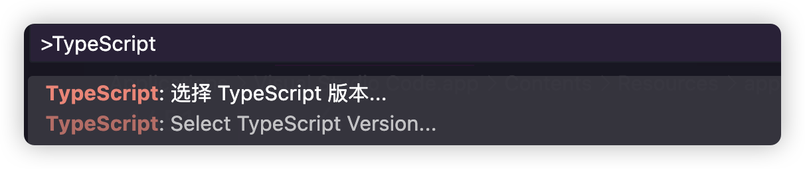

## 重要概念

TypeScript（TS）是一种编译时的静态类型语言，是一种强类型语言

1. **静态类型**: 在 TypeScript 中，变量和函数的类型是在编写代码时指定的，而不是在运行时确定的。这有助于捕捉类型错误，并提供更好的代码自动补全、导航和重构支持。
2. **编译时**: 浏览器和 nodejs 并不能直接识别 TS 代码，需要编译成 js 代码。TypeScript 在编译到 JavaScript 之前进行类型检查。这意味着任何类型错误都会在编译时被发现，而不是在代码运行时。
3. **强类型语言**: 这个术语通常用来描述那些在编译时执行严格的类型检查的语言。

## 安装与运行

### 安装

建议全局安装

```bash
npm i -g typescript
```

安装好之后，就可以直接使用 tsc 来编译 ts 文件了

### 编译

现在可以创建一个 ts 文件，并将他编译成 js 文件，比如下面简单的代码

```js
let str: string = 'hello'
```

但是这段简单的代码在编译后会出现错误。

这个错误并非代码本身的问题，而是因为 TypeScript 默认情况下会做出以下假设：

1、假设当前环境为 DOM 环境
2、如果代码中没有模块化语句，默认代码在全局作用域执行，因此变量为全局变量

最简单的解决方案是使用模块化，或者添加 TypeScript 的**配置文件**，也可以使用`tsc`命令行选项参数

### tsconfig.json 配置文件

官方配置文件说明地址：[tsconfig.json](https://www.typescriptlang.org/tsconfig)

具体说明见**tsconfig.json.xmind**

如果项目中指定了`tsconfig.json`文件，运行`tsc`不需要再指定文件路径地址

```json
{
    "compilerOptions": {
        "target": "ES2017", // 编译目标版本
        "lib": ["ES2017", "DOM", "DOM.Iterable"], // 需要引用的库
        "outDir": "./dist" // 指定输出目录，如果未指定和对应的.ts文件同目录
    },
    "include": ["src/**/*.ts"] // 指定需要编译的文件或目录
}
```

### 使用第三库简化流程

**ts-node:** 将 ts 代码在内存中完成编译，同时完成运行

**安装:**

```bash
npm i -g ts-node
```

**运行:**

```bash
ts-node src/index.ts
```

**nodemon:** 检测文件变化

**安装:**

```bash
npm i -g nodemon
```

**运行:**

```bash
nodemon --exec ts-node src/index.ts
```

同样，可以将此代码添加到 `package.json` 的 `scripts` 属性中

```json
"scripts": {
    "start": "nodemon --exec ts-node src/index.ts"
},
```

## 开发相关设置

### tsconfig 初始化

```shell
tsc --init
```

### 工程切换 Typescript

如果本地项目中安装了 TypeScript，并且希望相关类型引用指向本地 TypeScript 而非 VSCode 内置的 TypeScript，可以进行切换

`Ctrl` (`Command` 在 macOS) + `Shift` + `P` 打开**命令面板**，输入`Select Typescript Version`，选择切换即可


### 开发相关设置

在 **「设置」**中，**「打开工作区设置」**，由于内容较多，可以使用搜索词：**typescript inlay hints**

对于初学者，建议开启以下配置项：

-   Function Like Return Types，显示推导得到的函数返回值类型；
-   Parameter Names，显示函数入参的名称；
-   Parameter Types，显示函数入参的类型；
-   Variable Types，显示变量的类型。


```javascript
{
  "typescript.inlayHints.functionLikeReturnTypes.enabled": true,
  "typescript.inlayHints.parameterNames.enabled": "all",
  "typescript.inlayHints.parameterTypes.enabled": true,
  "typescript.inlayHints.variableTypes.enabled": true
}

```


> 并非所有开发者都习惯这种显示方式，可以根据个人需要进行调整。

### VS Code 插件

**Error Lens** 这个插件能够把错误直接显示到代码文件中的对应位置：


## TypeScript 常见类型

### JS 数据类型

-   `number`
-   `string`
-   `boolean`
-   `null`
-   `undefined`
-   `symbol`
-   `bigint`
-   `object`

### `any`

any 类型可以绕过类型检查，因此 any 类型的数据可以赋值给任意类型。如果没有约束，也不会进行类型推断

### 字面量类型

```js
const b = 'hello'
const c = null

let d: 'hello'
d = 'hello'
// d = "world"; // 报错,只能赋值为hello
```

### 联合类型

```typescript
let v1: string | number | undefined = undefined
v1 = 'hello'
v1 = 123

let v2: '男' | '女'
v2 = '女'

let v3: 'UP' | 'DOWN' | 'LEFT' | 'RIGHT'
v3 = 'RIGHT'
```

### 数组

数组可以通过**类型[]**来表示，比如 `number[]`、`string[]`、`boolean[]`等

数组也可以通过`Array<elemType>`来表示，比如`Array<number>`、`Array<string>`、`Array<boolean>`等

```typescript
const arr1 = [1, 2, 3, 4, 5]
const arr2: string[] = ['a', 'b', 'c', 'd', 'e']
const arr3: number[] = [1, 2, 3, 4, 5]
const arr4: Array<number> = [1, 2, 3, 4, 5]
```

空数组默认推断为`any[]`，这与**相关类型检查机制有关**

```typescript
const arr5 = []
arr5.push(123)
arr5.push('123')
```

数组也支持联合类型

```typescript
let arr6: (string | number)[] = [1, '2', 3, '4']
let arr7: Array<string | number> = [1, '2', '3', 4]
// 注意和下面写法的区别
let arr8: string[] | number[] = [1, 2, 3, 4]
let arr9: Array<string> | Array<number> = ['1', '2', '3', '4']
```

### 元祖类型(Tuple)

一个固定长度的数组，并且数组中每一项的类型确定

```typescript
const tuple1: [number, number] = [1, 2]
const tuple2: [number, string] = [1, '2']
```

**应用场景：** 在地图应用中，使用经纬度坐标来标记位置信息

可以使用数组来记录坐标，该数组中只有两个元素，且这两个元素都是数值类型

```js
let position: number[] = [39.5427, 116.2317]
```

使用 **number[]** 的缺点：不够严谨，因为该类型的数组中可以包含任意数量的数字

**更好的方式：** 元组(Tuple)

元组类型是另一种数组类型，它确切地知道包含多少个元素，以及特定索引对应的类型

```js
let position: [number, number] = [39.5427, 116.2317]
```

**说明：**

元组类型可以确切地标记有多少个元素，以及每个元素的类型。在示例中，元组有两个元素，每个元素的类型都是 number

**容易混淆的赋值**

```typescript
let tuple3: [] = [] // 空元祖

// tuple3 = [1];//报错

let value = [] // 这样才表示暂时的空数组，不过类型是any[]
```

### 函数

与 JavaScript 的区别在于需要添加参数和返回值的类型定义

返回值类型可以进行推断，参数的类型也可以通过类型检查的`"noImplicitAny": false`配置来取消强制要求

```typescript
function add(a: number, b: number): number {
    return a + b
}

const r = add(1, 2)
```

**可选参数与默认参数**

```typescript
function sum1(a: number, b: number, c?: number) {
    console.log(a, b, c)
}
sum1(3, 4)

// 默认参数本身就是可选参数
function sum2(a: number, b: number, c = 10) {
    console.log(a, b, c)
}
```

**剩余参数**

```typescript
const fn = (a: number, b: number, ...args: number[]) => {
    console.log(a, b, args[0])
}
```

### `void`

函数没有显式的返回值类型，会被默认的推导为`void`

```typescript
function print(): void {
    console.log('1.登录')
    console.log('2.注册')
}
```

### 泛型

TypeScript 中的泛型是一种工具，它允许在定义函数、接口或类时提供一个类型变量。这种类型变量可以被视为一种特殊的标记，它允许你在不同的地方使用不同的、具体的类型。泛型提供了一种方式来创建可重用的组件，这些组件可以支持多种类型的数据，同时保持类型的安全性。

```typescript
function identity<T>(arg: T): T {
    return arg
}

let output1 = identity<string>('myString') // 明确指定T为string
// 也可以使用类型推断
let output2 = identity('myString') // 类型推断，T被推断为string
let output3 = identity(123) // 类型推断，T被推断为number
console.log(output1, output2, output3)

function getTuple<T>(a: T, b: T) {
    return [a, b]
}
const as = getTuple<string>('hello', 'world')

function myNumberFilter(arr: number[], callback: (item: number, index?: number) => boolean): number[] {
    const result = []
    for (let i = 0; i < arr.length; i++) {
        const item = arr[i]
        if (callback(item)) {
            result.push(item)
        }
    }
    return result
}
const filterArr1 = myNumberFilter([1, 2, 3, 4, 5], item => item % 2 === 0)
console.log(filterArr1)

function myFilter<T>(arr: T[], callback: (item: T, index?: number) => boolean): T[] {
    const result = []
    for (let i = 0; i < arr.length; i++) {
        const item = arr[i]
        if (callback(item)) {
            result.push(item)
        }
    }
    return result
}

const filterArr2 = myFilter(['xxx.js', 'aaa.java', 'bbb.md'], item => item.endsWith('.js'))
console.log(filterArr2)
```

### 对象字面量类型

```typescript
const obj1 = {
    name: 'lily',
    age: 18
}

// 其实是下面的简写：
const obj2: {
    name: string
    age: number
} = {
    name: 'lily',
    age: 18
}

// 同样，在函数中也可以使用对象字面量
function getInfo(user: {name: string; age: number}): {name: string; age: number}[] {
    // todos...
    return [
        {
            name: 'lily',
            age: 18
        },
        {
            name: 'lucy',
            age: 20
        }
    ]
}
```

### 自定义类型:类型别名与接口

在 TS 中，**类型别名（Type Aliases）** 和 **接口（Interfaces）** 是两种定义对象类型的方式。它们在很多情况下可以互换使用，但各自有其特点和最佳应用场景。

**类型别名**是一种为类型创建新名称的方式，就是取一个新的名字。类型别名可以是任何有效的类型，包括基本类型、联合类型、元组等

```typescript
type TypeName = /* some type */

type Point = {
  x: number;
  y: number;
};

type ID = string | number;

type Age = number;

type User = {
  name: string;
  age: Age;
};

const obj3: User = {
  name: "lily",
  age: 18,
}

```

**接口**是面向对象的概念，因此它定义对象结构的一种方式，它描述了对象的形状，即对象应该有哪些属性以及属性的类型。接口主要用于声明对象的结构

```typescript
interface InterfaceName {
    // structure
}

interface Person {
    id: number
    name: string
    age: number
}

const obj4: Person = {
    id: 1,
    name: 'lily',
    age: 18
}
```

有了自定义的类型之后，可以很方便的在函数和数组中使用

```typescript
function fn1(user: User) {
    console.log(user.name)
}

const users: User[] = [
    {
        name: 'lily',
        age: 18
    },
    {
        name: 'lucy',
        age: 20
    }
]
```

**类型中的函数声明与可选属性**

```typescript
type InfoFn = (id: number, name?: string) => string

interface Book {
    id: number
    name: string
    price?: number
    show(id: number): ../../../../.vuepress/public/assets/images/web/language/typeScript/quick-start/
    filter: (id: number) => ../../../../.vuepress/public/assets/images/web/language/typeScript/quick-start/
    info: InfoFn
    author: User
}

const book: Book = {
    id: 1,
    name: 'javascript',
    show(id: number) {
        console.log(id)
    },
    filter(id: number) {
        console.log(id)
    },
    info(id: number, name?: string) {
        return 'hello'
    },
    author: {
        name: 'lily',
        age: 18
    }
}
```

### 交叉类型

```typescript
type A = {
    id: number
    name: string
}
type B = {
    age: number
}
type C = A & B
type D = A | B

// 注意类型C与类型D的区别
/*
const v5: C = {
  id: 1,
  name: "lily",
  // age: 18, //error 缺少age属性
}
*/

const v6: D = {
    id: 1,
    name: 'lily'
    // age: 18,
}
```

### 类型断言

类型断言是一种告诉编译器“我知道我在做什么”的方式。允许你将一个变量指定为更具体或更宽松的类型。

简而言之，TypeScript 根据类型推测无法确定具体类型时，而开发者明确知道某个值的类型，就可以通过类型断言来明确告诉 TypeScript 该值的具体类型

**语法:**

```typescript
<类型>值
或者
值 as 类型
```

```typescript
let someValue: any = 'this is a string'
let strLength1: number = (<string>someValue).length
// 建议使用 as 语法，因为尖括号语法在 React 中会与 JSX 标签语法产生冲突
let strLength2: number = (someValue as string).length
```

**非空断言**

当你确信某个值不是`null`或`undefined`时，可以使用非空断言

**语法:** `值!`，比如`someValue!`

```typescript
let maybeString: string | null = 'hello'
let definitelyString = maybeString!
```

```typescript
function getRandom(length?: number) {
    if (!length) {
        return undefined
    }

    return Math.random().toString(36).slice(-length)
}
let s = getRandom(6)
// 可以使用类型断言
;(s as string).charAt(0)
// 由于就是字符串和非空的处理，可以使用非空断言
s!.charAt(0)
```

```typescript
type Box = {
    id: number
    name: string
}

function getBox(): Box | undefined {
    if (Math.random() > 0.5) {
        return {
            id: 1,
            name: 'box1'
        }
    }
    return undefined
}

function createProduction(box: Box) {
    // todos...
}

createProduction(getBox() as Box)
// 非空断言
createProduction(getBox()!)
```

例如常见的 DOM 操作：

```typescript
const inputDom = document.querySelector('input')
inputDom!.addEventListener('change', e => {
    console.log((e.target as HTMLInputElement).value)
})
```

> 所有的 DOM 相关的类型声明都在核心库定义文件`lib.dom.d.ts`中，要查找相关的 Element，可以查看 **interface HTMLElementTagNameMap**

### 可选链操作符

需要注意的是，可选链操作符是 ES2020 的新语法特性，并非 TypeScript 的特性

可选链操作符 `?.` 使得我们在尝试访问一个对象的属性或调用一个方法时，如果该对象是 `undefined` 或 `null`，不会引发错误，而是会返回 `undefined`。这样可以避免使用冗长的条件语句来检查对象的每个层级。

```typescript
interface Address {
    street?: string
    city?: string
}

interface Student {
    name: string
    address?: Address
}

let student: Student = {
    name: 'Rose',
    address: {
        city: '上海'
        // 注意：这里没有提供street属性
    }
}

// 使用可选链安全地访问street属性
let street = student.address?.street // street将为undefined，但不会抛出错误

console.log(street) // 输出 undefined
```

## 类型声明

### 什么是类型声明文件

在前面的代码中，从 `TypeScript` 编译到 `JavaScript` 的过程中，类型信息会消失，如下面的代码所示：

```typescript
const str = 'hello'
type User = {
    id: number
    name: string
    show?: (id: number, name: string) => void
}

const u: User = {
    id: 1,
    name: '张三',
    show(id, name) {
        console.log(id, name)
    }
}

const users: Array<User> = [
    {id: 1, name: 'jack'},
    {id: 2, name: 'rose'}
]

function addUser(u: User) {
    // todos...
    return true
}

addUser(u)
```

**编译成 javascript 之后：**

```javascript
'use strict'
const str = 'hello'
const u = {
    id: 1,
    name: '张三',
    show(id, name) {
        console.log(id, name)
    }
}
const users = [
    {id: 1, name: 'jack'},
    {id: 2, name: 'rose'}
]
function addUser(u) {
    // todos...
    return true
}
addUser(u)
```

但类型信息是否真的完全消失了呢？实际上并非如此。如果留意之前在[Playground](https://www.typescriptlang.org/zh/play?#code/MYewdgzgLgBNBOMC8MBEALApgG2yVA3AFBQCeADpjAKoSaIoDeRMrMAlgCYBcMYArgFsARvRZswAQ0GZeCdmADm41hHQgA7gH5uACi7cBI+gBopM7vKUBKZAD4YANxBciAXyKhIsft1r1kGGY2Dh4ARhMVPmlZVEACfUBIOVRIkLVNfU4zGOtgkLYvCBBsTAA6PEUMrJlrKI8PAp86eAhuAEF4eElSAB5-eAcUAG0oxgMI81iAK0lgAGtUNxS2UZ4AJirY+BA6BaIAXSIAM34wYCh2cBhJTk4+3V8+nKiAemeYKBBObZKfqPhMKD8eBgd7wfiYYgea63Jr3awEIA)上编写代码时，会发现有一个专门的`DTS`选项。

编写的代码会自动转换成 TypeScript 类型声明。

在 VS Code 编辑器中也可以生成类型声明文件，只需要在`tsconfig.json`文件中添加相关配置即可

```diff
{
  "compilerOptions": {
    "target": "es2020",
    "esModuleInterop": true,
    "forceConsistentCasingInFileNames": true,
    "strict": true,
    "skipLibCheck": true,
    "outDir": "./dist",
+    "declaration": true,
+    "declarationDir": "./types",
  },
  "include": ["src/**/*.ts"],
  "exclude": ["./node_modules", "./dist", "./types"]
}
```

运行`tsc`，最后生成：**[文件名].d.ts**

```typescript
declare const str = 'hello'
type User = {
    id: number
    name: string
    show?: (id: number, name: string) => void
}
declare const u: User
declare const users: Array<User>
declare function addUser(u: User): boolean
```

也就是说，类型信息并未完全消失，而是被保存到了专门的类型声明文件中。

以`.d.ts`结尾的文件就是类型声明文件，其中`d`表示`declaration`（声明）。

实际上，`TypeScript`包含**两种文件类型**

1、`.ts`文件：既包含类型信息，又包含可执行代码，可以被编译成`.js`文件后执行，主要用于编写业务代码

2、`.d.ts`文件：只包含类型信息的类型声明文件，不会被编译成`.js`代码，仅用于提供类型信息

### 类型声明文件的来源

类型声明文件主要有以下三种来源。

-   TypeScript 编译器自动生成。
-   TypeScript 内置类型文件。
-   外部模块的类型声明文件，需要自己安装。

#### **自动生成**

只要使用编译选项 `declaration`，编译器就会在编译时自动生成单独的类型声明文件。

下面是在 `tsconfig.json` 文件里面，打开这个选项。

```typescript
{
  "compilerOptions": {
    "declaration": true
  }
}
```

[declaration](https://www.typescriptlang.org/tsconfig#declaration)这个属性还与其他属性有强关联：

-   [`declarationDir`](https://www.typescriptlang.org/tsconfig#declarationDir)：指定生成的声明文件`d.ts`的输出目录

-   [`emitDeclarationOnly`](https://www.typescriptlang.org/tsconfig#emitDeclarationOnly)：只输出 `d.ts` 文件，不输出 JavaScript 文件

-   [`declarationMap`](https://www.typescriptlang.org/tsconfig#declarationMap)：为 `d.ts` 文件创建源映射

#### **内置声明文件**

安装 TypeScript 时，会同时安装一些内置的类型声明文件，主要包含内置全局对象（JavaScript 语言接口和运行环境 API）的类型声明。这就是为什么 `string`、`number` 等基础类型以及 JavaScript API 能够直接获得类型提示的原因

内置声明文件位于 TypeScript 语言安装目录的 `lib` 文件夹内


这些内置声明文件的文件名统一为 **lib.[description].d.ts** 的形式，其中 `description` 部分描述了文件内容。比如，`lib.dom.d.ts` 这个文件就描述了 DOM 结构的类型。

如果需要了解对应的全局对象类型接口，可以查看这些内置声明文件。

`tsconfig.json` 中的 `target` 和 `lib` 配置与内置声明文件相关。TypeScript 编译器会根据编译目标 `target` 的值自动加载对应的内置声明文件，默认无需特别配置。也可以通过自定义 `lib` 属性来指定加载哪些内置声明文件：

```typescript
"lib":["es2020","dom","dom.iterable"]
```

> **为什么在未安装 TypeScript 之前也有类型提示？**
>
> 这是因为 `VS Code` 等 IDE 工具在安装或更新时，已经内置了 TypeScript 的库文件。通常位于 `VS Code安装路径` -> `resources` -> `app` -> `extensions` -> `node_modules` -> `typescript` 目录下。
>
> 如果 `VS Code` 长期未升级，可能导致本地 `VS Code` 的 `TypeScript` 版本过旧。如果项目目录下也安装了 TypeScript，可以进行版本切换。
>
> 在`VS Code`中使用快捷键`ctrl(command) + shift + P`，输入`TypeScript`
>
> 
>
> 选择`Select Typescript Version...`
>
> 
>
> 可以选择使用 `VS Code` 版本或项目工作区的版本

#### **外部类型声明文件**

如果项目中使用了外部的某个第三方库，那么就需要这个库的类型声明文件。这时又分成三种情况了。

**1、第三方库自带了类型声明文件**

**2、社区制作的类型声明文件**

**3、没有类型声明文件**

没有类型声明文件的情况比较容易理解，在此不做详细讨论，而且大多数情况下也不应该过分关注这种情况。关键是理解前两种情况的含义。通过下载两个常用的第三方库就能清楚地看出差异。

```shell
npm i axios lodash
```

> 注意：引入模块前，需要考虑模块的查找方式，因此需要在 tsconfig.json 中配置**[module](https://www.typescriptlang.org/tsconfig#module)**
>
> 对于现代 **Node.js 项目**，可以配置 `NodeNext`，此配置会影响以下设置：
>
> ```typescript
> "moduleResolution": "NodeNext",
> "esModuleInterop": true
> ```
>
> **不同环境对模块化配置的要求有所差异**，例如 Node.js 环境、Webpack 打包环境或第三方库开发环境，对模块化的要求各不相同，还涉及模块化解析方式等问题。此处不做深入讲解
>
> 在 **Node.js** 环境下，可以简单配置为`"module":"NodeNext"`
>
> 在 **Webpack/Vite** 等打包环境下，设置为：
>
> `"module": "ESNext"`
>
> `"moduleResolution": "bundler"`

引入相关模块：


查看这两个库的源代码就能发现差异，axios 包含`.d.ts`文件，而 lodash 没有，也就是说 lodash 没有类型声明，因此会出现无法找到模块声明文件的错误提示。

如果第三方库没有提供类型声明文件，社区通常会提供。TypeScript 社区主要使用 [DefinitelyTyped](https://github.com/DefinitelyTyped/DefinitelyTyped)，各种类型声明文件都会提交到该仓库，已经包含了数千个第三方库。上述代码提示的错误实际上是建议到 `@types` 名称空间下载 lodash 对应的类型声明（如果存在的话）。也可以到 [npm](https://www.npmjs.com/~types) 上进行搜索。几乎所有知名的库都能在上面找到，因此下载或搜索都比较简单，格式为 `@types` 开头，`/` 后面加上**第三方库的原始名称**即可，例如：

`@types/lodash`、`@types/jquery`、`@types/node`、`@types/react`、`@types/react-dom`等

```typescript
npm i --save-dev @types/lodash
```

```typescript
import lodash from 'lodash'

const result = lodash.add(1, 2)
console.log(result)
```


默认情况下，所有可见的“`@types`”包都会包含在你的编译中。任何包含文件夹中 `node_modules/@types` 的包都被视为可见。“任何包含文件夹”意味着不仅是项目的直接 `node_modules/@types` 目录会被搜索，**上层目录中的相应文件夹也会被递归搜索**。

可以通过[typeRoots](https://www.typescriptlang.org/tsconfig#typeRoots)选项设置查找的文件路径，如果指定了 `typeRoots`，则只会包含 `typeRoots` 下的包。例如：

```typescript
{
  "compilerOptions": {
    "typeRoots": ["./typings", "./vendor/types"]
  }
}
```

这个配置文件将会包含 `./typings` 和 `./vendor/types` 下的所有包，但不会包含 `./node_modules/@types` 下的任何包。所有路径都是相对于 `tsconfig.json` 文件的。

也就是说，如果你要手动指定 `typeRoots` ，那就需要自己手动指定所有需要查找的目录，如果你的项目中有深层次的目录结构，并且你希望包含其中的类型声明，你需要确保这些目录都被明确地添加到 `typeRoots` 中。

实际上，Node.js 本身也没有 TypeScript 的类型声明，因此在 `.ts` 文件中直接引入 Node.js 相关的模块同样会报错

```typescript
import path from 'path' // error 找不到模块"path"或其相应的类型声明
```

同样，我们直接在[DefinitelyTyped](https://github.com/DefinitelyTyped/DefinitelyTyped)下载即可

```typescript
npm i @types/node -D
```

### 类型声明文件的用途

当然也可以自己编写类型声明文件，但声明文件 `.d.ts` 大多数时候是与第三方库一起使用的。在 Node.js 环境下的代码学习阶段，单独声明 `.d.ts` 文件意义不大，首先需要了解这一点。使用 `.d.ts` 声明文件的场景通常是：

1、开发了一个主要由 JavaScript 代码组成的第三方库，需要为这些 JavaScript 代码添加类型声明，以便用户使用时能够获得类型提示，方便调用 API。

2、使用了他人开发的第三方库，但该库没有 TypeScript 类型声明，在社区 [DefinitelyTyped](https://github.com/DefinitelyTyped/DefinitelyTyped) 中也没有找到对应的类型声明，但必须使用该库时，可以手动为该库添加一些简单的类型声明，以避免项目中使用该第三方库时出现类型声明缺失的错误提示。

3、在开发应用项目时，需要补充一些全局的类型声明，这时可能需要自己编写 `.d.ts` 文件，这种情况大多数与第 2 点相关
