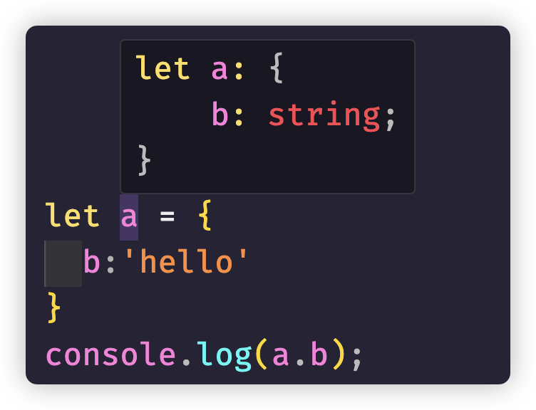

## `any` 与 `unknown`

### `any`

在 TS 中，编译时一切都要有类型，如果你和 TS 类型检查器无法确定类型是什么，默认为 `any` 。这是兜底的类型，是 TS 中所有类型的教父。

```javascript
let a: any = 666
let b: any = ['danger']
let c = a + b
```

正常情况下，第三个语句应该在 TS 中报错才对（谁会去计算一个数字和一个数组之和呢？）

但是如果显示声明了 `any` 标注，就不会报错，其实这里的做法就和原生 JS 的处理一模一样了。

换句话说，如果要使用 `any`，一定要显示标注，如果 TS 推导出值的类型为 `any`（例如忘记注解函数的参数，或者引入没有类型的 JavaScript 模块），将抛出运行时异常。

```javascript
let foo // any

function func(foo, bar) {} // error 参数"foo","bar"隐式具有“any”类型。
```

> 默认情况下，Typescript 是宽容的，在推导出类型为 `any` 时其实不会报错，如果在 `tsconfig.json` 中启用了 `noImplcitAny` 标志，就会遇到隐式 `any` 类型时报错。
>
> `noImplcitAny` 隶属于 TSC 的 `strict` 标志家族，如果已经在 `tsconfig.json` 中启用了 `strict` ，那就不需要专门设置 `noImplcitAny` 标志了，效果是一样的。

有时候我们可能确实需要一个表示任意类型的变量，特别是从 javascript 代码移植到 typescript 的时候。比较明显的比如 `console.log()` 方法就能接收任意类型的参数。

当然默认情况下，你看到的应该是这样的

```javascript
 log(...data: any[]): void;
```

我们现在能看到类型提示，这是由于 VS Code 编辑器结合着 `lib.dom.d.ts` 文件提供的 TS 支持。

如果已经安装了 `@types/node`，可以得到 nodejs 对于 `console.log` 函数更加细致的提示：

```javascript
log(message?: any, ...optionalParams: any[]): void;
```

> 关于 @types 的内容，可以参考快速入门。
>
> Node.js 的核心模块和某些第三方模块并不是天然支持 Typescript 的。这就意味着，如果在 TypeScript 项目中使用这些模块时，编译器无法得知这些模块的类型信息，从而无法提供类型检查和自动补全的功能。比如下面的代码会报错：
>
> ```typescript
> const fs = require('fs') // error 找不到名称require,需要Nodejs类型定义
> ```
>
> 我们可以手动安装 nodejs 的 TypeScript 社区[DefinitelyTyped](https://github.com/DefinitelyTyped/DefinitelyTyped) 提供的声明文件库。当使用 TypeScript 开发 Node.js 项目时，`@types/node` 库可以为 Node.js 的核心模块和常用的第三方模块提供类型定义，以便在开发过程中获得类型检查和自动补全的支持。
>
> ```javascript
> npm i @types/node -D
> ```
>
> 这样上面代码`const fs = require('fs');`也找到的对应的类型支持，在 TS 文件中不会再报错了。

总的来说，你可以在 `any` 类型变量上任意地进行操作，包括赋值、访问、方法调用等等，此时可以认为类型推导与检查是被完全禁用的：

```javascript
let anyVar: any = null
anyVar.foo.bar.fn()
anyVar[0][1][2].prop
```

正如我们一开始就强调的 **【any 兜底的类型，是 TS 中所有类型的教父】**

> **any 能兼容所有类型，也能够被所有类型兼容**

这一作用其实也意味着类型世界给你开了一个外挂，无论什么时候，你都可以使用 `any` 类型跳过类型检查。当然，运行时出了问题就需要你自己负责了。

`any` 类型的万能性也导致我们经常滥用它，比如类型不兼容了就 `any` 一下，类型不想写了也 `any` 一下，不确定可能会是啥类型还是 `any` 一下。此时的 `TypeScript` 就变成了令人诟病的 `AnyScript`。

### `unknown`

> 少数情况下，如果确实无法预知一个值的类型，不要使用 `any`，更合理的方式是使用 `unknown`

`unknown` 也表示任何值，一个 `unknown` 类型的变量可以再次赋值为任意其它类型，但只能赋值给 `any` 与 `unknown` 类型的变量

```javascript
let a: unknown = 30
let b = a === 30

let c: any = 30
let d: number = c + 10

let e: unknown = 'string'
e = 123
let f: any = e
// let f:string = e; // error 不能将类型unknown分配给类型string
//let f = e + 10; //error "e"的类型为"未知"
if (typeof e === 'number') {
    let g = e + 10
}
```

1. TS 不会把任何值推导为 `unknown` 类型，必须显式注解
2. `unknown` 类型的值可以比较
3. `unknown` 类型的变量可以赋值给 `any` 或者 `unknown` 类型的其他变量
4. 但是执行操作时不能假定 `unknown` 类型的值为某种特定的类型（比如上面的运算，注意和 `any` 的区别），必须先向 TS 证明一个值确实是某个类型，可以使用 `typeof`

简单的说，**any 放弃了所有的类型检查，而 unknown 并没有**。

```javascript
let anyFn: any
let unknownFn: unknown

anyFn.foo()
unknownFn.foo() // error 对象的类型为"unknown"
```

**在类型未知的情况下，更推荐使用 unknown 标注。**这相当于你使用额外的心智负担保证了类型在各处的结构，后续重构为具体类型时也可以获得最初始的类型信息，同时还保证了类型检查的存在。当然，`unknown` 用起来很麻烦。

......如果本身就出现了不得不使用 `any` 或者 `unknown` 的情况，没必要太过于纠结使用 `any` 还是 `unknown`，归根结底，用哪个完全取决于你自己，毕竟语言只是工具

## boolean 与类型字面量

`number`, `boolean`, `string`, `symbol`, bigint`这些 js 本身就支持的基础类型使用起来很简单，ts 的书写几乎感觉不到和 js 的差别，而且支持很多种书写的方式，当然中间还隐藏着一些很重要的细节。拿 boolean 举例来说：

```typescript
let a = true
var b = false
const c = true
let d: boolean = true
let e: true = true
let f: false = false
//let g: true = false; // error 不能将类型false分配给类型true
```

1. 可以让 TS 推导出值的类型为 `boolean`（`a`，`b`）
2. 可以明确的告诉 TS，值的类型为 `boolean`（`d`）
3. 可以明确的告诉 TS，值为某个具体的 `boolean` 值（`e`，`f` 和 `g`）
4. 可以让 TS 推导出 (const) 值为某个具体的布尔值（`c`）

首先我们常见的写法是 1-4（行），要么使用 TS 自己的类型推导，要么我们自己定义好 `boolean` 类型，这是我们开始就介绍的方式。但是，5-7（行）的写法是什么意思？

其实写法也很直观，我们大概也能猜到，**变量 `e` 和 `f` 不是普通的 `boolean` 类型，而是值只为 `true` 和 `false` 的 `boolean` 类型**

> 把类型设为某个值，就限制了 `e` 和 `f` 在所有布尔值中只能取指定的那个值。这个特性称为类型字面量（type literal）
>
> **类型字面量：仅仅表示一个值的类型**

由于类型字面已经限定了具体的类型 `true` 或者 `false`，因此上面代码第 7 行的错误就可以理解了：

```javascript
let g: true = false // error 不能将类型false分配给类型true
```

特别注意一下第三行的代码：`const c = true;`，这里的变量 `c` 的类型是类型字面量 `true`。

> 因为 const 声明的基本类型的值，赋值之后便无法修改，因此 TS 推导出的是范围最窄的类型

## 交叉（交集）类型 `&`

交叉类型和符号的意思相似，就表示 and 的意思，把 `&` 相交的组合起来，值需要全部满足相交组合的类型

```javascript
type Student = {name: string, score: number}
type Teacher = {name: string, age: number, subject: string}
type User = Student & Teacher
const user1: User = {name: 'jack', age: 18, subject: 'math'} // error 缺少属性"score"
```

虽然有时候口头上经常会说交集类型，但是在教学的时候，我并不是太喜欢把 `&` 符号称为交集，叫做交叉应该更容易理解一些，不容易给大家造成思想误区。

就拿上面的类型来说，`A&B` ----> 一说交集应该是，`type C = {name:string}` 才对啊，最后得到的好像是我记忆中数学的联合类型啊？不用对你的记忆怀疑，你的记忆是对的，你可以把锅丢给翻译

为了便于理解，你可以这样想：**C 既符合 A 也符合 B，所以是 A 和 B 的“交叉”**，有了这样的理解，下面出现的一些情况，我们才能更好的理解

相比联合类型，交叉类型的范围就没有那么广泛了，因为你不可能把具体的值使用`&`组合，这样意义也就混乱了

```javascript
type Width = number & string // never 类型
```

> `number` 和 `string` 没有什么交集，因此根本无法给变量赋值，交叉类型始终交叉的是类型，类型字面量或者基础类型，在做类型交叉的时候没有任何意义，因此得到的结果是 `never`。具体类型 `never` 类型的使用我们后面讲解

其实，对象字面量类型一样会有这样的效果

```typescript
type P = {
    name: string
    sex: string
}
type T = {
    name: string
    age: number
}
type PT = P & T

const a: PT = {
    name: 'jack',
    sex: '男',
    age: 11
}
```

如果有同名属性，并且类型一样，就会直接合并，但是如果类型不一样呢？

```diff
type P = {
  name: string
  sex: string
}
type T = {
+  name: number
  age:number
}
type PT = P & T

const a: PT = {
+  name: 'jack', // error 不能将类型“string”分配给类型“never”
  sex:'男',
  age:11
}
```

不过我们可以使用交集类型的特性，达到一些我们需要的效果。

比如，我们可能有一个联合类型，在实际开发中，可能这个联合类型我们并不知道有哪些，或者可能这个联合类型直接赋值给另外一个类型的时候会报错，我们可以使用`&`运算符对其进行约束

```typescript
type params = string | number | boolean
type pt = params & string
```

当然我们现在代码很简单，只能简单模拟这个情况，讲到一些类型工具之后我们再来看一些复杂情况

比如，我们还能使用交叉类型来实现类似于继承的效果

```typescript
type Goods = {
    id: number
    name: string
    price: number
}

type Cart = Goods & {
    count: number
}

type Order = Goods & {
    count: number
    totalPrice: number
}

const goods: Goods = {
    id: 1,
    name: 'goods',
    price: 100
}

const cart: Cart = {
    id: 1,
    name: 'goods',
    price: 100,
    count: 1
}

const order: Order = {
    id: 1,
    name: 'goods',
    price: 100,
    count: 1,
    totalPrice: 100
}
```

## `number`, `bigint` 与 `string`

### `number` 与 `bigint`

有了上面 `boolean` 类型的说明，其他的基本数据类型基本一致

> `bigint` 是 ES11(ES2020) 新增的一种基本数据类型，在 JS 中，可以用 `Number` 表示的最大整数为 2^53 - 1，可以写为 `Number.MAX_SAFE_INTEGER`。如果超过了这个界限，那么就可以用 `BigInt` 来表示，它可以表示任意大的整数。
>
> 在一个整数字面量后面加 `n` 的方式定义一个 `bigint`，或者调用函数 `BigInt()`
>
> **注意这里强调的问题：ES11（ES2020），如果编译的时候没有指定 tsconfig 的 target（指定代码编译成的版本）和 lib（TSC 假定运行代码的环境）为 es2020 以上的版本，或者执行 tsc 的时候，没有指定--target 为 es2020 以上版本，将会编译报错**

```ts
let a = 123
let b = Infinity * 0.1
const c = 567
let d = a < b
let e: number = 100
let f: 26.218 = 26.218
// let g: 26.218 = 10; // error 不能将类型10分配给类型26.218

let a1 = 1234n
const b1 = BigInt(1234)
const b2 = 1234n
let d1 = a < a1
// let e1 = 1234.5n; // error bigint字面量必须是整数
// let f1: bigint = 1234; // error 不能将类型number分配给类型bigint
let g1: bigint = 100n
let h1: 100n = 100n
```

1. 可以让 TS 推导出值的类型为 `number`/`bigint`（`a`，`b`，`a1`，`b1`）
2. 可以明确的告诉 TS，值的类型为 `number`/`bigint`（`e`，`f1`）
3. 可以明确的告诉 TS，值为某个具体的 `number`/`bigint` 值（`e`，`f`，`g`，`g1`，`h1`）
4. 可以让 TS 推导出 (`const`) 值为某个具体的 `number`/`bigint` 值（`c`，`b2`）

### string

与 `boolean` 和 `number` 形式是一样的，而且 `string` 字符串形式同样有单引号`''`,双引号`""`和模板字符串 ` `` ` 的形式

## symbol

symbol 符号是 ES6 新增的一种基本数据类型。

> **注意：**如果编译的时候没有指定 tsconfig 的 target 和 lib 为 es6（ES2015）以上的版本，或者执行 `tsc` 的时候，没有指定 `--target` 为 es2015 以上版本，将会编译报错

symbol 经常用于代替对象和映射的字符串键，确保使用正确的键，以防键被意外设置。

```ts
let a = Symbol('a')
let b: symbol = Symbol('a')

console.log(a === b) // false

let obj = {
    name: 'Symbol',
    [a]: 'jack',
    [b]: function () {
        console.log('ts')
    }
}
console.log(obj)

for (let key in obj) {
    console.log('---', key)
}
```

> Symbol('a')使用指定的名称新建了一个符号，这个符号是唯一的，不与其他任何符号相等，即便再使用相同的名称创建一个符号也是如此。
>
> symbol 属性不参与 `for..in` 循环。`Object.keys()`也会忽略他们

当然 symbol 也能进行全局注册：

```typescript
let id1 = Symbol.for('id')

const user = {
    [id1]: 123
}

console.log(user[id1]) // 123
console.log(id1) // Symbol(id)

let id2 = Symbol.for('id')

console.log(id1 === id2) // true
console.log(user[id2]) // 123
console.log(id2) // Symbol(id)
```

`Symbol.for()` 方法创建前，会首先搜索 **全局符号注册表** ，看看是否存在一个键值为 `id` 的 **符号值** 。如果存在就会返回已存在的 **符号值** ；否则创建一个新的 **符号值**

但是，如果使用 const 声明的 symbol 将会是 `unique symbol` 类型

```ts
const c = Symbol('a') // typeof c
const d: unique symbol = Symbol('a') // typeof d
//let e: unique symbol = Symbol('a'); // error unique symbol 的变量必须为 const

console.log(c === c)
console.log(c === d) // error 此比较没有意义，类型 typeof c 和 typeof d 没有重叠
```

`unique symbol`类型与其他字面量类型其实是一样的，比如 `1`，`true`，`"hello"` ，创建的是表示特定符号的类型

## 类型拓宽

类型拓宽（type widening）是理解 TS 类型推导机制的关键。

> 一般来说，TS 在推导类型的时候会放宽要求，故意推导出一个更宽泛的类型，而不限定为每个具体的类型。

声明变量时如果运行以后修改变量的值（例如使用 `let` 和 `var` 声明），变量类型将拓宽，从字面值放大到包含该字面量的基础类型

```typescript
let a = 'x' // string
let b = 123 // number
let c = true //boolean
```

然而，使用 `const` 声明不可变的变量时，情况不同，会自动的把 **类型缩窄**：

```typescript
const a = 'x' // 'x'
const b = 123 // 123
const c = true // true
```

我们当然可以显示的标注类型防止类型拓宽

```typescript
let a: 'x' = 'x' // 'x'
let b: 123 = 123 // 123
let c: true = true // true
```

不过使用 **`const` 声明的对象，并不会缩窄推导的类型**

```typescript
const obj = {
    b: 123 // b是number类型
}
```

因为 Javascript 对象是可变的，所以在 Typescript 看来，创建对象之后你可能会更新对象

## null 与 undefined

在 JavaScript 中，`null` 与 `undefined` 都表示缺少什么，Typescript 也支持这两个值，并且都有各自的类型，类型名称就是 `null` 与 `undefined`。

这两个类型比较特殊，在 TS 中，`undefined`类型只有`undefined`一个值，`null`类型也只有`null`一个值。

我们在写 JavaScript 的时候，这两个在语义上有细微的差别，`undefined`一般表示尚未定义，而`null`表示缺少值。

`null` 与 `undefined` 在**没有开启 `strictNullChecks` 检查的情况下**（tsconfig.json 中设置了 `strict:true` 默认开始，如果想关闭，可以设置 `strictNullChecks:false` ），**会被视为其他类型的子类型**，比如 string 类型会被认为包含了 `null` 与 `undefined`

> `null` 与 `undefined` 也是单独的类型是带有 Javascript 思维，在遇到复杂结构的时候经常会思考遗漏的问题。最重要的就是忽略类型兼容性的问题。

```typescript
const temp1: undefined = undefined
const temp2: null = null

const temp3: string = null // 仅在关闭了 strictNullChecks 时才成立
const temp4: string = undefined // 仅在关闭了 strictNullChecks 时才成立

let temp5 = undefined // any
let temp6: string = null // 仅在关闭了 strictNullChecks 时才成立

// 仅在关闭了 strictNullChecks 时才成立
function getStr(): string {
    if (Math.random() > 0.5) {
        return null
    }
    return 'hello'
}

type User = {
    name: string
    age: number
}

function getUser(): User {
    if (Math.random() > 0.5) {
        return null
    }
    return {
        name: 'John',
        age: 30
    }
}
```

## void

在 JavaScript 中，`void` 有特殊的用法，比如

```javascript
<a href='javascript:void(0)'>点击</a>
```

我们在界面经常这样写来表示阻止 a 标签的默认行为.

这里的 `void(0)` 等价于 `void 0`，即 `void expression` 的语法，我们可以使用它来执行一个立即执行函数（IIFE）

```javascript
void (function () {
    alert(111)
})()
```

在 Typescript 中，`void` 也表示一种类型，用于描述一个内部没有 `return` 语句，或者没有显式 `return` 一个值的函数的返回值，如：

```javascript
function fn1() {}
function fn2() {
    return
}
function fn3() {
    return undefined
}

let m1 = fn1()
let m2 = fn2()
let m3 = fn3()
console.log(m1, m2, m3)
```

`fn1` 与 `fn2` 的返回值类型都会被隐式推导为 `void`，只有显式返回了 `undefined` 值的 `fn3` 其返回值类型才被推导为了 `undefined`

> **注：**`fn3`只有在 `tsconfig.json` 中开启了 `strictNullChecks:true` 的情况下，其返回值类型才会被推导为 `undefined` ，如果没有开启 `strict` 模式，或者关闭了 `strictNullChecks`，`fn3` 函数的返回值类型会被默认推导为 `any`

虽然 `fn3` 的返回值类型会被推导为 `undefined`，但仍然可以使用 `void` 类型进行标注

```typescript
function fn3(): void {
    return undefined
}
```

`undefined` 能够被赋值给 `void` 类型的变量，就像在 JavaScript 中一个没有返回值的函数会默认返回一个 `undefined` ，其实主要还是为了兼容性。但是，在`strict`模式下，`null` 类型会报错，除非关闭`strictNullChecks`

```javascript
function fn3(): void {
    return undefined
}
function fn4(): void {
    return null // error 不能将类型null分配给类型void，关闭strictNullChecks不报错
}

let v1: void = undefined
let v2: void = null // error 不能将类型null分配给类型void，关闭strictNullChecks不报错
```

## 对象字面量

按照我们之前基础类型的惯性思维，在 Typescript 使用类型描述对象应该是下面这个样子：

```javascript
let a: object = {
    b: 'hello'
}
```

但是访问 b 的时候就会发生错误

```javascript
console.log(a.b) //error 类型object上不存在属性"b"
```

为什么把一个变量声明成 object 类型，却做不了任何操作呢？

**其实 object 类型对值并不了解，就只能表示该值是一个 JavaScript 对象，仅此而已**。因此，当我们输入

```javascript
a.
```

Typescript 不会有任何提示。

如果我们不显示注解，直接让 Typescript 推导

```javascript
let a = {
    b: 'hello'
}
console.log(a.b)
```



这其实就是**对象字面量**的语法，当然除了让 Typescript 推导出对象的解构，我们可以自己进行明确的描述

```javascript
const a: {b: string} = {
  b:'hello'
}
console.log(a.b);

const user: {
  name: string
  age: number
} = {
  name: 'jack',
  age: 18
}
console.log(user.name)
```

> 与前面讲的基本类型不同，使用**const 声明对象不会导致 Typescript 把推导的类型缩窄**。这是因为 JavaScript 对象是可变的，所以在 JavaScript 看来，创建对象之后你可能会更新对象的字段

## 可选符号 `?`

默认情况下，Typescript 对对象的属性要求十分的严格，如果声明对象有个类型为 `string` 的属性 `name` 和类型为 `number` 的属性 `age`，Typescript 将预期对象有这么两个属性。而且有且仅有这两个属性，如果缺少 `name` 和 `age` 属性，或者多了其他属性，Typescript 将报错

```typescript
// 类型 "{ name: string; }" 中缺少属性 "age"，但类型 "{ name: string; age: number; }" 中需要该属性
let user: {
    name: string
    age: number
} = {
    name: 'jack'
    // age: 18
}

// error "类型“{ name: string; age: number; }”上不存在属性“sex”
user.sex = '男'
```

我们可以通过可选符号修饰符 `?` 告诉 Typescript 某个属性是可选的

```javascript
let user: {
  name: string
  age?: number
  sex?: string
} = {
  name: 'jack'
}
```

> 注意：如果标注为**可选**属性，那么这个属性的类型其实是：`类型 | undefined`，也就是说，`age?:number`，其实真正的应该是 `age?:number | undefined`

## readonly

除了修饰符可选符号(`?`)之外，还可以使用 `readonly` 修饰符把字段标记为只读

```javascript
let user: {
  readonly name: string
  age: number
} = {
  name: 'jack',
  age: 18
}
user.age = 19;
user.name = 'tom'; //error 无法为 "name" 赋值，因为它是只读属性
```

> readonly 不仅仅可以修饰对象的属性，数组，元祖和类中都可以使用 readonly

## 类型别名与接口

我们使用 `let`，`const`，`var` 为某个值声明变量名，也就是这个值的别名，那么类似的，在 Typescript 中，可以为类型声明别名

```javascript
type Age = number;
type Person = {
  name: string
  age: Age
}
```

`Age` 就是一个 `number`，因此可以让 `Person` 的解构定义更容易理解。**约定俗成的，一般类型别名的首字母大写**

不过**Typescript 无法推导类型别名，因此必须显式注解**。

和使用 let 声明变量一样，**同一种类型不能声明两次**

```javascript
type Color = 'red'
type Color = 'blue' // error 标识符Color重复
```

而且和 `let`，`const` 一样，**类型别名采用块级作用域**，每一块代码和每一个函数都有自己的作用域，作用域内部的类型别名将遮盖外部的类型别名

```javascript
type Color = 'red'

if (true) {
    type Color = 'blue' // 不报错
    let color: Color = 'blue'
}
let color: Color = 'red'
```

当然，类型别名现在对我们最有用的地方就是减少重复输入复杂的类型。

我们上面声明对象类型要么类型推导，要么使用对象字面量，但是使用类型字面量书写又难看，而且也不方便，如果有多个同样类型的对象，这太麻烦了，类型别名就很简单的解决了这个问题

```javascript
type User = {
  name: string
  age: number
}

let user1: User = {
  name: 'jack',
  age: 18
}

let user2: User = {
  name: 'tom',
  age: 19
}
```

当然类型别名还能嵌套

```javascript
type Address = {
  province: string
  city: string
}
type User = {
  name: string
  age: number
  address: Address
}

let user1: User = {
  name: 'jack',
  age: 18,
  address: {
    province: '四川',
    city: '成都'
  }
}

let user2: User = {
  name: 'tom',
  age: 19,
  address: {
    province: '云南',
    city: '昆明'
  }
}
```

类型别名并不能由 TS 自动的推导出来，必须手动声明，或者也能使用类型断言

```typescript
function getUser(): User {
    return {
        name: 'John',
        age: 30,
        address: {
            province: '四川',
            city: '成都'
        }
    } as User
}
```

**对于定义比较复杂结构，接口和类型别名基本的作用一致**，上面的类型别名的代码完全可以使用接口进行替换。而且就算是交叉使用也不存在问题

```typescript
type Address = {
    province: string
    city: string
}
interface User {
    name: string
    age: number
    address: Address
}
```

## 结构化类型

Typescript 的对象类型表示**对象的结构**。这是一种设计选择，JavaScript 采用的是**结构化类型**，Typescript 直接沿用，没有采取名义化类型

> 在**结构化类型**中，类型的兼容性是根据其结构或成员来确定的，而不是依赖于类型的名称或标识符。换句话说，如果两个对象具有相同的结构，即它们具有相同的属性和方法，那么它们可以被认为是相同类型或兼容的类型，即使它们的名称不同。在某些语言中也叫做**鸭子类型(鸭子辨型)**（意思是不以貌取人）
>
> 相比之下，**名义化类型**的兼容性是根据类型的名称或标识符来确定的。在名义化类型系统中，即使两个对象具有相同的结构，如果它们的名称或标识符不同，它们被认为是不同的类型。
>
> 结构化类型通常用于动态类型语言，如 JavaScript，而名义化类型通常用于静态类型语言，如 Java 或 C++。

```typescript
type Person = {
    name: string
    age: number
}

type Animal = {
    name: string
    age: number
}

const person: Person = {
    name: 'John',
    age: 10
}

const animal: Animal = person

function greet(person: Person) {
    console.log(`Hello, ${person.name}`)
}

greet(animal)
```

`Person` 类型能够赋值给 `Animal` 类型，如果是 Java 等后端程序员会觉得这样做不可思议，但是其实将类型去掉，看看编译之后的结果，就能理解了，无非就是简单的对象传值，名字并不是最重要的。

```javascript
'use strict'
const person = {
    name: 'John',
    age: 10
}
const animal = person
function greet(person) {
    console.log(`Hello, ${person.name}`)
}
greet(animal)
```

同样的，就算是 class 类，一样是结构化类型

```javascript
class User {
  constructor(
  	public firstName: string,  // public 是 this.firstName=firstName 的简写形式
    public lastName: string,
    public age:number) {
  }
}

class Person {
  constructor(public firstName: string, public lastName: string, public age:number) {
  }
}

let a = new Person('lily','smith',20);
let b = new User('john','matt',21);
a = b;
```

## 装箱与拆箱类型

在写 javascript 的时候，如果暂时还不知道要给对象赋值什么属性，我们经常写成下面这个样子

```javascript
let obj = {}
```

在 typescript 中，`{}` 也可以用来表示类型，一般叫做空对象字面量表示

```typescript
let obj: {}
```

可能我们也会这么想，仅仅就只是声明一个对象，后面再给这个对象赋值具体的属性。

但是，`{}` 看似不起眼，实际上比之前的 object 作用范围还要大，object 至少规定了需要的是一个对象，而 `{}` 连基础类型都能复制，`{}` 其实和 `Object` 作用基本一样

```typescript
let obj1: {} = {name: 'John'}
let obj2: {} = 123
let obj3: {} = 'hello'
let obj4: object = {name: 'John'}
let obj5: object = 123 // Error
```

JavaScript 原型链折磨过的同学应该记得，原型链的顶端是 `Object` 以及 `Function`，这也就意味着所有的原始类型与对象类型最终都指向 `Object`，在 TypeScript 中就表现为 `Object` 包含了所有的类型

```typescript
const temp1: Object = {name: 'jack'}
const temp2: Object = () => {}
const temp3: Object = []
const temp4: Object = new String('hello')
const temp5: Object = 'world'
const temp6: Object = 123
const temp7: Object = true
const temp8: Object = Symbol('a')

// 关闭 strictNullChecks，下面也成立
const temp9: Object = undefined
const temp10: Object = null
const temp11: Object = void 0

// const tmp1: object = {};
// const tmp2: object = "world"; // error
// const tmp3: object = 123;     // error
```

和 `Object` 类似的还有 `Boolean`、`Number`、`String`、`Symbol`，这几个**装箱类型（Boxed Types）** 同样包含了一些超出预期的类型。以 `String` 为例，它同样包括 `undefined`、`null`、`void`，以及代表的 **拆箱类型（Unboxed Types）** `string`

```typescript
let str1: string = 'Hello World'
let str2: String = 'Hello World'

let str3: String = new String('Hello World')
// let str4: string = new String("Hello World"); // Error

str2 = str1
// str1 = str2; // Error

// 之前的类型字面量一样有这样的父子类型兼容问题
let str5: 'Hello World' = 'Hello World'
str2 = str5
// str5 = str2; // Error
```

> **在任何情况下，你都不应该使用这些装箱类型**

下图表示几种对象表示不同的值是否有效：

| 值                    | `object` | `{}` | `Object` |
| --------------------- | -------- | ---- | -------- |
| `{}`                  | 是       | 是   | 是       |
| `[]`                  | 是       | 是   | 是       |
| `function(){}`        | 是       | 是   | 是       |
| `new String('hello')` | 是       | 是   | 是       |
| `'a'`                 | 否       | 是   | 是       |
| `123`                 | 否       | 是   | 是       |
| `Symbol('a')`         | 否       | 是   | 是       |
| `null`                | 否       | 否   | 否       |
| `undefined`           | 否       | 否   | 否       |

## 联合(并集)类型 `|`

有时候一个类型，可能会是 `string`，也有可能是 `number`，或者这个类型，并不仅仅就是一个类型字面量的值，我们希望可以限定是多个值，那这个时候我们应该怎么表示呢？

```javascript
type Width = number | string
const width1: Width = 100
const width2: Width = '100px'

type Color = 'red' | 'blue' | 'green'
const color1: Color = 'red'
const color2: Color = 'blue'
const color3: Color = 'green'
```

同样的，如果是对象类型，一样可以

```typescript
type Student = {name: string; score: number}
type Teacher = {name: string; age: number; subject: string}
type Person = Student | Teacher

const person1: Person = {name: 'jack', score: 100}
const person2: Person = {name: 'jack', age: 18, subject: 'math'}
const person3: Person = {name: 'jack', age: 18, subject: 'math', score: 100}
const person4: Person = {name: 'jack'} // error
```

由于是联合，从上面的代码中就可以看出，`Person` 类型可以是 `Student` 类型的值，也可以是 `Teacher` 类型的值，甚至两者兼具结构合并之后的值也行。当然，你也不能两个都不是，所以 `person4` 报错

但是使用对象的联合类型很容易让我们产生疑惑。上面的 person1 和 person2 对象都好说，取的是联合，所以我们可以要么是 Student，要么可以是 Teacher。要么其实我们可以两个都是，所以 `person3` 这样赋值是没有问题的。

但是要取值的时候就会发生问题

```typescript
const person3: Person = {name: 'jack', age: 18, subject: 'math', score: 100}

console.log(person3.name)
console.log(person3.age) // error 类型Person上不存在属性age
console.log(person3.score) // error 类型Person上不存在属性score
```

虽然 `Student` 类型和 `Teacher` 类型的联合都能赋值给 `person3`，但是实际在使用的时候 `Student` 有的属性，`Teacher` 并不一定有，反过来也一样，因此只能调用两者共同的属性 `name`。

> 如果联合不相交，那么值只能属于联合类型中的某个成员，不能同时属于每个成员。

联合类型我们非常常用，无论是在声明类型别名，对象字面量或者函数中都能用到

```typescript
type Color = '黑色' | '白色' | '褐色' | '花色'
type Breed = '英短' | '中华田园猫' | '暹罗猫' | '孟买猫'
type Cat = {
    name: string
    age: number
    gender: '公猫' | '母猫'
    color?: Color
    breed?: Breed
}

const cat: Cat = {
    name: 'Tom',
    age: 11,
    gender: '公猫',
    color: '黑色'
}
cat.breed = '中华田园猫'
```

## 交叉(交集)类型 `&`

交叉类型和符号的意思相似，就表示 and 的意思，把 `&` 相交的组合起来，值需要全部满足相交组合的类型

```javascript
type Student = {name: string, score: number}
type Teacher = {name: string, age: number, subject: string}
type User = Student & Teacher
const user1: User = {name: 'jack', age: 18, subject: 'math'} // error 缺少属性"score"
```

虽然有时候口头上经常会说交集类型，但是在教学的时候，我并不是太喜欢把`&`符号称为交集，叫做交叉应该更容易理解一些，不容易给大家造成思想误区。

就拿上面的类型来说，`A&B` ----> 一说交集应该是，`type C = {name:string}` 才对啊，最后得到的好像是我记忆中数学的联合类型啊？不用对你的记忆怀疑，你的记忆是对的，你可以把锅丢给翻译

为了便于理解，你可以这样想：**C 既符合 A 也符合 B，所以是 A 和 B 的“交叉”**，有了这样的理解，下面出现的一些情况，我们才能更好的理解

相比联合类型，交叉类型的范围就没有那么广泛了，因为你不可能把具体的值使用 `&` 组合，这样意义也就混乱了

```javascript
type Width = number & string // never类型
```

> `number` 和 `string` 没有什么交集，因此根本无法给变量赋值，交叉类型始终交叉的是类型，类型字面量或者基础类型，在做类型交叉的时候没有任何意义，因此得到的结果是 `never`。具体类型 `never` 类型的使用我们后面讲解

其实，对象字面量类型一样会有这样的效果

```typescript
type P = {
    name: string
    sex: string
}
type T = {
    name: string
    age: number
}
type PT = P & T

const a: PT = {
    name: 'jack',
    sex: '男',
    age: 11
}
```

如果有同名属性，并且类型一样，就会直接合并，但是如果类型不一样呢？

```diff
type P = {
  name: string
  sex: string
}
type T = {
+  name: number
  age:number
}
type PT = P & T

const a: PT = {
+  name: 'jack', // error 不能将类型“string”分配给类型“never”
  sex:'男',
  age:11
}
```

不过我们可以使用交集类型的特性，达到一些我们需要的效果。

比如，我们可能有一个联合类型，在实际开发中，可能这个联合类型我们并不知道有哪些，或者可能这个联合类型直接赋值给另外一个类型的时候会报错，我们可以使用 `&` 运算符对其进行约束

```typescript
type params = string | number | boolean
type pt = params & string
```

当然我们现在代码很简单，只能简单模拟这个情况，讲到一些类型工具之后我们再来看一些复杂情况

比如，我们还能使用交叉类型来实现类似于继承的效果

```typescript
type Goods = {
    id: number
    name: string
    price: number
}

type Cart = Goods & {
    count: number
}

type Order = Goods & {
    count: number
    totalPrice: number
}

const goods: Goods = {
    id: 1,
    name: 'goods',
    price: 100
}

const cart: Cart = {
    id: 1,
    name: 'goods',
    price: 100,
    count: 1
}

const order: Order = {
    id: 1,
    name: 'goods',
    price: 100,
    count: 1,
    totalPrice: 100
}
```

## `typeof` 与控制流分析

### 细化:类型的控制流分析

Typescript 有非常强大的类型推导能力，不单单有之前我们提到的类型拓宽，还可以类型收缩，比如在类型拓宽中，我们就提到了 `const` 声明的变量会自动的转变为类型字面量。当然这仅仅是冰山一角，Typescript 甚至可以随着你的代码逻辑，不断地尝试窄收窄，这一能力称之为**类型的控制流分析**（也可以简单的理解为就是类型推导）

> 有些人也把 **类型的控制流分析** 简称为 **类型收缩(收窄)**，但是这种称呼容易和 `const` 声明类型的类型收窄引起混淆。
>
> 不过怎么称呼无所谓，在具体的语境中，能理解就行。

```javascript
function parse(value: number | string | boolean | null | undefined) {
    if (typeof value === 'number') {
        return value * 2 // number
    } else if (typeof value === 'string') {
        return `hello ${value}` // string
    } else if (typeof value === 'boolean') {
        return !value // boolean
    } else {
        return value // null | undefined
    }
}
```

> 你可以把整个流程控制想象成一条河流，从上而下流过你的程序，随着代码的分支分出一条条支流，在最后重新合并为一条完整的河流。
>
> **在类型控制流分析下，每流过一个 `if` 分支，后续联合类型的分支就会少一个，因为这个类型已经在这个分支处理过了，不会进入下一个分支**

### `typeof`:类型查询

上面的代码中，我们使用了在 JavaScript 很常用的一个操作符`typeof`，在 JavaScript 中，我们常常用`typeof`来检查变量类型，通常会返回 `"string"`/`"number"`/`"boolean"`/`"function"`/`"object"` 等值。

在 Typescript 中给 `typeof` 操作符还赋予了新的功能：**类型查询（Type Query Operator）**

简单来说，可以通过 `typeof` 获取自动推导的类型，给 `typeof` 一个值，就可以帮你推导出这个值的类型

```typescript
let temp1 = 'hello1'
const temp2 = 'hello2'
const temp3 = null
const temp4 = (a: string) => a.toUpperCase()

type Temp1 = typeof temp1 //string
type Temp2 = typeof temp2 //hello2
type Temp3 = typeof temp3 //null
type Temp4 = typeof temp4 // (a: string) => string
```

对象也是可以的

```javascript
const user = {
    name: 'jack',
    age: 18,
    address: {
        province: '四川',
        city: '成都'
    }
}

type User = typeof user

const person: User = {
    name: 'jack',
    age: 18,
    address: {
        province: '四川',
        city: '成都'
    }
}
```
