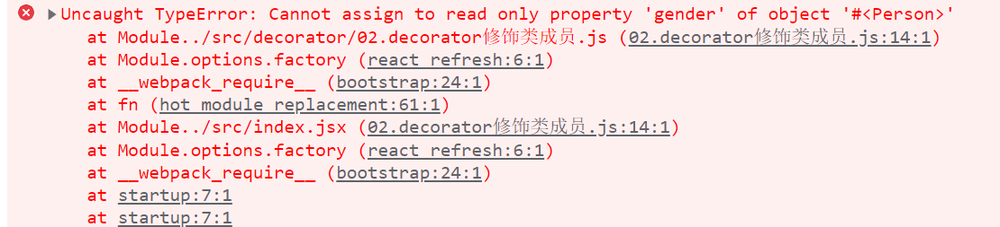
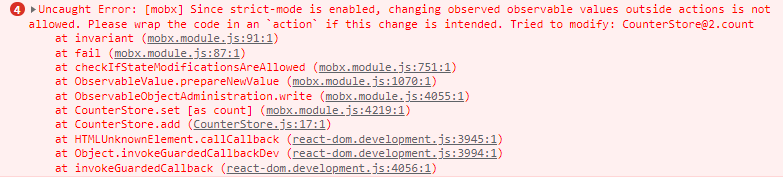
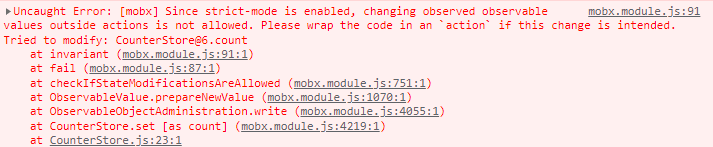

**官方文档**： https://cn.mobx.js.org/
**DEMO**：https://gitee.com/damiaoxi/stars/tree/master/React_Advanced/04.Mobx

## 装饰器语法的补充

> 装饰器就是对一个类进行处理的函数
>
> Node 原生并不支持装饰器语法，但是 Babel 可以对装饰器语法进行转换，因此需要配合 Babel 一起使用

### 基本使用

````javascript
// 将此函数作为装饰器使用
@haveEyes
class Person{}

// target 即 class 对象
function haveEyes(target){
    target.haveeyes = true
}

console.log(Person.haveeyes); // true
````

定义一个函数，将此函数作为装饰器使用在类上，函数的默认参数即类对象。

在函数体内对类对象进行操作，便可实现使用装饰器对类进行修改的功能。

### 装饰器修饰类

#### 装饰器修饰类时的传参

````javascript
@speak(666)
class Person{}

// 通过给函数传参，函数返回一个函数，将返回函数作为装饰器处理函数，即可完成装饰器传参
function speak(word) {
    return (target) => {
        target.speak = function(){
            console.log(word)
        }
       
    }
}

Person.speak() // 666
````

- 作为装饰器处理器的函数在装饰器函数内部返回，直接作为装饰器的函数接收一个参数，便可通过函数柯里话完成装饰器传参。

#### 通过类装饰器给类成员添加成员属性

通过原型对象 `target.prototype` 可以通过原型链给类的对象添加成员属性

````javascript
@name
class Person{}

// 通过原型对象 `target.prototype` 可以通过原型链给类的对象添加成员属性
function name(target){
    target.prototype.name = 'default name'
}

const Andy = new Person()
console.log(Andy.name) // default name
````

### 装饰器修饰类成员(属性、方法)

````javascript
class Person{
    @readonly gender = 'male'
}

function readonly(target, attrName, description){
    console.log('target:', target); // 类的 prototype 对象
    console.log('attrName:', attrName); // 类的成员属性名
    console.log('description:', description);// 类成员属性的装饰器对象

    description.writable = false
}
````

当装饰器修饰类的成员属性时，入参有三个：

- `target`：类的 prototype 对象
- `attrName`：类的成员属性名
- `description`：类成员属性的装饰器对象

通过 `description` 对象对类成员属性进行劫持，便可以对该属性进行改造。

````javascript
let Andy = new Person()
Andy.gender = 'female'
````




## observable

### observable() 与 @observable

将对象转换为可被观察的状态

#### **用法**

- `observable(value)`
- `@observable classProperty = value`

Observable 可以转换的值可以有：

- **JavaScript 基本数据类型**

  > 转换规则：
  >
  > 将改数据本身转换为观测对象

- **引用类型**

  - 普通对象

    > 转换规则
    >
    > - 如果 **value** 是一个没有原型的对象
    >   - 该 **value** 会被克隆，并且所有的属性都会变成可观察的。详细参考： [Observable Object](https://cn.mobx.js.org/refguide/object.html)。
    >
    > - 如果 value 是有原型的对象
    >   - 该 **value** 会被克隆，并且自身属性会被变成可观察的
    >   - 原型属性或者函数，`observable`  会被抛出。如果想要为原型属性或者函数创建一个独立的可观察对象，需要使用 [Boxed Observable](https://cn.mobx.js.org/refguide/boxed.html) 代替 `observable `。
    >   - MboX 不会将一个原型的对象自动转换为可观察的对象，因为这是原型本身构造函数的事情。

  - 类实例

  - 数组和映射

    > 转换规则
    >
    > - 如果 **value** 是数组
    >   - 会返回一个 [Observable Array](https://cn.mobx.js.org/refguide/array.html)。
    >   - 数组内的所有值，包括未来加入的值，都会变为可观察的
    > - 如果 **value** 是 ES6 的 `Map` 
    >   - 会返回一个新的 [Observable Map](https://cn.mobx.js.org/refguide/map.html)。
    >   - Observable maps不仅对某个特定 entry 的更改做出响应，而且对添加或者删除 entry 时也做出反应。

#### 注意点

- 想要使用 `@observable` 装饰器，首先需要保证编辑器（babel 或者 typescript）中，装饰器语法是启用的。

- `@observable` 可以在实例字段和属性 getter上使用

- 在默认情况向下，将数据转换成可观测的是具备**感染性**的。这意味着 `observable` 会将数据及其内部结构中所有成员都标记成观测对象，包括在声明后新添加进去的对象。

- *[ MboX 4 及以下版本 ]* 当转换数据中 **键是动态对象**时，对象上只有初始化便存在的属性会被转换成可观察的。可以使用 [extendObservable](https://cn.mobx.js.org/refguide/extend-observable.html) 可以将其转换为可观察的。


## 改变 observables

### action

#### 用法

- `action(fn)`
- `action(name, fn)`
- `@action classMethod() {}`
- `@action(name) classMethod () {}`
- `@action boundClassMethod = (args) => { body }`
- `@action(name) boundClassMethod = (args) => { body }`
- `@action.bound classMethod() {}`

修改状态的东西，都叫做动作，MobX 使用 `action` 显式地标记处动作所在的地方。

`action` 接收一个函数并返回一个具备同样名字的函数。 `action` 会分批处理变化，并只在最外层动作都完成后通知计算值的相关的反应，从而确保在动作完成前，动作期间生成的中间值或未完成的值对应用的其余部分时不可见的。

#### 何时使用 action

对修改状态的函数，永远应该用 `action` 进行标记。只执行查找、过滤功能的而函数则不应该被标记成 `action`。

**注意：**在将 MobX 配置为需要通过动作来更改状态时：

````javascript
configure({
    enforceActions: 'observed'
})
````

必须使用 `action` 标记改变状态的函数。否则报错：



#### action.bound

在实际应用中，经常出现将 store 中的函数传递给另外一个组件，在另外一个组件中调用这个函数。如果在定义动作的时候，不给动作绑定 `this` 会导致动作在调用时，其中 `this` 会动态指向传入的组件。

使用 `@action.bound` 标记的动作会永久绑定函数内的 `this` 指向。

**注意：** 

箭头函数中 `this` 是已经在定义时绑定过的，不需要再使用 `@action.bound` 绑定一次了。

### 异步 action

#### 处理普通异步 action 的方式

`action` 包装 / 装饰器只会对同步运行的函数进行调用，当函数中包含异步函数时，则不会做出反应。

这意味着如果动作中存在 `setTimeout`、`setInterval`、`Promise.then` 或 `sync` 语句的时候，如果回调函数中某些状态发生了改变，这些回调函数也应该被包装在 `action` 中 ，否则会报错。



创建异步 action 有以下几种方式，没有哪个更好只说，只是阐述一些可以选择的做法：

````javascript
@action 
autoAdd = () => {
    setInterval(() => {
        this.count = this.count + 3
    }, 1000)
}
````

当直接调用这个动作时，会抛错，我们可以：

- 将回调函数声明成动作，并在异步操作中直接调用

  ````javascript
  @action 
  autoAdd = () => {
      setInterval(() => {
          this.addCallback()
      }, 1000)
  }
  
  @action 
  addCallback = () => {
      this.count = this.count + 3
  }
  ````

- 使用 `action()` 包裹回调函数，使之声明为一个动作

  ````javascript
  @action 
  autoAdd = () => {
      setInterval(() => {
          action('addCallback',() => {this.count = this.count + 3})()
      }, 1000)
  }
  ````

  **注意**：

  - `action(actionName, func)` 的第一个参数为动作名（可以省略），第二个参数为想要转换为动作的函数。

  - 需要调用 `action()` 包裹后返回的函数，否则只是声明这样一个动作。

- 使用 `runInAction` 工具函数

  ````javascript
  @action 
  autoAdd = () => {
    setInterval(() => {
      runInAction(() => {
        this.count = this.count + 3;
      });
    }, 1000);
  };
  ````

  使用 `runInAction` 工具函数包裹函数中修改状态的部分，而不是将整个回调函数都声明成一个动作，这种方式时鼓励用户不要到处写 action，而是在在整个函数过程结束时竟可能多的对所有状态进行修改。

#### 处理 async / await 中的 action

基于 async / await 的函数虽然看上去时同步函数，但是本质上是 `promise` 的语法糖，如果是仅使用 `@action` 标记该函数，结果是 `@action` 仅应用于代码块直到第一个 `await` 的地方，在这个 `await` 之后，一个新的异步函数会开启，这个 `await` 之后状态修改的代码都不会被包装成动作。使用 `runInAction` 即可将 `await` 异步后面的状态修改包装成动作：

````javascript
@action delayAdd = async () => {
    await this.delayAddCallback()
    runInAction(() => {
        this.count = this.count + 10;
    })
}
delayAddCallback = () => {
    setTimeout(() => {
        alert('Delay success！')
    }, 1000);
}
````


## 对 observable 做出响应

### computed

计算属性（computed values）是可以根据现有的状态或者其他计算值衍生出的值。

当 `computed` 中任意被观测的状态或者计算值发生变化时，该计算值会重新计算并返回新的值。

#### 计算属性的使用方式

- `@computed`

  如果已经启用了装饰器语法，可以在任意类属性的 getter 上使用 `@computed` 装饰器来声明一个计算属性：

  ````javascript
  @computed
  get amount() {
      return this.price * this.count
  }
  ````

-  `decorate()`  ：

  ````javascript
  class CounterStore {
  	get amount() {
      	return this.price * this.count
  	}
  }
  
  decorate(CounterStore,{
      amount: computed
  })
  ````

-  `observable.object` 和 `extendObservable` 都会自动将 getter 属性推导成计算属性，所以以下代码可以达成相同的效果：

  ````javascript
  const CounterStore = observable.object({
      get amount() {
      	return this.price * this.count
  	}
  })
  ````

#### 计算属性的 setter

除了给属性的 getter 标记为计算属性外，已经被标记成计算属性的 setter 也可以被定义。计算属性的 setter 不能用来直接改变计算属性的值，但是可以用作 “逆衍生”。如：

````javascript
// 检视 price 和 count，以此衍生出计算属性 total
@computed
get total() {
    return this.price * this.count
}
// 通过检视计算属性 total 的变化，重新计算出此时的 price 时多少
set total(total) {
    this.price = total / this.count
}
````

### autorun

创建一个响应式函数，该函数不会有任何观察者。该函数在代码运行时自动触发一次，随后当函数内的被观测对象发生改变时，函数会被再次触发。

与 `computed` 不同，该函数不会产生任何返回值，所以在需要计算出一个值，并该值需要跟随其依赖响应式改变时，请使用 `computed`。不需要返回一个值，仅需要功能所需要的依赖发生改变时，函数再运行一次，则选择 `autorun`。

#### autorun 的基本使用

````javascript
disposer = autorun(() => {
    console.log('autorun invoking!')
    if(this.count < 0 || this.price < 0){
        alert('count & price wouldn\'t be negative')
        runInAction(() => {
            this.count = 0
            this.price = 0
        })
    }
})
````

`autorun()` 第一个参数为需要执行的函数，当函数内部的被观测对象发生改变时，该函数会执行一次。

**注意：** 该函数本质是一个异步函数，所以内部对状态的改变需要使用 `runInAction()` 中执行。

#### autorun 的配置选项

`autorun()` 接收第二个参数，它是一个参数对象，有如下可选的参数:

- `delay`: 延时触发的时间(以毫秒为单位)，可以用于防抖。如果是 0(默认值) 的话，立刻执行。
- `name`: 字符串，用于在例如像 [`spy`](https://cn.mobx.js.org/refguide/spy.html) 这样事件中，作为此响应函数（第一个参数）的名称。
- `onError`: 用来处理响应函数（第一个参数）的错误。
- `scheduler`: 设置自定义调度器以决定如何调度 autorun 函数的重新运行。

````javascript
disposer = autorun(() => {
    console.log('autorun invoking!')
    if(this.count < 0 || this.price < 0){
        alert('count & price wouldn\'t be negative')
        runInAction(() => {
            this.count = 0
            this.price = 0
        })
        throw new Error('You typed in a negative number! Don\'t do that!')
    }
}, {
    delay: 1000,
    onError: (e) => { // 抛出异常时执行
        console.log('Error catched!');
    }
})
````

##### delay 选项

用于配置响应函数的执行时机，接收一个数字，单位时毫秒，可以用于防抖

##### onError 选项

接收一个回调函数。当响应函数中抛出异常时，会捕获异常，并执行回调函数。

### when

#### when 基本使用

**用法：**`when(() => boolean, () => void)`

`when()` 函数接收两个参数

- 第一个参数接收一个返回布尔类型值得函数。`when` 会监听该函数内部的可观察对象的变化，当可观察对象发生变化时会自动执行第一个函数。
- 第二个参数接收一个执行函数。当`when` 监听的第一个参数函数返回值时 `true` 时，立即执行该执行函数。

在下面的例子中，`when` 会监听 `count` 的变化，直到 `count` 大于等于 10 的时候，执行第二个参数函数：

````javascript
when(
    () => this.count >= 10,
    () => {
        if(this.interval){
            clearInterval(this.interval)
        }
        alert('The maximum count is 15. You\'re getting close to that number')
    }
);
````

#### 注意

`when()` 的第二个参数函数执行完毕后，该自动运行程序（`when` 本身）会被销毁。也就是说，`when()` 第一个函数返回一次 `true` 之后，便去执行第二个执行函数，然后销毁了自己。

### Reaction

#### reaction 的基本使用

**用法：**  `reaction(() => data, (data, reaction) => { sideEffect }, options?) `

`reaction()` 接收三个参数

- 第一个参数：一个返回数据的函数，当数据函数内部的可观察对象发生变化时，该函数会重新执行，并返回一个数据给第二个参数用。当返回的值发生变化的时候，才会调用第二个参数接收的函数。
- 第二个参数：一个效果函数，起入参有两个
  - `data`：第一个数据函数返回值。
  - `reaction`：当前的 reaction，可以用来在执行期间清理 `reaction`。
- 第三个参数：配置选项对象

不同于 `autorun`，`reaction` 并不会在创建的时候就执行一次，而是在数据函数返回的数据发生变化的时候才开始执行。

#### 选项对象

Reaction 接收第三个参数，它是一个参数对象，有如下可选的参数:

- `fireImmediately`: 布尔值，用来标识效果函数是否在数据函数第一次运行后立即触发。默认值是 `false` 。
- `delay`: 可用于对效果函数进行去抖动的数字(以毫秒为单位)。如果是 0(默认值) 的话，那么不会进行去抖。
- `equals`: 默认值是 `comparer.default` 。如果指定的话，这个比较器函数被用来比较由 *数据* 函数产生的前一个值和后一个值。只有比较器函数返回 false *效果* 函数才会被调用。此选项如果指定的话，会覆盖 `compareStructural` 选项。
- `name`: 字符串，用于在例如像 [`spy`](https://cn.mobx.js.org/refguide/spy.html) 这样事件中用作此 reaction 的名称。
- `onError`: 用来处理 reaction 的错误，而不是传播它们。
- `scheduler`: 设置自定义调度器以决定如何调度 autorun 函数的重新运行

````javascript
reaction(
    () => {
        console.log('reaction invoking!')
        return this.count
    },
    (count) => {
        if(count > 15){
            if(!window.confirm('Your input have over the maximum limit! Please confirm your behavior is what you determined to.')){
                this.count = 15
            }
        }
        
    }
)
````

## Demo
https://gitee.com/damiaoxi/stars/tree/master/React_Advanced/04.Mobx/01.MobxDemo

